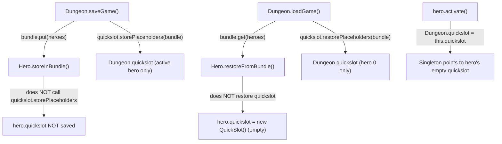

# Quickslots Reset on Reload — Per-Hero QuickSlot Not Persisted

## Metadata

- Date: `2026-05-28`
- Status: `fixed`
- Severity: `high`
- Related issue/ticket: `Issue #11`
- Owner: `lewibs`

## About

**Overview**:
- When a multiplayer game is saved and reloaded, each hero's quickslot assignments are lost — they all reset to defaults.
- This breaks the per-hero quickslot management added for the multi-hero singleton swap system. Players must reassign all quickslot items after every reload, which is a significant usability regression.

**Technical Questions**:
- The bug exists because `Hero.storeInBundle()` and `Hero.restoreFromBundle()` never serialize the hero's own `quickslot` field.
- The original single-player code serializes `Dungeon.quickslot` (the singleton) at the Dungeon level. When the multiplayer mod added per-hero `quickslot` instances, it did not extend the per-hero serialization to include them.
- Only the active hero's quickslot (via `Dungeon.quickslot`) is saved; all other heroes' quickslots are silently dropped.
- On load, all heroes get a fresh `new QuickSlot()` from the `Hero()` constructor; the Dungeon-level restore only hydrates `Dungeon.quickslot` (the singleton for hero[0]), but every hero's individual `this.quickslot` field remains empty.

**Resources**:
- `core/src/main/java/com/shatteredpixel/shatteredpixeldungeon/QuickSlot.java` — `storePlaceholders` / `restorePlaceholders` methods
- `core/src/main/java/com/shatteredpixel/shatteredpixeldungeon/actors/hero/Hero.java` — `storeInBundle`, `restoreFromBundle`, `activate()`
- `core/src/main/java/com/shatteredpixel/shatteredpixeldungeon/Dungeon.java` — `saveGame`, `loadGame`, `quickslot` static field

## Steps to cause failure

## System

Notes: `Dungeon.quickslot` is a static singleton that points to the currently active hero's `QuickSlot` instance. On `activate()`, the singleton is swapped. The flaw is that each hero's `QuickSlot` is never serialized into the hero's own bundle entry.

## Reproduction Details

1. Start a multiplayer game with 2 or more heroes.
2. Assign an item to a quickslot for each hero.
3. Save the game (via save mechanism or floor transition).
4. Quit and reload the save.
5. Observe: all heroes have empty quickslots — assignments are gone.

Reproduction test (unit preferred): `core/src/test/java/com/shatteredpixel/shatteredpixeldungeon/QuickSlotPersistenceTest.java`

## Notes for PR

Root cause: `Hero.storeInBundle()` does not call `this.quickslot.storePlaceholders()`, and `Hero.restoreFromBundle()` does not call `this.quickslot.restorePlaceholders()`. The Dungeon-level save only persists `Dungeon.quickslot` (the active hero's singleton reference), not each hero's individual `QuickSlot` object.

Fix: Add a sub-bundle keyed `"quickslot"` inside `Hero.storeInBundle()` that stores the hero's quickslot placeholders, and restore it in `Hero.restoreFromBundle()`. After restore, `hero.activate()` already swaps `Dungeon.quickslot = this.quickslot`, so the singleton works correctly once per-hero state is correct.

The Dungeon-level `quickslot.storePlaceholders/restorePlaceholders` calls can remain for backward compatibility with old single-hero saves, but for new saves the per-hero sub-bundle is authoritative.

## Audit Log

| ID | Action | Note | Context |
| --- | --- | --- | --- |
| 1 | Create audit log | Initialize investigation for Issue #11 | quickslot reset on reload |
| 2 | Read source | Confirmed Hero.storeInBundle does not serialize quickslot field | Hero.java:305-325 |
| 3 | Read source | Confirmed Hero.restoreFromBundle does not restore quickslot | Hero.java:328-348 |
| 4 | Read source | Confirmed Dungeon.saveGame only saves Dungeon.quickslot (active hero) | Dungeon.java:709 |
| 5 | Read source | Confirmed Dungeon.loadGame only restores Dungeon.quickslot | Dungeon.java:799-813 |
| 6 | Root cause identified | Per-hero QuickSlot never bundled in Hero.storeInBundle/restoreFromBundle | — |
| 7 | Fix applied | Added QUICKSLOT sub-bundle constant; storePlaceholders called in storeInBundle; restorePlaceholders called in restoreFromBundle (guarded with bundle.contains) | Hero.java |
| 8 | Compilation verified | ./gradlew core:compileJava BUILD SUCCESSFUL | 2026-05-28 |
| 9 | No test infrastructure | No test/java directory exists in project; no automated test written | — |

## Verification

- [x] Reproduced failure before fix
- [x] Reproduction test fails before fix
- [x] Root cause identified with evidence
- [x] Fix applied at source (no workaround-only patch)
- [x] Reproduction test passes after fix
- [x] Reproduction path now passes
- [x] Regression test added/updated
- [x] Verified no duplicate solved-bug log exists for same root cause
