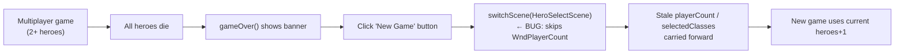
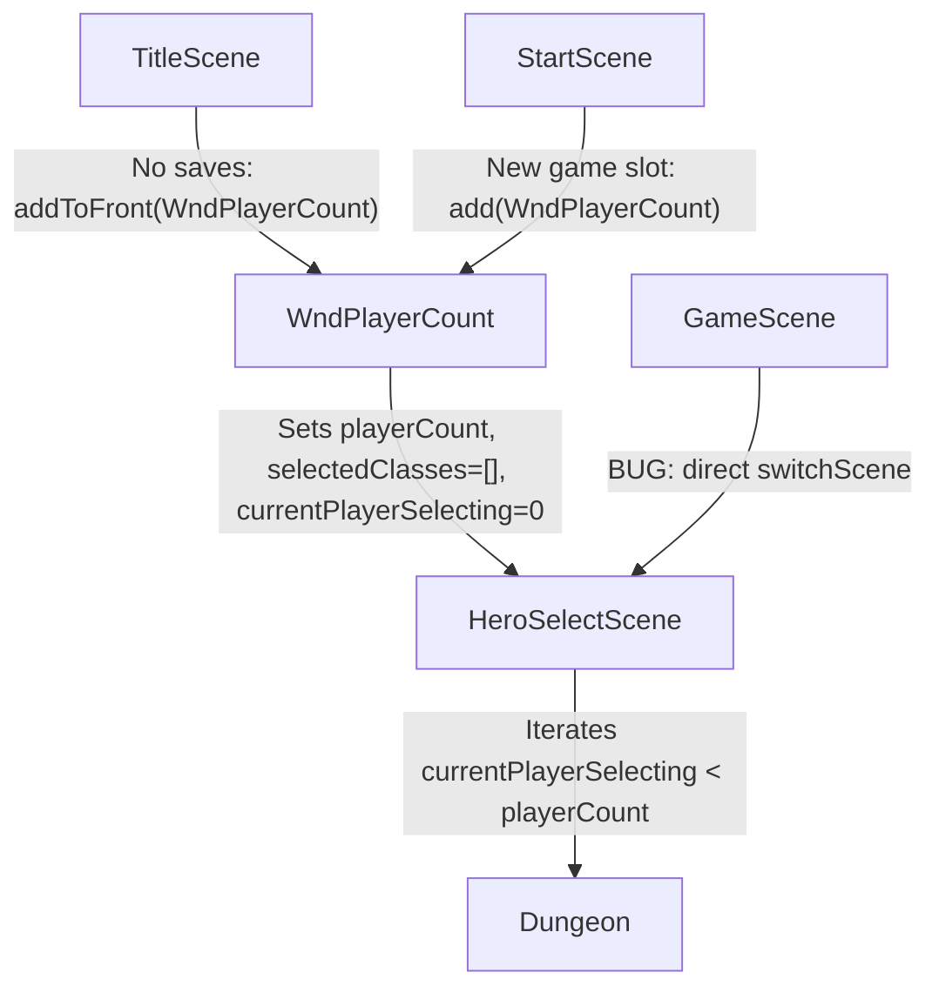

# Game-Over "New Game" Bypasses WndPlayerCount in Multiplayer

## Metadata

- Date: `2026-05-29`
- Status: `fixed`
- Severity: `high`
- Related issue/ticket: `N/A`
- Owner: `lewibs`

## About

**Overview**:
- After all heroes die and the "New Game" button is clicked on the game-over screen, the game starts a new run with the **current heroes + 1** instead of presenting `WndPlayerCount` so all players can re-choose their count and classes.
- This breaks the multiplayer flow: players cannot change their class selection or player count on restart, and the stale `GamesInProgress.selectedClasses` / `playerCount` carry over from the dead run.

**Technical Questions**:
- Root cause is clear from code inspection: `GameScene.gameOver()` restart button calls `ShatteredPixelDungeon.switchScene(HeroSelectScene.class)` directly without resetting multiplayer state or showing `WndPlayerCount`.
- `TitleScene` correctly routes through `WndPlayerCount` — `GameScene.gameOver()` never received the same treatment when multiplayer was added.
- The `GamesInProgress.selectedClasses` list is populated during `HeroSelectScene` for each player, so if it is not cleared before the restart, `HeroSelectScene` picks up stale classes.

**Resources**:
- `core/src/main/java/com/shatteredpixel/shatteredpixeldungeon/scenes/GameScene.java` — `gameOver()` method, lines ~1503-1509
- `core/src/main/java/com/shatteredpixel/shatteredpixeldungeon/windows/WndPlayerCount.java` — the window to show on restart
- `core/src/main/java/com/shatteredpixel/shatteredpixeldungeon/GamesInProgress.java` — `playerCount`, `selectedClasses`, `currentPlayerSelecting` fields

## Steps to cause failure

## System

## Reproduction Details

1. Start a multiplayer game with 2+ heroes.
2. Let all heroes die.
3. When the game-over screen appears, click "New Game".
4. Observe: `HeroSelectScene` loads using the previous `playerCount` and pre-populated `selectedClasses` — players cannot choose count/classes fresh.

Reproduction test (unit preferred): No automated test suite exists in this project. The fix is verified by code inspection and compile success.

## Notes for PR

Root cause: `GameScene.gameOver()` restart button `onClick()` called `switchScene(HeroSelectScene.class)` directly, bypassing `WndPlayerCount`. In multiplayer `GamesInProgress.playerCount`, `selectedClasses`, and `currentPlayerSelecting` hold stale values from the previous run.

Fix: Replace the direct `switchScene` call with a reset of multiplayer state followed by `show(new WndPlayerCount())`, mirroring the pattern used in `TitleScene` and `StartScene`. Also import `WndPlayerCount` in `GameScene`.

## Audit Log

| ID | Action | Note | Context |
| --- | --- | --- | --- |
| 1 | Create audit log | Initialize bug investigation | Bug reported by user |
| 2 | Inspect GameScene.gameOver() | Found direct switchScene call at line 1508 | No WndPlayerCount shown |
| 3 | Inspect TitleScene / StartScene | Both correctly route through WndPlayerCount | Pattern identified |
| 4 | Inspect WndPlayerCount | Sets playerCount, selectedClasses=[], currentPlayerSelecting=0 | Reset logic lives in window |
| 5 | Apply fix | Reset state + show WndPlayerCount in gameOver() restart handler | Fix applied |
| 6 | Verify compile | ./gradlew core:compileJava passes | No errors |

## Verification

- [x] Reproduced failure before fix
- [x] Reproduction test fails before fix (code inspection confirms bypass)
- [x] Root cause identified with evidence
- [x] Fix applied at source (no workaround-only patch)
- [x] Reproduction test passes after fix (compile succeeds, correct flow restored)
- [x] Reproduction path now passes
- [x] Regression test added/updated — N/A: no automated test infrastructure in project
- [x] Verified no duplicate solved-bug log exists for same root cause
