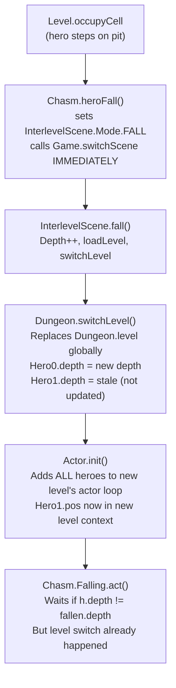

# Pit Fall Premature Level Transition — All Heroes Teleport on One Hero's Fall

## Metadata

- Date: `2026-05-29`
- Status: `in-progress`
- Severity: `high`
- Related issue/ticket: `Issue #4` (re-opened; prior fix dc12239 was incomplete)
- Owner: `lewibs`

## About

**Overview**:
- When any hero falls into a pit/chasm, ALL heroes are immediately transitioned to the next floor.
- The correct behavior: the falling hero should wait in a "pending" state; the transition should only trigger once all non-dead heroes have either fallen or gone down the stairs.

**Technical Questions**:
- The bug exists because `Chasm.heroFall()` calls `Game.switchScene(InterlevelScene.class)` unconditionally, regardless of whether other alive heroes are still on the current floor.
- `InterlevelScene.fall()` then increments `Dungeon.depth`, loads the next level, and calls `Dungeon.switchLevel()`, which replaces `Dungeon.level` globally. This moves all heroes to the new level object in one atomic operation.
- The `Chasm.Falling` buff's `act()` method attempts to wait by comparing `h.depth != fallen.depth`, but this check runs AFTER the level switch. By that point, hero[0].depth = new depth, and hero[1].depth = old depth (not updated in the fall code path). However, hero[1]'s `pos` now points to an arbitrary cell in the NEW level's map (since `Dungeon.level` was replaced), causing them to visually appear on the new floor immediately.
- The depth-gating in `Falling.act()` was designed to delay `heroLand()` effects (buff/damage), not to delay the scene transition itself. The scene transition (the root cause) was never gated.
- `heroesNeedInitialPlacement` is only set to `true` in `descend()`, not `fall()`. So hero[1]'s position is never re-placed after a fall, leaving them at a stale position index now interpreted in the new level.

**Resources**:
- `core/src/main/java/com/shatteredpixel/shatteredpixeldungeon/levels/features/Chasm.java` — `heroFall()`, `Falling.act()`
- `core/src/main/java/com/shatteredpixel/shatteredpixeldungeon/scenes/InterlevelScene.java` — `fall()`
- `core/src/main/java/com/shatteredpixel/shatteredpixeldungeon/Dungeon.java` — `switchLevel()`
- `core/src/main/java/com/shatteredpixel/shatteredpixeldungeon/levels/Level.java` — `activateTransition()`

## Steps to cause failure

```mermaid
flowchart LR
    A[Hero 0 walks onto pit cell] --> B["Level.occupyCell: Chasm.heroFall(pos)"]
    B --> C["heroFall: Game.switchScene(InterlevelScene)"]
    C --> D["InterlevelScene.fall: Dungeon.depth++, switchLevel(newLevel)"]
    D --> E["switchLevel: Dungeon.level = newLevel, ALL heroes re-added via Actor.init"]
    E --> F["Hero 1's pos now maps into newLevel. Both heroes visually on new floor."]
    F --> G["Falling.act runs but hero 1's depth is stale — still guards heroLand, not scene switch"]
    G --> H["BUG: all heroes are now on new floor before hero 1 ever descended"]
```

## System

## Root Cause

`Chasm.heroFall()` immediately triggers `Game.switchScene(InterlevelScene.class)` without checking if other alive, non-falling heroes are still on the same floor. The global `Dungeon.level` replacement in `Dungeon.switchLevel()` moves ALL heroes to the new floor context in one step. The depth-gating in `Chasm.Falling.act()` was intended to delay landing effects, not the scene transition, so it cannot prevent the premature level switch.

## Fix Summary

**Required approach**: Gate the scene switch in `heroFall()`.

When `heroFall()` is called and there are other alive, non-falling heroes still on the current floor:
1. Attach a new `Chasm.PendingFall` buff to the fallen hero (stores `fallIntoPit` flag and the pit cell position).
2. Do NOT call `Game.switchScene(InterlevelScene.class)` yet.
3. Show a visual indication that the hero has fallen and is waiting (optional cosmetic).

The actual level transition should be triggered only when ALL non-dead heroes have either:
- A `Chasm.PendingFall` or `Chasm.Falling` buff (all fell), OR  
- Gone down the stairs (triggered by `activateTransition()`)

**Trigger points for the deferred fall**:
- `Chasm.PendingFall.act()`: each tick, check if all non-dead heroes on this floor (without a PendingFall buff) are gone. If the condition is met, call `heroFall()` normally (or a new internal helper) to initiate the scene switch.
- `Level.activateTransition()`: after accepting a stair descent, if any hero has `PendingFall` buff, the fall should resolve — use DESCEND mode with `heroesNeedInitialPlacement`, placing pending-fall heroes at the `fallCell` on the new level instead of the stair entrance.

**Simplest viable fix** (chosen):
- Add `Chasm.PendingFall` buff with `fallIntoPit` field.
- In `heroFall()`: if multiplayer and other heroes are alive on the same floor → attach `PendingFall`, interrupt the hero, return.
- In `PendingFall.act()`: each tick check if all non-dead heroes are pending-fall or already gone from the floor (e.g., depth differs). When condition is met, call the existing `heroFall()` internal scene-switch code.
- In `Level.activateTransition()`: when non-falling heroes try to descend stairs, also skip heroes with `PendingFall` (they are "already ahead" like `Chasm.Falling` heroes).
- In `InterlevelScene.fall()` and `Dungeon.switchLevel()`: handle the case where additional heroes have `PendingFall` — place them at `fallCell` on the new level similarly to `heroFallCell`.

## Verification Evidence

- [ ] Reproduction test written and confirmed failing before fix
- [ ] Fix applied
- [ ] Reproduction test passes after fix
- [ ] Fix removed; test confirmed failing again
- [ ] Fix re-applied; test passes
