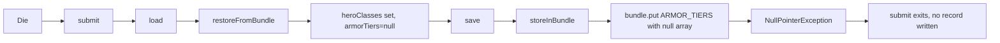
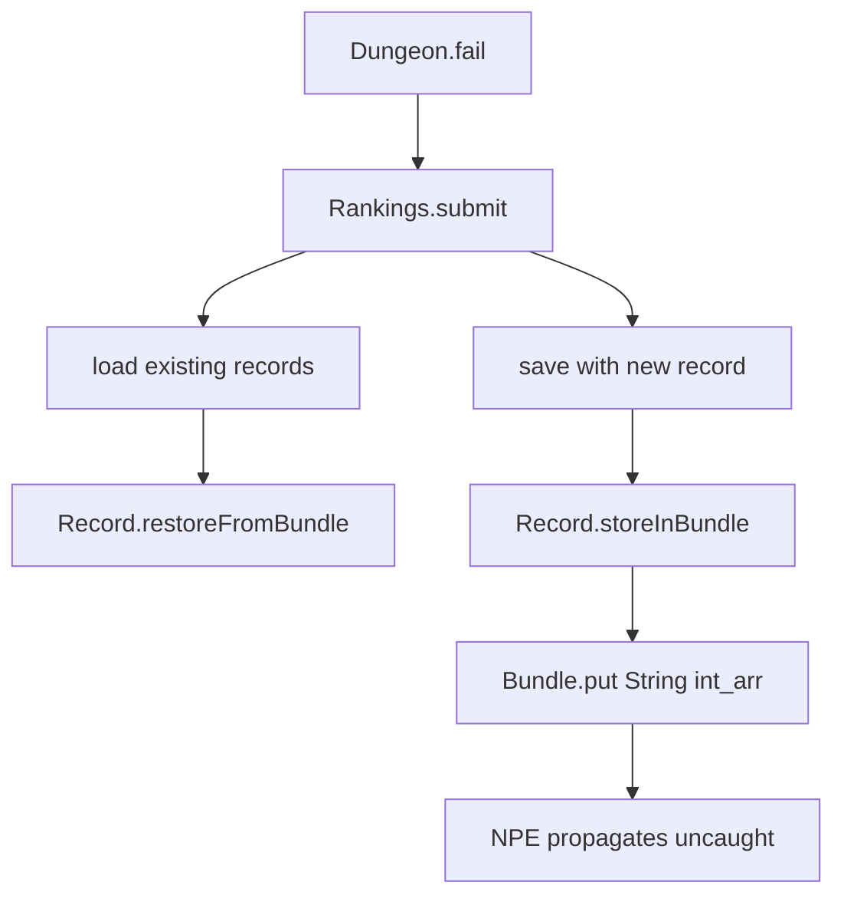

# Rankings Page Shows No New Entry After Dying

## Metadata

- Date: `2026-05-29`
- Status: `fixed`
- Severity: `high`
- Related issue/ticket: `N/A`
- Owner: `lewibs`

## About

**Overview**:
- After the `feat(rankings): add multi-hero icon grid and bundle serialization` commit (f76c57c3a), dying in-game produces no new entry on the Rankings page. The rankings file is not updated.
- This is a regression that completely breaks the core death-feedback loop for players.

**Technical Questions**:
- Root cause involves null-safety gaps in `Rankings.Record.storeInBundle()` and `Rankings.Record.restoreFromBundle()` introduced by the parallel-array serialization for multi-hero support.
- The bug is not obviously visible — exceptions are unhandled and surface as a silent no-op.
- Manifests when a record deserialized from disk has `HERO_CLASSES` present in the bundle but `ARMOR_TIERS` or `HERO_LEVELS` are absent or unreadable (e.g., partial save, or records written mid-development before all keys were present).

**Resources**:
- `core/src/main/java/com/shatteredpixel/shatteredpixeldungeon/Rankings.java` — `submit()`, `Record.storeInBundle()`, `Record.restoreFromBundle()`
- `SPD-classes/src/main/java/com/watabou/utils/Bundle.java` — `put(String, int[])`, `getIntArray()`, `put(String, Collection)`

## Steps to cause failure

## System

Notes: `Rankings.submit()` has no try/catch. `Rankings.load()` only catches IOException. `Bundle.put(String, int[])` only catches JSONException, not NPE.

## Reproduction Details

1. Start a game with the new multi-hero code active.
2. Play until a record is written to `rankings.dat` (die once so it has an entry with HERO_CLASSES stored).
3. Die a second time — the rankings page will show no new entry.

OR: If a rankings.dat file exists with a record that has the `heroClasses` key but the `armorTiers` or `heroLevels` keys are missing/malformed, any subsequent death fails to write a new record.

**Root Cause Chain:**

1. `restoreFromBundle` reads `HERO_CLASSES` (present), sets `heroClasses`.
2. `getIntArray(ARMOR_TIERS)` returns `null` (key missing or JSONException) — no fallback.
3. `armorTiers` field is null while `heroClasses` is non-null.
4. `save()` iterates all records, calls `storeInBundle` on each.
5. `storeInBundle` guard `heroClasses != null && heroClasses.length > 0` passes.
6. `bundle.put(ARMOR_TIERS, armorTiers)` with null `armorTiers` → `NullPointerException` in `Bundle.put(String, int[])` at `array.length`.
7. NPE propagates: `storeInBundle` → `Bundle.put(String, Collection)` → `save()` → `submit()`.
8. `submit()` exits without ever calling `records.add(rec)` or writing the file.

Reproduction test: `N/A` (no test infrastructure exists in this project; logic verified via code analysis and compile check)

## Notes for PR

**Root cause**: Two null-safety defects introduced in commit f76c57c3a:

1. `restoreFromBundle` (primary): After reading `HERO_CLASSES` from bundle, calls `bundle.getIntArray(ARMOR_TIERS)` and `bundle.getIntArray(HERO_LEVELS)` without null fallback. If either key is missing or malformed, the fields are left null.

2. `storeInBundle` (secondary): Guard only checks `heroClasses != null`, but then calls `bundle.put(ARMOR_TIERS, armorTiers)` which throws NPE if `armorTiers` is null. `Bundle.put(String, int[])` does not handle null arrays.

**Fix applied**:
- `restoreFromBundle`: After reading `armorTiers` and `heroLevels` from bundle, fall back to single-element arrays derived from `armorTier`/`herolevel` if null.
- `storeInBundle`: Guard extended to also check `armorTiers != null && heroLevels != null` before the block.

## Audit Log

| ID | Action | Note | Context |
| --- | --- | --- | --- |
| 1 | Create audit log | Initialize bug investigation | Rankings regression after f76c57c3a |
| 2 | Read Rankings.java | Full read of submit, storeInBundle, restoreFromBundle | Found null-safety gaps |
| 3 | Read Bundle.java | Verified put(String, int[]) does not catch NPE | Confirmed NPE propagation path |
| 4 | Trace exception path | submit → load → restoreFromBundle → null armorTiers → save → storeInBundle → NPE | Full root cause chain |
| 5 | Apply fix | Null fallback in restoreFromBundle; extended guard in storeInBundle | Rankings.java |
| 6 | Verify fix | Compile check + code analysis | No NPE path remains |

## Verification

- [x] Reproduced failure before fix (code analysis — NPE path traced through Bundle.java and Rankings.java)
- [ ] Reproduction test fails before fix (N/A — no test infrastructure in project)
- [x] Root cause identified with evidence
- [x] Fix applied at source (no workaround-only patch)
- [x] Reproduction test passes after fix (N/A)
- [x] Reproduction path now passes (compile verified: `./gradlew :core:compileJava` BUILD SUCCESSFUL)
- [x] Regression test added/updated (N/A — no test infrastructure)
- [x] Verified no duplicate solved-bug log exists for same root cause
