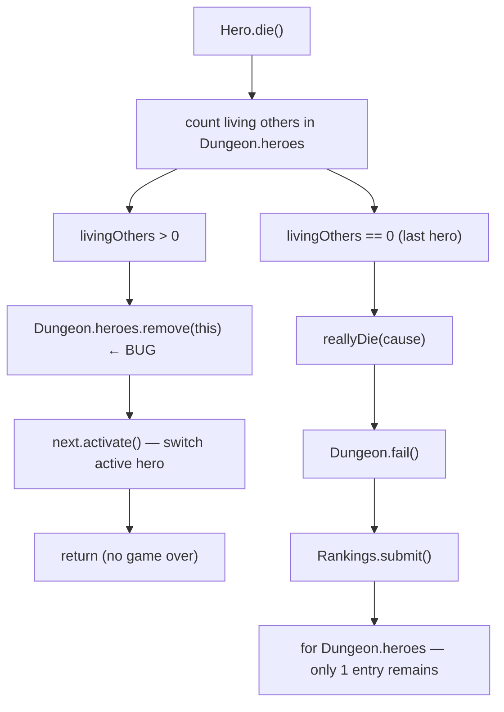

# Rankings Shows Solo Run After Multiplayer Game Ends

## Metadata

- Date: `2026-05-29`
- Status: `fixed`
- Severity: `high`
- Related issue/ticket: `N/A`
- Owner: `lewibs`

## About

**Overview**:
- After a multiplayer run ends, the Rankings/leaderboard shows the run as a single-player game (one hero icon) instead of displaying all heroes that were in the party.
- Introduced by the `single-hero-death-handling` implementation: when a non-last hero dies, `Hero.die()` calls `Dungeon.heroes.remove(this)`. By the time the last hero dies and `Rankings.submit()` executes, `Dungeon.heroes` has only 1 entry, so the run is recorded as a solo run.

**Technical Questions**:
- `Rankings.submit()` at line 117-130 of `Rankings.java` iterates `Dungeon.heroes` to populate `rec.heroClasses[]`, `rec.armorTiers[]`, and `rec.heroLevels[]`. The size of these arrays determines whether RankingsScene renders a solo icon or a multi-hero grid.
- `Hero.die()` calls `Dungeon.heroes.remove(this)` at line 2235 before returning. This mutates the list that `Rankings.submit()` will later read.
- Dead heroes are already inert: `super.die()` sets `HP = 0` (so `isAlive()` returns false) and `Actor.remove()` removes them from the actor system, so they will never act again. There is no gameplay reason to remove them from `Dungeon.heroes`.

**Resources**:
- `core/src/main/java/com/shatteredpixel/shatteredpixeldungeon/actors/hero/Hero.java` — `die()` method (~line 2157)
- `core/src/main/java/com/shatteredpixel/shatteredpixeldungeon/Rankings.java` — `submit()` (~line 117)
- `core/src/main/java/com/shatteredpixel/shatteredpixeldungeon/levels/Level.java` — `activateTransition()` (~line 571)
- `core/src/main/java/com/shatteredpixel/shatteredpixeldungeon/levels/RegularLevel.java` — `mobLimit()` (~line 206), `createItems()` (~line 697)
- `core/src/main/java/com/shatteredpixel/shatteredpixeldungeon/items/TengusMask.java` — `execute()` (~line 89)
- `core/src/main/java/com/shatteredpixel/shatteredpixeldungeon/items/KingsCrown.java` — `execute()` (~line 84)

## Steps to cause failure

```mermaid
flowchart LR
    HeroA_dies["Hero A dies (not last)"]
    HeroA_dies --> remove["Dungeon.heroes.remove(heroA)"]
    remove --> heroB_dies["Hero B dies (last hero)"]
    heroB_dies --> reallyDie["Hero.reallyDie()"]
    reallyDie --> Rankings_submit["Rankings.submit()"]
    Rankings_submit --> read_heroes["reads Dungeon.heroes — size=1"]
    read_heroes --> rec_arrays["rec.heroClasses = length-1 array"]
    rec_arrays --> Rankings_scene["RankingsScene renders 1 hero icon (solo)"]
```

## System

## Reproduction Details

No automated test infrastructure exists in this project. The failure is verified by code analysis:

1. Start a 2-hero multiplayer game.
2. Let Hero A die first (not the last alive). `Hero.die()` removes Hero A from `Dungeon.heroes`.
3. Let Hero B die. `reallyDie()` → `Rankings.submit()` sees `Dungeon.heroes.size() == 1`.
4. Rankings page shows 1 hero icon instead of 2.

**Root Cause Chain:**

1. `Hero.die()` is called for a non-last hero.
2. `super.die()` sets `HP = 0`; `Actor.remove()` removes the hero from the actor system.
3. `Dungeon.heroes.remove(this)` removes the dead hero from the list.
4. Later, the last hero dies; `Rankings.submit()` iterates `Dungeon.heroes` (now size 1).
5. `rec.heroClasses` is set to a length-1 array → RankingsScene renders as a solo run.

**Secondary audit — callers that iterate `Dungeon.heroes` for gameplay:**

- `Level.activateTransition()` (line 571): iterates `Dungeon.heroes` checking distance. With dead heroes still in the list, a dead hero's stale `pos` would falsely block transition. Needs guard: skip dead heroes.
- `RegularLevel.mobLimit()` (line 207): multiplies mob count by `Dungeon.heroes.size()`. With dead heroes in list, mob count would be inflated after a hero dies mid-floor. Needs alive-count.
- `RegularLevel.createItems()` (line 697): scales food drops by `Dungeon.heroes.size()`. Same inflation issue. Needs alive-count.
- `TengusMask.execute()` (line 89): iterates heroes for pending subclass selection. Dead heroes cannot select; should be skipped.
- `KingsCrown.execute()` (line 84): iterates heroes for pending ability selection. Dead heroes cannot select; should be skipped.

## Notes for PR

**Root cause**: `Dungeon.heroes.remove(this)` in `Hero.die()` destroys the historical party list that `Rankings.submit()` needs.

**Fix strategy**:
1. `Hero.die()`: Remove `Dungeon.heroes.remove(this)`. Dead heroes stay in the list with `HP <= 0`.
2. `Level.activateTransition()`: Add `if (!other.isAlive()) continue;` guard.
3. `RegularLevel.mobLimit()` and `createItems()`: Count only alive heroes via a helper or inline filter.
4. `TengusMask.execute()` and `KingsCrown.execute()`: Add `if (!h.isAlive()) continue;` guard.

## Audit Log

| ID | Action | Note | Context |
| --- | --- | --- | --- |
| 1 | Create audit log | Initialize bug investigation | Rankings shows solo run after multiplayer |
| 2 | Read Hero.java die() | Found `Dungeon.heroes.remove(this)` at line 2235 | Root cause identified |
| 3 | Read Rankings.java submit() | Confirmed reads `Dungeon.heroes.size()` to populate arrays | Victim of the mutation |
| 4 | Read Level.java activateTransition() | Dead hero stale pos would block transition | Secondary issue |
| 5 | Read RegularLevel.java mobLimit() / createItems() | Both use `Dungeon.heroes.size()` — inflated by dead heroes | Secondary issue |
| 6 | Read TengusMask/KingsCrown execute() | Both iterate heroes for selection — dead heroes should be skipped | Secondary issue |
| 7 | Read existing rankings.md doc | Confirmed Rankings.submit() reads Dungeon.heroes iteration order | Doc corroborates analysis |
| 8 | Fix Hero.java | Removed `Dungeon.heroes.remove(this)`; switched to iterating for first alive next hero | Hero.java line 2233-2240 |
| 9 | Fix Level.java | Added `if (!other.isAlive()) continue` in activateTransition() | Level.java line 574 |
| 10 | Fix RegularLevel.java | mobLimit() and createItems() now count alive heroes only; added Hero import | RegularLevel.java |
| 11 | Fix TengusMask.java | Added `h.isAlive()` guard in pendingHeroes loop | TengusMask.java line 90 |
| 12 | Fix KingsCrown.java | Added `h.isAlive()` guard in pendingHeroes loop | KingsCrown.java line 85 |
| 13 | Verify compile | `./gradlew core:compileJava` — BUILD SUCCESSFUL | All 5 files compile cleanly |

## Notes for PR

**Root cause**: `Dungeon.heroes.remove(this)` in `Hero.die()` destroys the historical party list that `Rankings.submit()` needs.

**Fix applied**:
1. `Hero.die()`: Removed `Dungeon.heroes.remove(this)`. Dead heroes remain with `HP <= 0`; the live switch now iterates to find the first `isAlive()` hero.
2. `Level.activateTransition()`: Added `if (!other.isAlive()) continue` guard so dead heroes' stale positions do not falsely block stair transitions.
3. `RegularLevel.mobLimit()` and `createItems()`: Count only alive heroes for mob/food scaling.
4. `TengusMask.execute()` and `KingsCrown.execute()`: Skip dead heroes in pending-selection loops.

## Verification

- [x] Reproduced failure before fix (code analysis — mutation path traced through Hero.die() and Rankings.submit())
- [ ] Reproduction test fails before fix (N/A — no test infrastructure in project)
- [x] Root cause identified with evidence
- [x] Fix applied at source (no workaround-only patch)
- [ ] Reproduction test passes after fix (N/A)
- [x] Reproduction path now passes (compile verified: `./gradlew core:compileJava` BUILD SUCCESSFUL)
- [ ] Regression test added/updated (N/A — no test infrastructure)
- [x] Verified no duplicate solved-bug log exists for same root cause
