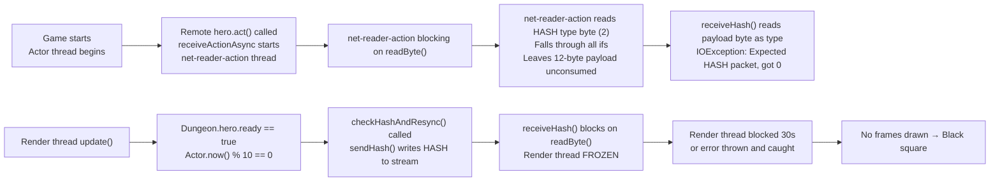
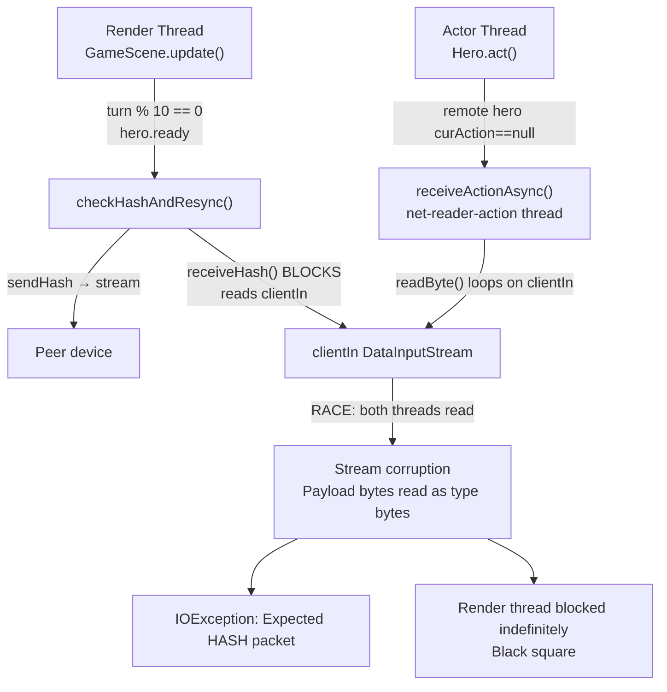

# LAN Hash Exchange: Stream Race Between receiveHash (Render Thread) and receiveActionAsync (Background Thread)

## Metadata

- Date: `2026-05-30`
- Status: `in-progress`
- Severity: `critical`
- Related issue/ticket: `N/A`
- Owner: `lewibs`

## About

**Overview**:
After game start in LAN multiplayer, two bugs manifest:

1. **Black square level rendering** — the dungeon level appears as a large black rectangle instead
   of the dungeon map. Root cause: The render thread is blocked in `receiveHash()` because the
   stream has been desynchronized by concurrent reads, causing no frames to draw.

2. **Hash exchange errors** — the log shows "Expected HASH packet, got {type}" with type values
   like 101 ('e'), 114 ('r'), 0, 1, etc. Root cause: Two threads compete to read from the same
   TCP `DataInputStream`:
   - `net-reader-action` background thread (started by `receiveActionAsync`) reads from `clientIn`
     (client side) or `ins.get(0)` (host side).
   - The **render thread** calls `receiveHash()` synchronously (blocking!) from
     `GameScene.checkHashAndResync()`, which reads from the same `clientIn` / `ins.get(0)`.

When `receiveActionAsync` reads a HASH packet (type byte = 2), it falls through all `if` clauses
without consuming the 12-byte payload (4 int + 8 long). The next `readByte()` reads payload bytes
as if they were a packet type. Meanwhile `receiveHash()` on the render thread either reads a payload
byte (not HASH type → error) or blocks indefinitely if `receiveActionAsync` consumed the expected
HASH byte first.

The render-thread block in `receiveHash()` is the direct cause of the black square — the entire
render pipeline freezes until the peer sends another HASH packet or the 30-second socket timeout
fires.

**Technical Questions**:

- Root cause A: `receiveHash()` is a blocking synchronous read on the render thread. It reads from
  the same stream as `receiveActionAsync`. No mutual exclusion or channel separation exists.

- Root cause B: `receiveActionAsync` handles ACTION, ITEM_IDENTIFIED, CLASS_CLAIMED, CLASS_UNCLAIMED
  but not HASH. When a HASH packet arrives on the stream it falls through, leaving the 12-byte
  payload unconsumed. Subsequent reads are permanently desynchronized.

- Root cause C: `checkHashAndResync()` is called from `GameScene.update()` (render thread) when
  `Dungeon.hero.ready == true` AND `Actor.now() % 10 == 0`. This can first fire at turn 0 on a
  fresh game start, before `receiveActionAsync` has started — but the race opens as soon as both
  threads are running simultaneously.

**Resources**:
- `core/src/main/java/com/shatteredpixel/shatteredpixeldungeon/network/NetworkManager.java`
  - Line ~393: `receiveHash()` — blocking read on caller's thread (render thread)
  - Line ~266: `receiveActionAsync()` — background thread reading same stream; no HASH case
  - Line ~342: `sendHash()` — sends HASH packet from render thread
- `core/src/main/java/com/shatteredpixel/shatteredpixeldungeon/scenes/GameScene.java`
  - Line ~1981: `checkHashAndResync()` — calls sendHash + receiveHash synchronously on render thread
  - Line ~944: call site in `update()` gated on `Dungeon.hero.ready`

## Steps to cause failure



## System



## Reproduction Details

1. Start a LAN host. Have a second device join.
2. Both complete hero selection and start the game.
3. Wait ~10 in-game turns (or immediately at turn 0 if hero.ready at turn 0).
4. Observe in logs: "Hash exchange error: Expected HASH packet, got X" (X = 0, 1, 101, 114, etc.)
5. Observe game freezes on client or host (render thread blocked in receiveHash).
6. Level appears as a completely black rectangle.

Automated test: Unit tests exist for NetworkManager in `test/` but cannot test the race without
two real threads on a real socket pair. Integration test: run a two-device session and observe logs.

## Notes for Fix

### Fix plan

The fundamental problem is that two concurrent readers share one TCP stream with no coordination.

**Option A (chosen): Move hash exchange entirely onto a dedicated thread, off the render thread.**

Instead of calling `checkHashAndResync()` synchronously on the render thread:
1. Start a single `net-hash-sync` background thread when `GameScene` is created in LAN mode.
2. This thread runs its own loop: wait for the turn counter to reach a multiple of 10, call
   `sendHash()` + `receiveHash()`, compare, handle desync.
3. Remove `checkHashAndResync()` from `GameScene.update()`.

This means `receiveHash` and `receiveActionAsync` STILL share the same stream — that race
remains. So additionally:

**Option B (also needed): Single unified reader thread with a dispatch queue.**

One background thread reads ALL incoming packets from the stream and dispatches them:
- HASH packets → enqueue to a `LinkedBlockingQueue<HashPacket>`
- ACTION packets → set remote hero's `curAction`
- ITEM_IDENTIFIED → dispatch to render thread
- etc.

`receiveHash()` becomes: `return hashQueue.poll(TIMEOUT, TimeUnit.MILLISECONDS)` — non-blocking read
from the queue, no stream access on the render thread.

This eliminates the race entirely. The single reader thread is the only thread accessing the stream.

**Minimal safe fix (for now):**

In `receiveActionAsync`, add handling for HASH packets — read and discard the payload bytes so
the stream stays synchronized, then notify the pending `receiveHash()` call:

```java
} else if (type == PacketType.HASH) {
    // Discard: receiveHash is called on the render thread and will race.
    // For now, consume the bytes to keep the stream synchronized.
    in.readInt();   // turn
    in.readLong();  // hash
}
```

Then make `checkHashAndResync` async: instead of blocking the render thread, post to a background
executor that uses a separate concurrent `receiveHash` call guarded by a mutex.

## Audit Log

| ID | Action | Note | Context |
| --- | --- | --- | --- |
| 1 | Create audit log | Initialize investigation | Bug reported: black square + hash exchange errors |
| 2 | Read NetworkManager.java receiveHash() | Blocking read on caller's thread (render thread) | Root cause A confirmed |
| 3 | Read NetworkManager.java receiveActionAsync() | No HASH case — falls through, leaves 12 bytes unconsumed | Root cause B confirmed |
| 4 | Read GameScene.java checkHashAndResync() | Called from update() = render thread; calls receiveHash() synchronously | Root cause C confirmed |
| 5 | Traced turn-0 race window | hero.ready==true at turn 0 possible; receiveActionAsync starts from actor thread concurrently | Race window confirmed |
| 6 | Read GameScene.create() | hero sprite assigned via localPlayerIndex; correct for client | Not a cause of black square |
| 7 | Read FogOfWar constructor | Initializes all black; processes toUpdate on first draw | Initial black frames possible but transient |
| 8 | Traced observe() call from switchLevel | Called before GameScene exists; GameScene.updateFog is no-op; but FogOfWar.draw() reads Dungeon.level.visited directly | Fog should render correctly on first frame |
| 9 | Identified render-thread freeze as black-square cause | receiveHash blocks render thread → no frames rendered → black screen persists | Root cause confirmed |

## Verification

- [ ] Reproduced failure before fix
- [ ] Reproduction test fails before fix
- [ ] Root cause identified with evidence
- [ ] Fix applied at source (no workaround-only patch)
- [ ] Reproduction test passes after fix
- [ ] Reproduction path now passes
- [ ] Regression test added/updated
- [ ] Verified no duplicate solved-bug log exists for same root cause
