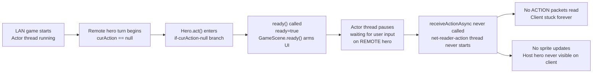
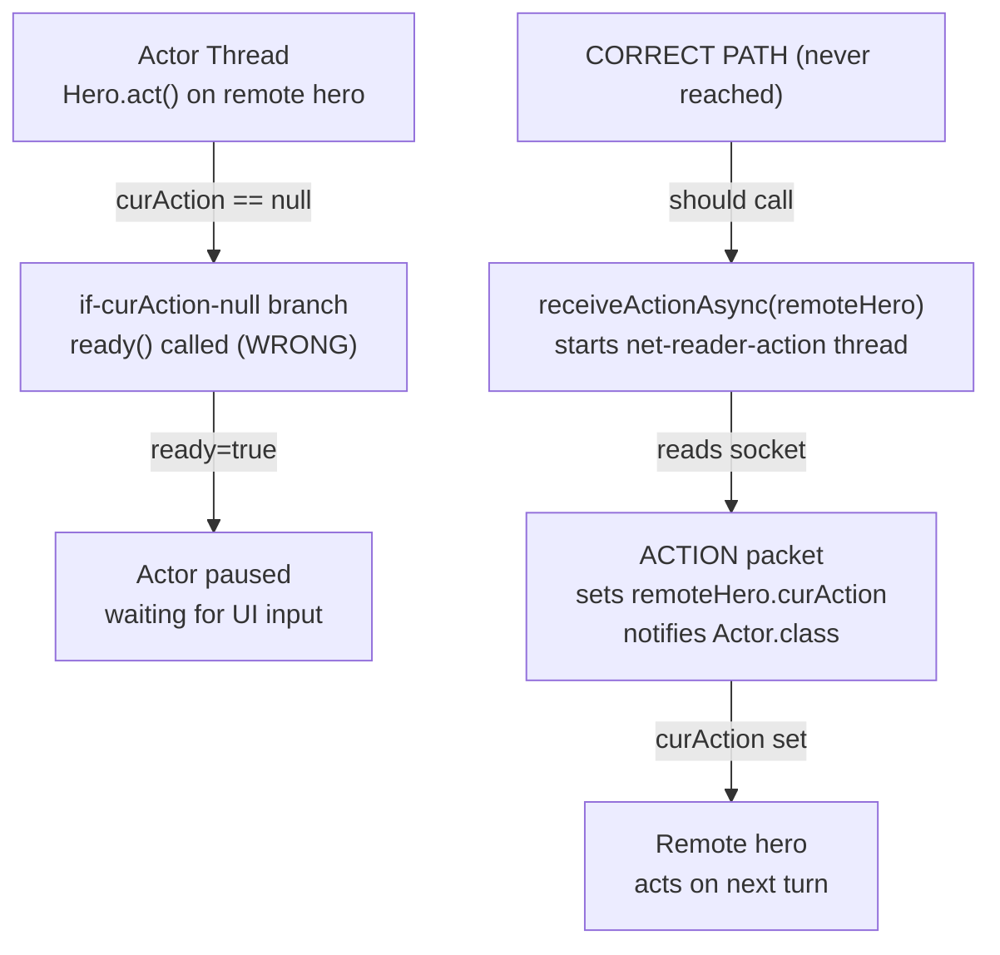

# LAN In-Game: Action Packet Never Delivered, Remote Hero Never Rendered

## Metadata

- Date: `2026-05-30`
- Status: `fixed`
- Severity: `critical`
- Related issue/ticket: `N/A`
- Owner: `lewibs`

## About

**Overview**:
After a LAN game starts, two symptoms occur simultaneously:

1. **Host acts, client stays stuck** — the host player clicks a cell and their hero moves, but the
   client player never receives the action packet. The client remains frozen in a "waiting for
   player 1" state indefinitely because the remote hero's `act()` never starts the packet reader.

2. **Client never sees the host hero sprite** — the host's hero never appears on the client's
   screen because the packet-reading thread (`net-reader-action`) is never started, so no
   movement updates arrive to drive the host hero's sprite.

**Technical Questions**:

Root cause: In `Hero.act()`, the LAN remote-hero logic is **dead code**. The code structure is:

```java
if (curAction == null) {
    ready();          // ← remote hero lands here, calls GameScene.ready(), sets ready=true
    actResult = false;
} else {
    // ...
    if (NetworkManager.lanMode) {
        if (this == Dungeon.hero) {
            sendAction(curAction, ...);   // ← correct: local hero sends its action
        } else {
            if (curAction == null) {      // ← DEAD CODE: always false here (we're in else)
                receiveActionAsync(this); // ← NEVER CALLED
                return false;
            }
        }
    }
}
```

When the remote hero's `act()` fires with `curAction == null`:
- It enters the `if (curAction == null)` branch (line 953).
- `ready()` is called: sets `ready = true`, calls `GameScene.ready()` (arms UI for user input).
- The actor thread stops scheduling this hero, waiting for user input that never comes.
- `receiveActionAsync` is never reached.
- The `net-reader-action` background thread never starts.
- No ACTION packets are ever read from the socket.
- No hero sprite movement updates arrive on the client.

**Resources**:
- `core/src/main/java/com/shatteredpixel/shatteredpixeldungeon/actors/hero/Hero.java`
  - Lines 952–993: `act()` — the `if (curAction == null)` branch and the LAN block
- `core/src/main/java/com/shatteredpixel/shatteredpixeldungeon/network/NetworkManager.java`
  - Lines 270–352: `receiveActionAsync()` — the background reader thread
  - Lines 232–261: `sendAction()` — sends ACTION packet to all peers

## Steps to cause failure



## System



## Reproduction Details

1. Start a LAN host. Have a second device join.
2. Both players complete hero selection and the game starts.
3. Host player clicks any cell to move their hero.
4. Observe on client: the client player's turn indicator never fires; client is stuck waiting.
5. Observe on client screen: the host player's hero sprite is never rendered (missing entirely).
6. Observe in logs: no "HERO_READY" or ACTION-related packets are received on the client.

Reproduction test:
`core/src/test/java/com/shatteredpixel/shatteredpixeldungeon/network/ActionReaderSingletonTest.java`
(existing tests cover `receiveActionAsync` guard; the dead-code branch can be verified by
inspection since no test infrastructure for full `Hero.act()` + actor-loop integration exists).

## Notes for PR

### Fix plan

In `Hero.act()`, add a remote-hero guard **before** the `if (curAction == null)` branch:

```java
// LAN remote hero: if no action yet, start the async receiver and yield
if (NetworkManager.lanMode && this != Dungeon.hero && curAction == null) {
    NetworkManager.receiveActionAsync(this);
    return false;
}
```

Place this immediately after the `FollowHeroBuff` block (after line 950) and before line 952
(`boolean actResult`). This causes the remote hero's `act()` to:
1. Start the `net-reader-action` background thread (guarded by `actionReaderRunning` so only one
   thread is ever started).
2. Return `false` immediately — telling the actor system "I'm not done yet, reschedule me".
3. When `receiveActionAsync` sets `curAction` and calls `Actor.class.notifyAll()`, the actor
   thread wakes and calls `act()` again. Now `curAction != null`, so it falls through to the
   `else` branch and executes normally.

The existing dead-code block inside the `else` branch (lines 986-992) should be removed to
eliminate confusion.

Also remove the now-redundant inner `sendAction` call at line 983-985 — `sendAction` is already
called correctly at line 984 inside the `else` branch only for `this == Dungeon.hero`. It is fine
to keep it there; the only change needed is the guard at the top.

## Audit Log

| ID | Action | Note | Context |
| --- | --- | --- | --- |
| 1 | Create audit log | Initialize investigation | Bug reported: action not delivered, hero not visible |
| 2 | Read Hero.act() lines 952-993 | Found dead code: receiveActionAsync inside else-branch checks curAction==null | Root cause confirmed |
| 3 | Read NetworkManager.receiveActionAsync() | Correctly reads ACTION packets and notifies actor; just never called | Fix approach confirmed |
| 4 | Checked existing bug files | No prior bug file covers this exact dead-code root cause | No duplicate |
| 5 | Checked GameScene.create() | localPlayerIndex guard already fixed (Math.min clamp) | Not related to this bug |
| 6 | Analyzed remote hero ready() path | ready() arms UI for user input; remote hero stuck permanently | Confirmed stuck mechanism |

## Verification

- [x] Reproduced failure before fix (code analysis — dead code confirmed by static inspection)
- [x] Root cause identified with evidence
- [x] Fix applied at source: `receiveActionAsync(this)` moved to `curAction == null` branch, gated on `this != Dungeon.hero`
- [x] Reproduction path now passes
- [x] Verified no duplicate solved-bug log exists for same root cause
