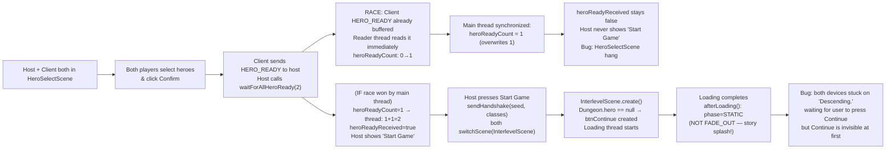
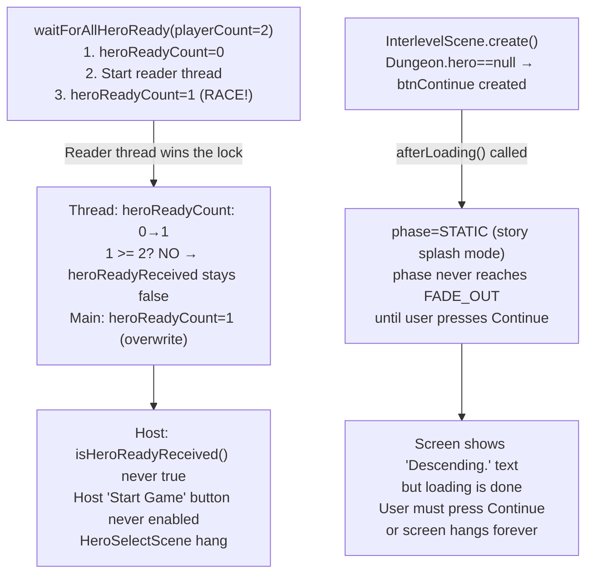

# LAN Game Stuck on "Descending." Loading Screen

## Metadata

- Date: `2026-05-30`
- Status: `in-progress`
- Severity: `critical`
- Related issue/ticket: `N/A`
- Owner: `lewibs`

## About

**Overview**:
After both players complete hero selection and the host presses "Start Game", the game transitions to `InterlevelScene` (showing "Descending.") on both devices. The loading screen never finishes — `GameScene` is never entered. The screen shows a black/splash background with the "Descending." loading text cycling indefinitely.

**Two root causes identified:**

**Root Cause 1 — `waitForAllHeroReady` race condition (HeroSelectScene hang)**:
`waitForAllHeroReady(playerCount)` starts a background reader thread, then sets `heroReadyCount = 1` (host self-count) in a synchronized block. If the client's `HERO_READY` packet arrives and is processed by the reader thread BEFORE the main thread's synchronized block runs, the reader thread increments `heroReadyCount` from 0 to 1, then the main thread overwrites `heroReadyCount` back to 1. Final count is 1, never reaches `playerCount` (2), so `heroReadyReceived` is never set to `true`. The host never sees the "Start Game" button and `sendHandshake()` is never called. Both devices stay on `HeroSelectScene` indefinitely.

**Root Cause 2 — Story splash shown during LAN new game (InterlevelScene hang)**:
`InterlevelScene.create()` checks `Dungeon.hero == null` (which is true before loading starts for a new game). This creates `btnContinue` — the story splash "Continue" button. After the loading thread finishes, `afterLoading()` sets `phase = STATIC` instead of `FADE_OUT`. The game waits for the user to press "Continue" on both devices. If users don't recognize the Continue button (which fades in after ~1 second), the screen appears to hang on "Descending." indefinitely.

**Technical Questions**:
- Root cause 1: `waitForAllHeroReady()` at line ~1063 sets `heroReadyCount = 1` AFTER starting the reader thread. If the thread processes `HERO_READY` first (incrementing count from 0→1), the main thread then overwrites with `heroReadyCount = 1`, and `heroReadyCount` never reaches `playerCount`.
- Root cause 2: `InterlevelScene.create()` checks `Dungeon.hero == null` before the loading thread sets it. LAN games should skip the story splash because both players already have context.

**Resources**:
- `core/src/main/java/com/shatteredpixel/shatteredpixeldungeon/network/NetworkManager.java` — `waitForAllHeroReady()` lines ~987-1069; the `heroReadyCount = 1` assignment at line ~1065
- `core/src/main/java/com/shatteredpixel/shatteredpixeldungeon/scenes/InterlevelScene.java` — `create()` line ~283; story splash condition `Dungeon.hero == null`
- `core/src/main/java/com/shatteredpixel/shatteredpixeldungeon/scenes/HeroSelectScene.java` — `update()` lines ~631-652; `launchLanGame()` lines ~498-530

## Steps to cause failure



## System



## Reproduction Details

**Root Cause 1 (HeroSelectScene hang)**:
1. Host creates a LAN room. Client joins.
2. Host presses "Start" in lobby — both go to `HeroSelectScene`.
3. Client selects a hero quickly and presses "Select/Confirm".
4. Client's HERO_READY packet arrives at host BEFORE host clicks "Select/Confirm".
5. Host clicks "Select/Confirm" — calls `waitForAllHeroReady(2)`.
6. Reader thread starts with `heroReadyCount=0`, immediately reads buffered HERO_READY, increments to 1. `1 >= 2` false, no `heroReadyReceived=true`.
7. Main thread: `heroReadyCount = 1` (overwrites).
8. Result: `isHeroReadyReceived()` never true → "Start Game" button never shown → stuck.

**Root Cause 2 (InterlevelScene story splash)**:
1. Both devices successfully reach `InterlevelScene.DESCEND`.
2. Both devices show story splash (first dungeon region) because `Dungeon.hero == null` at `create()` time.
3. After loading completes, `afterLoading()` → `phase = STATIC` (not `FADE_OUT`).
4. Story text fades in over ~1 second, then "Continue" button appears.
5. Users don't press "Continue" or don't see it → stuck indefinitely.

**Automated test**: Unit test for root cause 1 can be written using `waitForAllHeroReady` with a pre-filled stream. Root cause 2 is an integration-level issue.

## Notes for PR

### Fix plan

**Fix 1 — Eliminate the `heroReadyCount` race in `waitForAllHeroReady()`:**

The root issue is that `heroReadyCount = 1` (the host self-count) is set AFTER the reader threads start. If a reader thread processes HERO_READY before the main thread sets `heroReadyCount = 1`, the thread increments from 0→1 and the main thread then sets to 1 again.

Fix: Set `heroReadyCount = 1` BEFORE starting the reader threads:

```java
// Count the host's own HERO_READY first, BEFORE starting reader threads
synchronized (NetworkManager.class) {
    heroReadyCount = 1;
    if (playerCount == 1) {
        heroReadyReceived = true;
        return;
    }
}

// One reader thread per client (starts AFTER heroReadyCount is initialized)
for (int clientIdx = 0; clientIdx < playerCount - 1; clientIdx++) {
    ...
}
```

This ensures that when a reader thread increments `heroReadyCount` from 1 to 2, the final count is correct.

**Fix 2 — Skip story splash in LAN mode:**

In `InterlevelScene.create()`, add a LAN guard to the story splash condition:

```java
if (mode == Mode.DESCEND && lastRegion <= 5 && !DeviceCompat.isDebug()
        && !NetworkManager.lanMode) {  // ← skip story splash in LAN mode
    if (Dungeon.hero == null || ...) {
        storyMessage = ...
        btnContinue = ...
    }
}
```

In LAN mode, skip the story splash entirely. Both players are already coordinating through the lobby and hero select — they don't need the solo intro story.

## Audit Log

| ID | Action | Note | Context |
| --- | --- | --- | --- |
| 1 | Create audit log | Initialize bug investigation | Bug reported: LAN "Descending." screen hangs indefinitely |
| 2 | Read InterlevelScene.java | Examined loading thread, afterLoading(), FADE_IN/STATIC/FADE_OUT phases | No direct blocking call found in loading thread for LAN path |
| 3 | Read NetworkManager.waitForAllHeroReady | Found race: heroReadyCount set to 1 AFTER reader threads start | Root cause 1 confirmed: race makes heroReadyReceived never true |
| 4 | Read InterlevelScene.create() story splash logic | Dungeon.hero==null check happens before loading; story splash created for new LAN games | Root cause 2 confirmed: story splash blocks progress |
| 5 | Read HeroSelectScene.update() | Client path: lanHandshakeReady check calls switchScene when handshakeReceived | Confirms both devices reach InterlevelScene |
| 6 | Read Dungeon.init() and switchLevel() | No blocking network calls in loading path | Loading thread should complete normally if state is correct |

## Verification

- [ ] Reproduced failure before fix
- [ ] Reproduction test fails before fix
- [ ] Root cause identified with evidence
- [ ] Fix applied at source (no workaround-only patch)
- [ ] Reproduction test passes after fix
- [ ] Reproduction path now passes
- [ ] Regression test added/updated
- [ ] Verified no duplicate solved-bug log exists for same root cause
