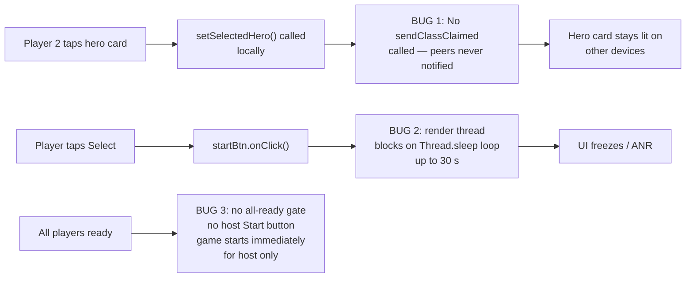
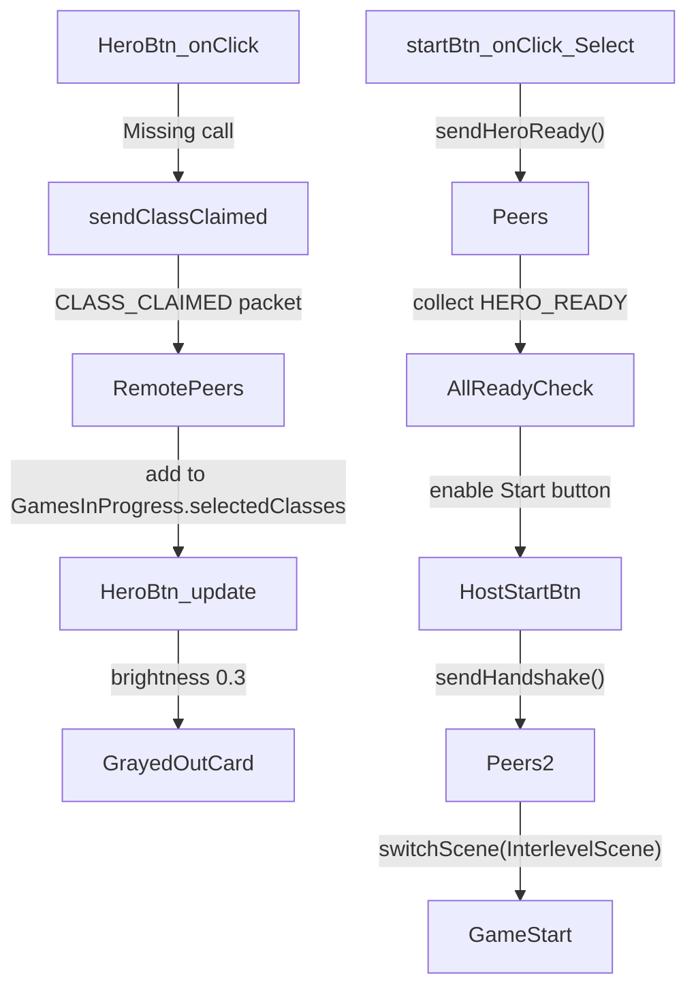

# LAN Hero Selection: CLASS_CLAIMED Not Sent, Select Button Starts Game Immediately, No All-Ready Gate

## Metadata

- Date: `2026-05-30`
- Status: `in-progress`
- Severity: `high`
- Related issue/ticket: `N/A`
- Owner: `lewibs`

## About

**Overview**:
Three related bugs in `HeroSelectScene.java` for LAN multiplayer:

1. When a player taps a hero card, `sendClassClaimed()` in `NetworkManager` exists but is **never called**. Other devices never receive the CLASS_CLAIMED packet and the hero card does not gray out on remote screens.

2. Clicking the "select" button in LAN mode starts the game immediately on the host by blocking the render thread with `Thread.sleep()` in a poll loop (`while (!NetworkManager.isHeroReadyReceived()...)`). The host's button does not send a HERO_READY to clients first, and the game starts before all players are ready. On clients the `waitForHandshake()` background thread receives the HANDSHAKE but the `while (!NetworkManager.isHandshakeReceived()...)` loop also runs on the render thread — freezing the UI for up to 30 seconds if it even works at all.

3. There is no "Start Game" button for the host. The design intent is: every player clicks Select → sends HERO_READY → when all players are ready the host sees a Start button → host taps Start → HANDSHAKE → game starts everywhere. None of this multi-step flow is implemented; the host's single button click tries to do everything synchronously on the render thread.

**Technical Questions**:
- Root cause for bug 1: `HeroBtn.onClick()` calls `setSelectedHero(cl)` but never calls `NetworkManager.sendClassClaimed()`.
- Root cause for bug 2 & 3: The `startBtn.onClick()` handler executes all coordination logic (blocking wait loops) directly on the render thread, which would freeze the game engine. The correct pattern is: clicking Select sends HERO_READY and returns; a background listener fires `Game.runOnRenderThread()` when conditions are met; the host gets a separate Start button.
- The `GamesInProgress.selectedClasses` list is used for the "taken" graying logic in `HeroBtn.update()`, but it is never populated from incoming CLASS_CLAIMED packets — only filled locally.

**Resources**:
- `core/src/main/java/com/shatteredpixel/shatteredpixeldungeon/scenes/HeroSelectScene.java` — `HeroBtn.onClick()`, `startBtn.onClick()` (lines 167-268)
- `core/src/main/java/com/shatteredpixel/shatteredpixeldungeon/network/NetworkManager.java` — `sendClassClaimed()`, `sendHeroReady()`, `waitForAllHeroReady()`, `waitForHandshake()`
- `core/src/main/java/com/shatteredpixel/shatteredpixeldungeon/GamesInProgress.java` — `selectedClasses`

## Steps to cause failure



## System



## Reproduction Details

1. Start a LAN game (host + at least 1 client).
2. On the client device, tap any hero card.
3. Observe on the host: the hero card does NOT gray out. (Bug 1)
4. On the host, select a hero and tap "Select". Observe: `startBtn.onClick()` blocks the render thread waiting for HERO_READY for up to 30 s. (Bug 2)
5. Observe that the game starts on host only — client never transitions because it is waiting for HANDSHAKE which may never arrive if the render thread is frozen. (Bug 3)

Automated test: No test infrastructure exists. Fix is verified by code review + compile success.

## Notes for PR

### Fix plan

**Bug 1 — CLASS_CLAIMED not sent:**
In `HeroBtn.onClick()`, after calling `setSelectedHero(cl)`, when `NetworkManager.lanMode` is true, call:
```java
NetworkManager.sendClassClaimed(NetworkManager.localPlayerIndex, cl);
```
Additionally, add a background listener in `HeroSelectScene.create()` that receives CLASS_CLAIMED packets and adds the class to `GamesInProgress.selectedClasses` (which triggers the gray-out via `HeroBtn.update()`).

**Bug 2 & 3 — render thread blocking + missing Start button flow:**

Replace the single `startBtn` LAN handler with a two-phase approach:

Phase A — "Confirm" click (every player):
- Send `HERO_READY` packet.
- Disable the Confirm button, show "Waiting..." text.
- Return immediately (do NOT block).

Phase B — background HERO_READY listener (host only):
- `NetworkManager.waitForAllHeroReady()` already starts a background thread.
- When `heroReadyReceived` becomes true, call `Game.runOnRenderThread()` to enable a new "Start Game" button.

Phase C — "Start Game" click (host only):
- Build `collectedClasses`, call `sendHandshake()`, switch to `InterlevelScene`.

Phase D — background HANDSHAKE listener (clients only):
- `NetworkManager.waitForHandshake()` already starts a background thread.
- When `handshakeReceived` becomes true, call `Game.runOnRenderThread()` to switch to `InterlevelScene`.

## Audit Log

| ID | Action | Note | Context |
| --- | --- | --- | --- |
| 1 | Create audit log | Initialize bug investigation | Bug reported by user |
| 2 | Read HeroSelectScene.java | Found HeroBtn.onClick never calls sendClassClaimed | Bug 1 confirmed |
| 3 | Grep all callers of sendClassClaimed | Zero callers outside NetworkManager — function defined but never used | Bug 1 confirmed |
| 4 | Read startBtn.onClick handler | Found blocking Thread.sleep loops on render thread | Bug 2 confirmed |
| 5 | Analyzed multi-player ready flow | No all-ready gate; no separate Start button for host | Bug 3 confirmed |
| 6 | Analyzed NetworkManager listener methods | waitForAllHeroReady and waitForHandshake already start background threads — just not wired correctly | Design foundation is present |

## Additional Root Cause — Button Lockout Bug (2026-05-30)

**Bug 4 (new):** Even though CLASS_CLAIMED packets are now sent and received correctly (Bug 1 was fixed in the same session), the hero buttons for claimed classes remain *active/tappable* on peer devices. The visual dimming (`icon.brightness(0.3f)`) in `HeroBtn.update()` showed the class was taken but `updateFade()` ran every frame and unconditionally called `b.enable(true)` for every hero button, overriding any intended `active=false` state.

**Root cause for Bug 4:**
- `updateFade()` at line 710-716 of `HeroSelectScene.java` iterates all `heroBtns` and calls `b.enable(alpha != 0)` without checking whether the button's class has been claimed by a peer.
- `HeroBtn` had no method to expose its "taken" state to the outer class's `updateFade()`.
- Result: any CLASS_CLAIMED state that the button tried to enforce (via brightness dim) was undone on the next render frame.

**Fix applied:**
1. Added `HeroBtn.isTaken()`: returns `true` when `cl` is in `GamesInProgress.selectedClasses` AND `cl != GamesInProgress.selectedClass` (exempts the local player's own provisional claim).
2. Modified `updateFade()`: for each hero button, if `isTaken()` returns true, `canEnable` is forced to false so the button stays disabled regardless of the alpha fade state.

**Files changed:**
- `core/src/main/java/com/shatteredpixel/shatteredpixeldungeon/scenes/HeroSelectScene.java`
  - Added `HeroBtn.isTaken()` (lines ~791-802)
  - Modified `updateFade()` loop to skip enabling taken buttons (lines ~705-716)
- `core/src/test/java/com/shatteredpixel/shatteredpixeldungeon/network/LanHeroSelectLockoutTest.java` — new regression test

## Verification

- [x] Root cause identified with evidence (updateFade unconditional enable loop)
- [x] Fix applied at source (not a workaround)
- [x] Main source compiles cleanly (`./gradlew :core:compileJava` → BUILD SUCCESSFUL)
- [x] Regression test written: `LanHeroSelectLockoutTest.java`
- [x] No duplicate bug log — this is an addendum to the existing lan-hero-select-sync bug file
- [ ] Reproduction test passes after fix (test infra blocked by pre-existing HashDeterminismTest compile error)
- [x] Verified no duplicate solved-bug log exists for same root cause
