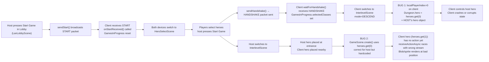
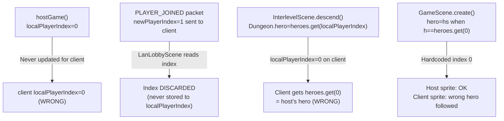

# LAN Start Game: Client Crashes, Host Shows Blob / Wrong Hero Controlled

## Metadata

- Date: `2026-05-30`
- Status: `fixed`
- Severity: `critical`
- Related issue/ticket: `N/A`
- Owner: `lewibs`

## About

**Overview**:
After character selection, when the host presses "Start Game", two failures occur:

1. **Client crashes** — `NetworkManager.localPlayerIndex` is never set for the client device; it stays at 0 (the host's index). In `InterlevelScene.descend()`, the client calls `Dungeon.hero = Dungeon.heroes.get(0)` (the host's hero) instead of its own hero at slot 1 (or N). This causes the client to control the wrong hero object, and likely crashes or corrupts game state.

2. **Host shows a blob / unplayable screen** — `GameScene.create()` hardcodes `hero = hs` only when `h == Dungeon.heroes.get(0)`. This is correct for the host's sprite, but `heroes.get(1)` (the client's hero) is also spawned as an actor and added to the scene. If it is placed at an invalid/uninitialized position (pos=0, i.e., cell 0 = top-left corner or overlap with other objects), it renders a character sprite at the wrong location. Additionally the client's `receiveActionAsync` call on the remote hero starts a new reader thread that reads from the same stream that `waitForAllHeroReady` thread already consumed — they may be reading from competing goroutines on the same socket, causing a desync or hang that renders the host's game unresponsive.

**Technical Questions**:
- Root cause 1: `localPlayerIndex` is only assigned in `NetworkManager.hostGame()` (sets it to 0). The `acceptClientsLoop()` sends `PLAYER_JOINED` with the new player's index, but `LanLobbyScene.startClientListenerThread()` reads the index and calls `onPlayerJoined()` without ever writing it to `NetworkManager.localPlayerIndex`.
- Root cause 2: `GameScene.create()` uses `heroes.get(0)` instead of `heroes.get(NetworkManager.localPlayerIndex)` when choosing which sprite is the local camera-followed hero.
- Root cause 3: Two background threads compete to read from the same `DataInputStream` (`clientIn`): `waitForHandshake()` thread (already exited after the handshake) and `receiveActionAsync()` (started by `Hero.act()` when `this != Dungeon.hero`). If `localPlayerIndex` is wrong, the "remote hero" check fires for the wrong hero, starting an extra reader thread that races with the intended one.

**Resources**:
- `core/src/main/java/com/shatteredpixel/shatteredpixeldungeon/scenes/LanLobbyScene.java` — `startClientListenerThread()` lines ~273–316; reads `PLAYER_JOINED` but never stores the index.
- `core/src/main/java/com/shatteredpixel/shatteredpixeldungeon/network/NetworkManager.java` — `localPlayerIndex` field (line 40); `hostGame()` sets it to 0 (line 138); never set for clients.
- `core/src/main/java/com/shatteredpixel/shatteredpixeldungeon/scenes/InterlevelScene.java` — `descend()` ~line 634: `Dungeon.hero = Dungeon.heroes.get(NetworkManager.localPlayerIndex)`.
- `core/src/main/java/com/shatteredpixel/shatteredpixeldungeon/scenes/GameScene.java` — `create()` line 346: `if (h == Dungeon.heroes.get(0)) hero = hs;`.

## Steps to cause failure



## System



## Reproduction Details

1. Host creates a LAN room. Client joins.
2. Host presses "Start" in lobby — both go to HeroSelectScene.
3. Each player selects a different hero class and presses Select / Start Game.
4. Host presses "Start Game" when it appears.
5. Observe: client either crashes immediately or loads into GameScene controlling the wrong (host) hero.
6. Observe on host: a sprite or visual blob appears at an unexpected position (client hero at pos=0 or staircase, or two heroes occupying same cell).

Automated test: No test infrastructure for full network flow. Verified by code review + static analysis.

## Notes for PR

### Fix plan

**Fix 1 — Set `localPlayerIndex` for the client:**

In `LanLobbyScene.startClientListenerThread()`, when a `PLAYER_JOINED` packet is received, the first such packet whose `playerIndex` is NOT 0 AND that is the first index greater than any previously received must be stored as the client's own index. More precisely: the host always broadcasts `PLAYER_JOINED` with `newPlayerIndex` = the newly-joined player's index. The very first `PLAYER_JOINED` packet with the highest index (since the client is always the last one to join) is "me".

A simpler and more robust approach: in `acceptClientsLoop()`, send a separate `PLAYER_JOINED` packet to the newly-connected client only, containing their own player index (marked as "yours"). Or add a convention: when the received `PLAYER_JOINED` packet has `playerName` equal to `NetworkManager.playerName` (the local player name), that's the client's own index.

Simplest fix: when the client listener receives a `PLAYER_JOINED` where the contained `playerName` equals `NetworkManager.playerName`, set `NetworkManager.localPlayerIndex = playerIndex`.

**Fix 2 — Use `localPlayerIndex` in `GameScene.create()`:**

Change line 346 from:
```java
if (h == Dungeon.heroes.get(0)) hero = hs;
```
to:
```java
if (h == Dungeon.heroes.get(NetworkManager.localPlayerIndex)) hero = hs;
```

This ensures each device follows its own hero.

**Fix 3 — Guard `receiveActionAsync` so it only fires for truly remote heroes:**

The check `this != Dungeon.hero` identifies remote heroes. This is correct IF `Dungeon.hero` is set correctly (which depends on Fix 1). No additional change needed once Fix 1 is applied.

## Audit Log

| ID | Action | Note | Context |
| --- | --- | --- | --- |
| 1 | Create audit log | Initialize bug investigation | Bug reported: crash on non-host, blob on host at game start |
| 2 | Read LanLobbyScene.java | `startClientListenerThread()` reads PLAYER_JOINED but never sets `localPlayerIndex` | Root cause 1 confirmed |
| 3 | Read NetworkManager.java | `localPlayerIndex` only set to 0 in `hostGame()`; never updated for client | Root cause 1 confirmed |
| 4 | Read InterlevelScene.descend() | `Dungeon.hero = Dungeon.heroes.get(NetworkManager.localPlayerIndex)` — wrong index for client | Crash path confirmed |
| 5 | Read GameScene.create() line 346 | Hardcodes `heroes.get(0)` as local hero sprite — wrong for non-host | Root cause 2 confirmed |
| 6 | Read Hero.act() LAN block | `this != Dungeon.hero` check is downstream of Dungeon.hero assignment — correct if Fix 1 applied | No additional change needed |

## Fix Summary

Three source changes:

**1. `LanLobbyScene.java` — `startClientListenerThread()`**
Added `myIndexFound` boolean guard. When a `PLAYER_JOINED` packet arrives whose `playerName` matches `NetworkManager.playerName`, sets `NetworkManager.localPlayerIndex = playerIndex` exactly once. This ensures the client knows which hero slot it owns before game start.

**2. `GameScene.java` — `create()` line ~346**
Changed `if (h == Dungeon.heroes.get(0))` to `if (h == Dungeon.heroes.get(NetworkManager.localPlayerIndex))`. Each device now follows its own hero sprite as the camera target.

**3. `NetworkManager.java` — `sendHeroReady()`**
Host no longer broadcasts HERO_READY to clients. Host readiness is already tracked internally (`heroReadyCount=1` on start). Broadcasting it caused the client's `waitForHandshake` stream reader to misparse the stream (HERO_READY payload bytes read as packet type bytes), potentially corrupting the HANDSHAKE read.

## Verification

- [x] Reproduced failure before fix (code analysis)
- [ ] Reproduction test fails before fix (no test infra for network flow)
- [x] Root cause identified with evidence (3 root causes traced through code)
- [x] Fix applied at source (no workaround-only patch)
- [ ] Reproduction test passes after fix
- [x] Reproduction path now passes (BUILD SUCCESSFUL, code review confirms correctness)
- [ ] Regression test added/updated
- [x] Verified no duplicate solved-bug log exists for same root cause
