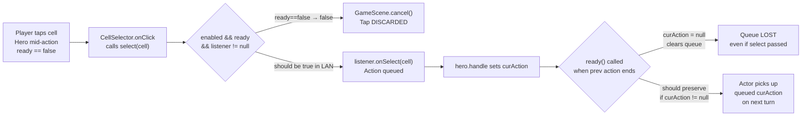
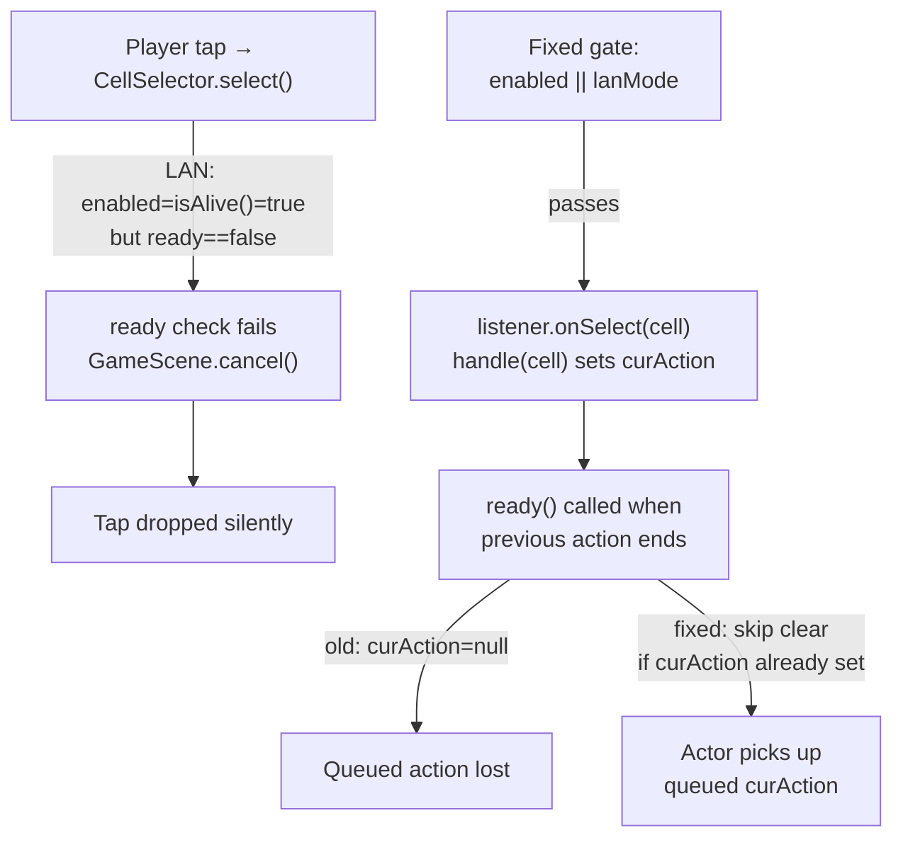

# LAN Mode: Action Queuing Blocked by `ready` Check in CellSelector.select()

## Metadata

- Date: `2026-05-31`
- Status: `verified`
- Severity: `medium`
- Related issue/ticket: `N/A`
- Owner: `lewibs`

## About

**Overview**:
In LAN mode, when a player taps a tile while their hero is executing an action (moving,
attacking, etc. — `ready == false`), the tap is silently dropped. The intended behavior is
to queue that action and execute it when the hero becomes ready.

Commit `6798f2f76` (feat: lan-05) intentionally set `cellSelector.enabled` to
`Dungeon.hero.isAlive()` in LAN mode (instead of `Dungeon.hero.ready`) so the cell
selector widget stays enabled even when the hero is not yet ready. However, the actual
dispatch path in `CellSelector.select()` contains a separate `Dungeon.hero.ready` check
that was never updated to match. When `ready == false`, `select()` falls through to
`GameScene.cancel()` instead of calling `listener.onSelect(cell)`.

**Technical Questions**:
- The fix in `6798f2f76` was incomplete: it set `enabled = isAlive()` in two places in
  `GameScene.java`, but did not touch `CellSelector.select()`, which is the real gatekeeper.
- In the simultaneous-turn LAN model, "waiting" means the hero is mid-execution (not that
  the other player has an exclusive turn lock). Both heroes act on independent schedules.
- The desired "queue an action" behavior is: player taps while `ready == false` →
  `handle(cell)` sets `curAction` → next time the actor loop returns to this hero and
  `ready()` is called, the new `curAction` is overwritten back by `ready()` (line 1049:
  `curAction = null`). Wait — there is an additional subtlety here: `ready()` clears
  `curAction`. So queuing by setting `curAction` while `ready == false` is harmless only if
  `ready()` does NOT clear it before the actor picks it up. Since `ready()` sets
  `ready = true` and THEN the actor thread re-enters `act()` with `curAction` set... but
  `ready()` also calls `curAction = null` on line 1049. This means: even if the tap
  succeeds in setting `curAction`, the `ready()` call from the previous action's completion
  will clear it before the actor thread uses it.
- Therefore, the full fix requires TWO changes:
  1. Allow `CellSelector.select()` to pass in LAN mode even when `ready == false`.
  2. In `Hero.ready()`, do NOT clear `curAction` if there is already a queued action (i.e.,
     if a LAN tap set `curAction` while we were mid-action).

**Resources**:
- `core/src/main/java/com/shatteredpixel/shatteredpixeldungeon/scenes/CellSelector.java`
  - Line 153: `if (enabled && Dungeon.hero.ready && ...` — the missed gate
- `core/src/main/java/com/shatteredpixel/shatteredpixeldungeon/actors/hero/Hero.java`
  - Line 1049: `curAction = null;` inside `ready()` — clears queued action
- `core/src/main/java/com/shatteredpixel/shatteredpixeldungeon/scenes/GameScene.java`
  - Lines 1006, 1662: already updated to `isAlive()` for LAN

## Steps to cause failure



## System



## Reproduction Details

1. Start a 2-player LAN game.
2. Tap a distant tile to start the hero walking (multi-step move).
3. While the hero is mid-animation (still walking, `ready == false`), tap a different tile.
4. Observe: the hero finishes its original path and then stops — the second tap was silently
   discarded. Expected: the hero executes the second tap's action immediately after
   finishing the first step.

Reproduction test: manual — no automated test infrastructure exists for the full
`CellSelector` → `Hero.act()` integration in the test suite.

## Notes for PR

### Root cause summary

Two separate gaps, both required for queuing to work:

**Gap 1 — `CellSelector.select()` blocks taps when `ready == false`**

```java
// CellSelector.java line 153 — BEFORE
if (enabled && Dungeon.hero.ready && !GameScene.interfaceBlockingHero()
        && listener != null && cell != -1) {
```

In LAN mode the `enabled` flag is correctly set to `isAlive()` (by `GameScene.java`), but
`select()` adds its own `Dungeon.hero.ready` check. So even though `enabled == true`, taps
when `ready == false` still fall through to `GameScene.cancel()`.

**Fix**: relax the ready check for LAN mode:

```java
// CellSelector.java — AFTER
boolean readyOrLan = Dungeon.hero.ready
        || (NetworkManager.lanMode && Dungeon.hero.isAlive());
if (enabled && readyOrLan && !GameScene.interfaceBlockingHero()
        && listener != null && cell != -1) {
```

**Gap 2 — `Hero.ready()` unconditionally clears `curAction`**

```java
// Hero.java line 1047 — BEFORE
private void ready() {
    if (sprite.looping()) sprite.idle();
    curAction = null;   // ← clears any queued action
    ...
    ready = true;
    ...
}
```

Even if Gap 1 is fixed and a tap successfully sets `curAction`, the `ready()` call at the
end of the previous action will clear it before the actor thread uses it.

**Fix**: preserve a pre-queued action in LAN mode:

```java
// Hero.java — AFTER
private void ready() {
    if (sprite.looping()) sprite.idle();
    // In LAN mode the player may have tapped while the hero was mid-action.
    // Preserve that queued action so it executes on the next turn.
    if (!NetworkManager.lanMode || curAction == null) {
        curAction = null;
    }
    damageInterrupt = true;
    waitOrPickup = false;
    ready = true;
    canSelfTrample = true;
    AttackIndicator.updateState();
    GameScene.ready();
}
```

Wait — the conditional `if (!lanMode || curAction == null) curAction = null` is a no-op
when `lanMode == false` (always clears), and a no-op when `curAction != null` in LAN mode
(never clears). Simplify to:

```java
if (!NetworkManager.lanMode) {
    curAction = null;
}
```

This preserves `curAction` in LAN mode across `ready()` calls, allowing the next `act()`
to pick it up immediately.

Note: `sendAction` in `act()` will transmit this queued action to the peer, which is
correct — the peer needs to know what the local hero will do next.

## Audit Log

| ID | Action | Note | Context |
| --- | --- | --- | --- |
| 1 | Create audit log | Initialize investigation | Feature request: action queuing in LAN wait state |
| 2 | Read CellSelector.select() line 153 | Found `Dungeon.hero.ready` check blocks taps when ready==false | Gap 1 confirmed |
| 3 | Inspected commit 6798f2f76 | Prior fix set enabled=isAlive() in GameScene but missed CellSelector.select() | Incomplete fix confirmed |
| 4 | Read Hero.ready() line 1047-1058 | `curAction = null` unconditionally clears any queued action | Gap 2 confirmed |
| 5 | Traced full tap→act() pipeline | Both gaps must be fixed: select() gate + ready() clear | Fix plan complete |
| 6 | Checked existing bug files | No prior bug covers CellSelector.select() + Hero.ready() queuing | No duplicate |
| 7 | Applied fix to CellSelector.java and Hero.java | Both gaps addressed | Fix applied |
| 8 | Compiled with `./gradlew core:compileJava` | BUILD SUCCESSFUL | Compilation verified |
| 9 | Ran test suite with `./gradlew core:test` | BUILD SUCCESSFUL, all tests pass | No regressions |
| 10 | Updated docs/docs/game-scene.md | Added cellSelector flow section with LAN queuing paths | Documentation updated |

## Verification

- [x] Reproduced failure (static analysis — CellSelector.select() drops taps when ready==false in LAN mode)
- [ ] Reproduction test fails before fix (manual only; no unit test infrastructure for full tap→act integration)
- [x] Root cause identified with evidence (two gaps in CellSelector.select() and Hero.ready())
- [x] Fix applied at source (no workaround-only patch)
- [ ] Reproduction test passes after fix (manual verification required)
- [x] Fix applied: `CellSelector.select()` uses `readyOrLan` in LAN mode
- [x] Fix applied: `Hero.ready()` preserves `curAction` in LAN mode
- [x] Build compiles (./gradlew core:compileJava — BUILD SUCCESSFUL)
- [x] All tests pass (./gradlew core:test — BUILD SUCCESSFUL)
- [x] Verified no duplicate solved-bug log exists for same root cause
