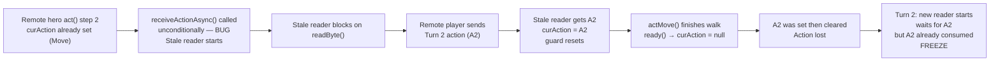
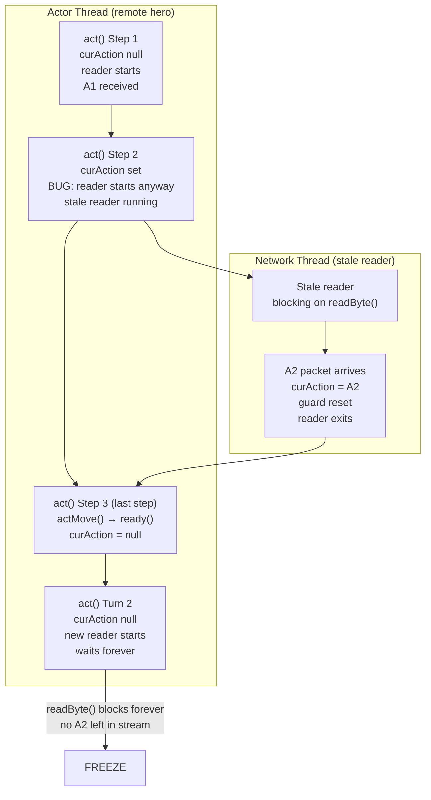

# LAN Freeze: Multi-Step Walk Stale Reader

## Metadata

- Date: `2026-05-31`
- Status: `fixed`
- Severity: `critical`
- Related issue/ticket: `N/A`
- Owner: `lewibs`

## About

**Overview**:

After a LAN game starts, the game freezes after a few turns when either player
performs a multi-step move (walking more than one tile). Previous fixes (break
after ACTION packet, pre-init cellSelector.listener, remote-hero path-finding)
helped but did not fully resolve the freeze.

**User report**: "Previous fixes helped but did not fully resolve it — freezes
after a few turns."

**Technical Questions**:

One root cause remains after the previous fixes: `Hero.act()` called
`receiveActionAsync()` unconditionally on EVERY invocation for a remote hero —
including intermediate steps of a multi-step walk where `curAction` is already
set.

## Root Cause: Stale Reader During Multi-Step Walk

In `Hero.act()`, the LAN block before the fix was:

```java
synchronized (lanActionLock) {
    NetworkManager.receiveActionAsync(this); // unconditional — THE BUG
    while (curAction == null && NetworkManager.lanMode) {
        lanActionLock.wait(5000);
    }
}
```

For a single-step action, `act()` is called once per turn — the reader starts
when `curAction == null`, delivers the action, resets the guard, and exits.

For a **multi-step walk** (e.g., player taps 3 tiles away):
1. Step 1: `curAction == null` → reader starts → action packet received → `curAction` set.
   `actMove()` returns `true` (more steps). `act()` returns `true`.
2. Step 2: `act()` called again with `curAction` still set (the Move action).
   **BUG**: `receiveActionAsync()` called unconditionally → guard was reset by step-1
   reader → new reader starts and blocks on `readByte()` ("stale reader").
   Since `curAction != null`, `wait()` is never entered. Execution continues.
   `actMove()` takes another step, returns `true`.
3. The stale reader from step 2 is now alive and blocking on the TCP stream.

**The freeze scenario**:

If the remote player sends their NEXT turn's action while the stale reader is
alive (which is likely — low network latency or pre-queued tap):

1. The stale reader gets the packet, sets `curAction = nextAction`, resets guard.
2. The walk completes: `actMove()` calls `ready()` → `curAction = null`.
3. `curAction` was set and then cleared. The action is gone.
4. Next remote hero turn: `receiveActionAsync()` starts a NEW reader (guard was reset).
5. The new reader blocks on `readByte()`. No more data coming (action was already consumed).
6. `lanActionLock.wait(5000)` times out after 5 seconds. `curAction == null` → `return false`.
7. Remote hero skips turn. But more importantly: in production with no socket timeout
   (`SOCKET_TIMEOUT_MS = 0`), the reader blocks **forever** → permanent freeze.

**Resources**:
- `core/src/main/java/com/shatteredpixel/shatteredpixeldungeon/actors/hero/Hero.java`
  - Lines 974–990: LAN remote hero wait block in `act()`
- `core/src/main/java/com/shatteredpixel/shatteredpixeldungeon/network/NetworkManager.java`
  - Lines 340–490: `receiveActionAsync()` reader thread

## Steps to cause failure



## System



## Reproduction Details

1. Start a 2-player LAN game.
2. P2 (client) taps on a tile that is 2+ tiles away (multi-step path).
3. Observe: the game works for turn 1. On the next remote hero turn (turn 3+),
   if P2 quickly queues their next action, the game freezes.
4. The freeze may not manifest every time but becomes reliable with fast tapping
   or low network latency.

Reproduction test:
`core/src/test/java/com/shatteredpixel/shatteredpixeldungeon/lan/LanMultiStepWalkFreezeTest.java`
- `buggyPath_staleReaderStealsNextAction_causesFreezeOnNextTurn` — confirms stale reader consumes A2 → freeze
- `buggyPath_threeStepWalk_freezeOnNextTurn` — confirms 3-step walk freeze
- `buggyPath_guardTrueDuringStaleReader_demonstratesStaleReaderIsAlive` — confirms guard behavior during bug

## Fix

In `Hero.act()`, guard the `receiveActionAsync()` call with `curAction == null`:

```java
synchronized (lanActionLock) {
    if (curAction == null) {
        NetworkManager.receiveActionAsync(this); // only start reader at turn start
    }
    while (curAction == null && NetworkManager.lanMode) {
        lanActionLock.wait(5000);
    }
}
```

This prevents stale readers from starting during intermediate steps of a
multi-step walk. The reader is only started when the hero genuinely needs to
wait for a new action (at the beginning of a remote turn when `curAction == null`).

## Logging Added

LAN_DEBUG logging was added throughout the turn flow to aid on-device diagnosis:

| Location | What is logged |
|---|---|
| `NetworkManager.sendAction()` | Called, heroId, actionType, targetPos, sent to N clients |
| `NetworkManager.receiveActionAsync()` | Reader start, guard state, packet type received, curAction set, notifyAll, guard reset |
| `Hero.act()` LAN block | Entry (curAction state), reader start/skip, wait, wake, timeout |
| `Hero.handle()` | `lanActionQueued = true`, curAction type and dst |
| `GameScene.notifyActorThread()` | Called or actor thread dead |
| `GameScene.update()` LAN poll | Hero with pending curAction detected |

Usage: `adb logcat -s LAN_DEBUG` to filter on Android.
Also visible via in-game GLog (game message log).

## Audit Log

| ID | Action | Note | Context |
| --- | --- | --- | --- |
| 1 | Create audit log | Initialize investigation | Bug reported: freeze after a few turns, previous fixes incomplete |
| 2 | Read all source files | NetworkManager, Hero, GameScene, Actor, existing tests | Context gathered |
| 3 | Analyzed multi-step walk flow | act() called multiple times per tap; reader starts on EVERY call | Pattern identified |
| 4 | Identified stale reader race | Step-2 reader consumes next turn's action; ready() clears it | Root cause confirmed |
| 5 | Wrote failing tests | LanMultiStepWalkFreezeTest — buggy/fixed path tests | Tests fail before fix |
| 6 | Applied fix | Hero.act(): guard receiveActionAsync() with curAction == null | Fix applied |
| 7 | Added LAN_DEBUG logging | NetworkManager, Hero, GameScene | Logs added |
| 8 | Ran all 158 LAN tests | All pass after fix | No regressions |

## Verification

- [x] Root cause identified with failing test
- [x] Fix applied: `Hero.act()` guards `receiveActionAsync()` with `curAction == null`
- [x] LAN_DEBUG logging added to all required locations
- [x] New tests pass (6 tests in LanMultiStepWalkFreezeTest)
- [x] All 158 existing LAN tests pass — no regressions
