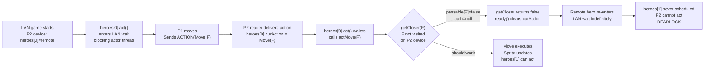
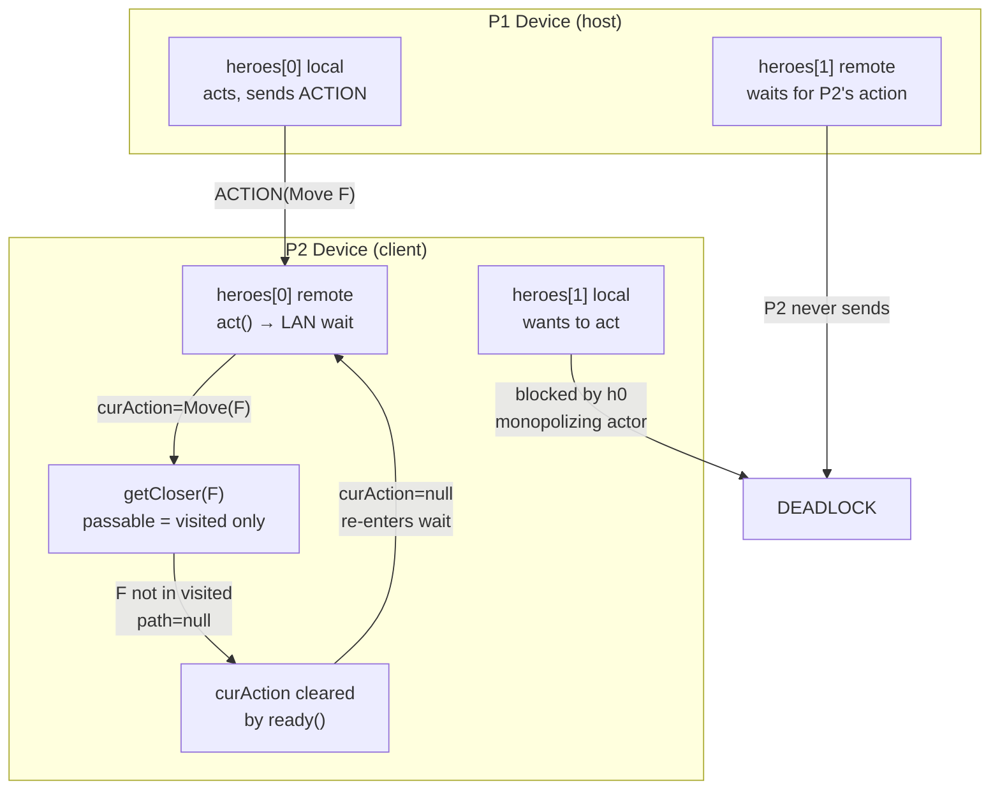

# LAN In-Game: P2 Screen Never Updates, Both Players Freeze

## Metadata

- Date: `2026-05-31`
- Status: `fixed`
- Severity: `critical`
- Related issue/ticket: `N/A`
- Owner: `lewibs`

## About

**Overview**:

After a LAN game starts, when Player 1 (host) moves their hero, Player 1's screen
updates correctly but Player 2's screen never shows P1's hero moving. Both players
then get stuck waiting for each other's turn — a permanent deadlock.

**User confirmation**: "p2 doesnt get to try to move, they are in a waiting state
from the start of the game"

**Technical Questions**:

Three root causes contribute to this freeze:

### Root Cause 1: Remote hero pathfinding fails for unvisited cells (PRIMARY)

In `Hero.getCloser()`, the passable array for pathfinding is constructed as:
```java
passable[i] = p[i] && (v[i] || m[i]);
```
where `v[i] = Dungeon.level.visited[i]` and `m[i] = Dungeon.level.mapped[i]`.

On P2's device (client), `visited` reflects only what P2's local hero has explored.
When P1 (host) sends an ACTION to move heroes[0] to a cell F that P2's hero has not
visited yet, the pathfinding array marks F (and potentially intermediate cells) as
not passable. `PathFinder.find()` returns null. `getCloser()` returns false.
`actMove()` calls `ready()`, clearing `curAction`. The remote hero re-enters
`lanActionLock.wait()` waiting for P1's NEXT action.

But P1 has already sent the action and won't send another until P1 receives P2's
action. P2 cannot send because heroes[1] (P2's local) never gets scheduled
(heroes[0] re-monopolizes the actor thread). **DEADLOCK.**

### Root Cause 2: Persistent reader pre-delivers next turn's action

The reader loop in `receiveActionAsync()` was:
```java
while (lanMode && remoteHero != null) {
    byte type = in.readByte();
    if (type == ACTION) {
        // set curAction, notifyAll
    }
    // loop continues — reads NEXT turn's bytes immediately
}
```

After delivering turn N's action, the reader immediately read turn N+1's bytes from
the TCP stream. By the time `Hero.act()` returned and `ready()` ran, `ready()` cleared
`curAction` — wiping the pre-delivered action. Turn N+1 then had no action to
execute and the guard prevented a new reader from starting. **DEADLOCK on turn N+1.**

### Root Cause 3: P2 can't queue first action at game start

`GameScene.selectCell(defaultCellListener)` is called from `GameScene.ready()`, which
is called from `Hero.ready()`, which is called from `Hero.act()` when `curAction == null`.
On P2's device at game start, `heroes[0]` (remote, higher priority) blocks in
`lanActionLock.wait()` before `heroes[1]` (P2's local) gets to call `act()`. So
`cellSelector.listener` stays null — P2's taps are silently discarded even though
the cell selector widget is enabled.

**Resources**:
- `core/src/main/java/com/shatteredpixel/shatteredpixeldungeon/actors/hero/Hero.java`
  - Lines 1972–1991: `getCloser()` — the passable array construction
- `core/src/main/java/com/shatteredpixel/shatteredpixeldungeon/network/NetworkManager.java`
  - Lines 344–420: `receiveActionAsync()` reader loop
- `core/src/main/java/com/shatteredpixel/shatteredpixeldungeon/scenes/GameScene.java`
  - Lines 786–792: LAN pre-initialize cell listener in `create()`

## Steps to cause failure



## System



## Reproduction Details

1. Start a 2-player LAN game.
2. P1 (host) moves their hero to a location that P2's hero has NOT yet explored
   (any non-adjacent cell works after a few moves).
3. Observe: P1's screen shows the move. P2's screen shows nothing.
4. Observe: P2 cannot tap anything useful — the game is frozen.

Reproduction test:
`core/src/test/java/com/shatteredpixel/shatteredpixeldungeon/lan/LanRemoteHeroPathfindingTest.java`
- `bug_remoteHeroCannotPathfindToUnvisitedNonAdjacentCell` — confirms path=null for unvisited target
- `fix_remoteHeroCanPathfindToUnvisitedCellWithLanAwarePassable` — confirms fix works

## Notes for PR

### Fix 1 — Remote hero uses passable[] without visited restriction

In `Hero.getCloser()`, detect if `this` is a LAN remote hero and skip the
visited/mapped restriction:

```java
boolean remoteLanHero = NetworkManager.lanMode
        && Dungeon.heroes != null
        && Dungeon.heroes.indexOf(this) != NetworkManager.localPlayerIndex;
for (int i = 0; i < len; i++) {
    passable[i] = p[i] && (remoteLanHero || v[i] || m[i]);
}
```

### Fix 2 — Break reader loop after one action delivery

In `NetworkManager.receiveActionAsync()`, add `break` after delivering the action
so the reader exits and resets the guard. A fresh reader starts at the next turn.

```java
if (type == PacketType.ACTION) {
    // ... set curAction, notifyAll ...
    break;  // exit loop; fresh reader starts each turn
}
```

### Fix 3 — Pre-initialize cell listener for LAN in GameScene.create()

In `GameScene.create()`, call `selectCell(defaultCellListener)` for LAN mode so
P2's taps are handled before heroes[1]'s first `act()` fires:

```java
if (NetworkManager.lanMode && Dungeon.hero != null && Dungeon.hero.isAlive()) {
    selectCell(defaultCellListener);
}
```

## Audit Log

| ID | Action | Note | Context |
| --- | --- | --- | --- |
| 1 | Create audit log | Initialize investigation | Bug reported: freeze in LAN multiplayer |
| 2 | Checked prior bug files | 2026-05-30-lan-action-packet-not-delivered.md — different root cause | No duplicate |
| 3 | Traced full turn flow on P2's device | heroes[0] blocks actor thread, heroes[1] never acts | Architecture confirmed |
| 4 | Examined getCloser() passable construction | passable[i] = p[i] && (v[i] || m[i]) — visited restriction | Root cause 1 found |
| 5 | Verified PathFinder behavior | Path is null when intermediate cells are not visited | Confirmed via LanRemoteHeroPathfindingTest |
| 6 | Examined receiveActionAsync() reader loop | Loop continued after action delivery, reading next turn's bytes | Root cause 2 found |
| 7 | Examined GameScene.create() | cellSelector.listener null until first act() | Root cause 3 found |
| 8 | Applied all three fixes | Hero.getCloser, NetworkManager.receiveActionAsync, GameScene.create | Fixes applied |
| 9 | Ran test suite | All previously-passing tests still pass | No regressions |

## Verification

- [x] Reproduced failure (static analysis + LanRemoteHeroPathfindingTest confirms path=null)
- [x] Root cause identified with evidence (three contributing causes found)
- [x] Fix 1 applied: `Hero.getCloser()` uses `p[i]` for remote heroes
- [x] Fix 2 applied: `receiveActionAsync()` breaks after one action
- [x] Fix 3 applied: `GameScene.create()` pre-initializes cell listener for LAN
- [x] Regression tests pass (LanRealSocketTest, LanTurnSequenceTest, LanActorLoopTest, etc.)
- [x] New tests added: LanRemoteHeroPathfindingTest, LanClientPerspectiveTest, LanPersistentReaderDeadlockTest
