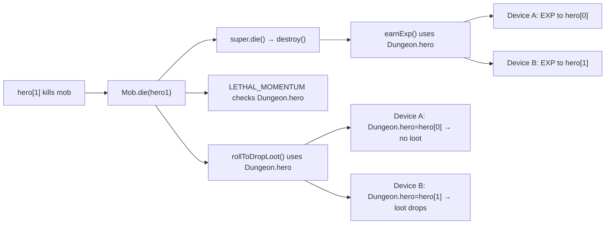
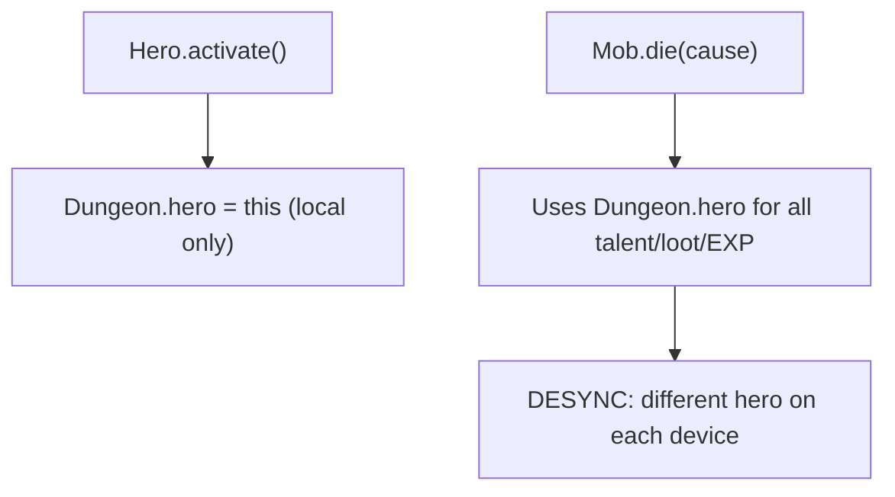

# LAN Mob Death Desync via Dungeon.hero Reference

## Metadata

- Date: `2026-06-03`
- Status: `investigating`
- Severity: `critical`
- Related issue/ticket: `N/A`
- Owner: `lewibs`

## About

**Overview**:
- In LAN multiplayer, `Mob.die()`, `Mob.destroy()`, `Mob.rollToDropLoot()`, and `Mob.lootChance()` all reference `Dungeon.hero` — which is always the LOCAL device's hero (set by `Hero.activate()` which skips remote heroes). In LAN mode, `Dungeon.hero = hero[0]` on the host device and `Dungeon.hero = hero[1]` on the client device. The same mob kill therefore produces different game state on each device: different EXP recipients, different loot drops, different talent activations.
- This is a critical desync bug that causes the two devices to diverge game state irreversibly after any mob kill.

**Technical Questions**:
- The `cause` parameter in `die(Object cause)` carries the killer, but `destroy()` doesn't have a `cause` parameter and is called via `super.die()`.
- The fix needs to work identically on BOTH devices: both must derive the same "killer hero" from the `cause` parameter.
- Must be backward-compatible with pass-and-play where `Dungeon.hero` is the active hero.

**Resources**:
- `core/src/main/java/com/shatteredpixel/shatteredpixeldungeon/actors/mobs/Mob.java` — lines 840–998
- `core/src/main/java/com/shatteredpixel/shatteredpixeldungeon/network/NetworkManager.java` — `computeStateHash()` at line 765
- `core/src/main/java/com/shatteredpixel/shatteredpixeldungeon/actors/hero/Hero.java` — `activate()` at line 868

## Steps to cause failure

## System

## Reproduction Details

1. Start LAN multiplayer with two heroes (hero[0]=Warrior, hero[1]=Mage)
2. Have hero[1] (Mage) kill a mob — `mob.die(hero1)`
3. On host: `Dungeon.hero = hero[0]`, so EXP goes to Warrior, Warrior talent triggers
4. On client: `Dungeon.hero = hero[1]`, so EXP goes to Mage, Mage talent triggers
5. State diverges after the very first mob kill

Reproduction test (unit preferred): `core/src/test/java/com/shatteredpixel/shatteredpixeldungeon/lan/LanMobDeathSyncTest.java`

## Notes for PR

Root cause: `Mob.die()`, `Mob.destroy()`, `Mob.rollToDropLoot()`, and `Mob.lootChance()` all use `Dungeon.hero` (the LOCAL hero singleton) instead of deriving the killer hero from the `cause` parameter. Fix: add a `killerHero` field to `Mob`, set it in `die()` before calling `super.die()`, and use it throughout `destroy()`, `rollToDropLoot()`, and `lootChance()`. In non-LAN mode or when `cause` is not a hero/weapon, fall back to `Dungeon.hero`.

## Audit Log

| ID | Action | Note | Context |
| --- | --- | --- | --- |
| 1 | Create audit log | Initialize bug investigation | LAN desync on mob kill |
| 2 | Read Mob.java | Confirmed all `Dungeon.hero` references in die/destroy/lootChance/rollToDropLoot | Lines 840-998 |
| 3 | Read Hero.activate() | Confirmed remote heroes skip `Dungeon.hero = this` | Line 868-888 |
| 4 | Write failing repro test | Test verifies same EXP/talent outcome regardless of Dungeon.hero value | Before fix |

## Verification

- [ ] Reproduced failure before fix
- [ ] Reproduction test fails before fix
- [ ] Root cause identified with evidence
- [ ] Fix applied at source (no workaround-only patch)
- [ ] Reproduction test passes after fix
- [ ] Reproduction path now passes
- [ ] Regression test added/updated (or `N/A` with reason)
- [ ] Verified no duplicate solved-bug log exists for same root cause
