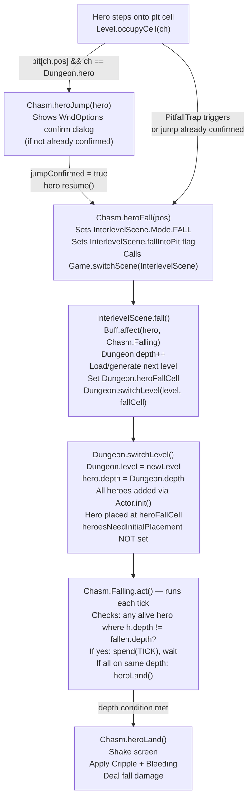

# Chasm Fall — Multiplayer Level Transition

## Metadata

- System type: `flow`

## System Intent

- What this is: The flow that handles a hero falling into a pit/chasm and transitioning to the next floor. In single-player, the hero immediately falls and the game loads the next level. In multiplayer the same code path executes, but the prior commit (dc12239) attempted to add party synchronization — requiring the scene switch to wait until all non-dead, non-falling heroes have reached the new depth before `heroLand()` applies damage/effects.

## Mermaid Diagram



## Flows

### Flow: `heroFall.singlePlayer`

- Core files:
  - `core/src/main/java/com/shatteredpixel/shatteredpixeldungeon/levels/features/Chasm.java`
  - `core/src/main/java/com/shatteredpixel/shatteredpixeldungeon/scenes/InterlevelScene.java`
  - `core/src/main/java/com/shatteredpixel/shatteredpixeldungeon/Dungeon.java`

#### Paths

| path | input | output | path-type | notes |
| --- | --- | --- | --- | --- |
| `heroFall.immediate` | Hero on pit cell, single-player | InterlevelScene.FALL triggered, level loaded | happy path | Chasm.Falling.act() runs once, immediately calls heroLand() |
| `heroFall.featherFall` | Hero has ElixirOfFeatherFall buff | No damage on landing | variant | ElixirOfFeatherFall.FeatherBuff.processFall() called instead of damage |

---

### Flow: `heroFall.multiplayer`

- Core files:
  - `core/src/main/java/com/shatteredpixel/shatteredpixeldungeon/levels/features/Chasm.java`
  - `core/src/main/java/com/shatteredpixel/shatteredpixeldungeon/scenes/InterlevelScene.java`
  - `core/src/main/java/com/shatteredpixel/shatteredpixeldungeon/Dungeon.java`
  - `core/src/main/java/com/shatteredpixel/shatteredpixeldungeon/levels/Level.java`
  - `core/src/main/java/com/shatteredpixel/shatteredpixeldungeon/actors/hero/Hero.java`

#### Types

```txt
Chasm.Falling (buff)
  target: Hero  — the fallen hero
  act():  checks h.depth != fallen.depth for all alive, non-falling heroes in Dungeon.heroes
          → if any mismatch: spend(TICK); return  (wait)
          → if all same depth: heroLand(); detach()

Hero.depth (int, serialized as "heroDepth")
  — tracks which floor this hero is on
  — updated by Dungeon.switchLevel() for hero[0] always
  — updated for heroes[1..N] only in the heroesNeedInitialPlacement block (stair descent only, NOT fall)

Dungeon.heroFallCell (int)
  — set by InterlevelScene.fall() to the fall landing cell
  — consumed by Dungeon.switchLevel() to override hero[0].pos
  — reset to -1 after use

InterlevelScene.fallIntoPit (boolean)
  — set by Chasm.heroFall() based on whether the pit cell is in a WeakFloorRoom
  — passed to Level.fallCell(fallIntoPit) to determine landing position
```

#### Paths

| path | input | output | path-type | notes |
| --- | --- | --- | --- | --- |
| `heroFall.mp.fall` | One hero falls; others alive on same floor | Scene switches immediately; all heroes on new level | BUG path | heroesNeedInitialPlacement not set; hero[1].depth stale but hero[1].pos now in new level context |
| `heroFall.mp.landing-wait` | Chasm.Falling.act() with hero[1].depth != hero[0].depth | spend(TICK), keep waiting | intended gate | Depth comparison works because heroFall only updates hero[0].depth; hero[1].depth stays at old floor |
| `heroFall.mp.landing-proceed` | All alive heroes have same depth | heroLand() called | happy path (after stairs) | Intended: hero[1] descends stairs and gets depth updated via heroesNeedInitialPlacement |

#### Pseudocode

```
// Chasm.heroFall(pos) — called from Level.occupyCell, Hero.act, PitfallTrap
heroFall(pos):
  jumpConfirmed = false
  play FALLING sound
  Level.beforeTransition()
  if hero.isAlive():
    hero.interrupt()
    InterlevelScene.mode = FALL
    InterlevelScene.fallIntoPit = (room at pos is WeakFloorRoom)
    Game.switchScene(InterlevelScene.class)   // ← immediate, unconditional
  else:
    hero.sprite.visible = false

// InterlevelScene.fall() — runs in background thread
fall():
  Mob.holdAllies(Dungeon.level)
  Buff.affect(Dungeon.hero, Chasm.Falling)
  Dungeon.saveAll()
  Dungeon.depth++
  level = loadLevel or newLevel
  fallLandingCell = level.fallCell(fallIntoPit)
  Dungeon.heroFallCell = fallLandingCell
  Dungeon.switchLevel(level, fallLandingCell)

// Dungeon.switchLevel(level, pos)
switchLevel(level, pos):
  Dungeon.level = level            // replaces global level
  hero.pos = pos
  hero.depth = Dungeon.depth
  if heroFallCell != -1:
    hero.pos = heroFallCell        // override to fall cell
    heroFallCell = -1
  if heroesNeedInitialPlacement:   // NOT set in fall() path
    // place heroes[1..N] near pos, update their depth
  Actor.init()                     // adds ALL heroes to new level's actor loop

// Chasm.Falling.act() — runs each game tick after level switch
Falling.act():
  if multiplayer:
    for each hero h in Dungeon.heroes (skip fallen, skip dead):
      if h.depth != fallen.depth:
        spend(TICK); return  // wait
  heroLand()
  detach()
```

## Known Bug

**`docs/bugs/2026-05-29-pit-fall-premature-level-transition.md`**

When one hero falls in multiplayer, `heroFall()` triggers `Game.switchScene(InterlevelScene.class)` unconditionally. `InterlevelScene.fall()` replaces `Dungeon.level` globally. All heroes are moved to the new level context via `Actor.init()`. Hero[1]'s `depth` field is stale (= old floor, not updated in fall path) but their `pos` now maps into the new level, causing them to visually appear on the new floor immediately.

The `Chasm.Falling.act()` depth gate was intended to defer `heroLand()` damage effects but does not gate the scene transition itself.

**Fix required**: Gate the scene switch in `heroFall()` — if other alive non-falling heroes are still on the same floor, attach a `Chasm.PendingFall` buff and defer `Game.switchScene()` until all non-dead heroes are either pending-fall or have descended stairs.

## Callers of `Chasm.heroFall()`

| Caller | File | Condition |
|--------|------|-----------|
| `Level.occupyCell(ch)` | `levels/Level.java:1188` | `pit[ch.pos] && ch == Dungeon.hero` |
| `Hero.act()` step logic | `actors/hero/Hero.java:1881` | `jumpConfirmed == true` after `heroJump` dialog |
| `PitfallTrap.act()` | `levels/traps/PitfallTrap.java:136` | Hero is in trap cell positions |

## Logs

| Source | Location |
|--------|----------|
| Fall sound | `Assets.Sounds.FALLING` played in `Chasm.heroFall()` |
| Game log | `GLog.n(Messages.get(Chasm.class, "ondeath"))` on death from fall |

## Deployment

- Mechanism: `local only` (Android/Desktop game, Gradle build)
- Deploy command:
  ```bash
  ./gradlew desktop:run
  ```
- Notes: Java/libGDX game; no server deployment.
