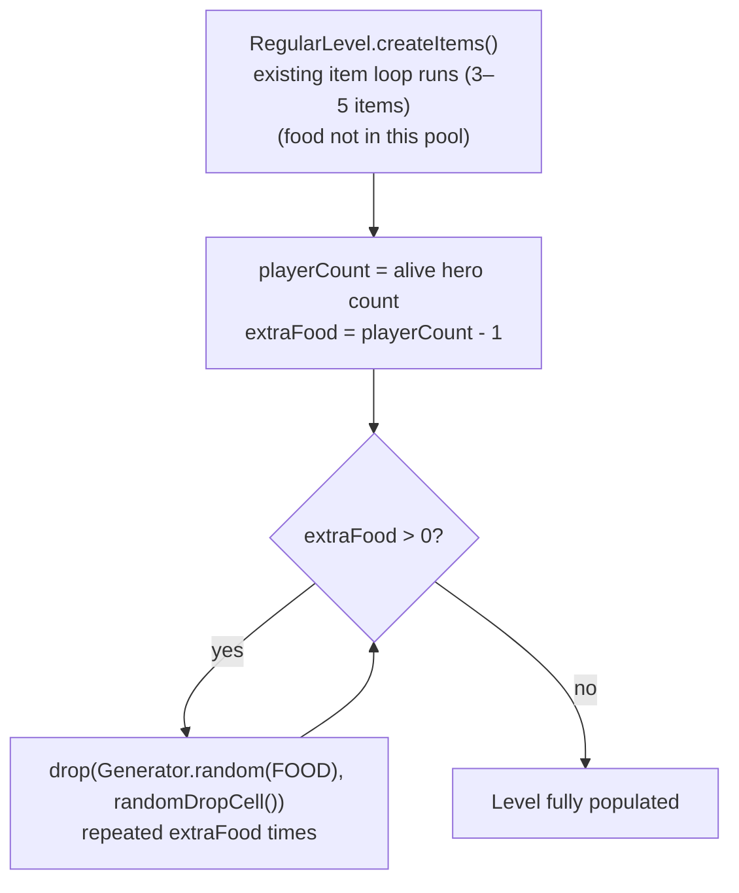

# Food Spawning

## Metadata

- System type: `flow`

## System Intent

- What this is: Controls how many food items are dropped onto each regular dungeon floor during level generation. In single-player the normal item pool (`Generator.random()`) never produces food — food comes from talents and Monk mob drops. For multiplayer, `RegularLevel.createItems()` appends one extra food item per additional **living** player (i.e. `aliveCount - 1` extra drops) so parties do not share a solo-sized food supply. Dead heroes (HP <= 0) are excluded from the count. Boss levels and special levels are unaffected because they do not call `RegularLevel.createItems()`.

## Mermaid Diagram



## Flows

### Global Types

```txt
StandardError {
  message: string
}
```

---

### Flow: `scaleFloorFoodDrops`

- Test files: N/A
- Core files:
  - `core/src/main/java/com/shatteredpixel/shatteredpixeldungeon/levels/RegularLevel.java`
  - `core/src/main/java/com/shatteredpixel/shatteredpixeldungeon/items/Generator.java`

#### Types

```txt
// Generator.Category.FOOD contains:
//   Food        — prob weight 4  (80%)
//   Pasty       — prob weight 1  (20%)
//   MysteryMeat — prob weight 0  (never spawned via this path)
//
// firstProb = 0, secondProb = 0 for FOOD in the normal item deck,
// so food never appears in Generator.random() without an explicit category argument.
//
// Extra food items are plain floor drops (not inside chests or skeletons).
// They are dropped at randomDropCell() — a random valid passable cell.
```

#### Paths

| path | input | output | path-type | notes |
| --- | --- | --- | --- | --- |
| `scaleFloorFoodDrops.singlePlayer` | 1 alive hero | extraFood = 0, no drops added | happy path | Identical to pre-multiplayer behavior |
| `scaleFloorFoodDrops.twoPlayers` | 2 alive heroes | 1 extra food item dropped on floor | happy path | Dead heroes in `Dungeon.heroes` are excluded |
| `scaleFloorFoodDrops.fourPlayers` | 4 alive heroes | 3 extra food items dropped on floor | happy path | |
| `scaleFloorFoodDrops.nullHeroes` | `Dungeon.heroes` null or empty | extraFood = 0, no drops | happy path | Defensive fallback treats as single-player |
| `scaleFloorFoodDrops.noValidCell` | `randomDropCell()` returns `-1` | drop skipped for that iteration | happy path | Cell check prevents crash on pathological floors |

#### Pseudocode

```
// RegularLevel.createItems() — appended after existing item loop:

int playerCount = 1;
if (Dungeon.heroes != null && !Dungeon.heroes.isEmpty()) {
    int alive = 0;
    for (Hero h : Dungeon.heroes) { if (h.isAlive()) alive++; }
    playerCount = alive > 0 ? alive : 1;
}
for (int i = 0; i < playerCount - 1; i++) {
    int cell = randomDropCell();
    if (cell != -1) {
        drop(Generator.random(Generator.Category.FOOD), cell);
    }
}
```

## Logs

| Source | Location |
|--------|----------|
| In-game log | No `GLog` entries — food drops silently like all floor loot |

## Deployment

- Mechanism: `local only`
- Deploy command:
  ```bash
  ./gradlew desktop:debug
  ```
- Notes: Single-player (1 alive hero) is unchanged — the loop runs 0 times. Dead heroes remain in `Dungeon.heroes` with HP <= 0 but are excluded via `isAlive()`, so a mid-floor death does not cause a food refund or re-roll (food is placed at level-generation time). Boss levels and special levels do not subclass `RegularLevel` and do not call this method, so they are unaffected. Food already on the floor from talents (`CACHED_RATIONS`) or Monk mob drops (8.3% chance) is independent of this path and is not modified.
