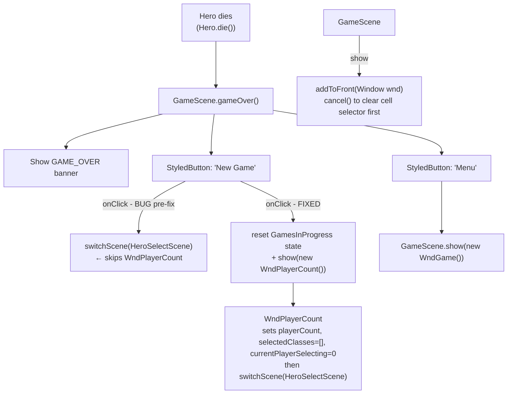

# GameScene

## Metadata

- System type: `flow`

## System Intent

- What this is: `GameScene` is the primary in-game scene that renders the dungeon, processes hero input, and manages all in-game UI (toolbar, inventory, health bars, banners). It is a static-singleton pattern — most public methods are `static` and operate on the shared `scene` reference.
- Key responsibilities:
  - Rendering dungeon terrain, mobs, heaps, effects, and fog-of-war
  - Showing in-game windows (WndHero, WndBag, WndGame, etc.) via `GameScene.show(Window)`
  - Showing the game-over banner and restart/menu buttons via `GameScene.gameOver()`
  - Routing scene transitions (to TitleScene, InterlevelScene, RankingsScene)
  - Showing the boss-slain banner via `GameScene.bossSlain()`

## Mermaid Diagram



## Flows

### Flow: `gameOver`
- Core files: `core/src/main/java/com/shatteredpixel/shatteredpixeldungeon/scenes/GameScene.java`
- Triggered by: `Hero.die()` → `GameScene.gameOver()` directly (via `Game.runOnRenderThread`). `Dungeon.fail()` is called separately for rankings submission, not as part of the gameOver chain.

#### Types

```txt
// No typed payloads — operates on static Dungeon/GamesInProgress state

GamesInProgress (global state relevant to restart):
  playerCount: int            // number of players (1-4)
  selectedClasses: ArrayList<HeroClass>  // classes chosen per player
  currentPlayerSelecting: int // which player is currently choosing
  selectedClass: HeroClass    // class for the currently selecting player
  curSlot: int                // save slot index
```

#### Paths

| path | input | output | path-type | notes |
| --- | --- | --- | --- | --- |
| `gameOver.restart` | click "New Game" button | shows WndPlayerCount (post-fix) | happy path | resets playerCount, selectedClasses, currentPlayerSelecting to defaults before showing WndPlayerCount |
| `gameOver.menu` | click "Menu" button | shows WndGame | happy path | |
| `gameOver.bypass` | click "New Game" (pre-fix) | direct switchScene(HeroSelectScene) | bug | skipped WndPlayerCount, stale multiplayer state carried forward |

#### Pseudocode

```
gameOver():
  show GAME_OVER banner
  create restart StyledButton:
    onClick():
      GamesInProgress.selectedClass = null          // clear stale class
      GamesInProgress.curSlot = GamesInProgress.firstEmpty()
      GamesInProgress.playerCount = 1               // reset to default
      GamesInProgress.selectedClasses = new ArrayList<>()
      GamesInProgress.currentPlayerSelecting = 0
      GameScene.show(new WndPlayerCount())          // let players re-choose count + classes
  create menu StyledButton:
    onClick():
      GameScene.show(new WndGame())
  both buttons fade-in as the game-over banner fades in (alpha tracks banner.am^2)
```

### Flow: `show(Window)`
- Core files: `GameScene.java`

#### Pseudocode

```
show(Window wnd):
  if scene == null: return
  cancel()  // clears cellSelector listener
  if inventory visible:
    inherit offset from existing window or lastOffset
  scene.addToFront(wnd)
```

### Flow: `WndPlayerCount → HeroSelectScene`
- Core files: `WndPlayerCount.java`, `HeroSelectScene.java`, `GamesInProgress.java`
- Invoked from: `TitleScene`, `StartScene`, and (post-fix) `GameScene.gameOver()`

#### Pseudocode

```
WndPlayerCount.onClick(playerCount):
  GamesInProgress.playerCount = playerCount
  GamesInProgress.selectedClasses = new ArrayList<>()
  GamesInProgress.currentPlayerSelecting = 0
  hide()
  switchScene(HeroSelectScene)

HeroSelectScene (per-player loop):
  for each player (currentPlayerSelecting < playerCount):
    player picks class → selectedClasses.add(selectedClass)
    currentPlayerSelecting++
  when all selected → Dungeon.newGame()
```

## Logs

| Source | Location |
|--------|----------|
| GLog (in-game log) | `GameScene.log` UI component |
| No file logs | All output is in-game UI or Android logcat |

## Deployment

- Mechanism: `local only` (Android app, desktop via libGDX)
- Deploy command:
  ```bash
  ./gradlew android:assembleDebug   # Android APK
  ./gradlew desktop:run             # Desktop run
  ./gradlew core:compileJava        # Compile check
  ```
- Notes: Scene transitions are handled by `ShatteredPixelDungeon.switchScene()` and `ShatteredPixelDungeon.switchNoFade()`. Windows are added via `scene.addToFront()`. `GameScene.show()` is the canonical entry point for showing in-game windows.
