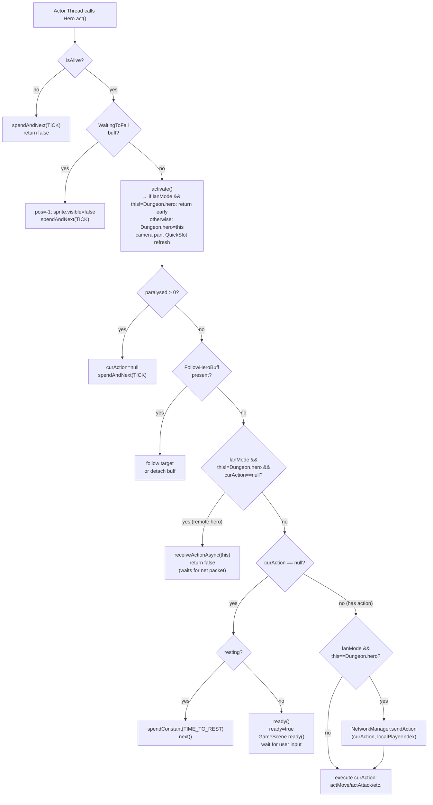

# Hero.act() — LAN Multiplayer Turn Handling

## Metadata

- System type: `component`

## System Intent

- What this is: `Hero.act()` is the per-turn entry point called by the actor thread for each Hero in `Dungeon.heroes`. It is responsible for: (1) running the singleton-swap (`Dungeon.hero = this` via `activate()`), (2) deciding whether to wait for user input (`ready()`), execute a buffered `curAction`, or yield for network synchronization (LAN mode).
- Key responsibilities:
  - Swapping `Dungeon.hero` to the currently-acting hero at the top of every turn (via `activate()`)
  - Waiting for a `curAction` to be set (by UI on the local hero, or by `receiveActionAsync` on the remote hero)
  - Sending the local hero's action to peers via `NetworkManager.sendAction()` before executing
  - Starting the `net-reader-action` background thread for the remote hero via `NetworkManager.receiveActionAsync()`
  - Handling special cases: paralysis, chasm-fall, follow-buff, resting

## Mermaid Diagram



## Flows

### Flow: `localHeroTurn`
- Core files: `core/src/main/java/com/shatteredpixel/shatteredpixeldungeon/actors/hero/Hero.java`

#### Types

```txt
Hero.ready: boolean          -- true when waiting for player input; false during action execution
Hero.curAction: HeroAction   -- action set by UI (CellSelector → Hero.handle()); null = waiting
Hero.resting: boolean        -- true when auto-resting (no visible enemy, no player input)
```

#### Paths

| path | input | output | path-type | notes |
| --- | --- | --- | --- | --- |
| `localHeroTurn.waitForInput` | `curAction == null`, not resting | `ready=true`; `GameScene.ready()` re-enables UI; actor thread sleeps | wait-for-input | Normal idle state; actor loop pauses until user taps a cell |
| `localHeroTurn.resting` | `curAction == null`, `resting == true` | `spendConstant(TIME_TO_REST)`; `next()` | auto-rest | Continues each turn until enemy spotted or player acts |
| `localHeroTurn.executeAction` | `curAction != null` (solo or non-LAN) | `ready=false`; action method called (`actMove`/`actAttack`/etc.) | happy path | |
| `localHeroTurn.lanSendAction` | `curAction != null`, `lanMode == true`, `this == Dungeon.hero` | `NetworkManager.sendAction(curAction, localPlayerIndex)` called first; then action executed locally | LAN happy path | Peers receive the ACTION packet before the local simulation advances |
| `localHeroTurn.paralysed` | `paralysed > 0` | `curAction = null`; `spendAndNext(TICK)` | skip turn | Paralysis clears any pending action |

---

### Flow: `remoteHeroTurn`
- Core files: `Hero.java`, `NetworkManager.java`

#### Types

```txt
NetworkManager.actionReaderRunning: volatile boolean
  -- singleton guard; only one net-reader-action thread may be active at once

NetworkManager.receiveActionAsync(remoteHero):
  -- if actionReaderRunning: no-op (guard)
  -- else: sets actionReaderRunning=true, starts "net-reader-action" thread
  -- thread reads DataInputStream, sets remoteHero.curAction, calls Actor.class.notifyAll()
```

#### Paths

| path | input | output | path-type | notes |
| --- | --- | --- | --- | --- |
| `remoteHeroTurn.awaitPacket` | `curAction == null`, `lanMode == true`, `this != Dungeon.hero` | `receiveActionAsync(this)` called; `return false` immediately | LAN wait path | `activate()` returns early (does NOT swap `Dungeon.hero`); reader thread starts; actor yields |
| `remoteHeroTurn.readerAlreadyRunning` | `curAction == null`, `actionReaderRunning == true` | `receiveActionAsync` no-ops (guard); `return false` again | guard | Prevents duplicate reader threads on each actor reschedule |
| `remoteHeroTurn.packetReceived` | reader thread sets `remoteHero.curAction`; `Actor.class.notifyAll()` | actor thread wakes; `Hero.act()` called again with `curAction != null` | happy path | Remote hero now executes its action just like a local hero |
| `remoteHeroTurn.peerDisconnect` | `IOException` on socket read | `peerDisconnectSignal` dispatched; `Actor.class.notifyAll()`; `actionReaderRunning = false` | error | Caller should handle `peerDisconnectSignal` to end the session |

#### Pseudocode

```
// Hero.act() — remote hero guard (must be placed BEFORE the curAction==null branch):
if (NetworkManager.lanMode && this != Dungeon.hero && curAction == null) {
    NetworkManager.receiveActionAsync(this);  // no-op if already running
    return false;                              // yield to actor thread; wake on notifyAll
}

// Hero.act() — local hero LAN send (inside the curAction != null branch):
if (NetworkManager.lanMode && this == Dungeon.hero) {
    NetworkManager.sendAction(curAction, NetworkManager.localPlayerIndex);
}
// ... then execute curAction locally ...

// NetworkManager.receiveActionAsync(remoteHero) — reader thread:
loop while lanMode:
    type = in.readByte()
    if type == ACTION:
        remoteHero.curAction = decodeAction(...)
        synchronized(Actor.class) { notifyAll() }
    else if type == HASH:
        hashQueue.offer(...)
    else if type == ITEM_IDENTIFIED: ...
    else if type == CLASS_CLAIMED / CLASS_UNCLAIMED: ...
    on IOException:
        peerDisconnectSignal.dispatch(remoteHero)
        synchronized(Actor.class) { notifyAll() }
        break
finally: actionReaderRunning = false
```

---

### Flow: `activate`
- Core files: `Hero.java`

#### Types

```txt
Dungeon.hero: volatile Hero  -- points to the currently-acting hero; read by all UI/camera code
```

#### Paths

| path | input | output | path-type | notes |
| --- | --- | --- | --- | --- |
| `activate.localHero` | `this == Dungeon.hero` OR `!lanMode` | `Dungeon.hero = this`; camera pan; QuickSlot/InventoryPane refresh | happy path | All UI code remains correct after swap |
| `activate.remoteHeroGuard` | `lanMode == true` AND `this != Dungeon.hero` | early return, `Dungeon.hero` NOT changed | LAN guard | Prevents the remote hero from hijacking the local hero singleton |

#### Pseudocode

```
// Hero.activate()
if (NetworkManager.lanMode && this != Dungeon.hero) return;  // guard for remote hero
Dungeon.hero = this;
Dungeon.quickslot = this.quickslot;
InventoryPane.lastBag = this.belongings.backpack;
Game.runOnRenderThread(() -> {
    Camera.main.panTo(sprite.center(), 5f);
    QuickSlotButton.refresh();
    InventoryPane.refresh();
});
```

---

## Logs

| Source | Location |
|--------|----------|
| `GLog.w("Peer disconnected: ...")` | `NetworkManager.receiveActionAsync` — IOException handler |
| `GLog.n("Failed to send action: ...")` | `NetworkManager.sendAction` — IOException handler |

## Deployment

- Mechanism: `local only`
- Deploy command:
  ```bash
  ./gradlew desktop:run
  ```
- Notes: The remote-hero path only activates when `NetworkManager.lanMode == true` AND `Dungeon.heroes.size() > 1`. All paths for solo play are completely unaffected.
