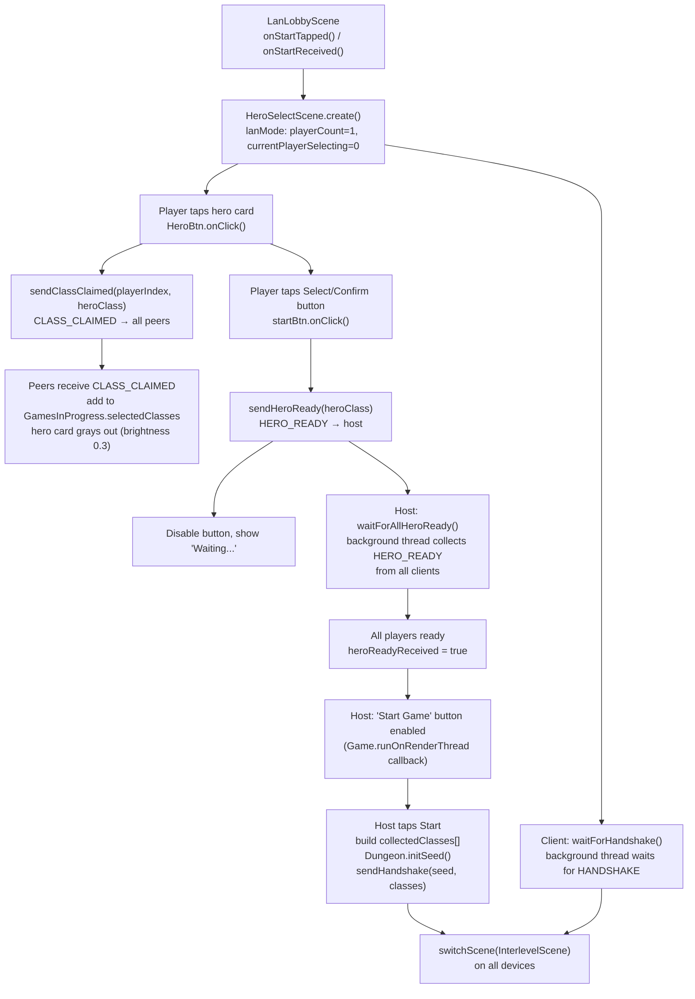

# Hero Select Scene — LAN Multiplayer Coordination

## Metadata

- System type: `flow`

## System Intent

- What this is: `HeroSelectScene` is the scene where each device picks a hero class before the dungeon starts. In **solo / pass-and-play** mode it loops once per local player. In **LAN mode** each device selects exactly one hero independently; coordination uses four packet types (`CLASS_CLAIMED`, `CLASS_UNCLAIMED`, `HERO_READY`, `HANDSHAKE`) to sync selection state and gate game start.

## Mermaid Diagram



## Flows

### Global Types

```txt
GamesInProgress.playerCount: int               -- set to 1 in LAN mode (each device selects one hero)
GamesInProgress.selectedClass: HeroClass       -- the locally hovered/selected class
GamesInProgress.selectedClasses: ArrayList<HeroClass>  -- classes claimed by any player (used for gray-out)
GamesInProgress.currentPlayerSelecting: int    -- set to 0 in LAN mode

NetworkManager.lanMode: boolean                -- true while in LAN session
NetworkManager.isHost: boolean                 -- true on host device
NetworkManager.localPlayerIndex: int           -- 0 = host, 1..N = clients
                                               -- reset to 0 by NetworkManager.cleanup() on session end
NetworkManager.connectedPlayerCount: int       -- total players (host counts as 1)
```

**Session lifecycle note**: `NetworkManager.cleanup()` resets `localPlayerIndex` to 0. This is critical for correctness — if a device acted as a LAN client (`localPlayerIndex=1`) and then starts a solo game, `GameScene.create()` must see `localPlayerIndex=0` to track the correct (only) hero. Without the reset, `GameScene.create()` would attempt `Dungeon.heroes.get(1)` on a single-hero roster and throw `IndexOutOfBoundsException`. A bounds clamp `Math.min(localPlayerIndex, heroes.size()-1)` in `GameScene.java:346` provides a secondary safety guard.

---

### Flow: `lanHeroCardTap`

- Core files:
  - `core/src/main/java/com/shatteredpixel/shatteredpixeldungeon/scenes/HeroSelectScene.java`
  - `core/src/main/java/com/shatteredpixel/shatteredpixeldungeon/network/NetworkManager.java`

#### Paths

| path | input | output | path-type | notes |
| --- | --- | --- | --- | --- |
| `lanHeroCardTap.select` | Player taps an unlocked, unclaimed hero card in LAN mode | `setSelectedHero(cl)` called; `sendClassClaimed(localPlayerIndex, cl)` broadcast to all peers; previous provisional claim unclaimed via `sendClassUnclaimed` | happy path | `setSelectedHero()` handles the claim/unclaim sequence and updates `GamesInProgress.selectedClasses` locally |
| `lanHeroCardTap.alreadyTaken` | Player taps a hero card in `GamesInProgress.selectedClasses` | `WndMessage("hero_taken")` shown | guard | Button is also disabled by `updateFade()` via `isTaken()` so click rarely reaches this path |
| `lanHeroCardTap.peerReceiveClaim` | Peer device receives `CLASS_CLAIMED` packet | class added to `GamesInProgress.selectedClasses` on the render thread; `HeroBtn.update()` dims it to brightness 0.3; `updateFade()` disables the button via `isTaken()` | happy path | Listener registered in `HeroSelectScene.create()` via `NetworkManager.onClassClaimedReceived` |
| `lanHeroCardTap.peerReceiveUnclaim` | Peer device receives `CLASS_UNCLAIMED` packet | class removed from `GamesInProgress.selectedClasses` on render thread; button re-enabled and brightness restored | happy path | Listener registered via `NetworkManager.onClassUnclaimedReceived` |

#### Pseudocode

```
// HeroSelectScene.create() — LAN listener registration
NetworkManager.onClassClaimedReceived = (playerIdx, cls) -> Game.runOnRenderThread(() -> {
    if (cls != null && !GamesInProgress.selectedClasses.contains(cls))
        GamesInProgress.selectedClasses.add(cls);
});
NetworkManager.onClassUnclaimedReceived = (playerIdx, cls) -> Game.runOnRenderThread(() -> {
    if (cls != null) GamesInProgress.selectedClasses.remove(cls);
});

// HeroSelectScene.setSelectedHero(cl) — LAN claim/unclaim sequence
if (NetworkManager.lanMode && !lanHeroConfirmed) {
    HeroClass prev = GamesInProgress.selectedClass;
    if (prev != null && prev != cl) {
        NetworkManager.sendClassUnclaimed(NetworkManager.localPlayerIndex, prev);
        GamesInProgress.selectedClasses.remove(prev);
    }
    if (cl != null) {
        NetworkManager.sendClassClaimed(NetworkManager.localPlayerIndex, cl);
        if (!GamesInProgress.selectedClasses.contains(cl))
            GamesInProgress.selectedClasses.add(cl);
    }
}
GamesInProgress.selectedClass = cl;
```

---

### Flow: `lanSelectConfirm`

- Core files:
  - `core/src/main/java/com/shatteredpixel/shatteredpixeldungeon/scenes/HeroSelectScene.java`
  - `core/src/main/java/com/shatteredpixel/shatteredpixeldungeon/network/NetworkManager.java`

#### Paths

| path | input | output | path-type | notes |
| --- | --- | --- | --- | --- |
| `lanSelectConfirm.playerConfirm` | Any player taps "Select" / Confirm button | `lanHeroConfirmed = true`; confirmed class locked into `selectedClasses`; `sendHeroReady(selectedClass)` sent; button disabled; "Waiting…" label shown; returns immediately | happy path | Does not block the render thread |
| `lanSelectConfirm.hostAllReady` | Host receives HERO_READY from all clients | `heroReadyReceived = true`; `Game.runOnRenderThread` enables host "Start Game" button | happy path | Driven by background thread via `waitForAllHeroReady`; host polls `lanReadyToStart` flag in `update()` |
| `lanSelectConfirm.hostStartGame` | Host taps "Start Game" button | `collectedClasses` assembled, `Dungeon.initSeed()`, `sendHandshake(seed, classes)`, `GamesInProgress.selectedClasses` populated, `switchScene(InterlevelScene)` | happy path | Host-only button enabled after `lanReadyToStart = true` |
| `lanSelectConfirm.clientReceiveHandshake` | Client receives HANDSHAKE packet | `Dungeon.seed` and `GamesInProgress.selectedClasses` set from payload; `switchScene(InterlevelScene)` | happy path | Driven by background thread via `waitForHandshake`; client polls `lanHandshakeReady` flag in `update()` |

#### Pseudocode

```
// Phase A — every player: tap "Select/Confirm"
startBtn.onClick() [LAN path]:
    if (GamesInProgress.selectedClass == null) return;
    lanHeroConfirmed = true;
    if (!GamesInProgress.selectedClasses.contains(GamesInProgress.selectedClass))
        GamesInProgress.selectedClasses.add(GamesInProgress.selectedClass);
    NetworkManager.sendHeroReady(GamesInProgress.selectedClass);
    startBtn.enable(false);
    startBtn.text("Waiting...");
    if (NetworkManager.isHost()) {
        NetworkManager.waitForAllHeroReady(connectedPlayerCount);  // background thread
    } else {
        NetworkManager.waitForHandshake();  // background thread
    }
    return;  // never blocks render thread

// Phase B — host: HeroSelectScene.update() polls lanReadyToStart
if (lanReadyToStart):
    lanReadyToStart = false;
    hostStartBtn.enable(true);

// Phase C — host: tap "Start Game"
hostStartBtn.onClick():
    HeroClass[] collectedClasses = NetworkManager.getCollectedClasses();
    collectedClasses[0] = GamesInProgress.selectedClass;
    Dungeon.initSeed();
    NetworkManager.sendHandshake(Dungeon.seed, collectedClasses);
    GamesInProgress.selectedClasses = new ArrayList<>(Arrays.asList(collectedClasses));
    InterlevelScene.mode = Mode.DESCEND;
    Game.switchScene(InterlevelScene.class);

// Phase D — client: HeroSelectScene.update() polls lanHandshakeReady
if (lanHandshakeReady):
    lanHandshakeReady = false;
    NetworkManager.HandshakePayload payload = NetworkManager.getHandshakePayload();
    Dungeon.seed = payload.seed;
    GamesInProgress.selectedClasses = new ArrayList<>(Arrays.asList(payload.heroClasses));
    InterlevelScene.mode = Mode.DESCEND;
    Game.switchScene(InterlevelScene.class);
```

---

### Flow: `lanHeroCardGrayOut`

- Core files:
  - `core/src/main/java/com/shatteredpixel/shatteredpixeldungeon/scenes/HeroSelectScene.java`

#### Types

```txt
HeroBtn.isTaken(): boolean
  Returns true when cl is in GamesInProgress.selectedClasses AND cl != GamesInProgress.selectedClass.
  Exempts the local player's own provisional claim so they can still change their hover before confirming.

HeroSelectScene.updateFade()
  Iterates heroBtns. For each button, if isTaken() is true, forces canEnable = false regardless of
  the UI fade alpha — preventing the enable(true) call from re-activating a taken card each frame.
```

#### Paths

| path | input | output | path-type | notes |
| --- | --- | --- | --- | --- |
| `lanHeroCardGrayOut.localClaim` | Local player selects a hero | `GamesInProgress.selectedClass` set; card brightness 1.0 | happy path | Local claim also added to `selectedClasses` as provisional reservation |
| `lanHeroCardGrayOut.remoteClaim` | Remote CLASS_CLAIMED packet received | Class added to `GamesInProgress.selectedClasses` on render thread; `HeroBtn.update()` sets brightness 0.3; `updateFade()` calls `isTaken()` and disables button | happy path | Driven by `onClassClaimedReceived` listener set in `create()` |
| `lanHeroCardGrayOut.remoteUnclaim` | Remote CLASS_UNCLAIMED packet received | Class removed from `GamesInProgress.selectedClasses` on render thread; button re-enabled and brightness restored next frame | happy path | Driven by `onClassUnclaimedReceived` listener set in `create()` |
| `lanHeroCardGrayOut.updateLoop` | `HeroBtn.update()` runs each frame | `cl == selectedClass` → 1.0 brightness; `selectedClasses.contains(cl)` → 0.3; else → 0.6 | always | Visual dim only; `updateFade()` enforces the `enable(false)` via `isTaken()` |
| `lanHeroCardGrayOut.updateFadeGuard` | `updateFade()` runs each frame | For each `HeroBtn` where `isTaken()` is true, `canEnable` forced to false; `b.enable(false)` called | always | Prevents the fade alpha restore from re-enabling a taken button mid-frame |

---

## NetworkManager packet API (hero selection relevant subset)

| Method | Packet type | Direction | Notes |
|---|---|---|---|
| `sendClassClaimed(playerIndex, heroClass)` | `CLASS_CLAIMED` (11) | sender → all peers | Called when player hovers/selects a card; not yet called from HeroSelectScene |
| `sendClassUnclaimed(playerIndex, heroClass)` | `CLASS_UNCLAIMED` (13) | sender → all peers | Called when player switches away from a previously claimed card |
| `sendHeroReady(heroClass)` | `HERO_READY` (6) | client → host | Confirms final class selection |
| `waitForAllHeroReady(playerCount)` | — | host | Starts background thread; sets `heroReadyReceived=true` when done |
| `sendHandshake(seed, classes)` | `HANDSHAKE` (3) | host → all clients | Broadcasts seed + class array to start game |
| `waitForHandshake()` | — | client | Starts background thread; sets `handshakeReceived=true` when done |
| `isHeroReadyReceived()` | — | host query | Polled from render-thread `update()` or callback |
| `isHandshakeReceived()` | — | client query | Polled from render-thread `update()` or callback |

---

## Logs

| Source | Location |
|--------|----------|
| HERO_READY sent | `GLog.p("HERO_READY sent: %s", ...)` in NetworkManager |
| HANDSHAKE sent | `GLog.p("HANDSHAKE sent: %d players, seed %d", ...)` in NetworkManager |
| Failures | `GLog.n(...)` in NetworkManager send/receive methods |

## Deployment

- Mechanism: `local only`
- Deploy command:
  ```bash
  ./gradlew desktop:run
  ```
- Notes: LAN mode is activated by `NetworkManager.lanMode = true` (set in `hostGame()` / `joinGame()`). Solo play is fully unaffected — the `if (NetworkManager.lanMode)` guard in `startBtn.onClick()` and `create()` separates the two paths.
