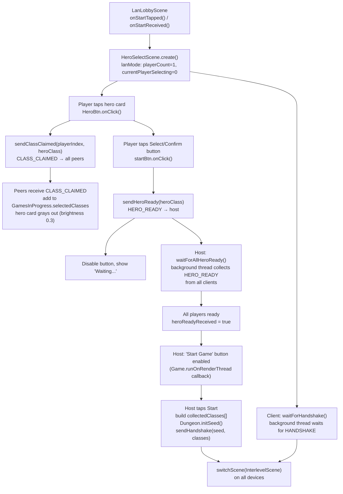

# Hero Select Scene — LAN Multiplayer Coordination

## Metadata

- System type: `flow`

## System Intent

- What this is: `HeroSelectScene` is the scene where each device picks a hero class before the dungeon starts. In **solo / pass-and-play** mode it loops once per local player. In **LAN mode** each device selects exactly one hero independently; coordination uses four packet types (`CLASS_CLAIMED`, `CLASS_UNCLAIMED`, `HERO_READY`, `HANDSHAKE`) to sync selection state and gate game start.

## Mermaid Diagram



## Flows

### Global Types

```txt
GamesInProgress.playerCount: int               -- set to 1 in LAN mode (each device selects one hero)
GamesInProgress.selectedClass: HeroClass       -- the locally hovered/selected class
GamesInProgress.selectedClasses: ArrayList<HeroClass>  -- classes claimed by any player (used for gray-out)
GamesInProgress.currentPlayerSelecting: int    -- set to 0 in LAN mode

NetworkManager.lanMode: boolean                -- true while in LAN session
NetworkManager.isHost: boolean                 -- true on host device
NetworkManager.localPlayerIndex: int           -- 0 = host, 1..N = clients
                                               -- reset to 0 by NetworkManager.cleanup() on session end
NetworkManager.connectedPlayerCount: int       -- total players (host counts as 1)
```

**Session lifecycle note**: `NetworkManager.cleanup()` resets `localPlayerIndex` to 0. This is critical for correctness — if a device acted as a LAN client (`localPlayerIndex=1`) and then starts a solo game, `GameScene.create()` must see `localPlayerIndex=0` to track the correct (only) hero. Without the reset, `GameScene.create()` would attempt `Dungeon.heroes.get(1)` on a single-hero roster and throw `IndexOutOfBoundsException`. A bounds clamp `Math.min(localPlayerIndex, heroes.size()-1)` in `GameScene.java:346` provides a secondary safety guard.

---

### Flow: `lanHeroCardTap`

- Core files:
  - `core/src/main/java/com/shatteredpixel/shatteredpixeldungeon/scenes/HeroSelectScene.java`
  - `core/src/main/java/com/shatteredpixel/shatteredpixeldungeon/network/NetworkManager.java`

#### Paths

| path | input | output | path-type | notes |
| --- | --- | --- | --- | --- |
| `lanHeroCardTap.select` | Player taps an unlocked, unclaimed hero card in LAN mode | `setSelectedHero(cl)` called locally; `sendClassClaimed(localPlayerIndex, cl)` sent to all peers | happy path | **BUG**: As of 2026-05-30, `sendClassClaimed` is never called in `HeroBtn.onClick()` — missing wiring |
| `lanHeroCardTap.alreadyTaken` | Player taps a hero card in `GamesInProgress.selectedClasses` | `WndMessage("hero_taken")` shown | guard | Works correctly today |
| `lanHeroCardTap.peerReceiveClaim` | Peer device receives `CLASS_CLAIMED` packet | class added to `GamesInProgress.selectedClasses`; `HeroBtn.update()` dims it to brightness 0.3 | happy path | **BUG**: No listener exists in `HeroSelectScene` to receive and apply CLASS_CLAIMED packets — missing wiring |

#### Pseudocode (intended, not yet implemented)

```
// HeroSelectScene.HeroBtn.onClick() — LAN tap path
} else {
    setSelectedHero(cl);
    if (NetworkManager.lanMode) {
        NetworkManager.sendClassClaimed(NetworkManager.localPlayerIndex, cl);
    }
}

// HeroSelectScene — background CLASS_CLAIMED listener (missing, needs to be added)
// When CLASS_CLAIMED received from peer:
Game.runOnRenderThread(() -> {
    GamesInProgress.selectedClasses.add(heroClass);
});
```

---

### Flow: `lanSelectConfirm`

- Core files:
  - `core/src/main/java/com/shatteredpixel/shatteredpixeldungeon/scenes/HeroSelectScene.java`
  - `core/src/main/java/com/shatteredpixel/shatteredpixeldungeon/network/NetworkManager.java`

#### Paths

| path | input | output | path-type | notes |
| --- | --- | --- | --- | --- |
| `lanSelectConfirm.playerConfirm` | Any player taps "Select" / Confirm button | `sendHeroReady(selectedClass)` sent; button disabled; "Waiting…" shown | happy path | **BUG**: Current code runs a blocking `Thread.sleep` poll loop on the render thread instead of returning immediately |
| `lanSelectConfirm.hostAllReady` | Host receives HERO_READY from all clients | `heroReadyReceived = true`; `Game.runOnRenderThread` enables host "Start Game" button | happy path | **BUG**: Current code polls with `Thread.sleep` on render thread; should use callback from `waitForAllHeroReady` background thread |
| `lanSelectConfirm.hostStartGame` | Host taps "Start Game" button | `collectedClasses` assembled, `sendHandshake(seed, classes)`, `switchScene(InterlevelScene)` | happy path | **BUG**: No separate "Start Game" button exists — the single button tries to do everything synchronously |
| `lanSelectConfirm.clientReceiveHandshake` | Client receives HANDSHAKE packet | `Dungeon.seed` and `GamesInProgress.selectedClasses` set from payload; `switchScene(InterlevelScene)` | happy path | **BUG**: Client side also polls with `Thread.sleep` on render thread; should use callback from `waitForHandshake` background thread |

#### Pseudocode (intended design)

```
// Phase A — every player: tap "Select/Confirm"
startBtn.onClick():
    if (GamesInProgress.selectedClass == null) return;
    if (NetworkManager.lanMode) {
        NetworkManager.sendHeroReady(GamesInProgress.selectedClass);
        startBtn.enable(false);
        startBtn.text("Waiting...");
        if (NetworkManager.isHost()) {
            int expected = NetworkManager.getConnectedPlayerCount();
            NetworkManager.waitForAllHeroReady(expected);  // starts background thread
            // host listens for heroReadyReceived via update() or a Runnable callback
        } else {
            NetworkManager.waitForHandshake();  // starts background thread
        }
        return;  // DO NOT block
    }
    // (solo path follows)

// Phase B — host only: game loop checks heroReadyReceived
// When NetworkManager.isHeroReadyReceived() becomes true, on render thread:
HeroClass[] classes = NetworkManager.getCollectedClasses();
classes[0] = GamesInProgress.selectedClass;  // host's own class at index 0
hostStartBtn.enable(true);

// Phase C — host: tap "Start Game"
hostStartBtn.onClick():
    long seed = Dungeon.seed != 0 ? Dungeon.seed : (Dungeon.initSeed(), Dungeon.seed);
    NetworkManager.sendHandshake(seed, classes);
    Dungeon.seed = seed;
    GamesInProgress.selectedClasses = new ArrayList<>(Arrays.asList(classes));
    ActionIndicator.clearAction();
    InterlevelScene.mode = Mode.DESCEND;
    Game.switchScene(InterlevelScene.class);

// Phase D — client: game loop checks handshakeReceived
// When NetworkManager.isHandshakeReceived() becomes true, on render thread:
NetworkManager.HandshakePayload payload = NetworkManager.getHandshakePayload();
Dungeon.seed = payload.seed;
GamesInProgress.selectedClasses = new ArrayList<>(Arrays.asList(payload.heroClasses));
ActionIndicator.clearAction();
InterlevelScene.mode = Mode.DESCEND;
Game.switchScene(InterlevelScene.class);
```

---

### Flow: `lanHeroCardGrayOut`

- Core files:
  - `core/src/main/java/com/shatteredpixel/shatteredpixeldungeon/scenes/HeroSelectScene.java`

#### Paths

| path | input | output | path-type | notes |
| --- | --- | --- | --- | --- |
| `lanHeroCardGrayOut.localClaim` | Local player selects a hero | `GamesInProgress.selectedClass` set; card brightness 1.0 | happy path | Works today |
| `lanHeroCardGrayOut.remoteClaim` | Remote CLASS_CLAIMED packet received | Class added to `GamesInProgress.selectedClasses`; `HeroBtn.update()` sets brightness 0.3 | happy path | **BUG**: Never actually happens — no listener sends CLASS_CLAIMED or receives it |
| `lanHeroCardGrayOut.updateLoop` | `HeroBtn.update()` runs each frame | `selectedClasses.contains(cl)` → 0.3 brightness; `cl == selectedClass` → 1.0; else → 0.6 | always | Logic is correct; just never triggered for remote claims |

---

## NetworkManager packet API (hero selection relevant subset)

| Method | Packet type | Direction | Notes |
|---|---|---|---|
| `sendClassClaimed(playerIndex, heroClass)` | `CLASS_CLAIMED` (11) | sender → all peers | Called when player hovers/selects a card; not yet called from HeroSelectScene |
| `sendClassUnclaimed(playerIndex, heroClass)` | `CLASS_UNCLAIMED` (13) | sender → all peers | Called when player switches away from a previously claimed card |
| `sendHeroReady(heroClass)` | `HERO_READY` (6) | client → host | Confirms final class selection |
| `waitForAllHeroReady(playerCount)` | — | host | Starts background thread; sets `heroReadyReceived=true` when done |
| `sendHandshake(seed, classes)` | `HANDSHAKE` (3) | host → all clients | Broadcasts seed + class array to start game |
| `waitForHandshake()` | — | client | Starts background thread; sets `handshakeReceived=true` when done |
| `isHeroReadyReceived()` | — | host query | Polled from render-thread `update()` or callback |
| `isHandshakeReceived()` | — | client query | Polled from render-thread `update()` or callback |

---

## Logs

| Source | Location |
|--------|----------|
| HERO_READY sent | `GLog.p("HERO_READY sent: %s", ...)` in NetworkManager |
| HANDSHAKE sent | `GLog.p("HANDSHAKE sent: %d players, seed %d", ...)` in NetworkManager |
| Failures | `GLog.n(...)` in NetworkManager send/receive methods |

## Deployment

- Mechanism: `local only`
- Deploy command:
  ```bash
  ./gradlew desktop:run
  ```
- Notes: LAN mode is activated by `NetworkManager.lanMode = true` (set in `hostGame()` / `joinGame()`). Solo play is fully unaffected — the `if (NetworkManager.lanMode)` guard in `startBtn.onClick()` and `create()` separates the two paths.
