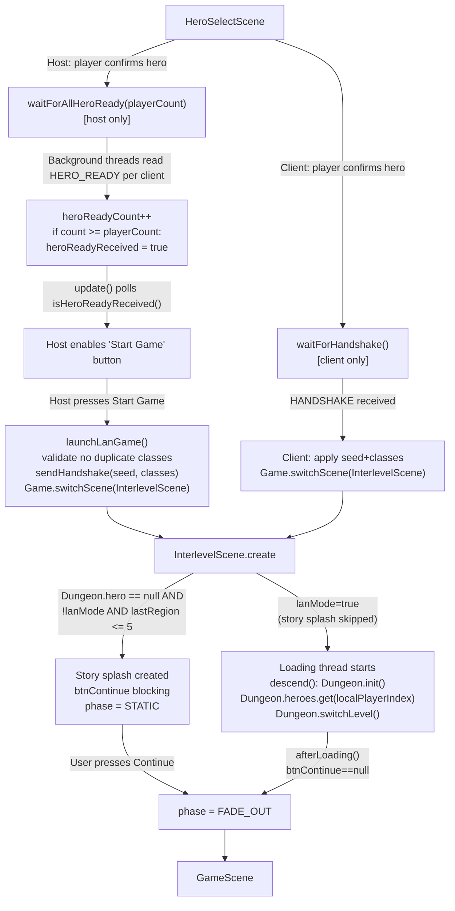

# LAN Game Loading

## Metadata

- System type: `flow`

## System Intent

- What this is: The sequence of scene transitions and network coordination that takes both host and client from `HeroSelectScene` through `InterlevelScene` (loading screen) and into `GameScene` for a new LAN game. Covers the hero-ready handshake protocol, race-condition guards, and story-splash gating.

## Mermaid Diagram



## Flows

### Flow: `hostLaunchLanGame`

- Core files:
  - `core/src/main/java/com/shatteredpixel/shatteredpixeldungeon/scenes/HeroSelectScene.java` — `launchLanGame()` (~line 498), `update()` (~line 631)
  - `core/src/main/java/com/shatteredpixel/shatteredpixeldungeon/network/NetworkManager.java` — `waitForAllHeroReady()` (~line 1014), `sendHandshake()` (~line 915)
  - `core/src/main/java/com/shatteredpixel/shatteredpixeldungeon/scenes/InterlevelScene.java` — `create()` (~line 283), `descend()` (~line 626), `afterLoading()` (~line 612)
- Test files:
  - `core/src/test/java/com/shatteredpixel/shatteredpixeldungeon/network/HeroReadyRaceTest.java`

#### Types

```txt
HeroReadyRaceInput {
  playerCount: int (number of players including host)
  HERO_READY packets: stream from each client (byte type + byte classOrdinal)
}

HandshakePayload {
  seed: long
  playerCount: int
  heroClasses: HeroClass[] (indexed by player slot)
}
```

#### Paths

| path | input | output | path-type | notes |
| --- | --- | --- | --- | --- |
| `hostLaunchLanGame.success` | All clients send HERO_READY, no duplicate classes | Host transitions to InterlevelScene, sendHandshake broadcast | happy path | |
| `hostLaunchLanGame.raceLost` | Client HERO_READY arrives before heroReadyCount=1 set | heroReadyReceived never true, HeroSelectScene hangs | **bug** | Root Cause 1 — fixed by initializing heroReadyCount=1 BEFORE starting reader threads |
| `hostLaunchLanGame.duplicateClass` | Two players chose same class | launchLanGame() shows WndMessage, resets confirm state | error | Host re-enables hero buttons |
| `hostLaunchLanGame.storySplash` | LAN mode, Dungeon.hero==null on InterlevelScene entry | btnContinue blocks FADE_OUT until user presses Continue | **bug** | Root Cause 2 — fixed by adding `!NetworkManager.lanMode` guard at line 283 |

#### Pseudocode

```
// HOST path
HeroSelectScene.update():
  if lanHeroConfirmed && isHost && !lanReadyToStart:
    if isHeroReadyReceived():
      lanReadyToStart = true
      startBtn.enable(true)  // shows "Start Game"

HeroSelectScene.startBtn.onClick():
  launchLanGame()

launchLanGame():
  validate no duplicate HeroClass in collectedClasses
  sendHandshake(seed, collectedClasses)
  InterlevelScene.mode = DESCEND
  Game.switchScene(InterlevelScene.class)

// CLIENT path  
HeroSelectScene.confirmBtn.onClick() [when lanMode]:
  sendHeroReady(selectedClass)
  waitForHandshake()  // starts background thread
  startBtn shows "Waiting..."

HeroSelectScene.update():
  if lanHeroConfirmed && !isHost && !lanHandshakeReady:
    if isHandshakeReceived():
      apply seed, heroClasses from HandshakePayload
      Game.switchScene(InterlevelScene.class)

// INTERLEVEL LOADING
InterlevelScene.create():
  if mode==DESCEND && lastRegion<=5 && !isDebug && !lanMode:  // lanMode guard
    if Dungeon.hero==null:
      create btnContinue story splash  // blocks FADE_OUT
  start loading thread → descend()

descend():
  if Dungeon.hero==null:   // new game
    Dungeon.init()         // creates all heroes from selectedClasses
    if lanMode:
      Dungeon.hero = Dungeon.heroes.get(localPlayerIndex)
    Dungeon.switchLevel(newLevel, -1)

afterLoading():
  if btnContinue==null: phase = FADE_OUT → switchScene(GameScene)
  else:                 phase = STATIC  (wait for user)

// waitForAllHeroReady — FIXED order (heroReadyCount=1 BEFORE threads start)
waitForAllHeroReady(playerCount):
  heroReadyCount = 0
  heroReadyReceived = false
  synchronized: heroReadyCount = 1  // ← MUST happen before thread.start()
  for each client:
    start thread → read HERO_READY → heroReadyCount++
                                   → if count>=playerCount: heroReadyReceived=true
```

## Known Bugs / Fixed Issues

| Bug | Root Cause | Fix Location | Audit Log |
| --- | --- | --- | --- |
| `waitForAllHeroReady` race: heroReadyReceived never true | heroReadyCount=1 set AFTER reader threads start; thread increments 0→1, main overwrites with 1 | `NetworkManager.waitForAllHeroReady()` — move `heroReadyCount=1` before loop | `docs/bugs/2026-05-30-lan-descending-hang.md` |
| LAN game stuck on "Descending." story splash | `InterlevelScene.create()` creates `btnContinue` for new games (Dungeon.hero==null) without LAN guard — blocks `FADE_OUT` | `InterlevelScene.create()` line ~283 — add `&& !NetworkManager.lanMode` | `docs/bugs/2026-05-30-lan-descending-hang.md` |

## Logs

| Source | Location |
|--------|----------|
| Hero ready | `GLog` via `NetworkManager` — "Error in hero-ready reader for slot %d" |
| Handshake | `GLog.p("HANDSHAKE sent: %d players, seed %d")` / `GLog.p("Handshake received — %d players, seed %d")` |
| Load timeout | `ShatteredPixelDungeon.reportException("waited more than 10 seconds on levelgen")` |

## Deployment

- Mechanism: `local only`
- Notes: Android + desktop via libGDX. No remote deployment.
