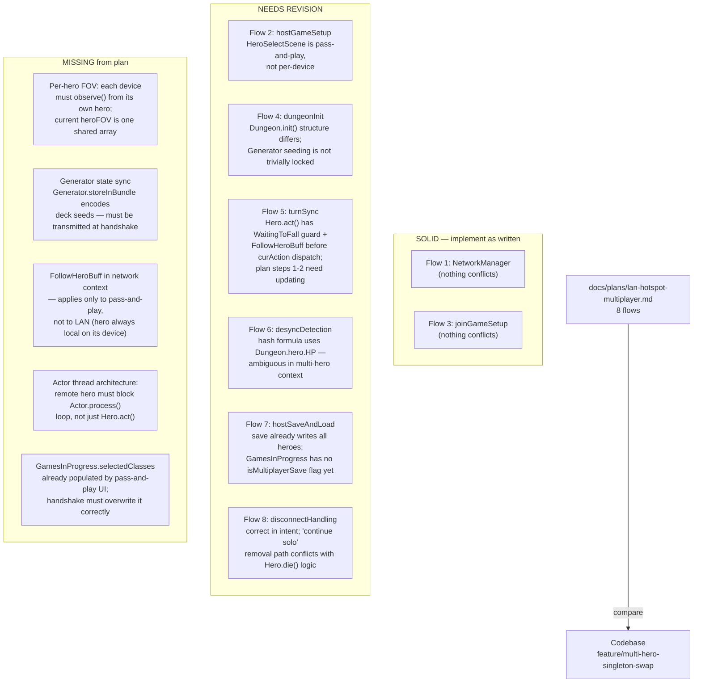

# LAN/Hotspot Multiplayer Plan Audit

## Metadata

- System type: `flow`

## System Intent

- What this is: An audit of `docs/plans/lan-hotspot-multiplayer.md` against the actual codebase state as of branch `feature/multi-hero-singleton-swap`. The plan describes a lockstep LAN/hotspot multiplayer system for 2–4 devices. This document records which plan flows are implementable as written, which require revision based on codebase reality, and what new considerations are missing from the plan entirely.

---

## Mermaid Diagram



---

## Flows

### Flow 1: `networkLayerInit` — SOLID

- Plan section: Flow 1
- Verdict: Implementable as written. No existing code conflicts with creating `NetworkManager` in `core/src/main/java/.../network/`.
- Evidence: No network package exists. `java.net` sockets are available. The binary protocol format is self-contained.
- Notes: Plan specifies `DataInputStream`/`DataOutputStream` — compatible with how the existing `Bundle`/`FileUtils` layer uses streams.

---

### Flow 2: `hostGameSetup` — NEEDS REVISION

- Plan section: Flow 2
- Verdict: Hero selection logic diverges from the plan.

**What the plan says:**
- After `START { playerCount, seed }`, each device goes through `HeroSelectScene` for its own slot independently.
- Host waits for `HERO_READY` from each client, then broadcasts `HANDSHAKE`.

**What the codebase actually does:**
- `HeroSelectScene` is a pass-and-play loop: it reads `GamesInProgress.currentPlayerSelecting` and `GamesInProgress.selectedClasses` to let each player on one device pick in turn.
- The scene does not have a network-receive path. It does not know what device it is running on.
- `GamesInProgress.playerCount`, `selectedClasses`, and `currentPlayerSelecting` are static globals that must be set before the scene is entered.

**What the revision needs:**
1. LAN game must bypass `WndPlayerCount` (player count is determined dynamically by join count, not chosen locally).
2. After receiving `START { seed, playerCount }`, the client device should enter `HeroSelectScene` with `playerCount = 1` and `currentPlayerSelecting = 0` so only the local hero is selected.
3. Host similarly sets `playerCount = 1` and selects only its own hero.
4. Hero-class exchange happens via `HERO_READY`/`HANDSHAKE` as planned, but `GamesInProgress.selectedClasses` on each device must be overwritten after `HANDSHAKE` is received (step added to Flow 4 below).

---

### Flow 3: `joinGameSetup` — SOLID

- Plan section: Flow 3
- Verdict: Implementable as written. Client-side flow is purely additive — new UI + socket code.
- Evidence: No existing code conflicts with `WndLANMenu`, `WndJoinGame`, or `LanLobbyScene`.

---

### Flow 4: `dungeonInit` — NEEDS REVISION

- Plan section: Flow 4
- Verdict: Several details conflict with the actual `Dungeon.init()` and seeding structure.

**Issue A — `Dungeon.init()` signature and seed injection:**

The plan says:
> "Host calls `Dungeon.newGame()` as normal ... Client calls `Dungeon.newGame()` with the received seed"

There is no `Dungeon.newGame()`. The actual entry point is `Dungeon.init()`, which reads `Dungeon.seed` (a static field already set by `Dungeon.initSeed()`). To inject a network-received seed, the client must call `Dungeon.seed = receivedSeed` before entering `InterlevelScene`, which in turn calls `Dungeon.init()`. This works but the plan's naming is wrong.

**Issue B — `GamesInProgress.selectedClasses` must be set before `Dungeon.init()`:**

`Dungeon.init()` reads `GamesInProgress.selectedClasses` to spawn heroes:
```java
if (GamesInProgress.selectedClasses != null && !GamesInProgress.selectedClasses.isEmpty()) {
    for (HeroClass cls : GamesInProgress.selectedClasses) {
        spawnHero(cls);
    }
}
```
Both devices must have `GamesInProgress.selectedClasses` set to the full list `[host class, client class, ...]` in the same order before `Dungeon.init()` runs. The `HANDSHAKE` packet must deliver `heroClasses[]` and the receiving device must write them to `GamesInProgress.selectedClasses` before switching to `InterlevelScene`.

**Issue C — Generator seeding is not fully captured by `Dungeon.seed`:**

`Generator` maintains per-category seeds (`Category.seed`) that evolve over the run (see `Generator.storeInBundle`). For a client joining mid-run (load resume, Flow 7), these seeds must also be transmitted. For a new game (Flow 4) at turn 0 this is a non-issue because `Generator.fullReset()` is called by `Dungeon.init()` and all seeds are derived deterministically from `Dungeon.seed` at that point.

**Issue D — `Random.pushGenerator(seed+1)` not `seed`:**

The plan says "identical seed produces identical sequence." This is true, but `Dungeon.init()` actually calls `Random.pushGenerator(seed + 1)` not `seed` (offset by 1 intentionally):
```java
Random.pushGenerator( seed+1 );
```
This is fine as long as both devices use the same seed; they will both call `pushGenerator(seed+1)`. The plan should note the +1 offset.

**Issue E — `Dungeon.heroes[0]` / `Dungeon.heroes[1]` notation:**

The plan uses array index notation. The field is `ArrayList<Hero> heroes`. The plan's step "Dungeon.heroes[0] = host hero" should read "Dungeon.heroes.get(0) = host hero (first entry in selectedClasses)".

---

### Flow 5: `turnSync` — NEEDS REVISION

- Plan section: Flow 5
- Verdict: Steps 1–2 conflict with the actual `Hero.act()` structure.

**Actual Hero.act() structure (from code):**
```
1. Guard: if (!isAlive()) skip turn immediately
2. Guard: if (WaitingToFall buff present) zero pos, hide sprite, spend TICK, return
3. activate()  — swaps Dungeon.hero singleton to this hero
4. fieldOfView = Dungeon.level.heroFOV
5. observe() / FOV update
6. checkVisibleMobs() + BuffIndicator refresh
7. Guard: if (paralysed > 0) spend TICK, return
8. FollowHeroBuff check: if present and not stopped, set curAction = HeroAction.Move
9. if (curAction == null): ready() or rest
10. else: dispatch to actMove/actAttack/etc.
11. Post-action WaitingToFall guard: if buff attached during turn, end turn immediately
```

**What the plan says (step 1):**
> "In Hero.act(), check `this == Dungeon.heroes[NetworkManager.localPlayerIndex]`
>  - If local hero: wait for player input as normal
>  - If remote hero: call `NetworkManager.receiveAction()` blocking read, set `curAction`"

**Revision needed:**
1. The `localPlayerIndex` check must happen at step 9 (after all guards, after `activate()`, after `FollowHeroBuff` is resolved), not at the top of `act()`. The WaitingToFall and dead-hero guards must run regardless of local vs. remote.
2. `FollowHeroBuff` is a pass-and-play mechanic — it auto-follows another hero on the same device. In LAN mode each device has only one hero, so `FollowHeroBuff` should never be attached to a remote hero. The network path should assert this does not happen rather than trying to route through it.
3. The blocking `NetworkManager.receiveAction()` call happens inside the actor thread (`Actor.process()` loop), which also holds the actor processing lock. This means the actor thread blocks waiting for network I/O. This is correct in principle (the loop will not advance until all heroes have acted) but must be designed to be interruptible when the thread is stopped (`keepActorThreadAlive = false` or `Thread.interrupt()`).

**What the plan says (step 2):**
> "When local hero gets input: call `NetworkManager.sendAction(curAction, heroId)` before `spendAndNext()`"

This is correct in placement (after `curAction` is set by `handle()`), but `sendAction` must fire before `actMove`/`actAttack` etc. execute — i.e., at the beginning of the `curAction` dispatch block, not inside each `actXxx` method individually. The recommended insertion point is just before the `if (curAction instanceof HeroAction.Move)` chain.

---

### Flow 6: `desyncDetection` — NEEDS REVISION

- Plan section: Flow 6
- Verdict: Hash formula is ambiguous for multi-hero state; minor fix needed.

**What the plan says:**
```java
long hash = Dungeon.seed
    ^ (long)Dungeon.hero.HP << 32
    ^ Actor.now()
    ^ Dungeon.level.feeling.ordinal()
    ^ Arrays.hashCode(mobPositions());
```

**Issue:** `Dungeon.hero.HP` is the currently-active hero's HP (the device's local player), not a stable aggregate. In a two-player game hero[0] hashes its own HP; hero[1] hashes its own HP. Because both heroes act on both devices (simulation is deterministic), the hash should include all heroes' HP. Revision:
```java
long hash = Dungeon.seed ^ Actor.now() ^ Dungeon.level.feeling.ordinal();
for (Hero h : Dungeon.heroes) {
    hash ^= (long) h.HP << (32 + Dungeon.heroes.indexOf(h) * 4);
}
hash ^= Arrays.hashCode(mobPositions());
```

**Issue B:** `Actor.now() % 10 == 0` — `Actor.now()` returns a float. Modulo on floats is unreliable for exact equality. Use `(int)Actor.now() % 10 == 0` instead.

---

### Flow 7: `hostSaveAndLoad` — NEEDS REVISION

- Plan section: Flow 7
- Verdict: Save format already supports all heroes (no changes needed there); other infrastructure is missing.

**What already works:**
- `Dungeon.saveGame()` already writes `Dungeon.heroes` under key `"heroes"` (Bundle collection). All heroes are persisted.
- `Dungeon.loadGame()` already restores all heroes from the `"heroes"` key, with backwards-compat for old single-hero saves.
- `GamesInProgress.Info` already carries `heroClasses`, `armorTiers`, and `heroLevels` for all heroes — enough for the `SAVE_LOBBY_INFO` packet.

**What is missing:**
1. `GamesInProgress` has no `isMultiplayerSave` flag. The plan requires it to distinguish LAN saves from single-player saves on the title screen. Must be added to both `GamesInProgress.Info` and serialized into the save bundle.
2. The `RESUME_HANDSHAKE` packet carries `fullDungeonBundle` (plan step f). The existing `Dungeon.saveGame()` writes to a file; a separate in-memory serialization path is needed to produce a byte array for transmission. `FileUtils.bundleToStream` is `private static` (SPD-classes/src/main/java/com/watabou/utils/FileUtils.java:221) and cannot be called outside that class. No public bundle-to-stream or bundle-to-bytes API exists. A new public helper must be added to `FileUtils` — either make `bundleToStream` public, or add a dedicated `public static byte[] bundleToBytes(Bundle bundle)` wrapper — before the `RESUME_HANDSHAKE` byte payload can be produced.
3. The client's "hero-claim" flow (plan step 6c–6e) assumes the client knows hero metadata before receiving the full bundle. `GamesInProgress.Info` carries `heroClasses` (ArrayList<HeroClass>), `armorTiers` (ArrayList<Integer>), and `heroLevels` (ArrayList<Integer>) for all heroes, but it does NOT track per-hero HP. The only HP field on `GamesInProgress.Info` is a single `int hp` that reflects `Dungeon.hero` alone (the last-active singleton), not each hero independently. The `SAVE_LOBBY_INFO` packet must therefore include HP values read directly from each entry in `Dungeon.heroes` at transmission time; it cannot be sourced from `GamesInProgress.Info`.

---

### Flow 8: `disconnectHandling` — NEEDS REVISION

- Plan section: Flow 8
- Verdict: "Continue solo" option conflicts with the existing `Hero.die()` removal logic.

**What the plan says:**
> "'Continue solo' (remove remote hero from `Dungeon.heroes`, revert to single-player turn loop)"

**Conflict:** `Hero.die()` already has a single-hero-death path: when `livingOthers > 0`, the dead hero is removed from `Dungeon.heroes` and the game continues. But "continue solo" does not involve the hero dying — it involves removing a live hero from the roster silently. This path does not exist. Implementing it requires:
1. A way to cleanly remove a live hero from `Actor.all` (currently done via `Actor.remove()`) and from `Dungeon.heroes`.
2. Updating `Actor.init()` actor-priority assignments after removal (currently only set at `init()` time).
3. Deciding what happens to the disconnected hero's items — they could be dropped at their last known position.

**"Wait for reconnect" path:**
- The plan says "host re-opens `ServerSocket`, client re-enters join flow, resync via Flow 6." This is reasonable but the resync must also rebuild `Actor.all` priorities and re-establish which hero index the rejoining player controls.

---

## New Considerations Missing from the Plan

### Gap 1: Per-Hero FOV in LAN vs. Pass-and-Play

**Current codebase state:**
- `Level.heroFOV` is a single `boolean[]` array per level (one per device).
- `Dungeon.observe()` computes FOV from `Dungeon.hero` (the active hero at call time).
- In pass-and-play mode, `Dungeon.observe()` is called inside each `Hero.act()` after the singleton swap — so each hero's turn computes the correct FOV for that hero. The single device shows only the active hero's view.

**LAN implication:**
- Each device already runs the full simulation, but renders from its own local hero's perspective. This works naturally: `Hero.act()` calls `activate()` which sets `Dungeon.hero = this`, and then `Dungeon.observe()` is called using that hero's position. The device hosting hero[1] will call `observe()` from hero[1]'s position when it is hero[1]'s turn, producing the correct FOV.
- No changes to `heroFOV` are needed for basic LAN operation.
- However: when hero[0]'s turn runs on hero[1]'s device, `activate()` swaps `Dungeon.hero` to hero[0], pans the camera to hero[0], and updates the UI to show hero[0]'s state. This is the pass-and-play behavior — the device owner watches hero[0] act before their turn. Whether this is desirable UX for LAN play must be decided. The alternative is to gate `activate()` behind a `localPlayerIndex` check so the camera and UI only update when the local hero is acting.

### Gap 2: Generator State Must Be Synchronized on Resume

For a fresh game (Flow 4): `Dungeon.init()` calls `Generator.fullReset()` which resets all category seeds, so both devices start from identical Generator state. No action needed for new games.

For a resumed game (Flow 7, `RESUME_HANDSHAKE`): `Generator.storeInBundle()` serializes per-category seeds and drop counts. This data must be included in the bundle transmitted via `RESUME_HANDSHAKE`, or the client will have a diverged Generator state from turn 1. The existing `Dungeon.saveGame()` already includes `Generator.storeInBundle()` in the bundle, so using the full save bundle for `RESUME_HANDSHAKE` (as the plan intends) covers this automatically.

### Gap 3: `FollowHeroBuff` is Pass-and-Play Only

`FollowHeroBuff` exists to let one hero automatically follow another when they are on the same device and the active player switches. In LAN mode each device controls only one hero; the "other" hero's turns run automatically via `NetworkManager.receiveAction()`. `FollowHeroBuff` should not be attached to any hero in LAN mode. The Network layer initialization (Flow 1) should include a flag or mode enum that suppresses `FollowHeroBuff` attachment in LAN sessions.

### Gap 4: Actor Thread Architecture for Network Blocking

The plan says the remote hero's `act()` "blocks until the network action arrives — same as local hero blocking on touch input." This framing is correct but understates the architecture difference.

For a local hero: `Hero.act()` calls `ready()` which returns `false` (doNext=false). The actor thread then calls `thisThread.wait()` and sleeps until the render thread notifies it (after user input). The thread releases CPU while waiting.

For a remote hero: `Hero.act()` must block on `NetworkManager.receiveAction()`. If this is a simple `DataInputStream.readFully()`, it blocks the actor thread indefinitely without the `thisThread.wait()` pattern. The actor thread does not sleep gracefully; it holds the thread until the read completes. This is functionally correct but means:
1. `GameScene.destroy()` (which calls `actorThread.interrupt()`) must be handled — the blocking read must respond to interruption.
2. The 4500ms actor-thread-stop timeout in `GameScene.destroy()` may fire if the remote device is slow to respond.

Use `Socket.setSoTimeout()` to limit how long each read blocks, and catch `SocketTimeoutException` as a disconnect signal.

### Gap 5: `Dungeon.hero` Singleton Visibility During Remote Turns

When hero[0]'s turn runs on hero[1]'s device, `activate()` is called and sets `Dungeon.hero = hero[0]`, panning the camera and refreshing UI to show hero[0]'s inventory and status. On a LAN device, this is disorienting — the device owner sees hero[0]'s UI during hero[0]'s turn even though they only control hero[1].

The plan does not address this. Two options:
1. Gate `activate()` with a LAN mode check: only update camera/UI if `this == localHero`.
2. Accept the pass-and-play camera behavior as-is for the initial implementation.

Option 1 is the better UX but requires `NetworkManager.localPlayerIndex` to be accessible from `Hero.activate()`.

---

## Summary Table

| Flow | Plan Section | Status | Key Issue |
|------|-------------|--------|-----------|
| `networkLayerInit` | Flow 1 | SOLID | No conflicts |
| `hostGameSetup` | Flow 2 | NEEDS REVISION | `HeroSelectScene` is pass-and-play; must run with `playerCount=1` per device |
| `joinGameSetup` | Flow 3 | SOLID | Additive; no conflicts |
| `dungeonInit` | Flow 4 | NEEDS REVISION | No `newGame()`; `selectedClasses` must be written before `InterlevelScene`; `pushGenerator(seed+1)` |
| `turnSync` | Flow 5 | NEEDS REVISION | Network check must come after WaitingToFall/dead guards and after `activate()`; FollowHeroBuff not applicable |
| `desyncDetection` | Flow 6 | NEEDS REVISION | Hash must cover all heroes' HP; `Actor.now() % 10` must use int cast |
| `hostSaveAndLoad` | Flow 7 | NEEDS REVISION | `isMultiplayerSave` flag missing; in-memory bundle serialization path needed for RESUME_HANDSHAKE |
| `disconnectHandling` | Flow 8 | NEEDS REVISION | "Continue solo" live-hero removal path does not exist; must be built |
| Per-hero FOV / camera | Missing | NEW | `activate()` swaps camera even for remote turns; gating needed for LAN |
| Generator sync on resume | Missing | NEW | Full save bundle in RESUME_HANDSHAKE covers this; must be explicit |
| FollowHeroBuff suppression | Missing | NEW | Must not attach in LAN mode |
| Actor thread blocking | Missing | NEW | `receiveAction()` must use `setSoTimeout()` and handle `InterruptedException` |
| `selectedClasses` handshake ordering | Missing | NEW | Client must write `selectedClasses` before entering `InterlevelScene` |

---

## Logs

| Source | Location |
|--------|----------|
| In-game log | `GLog` — all hero log messages go to the same in-game log regardless of which hero generated them |
| Network errors | No existing infrastructure; must be added in `NetworkManager` |
| Actor thread crashes | `ShatteredPixelDungeon.reportException()` via `GameScene.destroy()` 4500ms watchdog |

## Deployment

- Mechanism: `local only`
- Deploy command:
  ```bash
  ./gradlew desktop:run
  ```
- Notes: No network code exists yet. All content in this document describes plan-vs-codebase gap analysis. None of the LAN flows are implemented.
