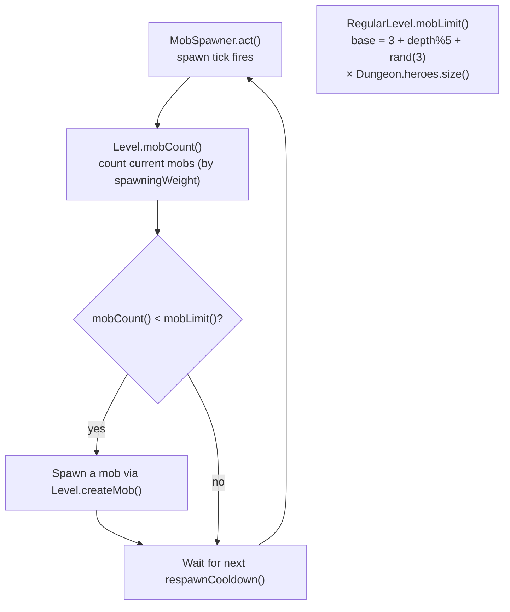

# Mob Spawning

## Metadata

- System type: `flow`

## System Intent

- What this is: Controls how many monsters can exist on a floor at once (`mobLimit()`) and how the `MobSpawner` actor fills up to that cap over time. In multiplayer the cap scales linearly with the number of players so each player faces a full solo density of enemies. Spawn frequency (`respawnCooldown`) is unchanged — the spawner fills the higher cap at the same natural rate.

## Mermaid Diagram



## Flows

### Global Types

```txt
StandardError {
  message: string
}
```

---

### Flow: `scaleRegularMobLimit`

- Test files: N/A
- Core files:
  - `core/src/main/java/com/shatteredpixel/shatteredpixeldungeon/levels/RegularLevel.java`
  - `core/src/main/java/com/shatteredpixel/shatteredpixeldungeon/levels/MiningLevel.java`
  - `core/src/main/java/com/shatteredpixel/shatteredpixeldungeon/levels/Level.java`
  - `core/src/main/java/com/shatteredpixel/shatteredpixeldungeon/actors/mobs/MobSpawner.java`

#### Types

```txt
// RegularLevel.mobLimit() returns:
//   0                      if depth <= 1 and amulet not obtained
//   10 * playerCount       if depth <= 1 and amulet obtained
//   mobs * playerCount     otherwise, where mobs = 3 + depth%5 + Random.Int(3)
//                          (×1.33 ceil if Feeling.LARGE)
//
// playerCount = Dungeon.heroes.size() if heroes != null && !isEmpty(), else 1
//
// Level.mobLimit() base returns 0 — boss/special levels that do not override are capped at 0
// MiningLevel.mobLimit() returns super.mobLimit() - 1 (inherits scaling, then subtracts 1)
```

#### Paths

| path | input | output | path-type | notes |
| --- | --- | --- | --- | --- |
| `scaleRegularMobLimit.singlePlayer` | `heroes.size() == 1` | base limit × 1 (unchanged) | happy path | pixel-identical to pre-multiplayer behavior |
| `scaleRegularMobLimit.twoPlayers` | `heroes.size() == 2` | base limit × 2 | happy path | e.g. depth 5 base 5 → limit 10 |
| `scaleRegularMobLimit.fourPlayers` | `heroes.size() == 4` | base limit × 4 | happy path | |
| `scaleRegularMobLimit.depth1NoAmulet` | `depth <= 1`, amulet not obtained | `0` | happy path | floor 1 remains mob-free at start regardless of player count |
| `scaleRegularMobLimit.depth1Amulet` | `depth <= 1`, amulet obtained | `10 * playerCount` | happy path | post-amulet floor 1 scales with player count |
| `scaleRegularMobLimit.miningLevel` | `MiningLevel` | `super.mobLimit() - 1` | happy path | inherits scaling from `RegularLevel`; offset of -1 is preserved |
| `scaleRegularMobLimit.bossLevel` | any boss/special `Level` subclass that does not override `mobLimit()` | `0` | happy path | base `Level.mobLimit()` returns 0; boss levels are unaffected |

#### Pseudocode

```
// RegularLevel.java — mobLimit()
int playerCount = (Dungeon.heroes != null && !Dungeon.heroes.isEmpty())
        ? Dungeon.heroes.size()
        : 1;

if (Dungeon.depth <= 1) {
    if (!Statistics.amuletObtained) return 0;
    else                            return 10 * playerCount;
}

int mobs = 3 + Dungeon.depth % 5 + Random.Int(3);
if (feeling == Feeling.LARGE) {
    mobs = (int) Math.ceil(mobs * 1.33f);
}
return mobs * playerCount;

// MobSpawner.act() — spawn gate (unchanged):
if (Dungeon.level.mobCount() < Dungeon.level.mobLimit()) {
    // spawn one mob
}
```

## Logs

| Source | Location |
|--------|----------|
| In-game log | No `GLog` entries for spawn limit changes |

## Deployment

- Mechanism: `local only`
- Deploy command:
  ```bash
  ./gradlew desktop:debug
  ```
- Notes: Single-player (`heroes.size() == 1`) is pixel-identical to before. Boss levels return 0 from the base `Level.mobLimit()` and are unaffected. `MiningLevel` calls `super.mobLimit() - 1` and inherits the scaling automatically. Spawn frequency (`respawnCooldown`) is not modified.
