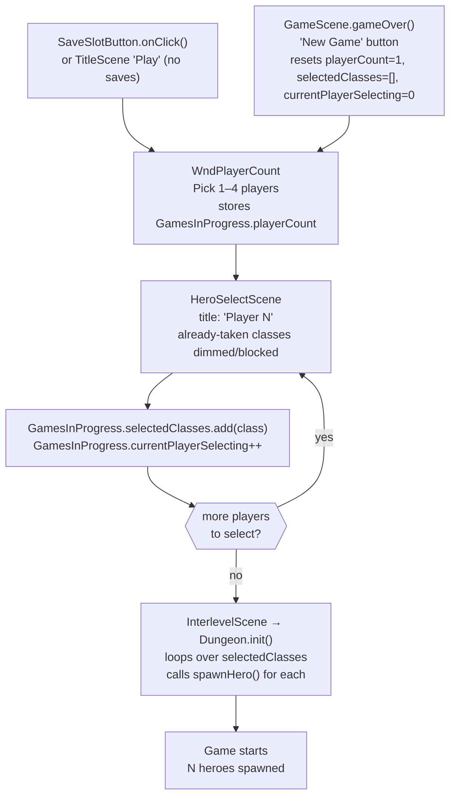

# Multiplayer Hero Selection UI

## Metadata

- System type: `flow`

## System Intent

- What this is: A UI flow that routes new-game creation through a player-count picker (`WndPlayerCount`) and then loops `HeroSelectScene` once per player, collecting one `HeroClass` per player into `GamesInProgress.selectedClasses`. `Dungeon.init()` then spawns one hero per entry in that list. Single-player games remain fully backwards compatible.

## Mermaid Diagram



## Flows

### Global Types

```txt
GamesInProgress.playerCount: int                     -- 1..4, set by WndPlayerCount
GamesInProgress.selectedClasses: ArrayList<HeroClass> -- one entry per player, in selection order
GamesInProgress.currentPlayerSelecting: int          -- 0-based index of player currently on HeroSelectScene
```

---

### Flow: `playerCountWindow`
- Core files:
  - `core/src/main/java/com/shatteredpixel/shatteredpixeldungeon/windows/WndPlayerCount.java`
  - `core/src/main/java/com/shatteredpixel/shatteredpixeldungeon/scenes/StartScene.java`
  - `core/src/main/java/com/shatteredpixel/shatteredpixeldungeon/scenes/TitleScene.java`
  - `core/src/main/java/com/shatteredpixel/shatteredpixeldungeon/scenes/GameScene.java`

#### Types

```txt
WndPlayerCount extends Window
  WIDTH = 120px
  Renders four RedButtons: "1 Player", "2 Players", "3 Players", "4 Players"
  Uses Messages keys: wndplayercount.title, wndplayercount.single_player, wndplayercount.multi_player
```

#### Paths

| path | input | output | path-type | notes |
| --- | --- | --- | --- | --- |
| `playerCountWindow.startScene` | New-game slot selected in `StartScene.SaveSlotButton.onClick()` | `WndPlayerCount` shown via `scene().add()` | happy path | Replaced direct `switchScene(HeroSelectScene.class)` |
| `playerCountWindow.titleScene` | No existing saves — `TitleScene` 'Play' button | `WndPlayerCount` shown via `addToFront()` | happy path | Both the normal click and debug long-click paths route here |
| `playerCountWindow.gameOver` | "New Game" clicked on game-over screen — `GameScene.gameOver()` restart button | `playerCount` reset to 1, `selectedClasses` cleared, `currentPlayerSelecting` reset to 0, then `WndPlayerCount` shown via `GameScene.show()` | happy path | Fixed bug where game restarted with stale multiplayer state; mirrors TitleScene/StartScene pattern |
| `playerCountWindow.selectCount` | Player taps 1–4 button | `GamesInProgress.playerCount` set, `selectedClasses` cleared to empty ArrayList, `currentPlayerSelecting = 0`, window hidden, `switchScene(HeroSelectScene.class)` | happy path | |

#### Pseudocode

```
// StartScene.java — SaveSlotButton.onClick() new-game branch
GamesInProgress.selectedClass = null;
GamesInProgress.curSlot = slot;
ShatteredPixelDungeon.scene().add(new WndPlayerCount());

// TitleScene.java — btnPlay.onClick() when no saves exist
GamesInProgress.selectedClass = null;
GamesInProgress.curSlot = 1;
ShatteredPixelDungeon.scene().addToFront(new WndPlayerCount());

// GameScene.java — gameOver() restart button onClick() (post-fix)
GamesInProgress.selectedClass = null;
GamesInProgress.curSlot = GamesInProgress.firstEmpty();
GamesInProgress.playerCount = 1;
GamesInProgress.selectedClasses = new ArrayList<>();
GamesInProgress.currentPlayerSelecting = 0;
GameScene.show(new WndPlayerCount());

// WndPlayerCount.java — button onClick() for playerCount = N
GamesInProgress.playerCount = playerCount;
GamesInProgress.selectedClasses = new ArrayList<>();
GamesInProgress.currentPlayerSelecting = 0;
hide();
ShatteredPixelDungeon.switchScene(HeroSelectScene.class);
```

---

### Flow: `perPlayerHeroSelection`
- Core files:
  - `core/src/main/java/com/shatteredpixel/shatteredpixeldungeon/scenes/HeroSelectScene.java`

#### Types

```txt
HeroSelectScene reads:
  GamesInProgress.currentPlayerSelecting -- to set subtitle label "Player N" (1-based)
  GamesInProgress.selectedClasses        -- to dim/block already-taken hero buttons
  GamesInProgress.playerCount            -- to decide when all players have selected

HeroSelectScene.HeroBtn.update():
  if selectedClasses.contains(cl): icon.brightness(0.3f)   -- dimmed, taken
  else if cl != selectedClass:     icon.brightness(0.6f)   -- normal unselected

HeroSelectScene.HeroBtn.onClick():
  if selectedClasses.contains(cl): show WndMessage("hero_taken")  -- blocks selection
```

#### Paths

| path | input | output | path-type | notes |
| --- | --- | --- | --- | --- |
| `perPlayerHeroSelection.subtitle` | `playerCount > 1` | subtitle label set to "Player N" (1-based from `currentPlayerSelecting + 1`) | happy path | Single-player (`playerCount == 1`) renders no subtitle |
| `perPlayerHeroSelection.subtitleHideOnSelect` | Portrait mode: `setSelectedHero(cl)` called | `title.visible = false` and `subtitle.visible = false` — both hidden in sync when a hero is selected | happy path | Mirrors title hide so "Player N" does not linger over the splash art |
| `perPlayerHeroSelection.subtitleRestoreOnReset` | `resetFade()` called (tap or `update()` window check) | `title.visible = true` and `subtitle.visible = true` — both restored in sync | happy path | `resetFade()` also resets `uiAlpha = 2f` to restart the fade timer |
| `perPlayerHeroSelection.disableTaken` | hero class already in `selectedClasses` | HeroBtn dimmed to 0.3 brightness; click shows `WndMessage("hero_taken")` | happy path | Prevents two players choosing the same class |
| `perPlayerHeroSelection.advancePlayer` | Start clicked, `currentPlayerSelecting + 1 < playerCount` | class added to `selectedClasses`, `currentPlayerSelecting++`, `selectedClass = null`, `switchScene(HeroSelectScene.class)` | happy path | Loop back for next player |
| `perPlayerHeroSelection.lastPlayer` | Start clicked, all players have selected | class added to `selectedClasses`, `currentPlayerSelecting++`, proceed to `InterlevelScene` | happy path | Identical to previous single-player start path from this point |
| `perPlayerHeroSelection.back` | Back button pressed | `playerCount = 1`, `selectedClasses` cleared, `currentPlayerSelecting = 0`, switch to `TitleScene` | cancel | Full reset so state is clean if user restarts |

#### Pseudocode

```
// HeroSelectScene.create() — subtitle for multiplayer
if (GamesInProgress.playerCount > 1):
    subtitle = renderTextBlock(Messages.get(this, "player_selecting", currentPlayerSelecting + 1))
    add subtitle

// HeroSelectScene.setSelectedHero(cl) — portrait mode visibility sync
if (!landscape()):
    title.visible = false
    if (subtitle != null): subtitle.visible = false   // hides "Player N" in sync with title
    startBtn.visible = startBtn.active = true
    // (landscape branch does not touch visible — hero name / desc shown instead)

// HeroSelectScene.resetFade() — restores both title and subtitle
uiAlpha = 2f
title.visible = true
if (subtitle != null): subtitle.visible = true       // restored in sync with title

// HeroSelectScene.startBtn.onClick()
GamesInProgress.selectedClasses.add(GamesInProgress.selectedClass);
GamesInProgress.currentPlayerSelecting++;

if (GamesInProgress.currentPlayerSelecting < GamesInProgress.playerCount):
    GamesInProgress.selectedClass = null;
    ShatteredPixelDungeon.switchScene(HeroSelectScene.class);
else:
    Dungeon.hero = null;
    Dungeon.daily = Dungeon.dailyReplay = false;
    Dungeon.initSeed();
    ActionIndicator.clearAction();
    InterlevelScene.mode = Mode.DESCEND;
    Game.switchScene(InterlevelScene.class);

// HeroSelectScene.onBackPressed()
GamesInProgress.playerCount = 1;
GamesInProgress.selectedClasses = new ArrayList<>();
GamesInProgress.currentPlayerSelecting = 0;
ShatteredPixelDungeon.switchScene(TitleScene.class);
```

---

### Flow: `dungeonInitMultiHero`
- Core files:
  - `core/src/main/java/com/shatteredpixel/shatteredpixeldungeon/Dungeon.java`

#### Types

```txt
Dungeon.init() loops GamesInProgress.selectedClasses to determine which heroes to spawn.
Dungeon.spawnHero(HeroClass) creates, initializes, and registers one Hero.
```

#### Paths

| path | input | output | path-type | notes |
| --- | --- | --- | --- | --- |
| `dungeonInitMultiHero.multiPlayer` | `selectedClasses` has 2–4 entries | one `spawnHero()` call per entry, in list order | happy path | Player 0 (first entry) receives highest `actPriority` per `actorRegistration` flow |
| `dungeonInitMultiHero.singlePlayer` | `selectedClasses` has 1 entry | one hero spawned; identical to pre-multiplayer behaviour | happy path | |
| `dungeonInitMultiHero.fallback` | `selectedClasses` null or empty | falls back to `spawnHero(GamesInProgress.selectedClass)` | backwards compat | Safety net for old code paths or direct test invocations |

#### Pseudocode

```
// Dungeon.java — Dungeon.init()
heroes = new ArrayList<>();

if (GamesInProgress.selectedClasses != null && !GamesInProgress.selectedClasses.isEmpty()):
    for HeroClass cls : GamesInProgress.selectedClasses:
        spawnHero(cls);
else:
    // fallback: single-player using legacy selectedClass
    spawnHero(GamesInProgress.selectedClass);
```

---

## Logs

| Source | Location |
|--------|----------|
| In-game log | `GLog` — no new entries added by this system |
| Crash reporting | `ShatteredPixelDungeon.reportException()` — existing infrastructure |

## Deployment

- Mechanism: `local only`
- Deploy command:
  ```bash
  ./gradlew desktop:run
  ```
- Notes: Single-player games remain fully backwards compatible. `selectedClasses` falls back to `selectedClass` when empty, so old saves and any code path that skips `WndPlayerCount` continue to work.
