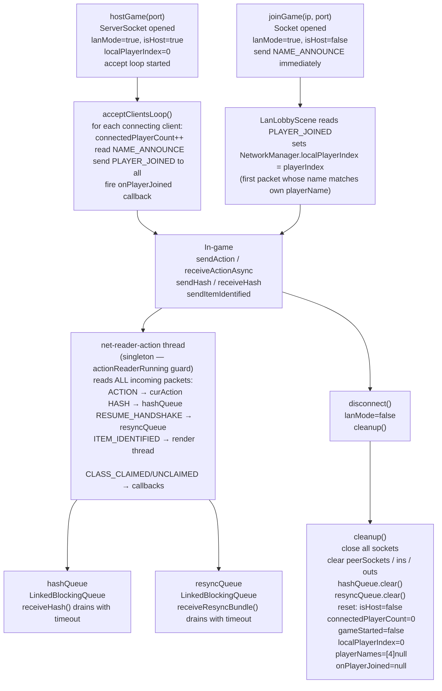

# NetworkManager

## Metadata

- System type: `service`

## System Intent

- What this is: `NetworkManager` is the static singleton that owns all TCP socket state for LAN multiplayer. It handles host/client connection setup, packet transmission (actions, hashes, hero-selection coordination), and session teardown. All public fields and methods are static; there is no instance.
- Key responsibilities:
  - Opening a `ServerSocket` (host) or `Socket` (client) and managing `DataInputStream`/`DataOutputStream` per peer
  - Broadcasting and receiving typed packets: `ACTION`, `HASH`, `HANDSHAKE`, `HERO_READY`, `CLASS_CLAIMED`, `CLASS_UNCLAIMED`, `PLAYER_JOINED`, `NAME_ANNOUNCE`, and resume-mode variants
  - Tracking `localPlayerIndex` (which hero slot this device owns: 0 = host, 1..N = client)
  - Enforcing the **single-reader invariant**: only one thread (`net-reader-action`) ever reads from the `DataInputStream` during gameplay; `HASH` and `RESUME_HANDSHAKE` payloads are routed through queues (`hashQueue`, `resyncQueue`) so no other thread touches the stream
  - Cleaning up all socket state and resetting all session fields via `cleanup()`

## Mermaid Diagram



## Flows

### Flow: `hostGame`
- Core files: `core/src/main/java/com/shatteredpixel/shatteredpixeldungeon/network/NetworkManager.java`

#### Types

```txt
// Static fields set by hostGame()
lanMode: boolean       -- true
isHost: boolean        -- true
localPlayerIndex: int  -- 0 (host always owns slot 0)
connectedPlayerCount: int -- starts at 1 (host counts as player 0)
playerNames[0]: String -- set to NetworkManager.playerName
```

#### Paths

| path | input | output | path-type | notes |
| --- | --- | --- | --- | --- |
| `hostGame.success` | `port` | ServerSocket opened; accept loop started; `lanMode=true` | happy path | |
| `hostGame.ioError` | `port` (unavailable) | `IOException` thrown; `lanMode=false` | error | |

---

### Flow: `joinGame`
- Core files: `NetworkManager.java`

#### Types

```txt
// Static fields set by joinGame()
lanMode: boolean       -- true
isHost: boolean        -- false
localPlayerIndex: int  -- NOT set here; set later by LanLobbyScene when PLAYER_JOINED received
```

#### Paths

| path | input | output | path-type | notes |
| --- | --- | --- | --- | --- |
| `joinGame.success` | `ip`, `port` | Socket opened; `NAME_ANNOUNCE` sent; `lanMode=true` | happy path | `localPlayerIndex` remains 0 until `LanLobbyScene.startClientListenerThread()` receives `PLAYER_JOINED` and sets it |
| `joinGame.ioError` | unreachable host | `IOException` thrown; `lanMode=false`; `cleanup()` called | error | |

---

### Flow: `cleanup`
- Core files: `NetworkManager.java`

#### Pseudocode

```
cleanup():
  close serverSocket (ignore IOException)
  for each s in peerSockets: close s (ignore IOException)
  close clientSocket (ignore IOException)
  peerSockets.clear()
  ins.clear()
  outs.clear()
  serverSocket = null
  clientSocket = null
  clientIn = null
  clientOut = null
  isHost = false
  connectedPlayerCount = 0
  gameStarted = false
  onPlayerJoined = null
  playerNames = new String[4]
  localPlayerIndex = 0        // CRITICAL — prevents stale index carrying into next session
  hashQueue.clear()           // drain pending hash packets so next session starts clean
  resyncQueue.clear()         // drain pending resync bundles so next session starts clean
  // actionReaderRunning resets to false via the thread's finally block when the thread exits
```

#### Paths

| path | input | output | path-type | notes |
| --- | --- | --- | --- | --- |
| `cleanup.normal` | called from `disconnect()` | all sockets closed; all session fields reset to defaults; `hashQueue` and `resyncQueue` cleared | happy path | Called automatically after any session end |
| `cleanup.staleIndex` | `localPlayerIndex` was 1 (client of prior LAN session) after cleanup | `localPlayerIndex` reset to 0 | guard | Without this reset, a subsequent solo game causes `GameScene.create()` to call `Dungeon.heroes.get(1)` on a 1-hero roster → `IndexOutOfBoundsException`. `GameScene.java:346` also clamps with `Math.min(localPlayerIndex, heroes.size()-1)` as a secondary guard. |
| `cleanup.queueDrain` | `hashQueue` or `resyncQueue` has stale entries from a prior session | both queues cleared; `receiveHash`/`receiveResyncBundle` in new session will not consume stale data | guard | Prevents phantom hash/resync responses leaking from one session into the next |

---

### Flow: `receiveActionAsync`
- Core files: `NetworkManager.java`

#### Types

```txt
actionReaderRunning: volatile boolean  -- singleton guard; true while net-reader-action thread is alive
hashQueue: LinkedBlockingQueue<HashPacket>  -- receives HASH payloads from the reader thread
resyncQueue: LinkedBlockingQueue<byte[]>    -- receives RESUME_HANDSHAKE payloads from the reader thread

HashPacket {
  turn: int
  hash: long
}
```

#### Paths

| path | input | output | path-type | notes |
| --- | --- | --- | --- | --- |
| `receiveActionAsync.guardReject` | called while `actionReaderRunning == true` | immediate no-op return | guard | Prevents multiple concurrent reader threads from racing on the same `DataInputStream`. Hero.act() calls this every turn when `curAction == null`; without the guard, each call would spawn a persistent reader thread. |
| `receiveActionAsync.started` | `actionReaderRunning == false` | `actionReaderRunning = true`; `net-reader-action` thread starts | happy path | Thread reads until `!lanMode` or disconnect |
| `receiveActionAsync.action` | `ACTION` packet on stream | `remoteHero.curAction` set; `Actor.class.notifyAll()` | happy path | |
| `receiveActionAsync.hash` | `HASH` packet on stream | payload (4 int + 8 long) read; `HashPacket` enqueued to `hashQueue` | happy path | Keeps stream synchronized; `receiveHash()` consumes from queue |
| `receiveActionAsync.resumeHandshake` | `RESUME_HANDSHAKE` packet on stream | length-prefixed bytes read; enqueued to `resyncQueue` | happy path | `receiveResyncBundle()` consumes from queue |
| `receiveActionAsync.disconnect` | `IOException` on read | `peerDisconnectSignal` dispatched; `Actor.class.notifyAll()`; thread exits; `actionReaderRunning = false` | error | |

#### Pseudocode

```
receiveActionAsync(remoteHero):
  synchronized(NetworkManager.class):
    if actionReaderRunning: return   // singleton guard
    actionReaderRunning = true
  start thread "net-reader-action":
    in = isHost ? ins.get(0) : clientIn
    loop while lanMode:
      type = in.readByte()
      if type == ACTION:
        heroId = in.readInt(); actionType = in.readByte(); targetPos = in.readInt()
        remoteHero.curAction = decodeAction(actionType, targetPos)
        notify Actor.class
      else if type == HASH:
        turn = in.readInt(); hash = in.readLong()
        hashQueue.offer(HashPacket(turn, hash))
      else if type == RESUME_HANDSHAKE:
        len = in.readInt(); bytes = new byte[len]; in.readFully(bytes)
        resyncQueue.offer(bytes)
      else if type == ITEM_IDENTIFIED: ...
      else if type == CLASS_CLAIMED / CLASS_UNCLAIMED: ...
      on IOException:
        peerDisconnectSignal.dispatch(remoteHero)
        notify Actor.class; break
    finally: actionReaderRunning = false
```

---

### Flow: `receiveHash`
- Core files: `NetworkManager.java`

#### Types

```txt
hashQueue: LinkedBlockingQueue<HashPacket>  -- populated by net-reader-action thread
SOCKET_TIMEOUT_MS: 30000ms
```

#### Paths

| path | input | output | path-type | notes |
| --- | --- | --- | --- | --- |
| `receiveHash.success` | `hashQueue` has entry | `HashPacket` returned | happy path | Non-blocking from the caller's perspective; the queue blocks internally |
| `receiveHash.timeout` | queue empty for 30 s | `SocketTimeoutException` thrown; `peerDisconnectSignal` dispatched | error | Treated as peer disconnect |
| `receiveHash.interrupted` | thread interrupted | `IOException("receiveHash interrupted")` thrown | error | |

---

### Flow: `receiveResyncBundle`
- Core files: `NetworkManager.java`

#### Types

```txt
resyncQueue: LinkedBlockingQueue<byte[]>  -- populated by net-reader-action thread
SOCKET_TIMEOUT_MS: 30000ms
```

#### Paths

| path | input | output | path-type | notes |
| --- | --- | --- | --- | --- |
| `receiveResyncBundle.success` | `resyncQueue` has entry | `byte[]` bundle returned | happy path | |
| `receiveResyncBundle.timeout` | queue empty for 30 s | `SocketTimeoutException` thrown | error | |
| `receiveResyncBundle.interrupted` | thread interrupted | `IOException` thrown | error | |

---

### Flow: `heroSelectionCoordination`
- Core files: `NetworkManager.java`, `HeroSelectScene.java`

#### Types

```txt
PacketType.HERO_READY    = 6  -- client → host: "I chose this class"
PacketType.HANDSHAKE     = 3  -- host → all clients: seed + ordered class array
PacketType.CLASS_CLAIMED = 11 -- any device → all peers: "I am hovering this class"
PacketType.CLASS_UNCLAIMED = 13 -- any device → all peers: "I abandoned this class"
```

#### Paths

| path | input | output | path-type | notes |
| --- | --- | --- | --- | --- |
| `heroSel.clientReady` | `sendHeroReady(heroClass)` called on client | `HERO_READY` packet sent to host with class ordinal | happy path | Host does NOT broadcast HERO_READY to clients — doing so would corrupt the `waitForHandshake` stream reader |
| `heroSel.hostCollect` | `waitForAllHeroReady(playerCount)` | Background threads (one per client) read `HERO_READY`; when all received `heroReadyReceived=true`; `heroReadyCount` incremented atomically | happy path | Host pre-counts itself: `heroReadyCount` starts at 1 |
| `heroSel.handshake` | `sendHandshake(seed, classes)` | `HANDSHAKE` packet broadcast to all clients with seed + class ordinal array | happy path | |
| `heroSel.clientWait` | `waitForHandshake()` | Background thread reads `HANDSHAKE`; stores `HandshakePayload`; sets `handshakeReceived=true` | happy path | Thread also handles interleaved `CLASS_CLAIMED`/`CLASS_UNCLAIMED` packets before HANDSHAKE arrives |
| `heroSel.classClaimed` | `sendClassClaimed(playerIndex, heroClass)` | `CLASS_CLAIMED` packet sent to all peers | happy path | Host relays to other clients via `waitForAllHeroReady` reader threads |

---

## Logs

| Source | Location |
|--------|----------|
| Host game | `GLog.p("Hosting game on port %d", port)` |
| Client connect | `GLog.p("Connected to host at %s:%d as \"%s\"", ...)` |
| Client joined | `GLog.p("Client \"%s\" connected, total players: %d", ...)` |
| HERO_READY sent | `GLog.p("HERO_READY sent to host: %s", ...)` |
| HANDSHAKE sent | `GLog.p("HANDSHAKE sent: %d players, seed %d", ...)` |
| Handshake received | `GLog.p("Handshake received — %d players, seed %d", ...)` |
| Disconnect | `GLog.w("Disconnected from network")` |
| Network errors | `GLog.n(...)` in all send/receive methods |

## Deployment

- Mechanism: `local only` (Android app, desktop via libGDX)
- Deploy command:
  ```bash
  ./gradlew desktop:run
  ```
- Notes: LAN mode is activated by `hostGame()` or `joinGame()`. Solo play is fully unaffected — all network paths are guarded by `if (!lanMode) return`. `cleanup()` is called by `disconnect()` and also on failed `joinGame()`. `localPlayerIndex` is always 0 for the host and 1..N for clients; it is reset to 0 by `cleanup()` on session end.
