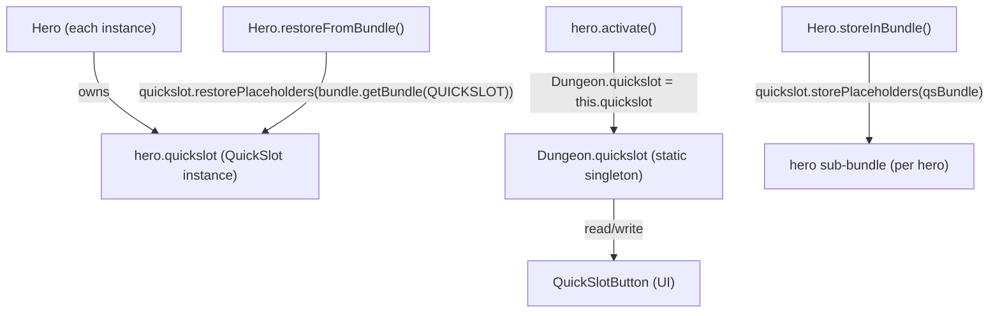

# QuickSlot System

## Metadata

- System type: `library`

## System Intent

- What this is: `QuickSlot` is a fixed-size (6-slot) container that maps inventory `Item` references to numbered quickslot positions in the game HUD. Each `Hero` instance owns its own `QuickSlot` field. `Dungeon.quickslot` is a static singleton that always points to the currently-active hero's `QuickSlot`, enabling all HUD code to reference one global variable regardless of which hero is active.

## Mermaid Diagram



## Flows

### Flow: `slot-assignment`
- Core files:
  - `core/src/main/java/com/shatteredpixel/shatteredpixeldungeon/QuickSlot.java`
  - `core/src/main/java/com/shatteredpixel/shatteredpixeldungeon/ui/QuickSlotButton.java`
  - `core/src/main/java/com/shatteredpixel/shatteredpixeldungeon/Dungeon.java`

#### Types

```txt
QuickSlot {
  slots: Item[6]   (null = empty, quantity==0 = placeholder)
}
```

#### Paths

| path | input | output | path-type | notes |
| --- | --- | --- | --- | --- |
| `slot-assignment.set` | Item, slot index | `Dungeon.quickslot.slots[i] = item` | happy path | Calls `clearItem(item)` first to prevent duplicates |
| `slot-assignment.clear` | slot index | `slots[i] = null` | happy path | |
| `slot-assignment.placeholder` | Item (qty>0 becomes qty=0) | `slots[i] = placeholder` | special | Used when item is consumed so slot shows greyed icon |
| `slot-assignment.replacePlaceholder` | Item | replaces placeholder with real item | happy path | Called on loot pickup |

#### Pseudocode

```
// Singleton swap on hero switch
hero.activate():
  Dungeon.hero      = this
  Dungeon.quickslot = this.quickslot    // UI now reads from this hero's slots
  QuickSlotButton.refresh()

// Slot assignment via UI
QuickSlotButton.setItem(slot, item):
  Dungeon.quickslot.setSlot(slot, item) // writes to ACTIVE hero's QuickSlot
  refresh()
```

### Flow: `save-load`
- Core files:
  - `core/src/main/java/com/shatteredpixel/shatteredpixeldungeon/Dungeon.java` (saveGame, loadGame)
  - `core/src/main/java/com/shatteredpixel/shatteredpixeldungeon/QuickSlot.java` (storePlaceholders, restorePlaceholders)
  - `core/src/main/java/com/shatteredpixel/shatteredpixeldungeon/actors/hero/Hero.java` (storeInBundle, restoreFromBundle)

#### Paths

| path | input | output | path-type | notes |
| --- | --- | --- | --- | --- |
| `save-load.save-hero` | `hero.storeInBundle()` | `hero.quickslot` written to `"quickslot"` sub-bundle inside the hero's bundle entry | happy path | Fixed in Issue #11; each hero's QuickSlot is now independently persisted |
| `save-load.load-hero` | `hero.restoreFromBundle()` | `hero.quickslot.restorePlaceholders(bundle.getBundle("quickslot"))` — guarded by `bundle.contains("quickslot")` | happy path | Backward-compat guard allows old saves (no sub-bundle) to load without error |
| `save-load.dungeon-level-compat` | `Dungeon.saveGame/loadGame` | `Dungeon.quickslot.storePlaceholders/restorePlaceholders` on top-level bundle | compat path | Retained for backward compatibility with pre-fix single-hero saves; per-hero sub-bundle is authoritative for new saves |

#### Pseudocode

```
// SAVE (Hero.storeInBundle)
Bundle qsBundle = new Bundle()
this.quickslot.storePlaceholders(qsBundle)   // serialize THIS hero's slots
bundle.put("quickslot", qsBundle)            // nest under hero's own bundle entry

// LOAD (Hero.restoreFromBundle)
if (bundle.contains("quickslot")) {
  quickslot.restorePlaceholders(bundle.getBundle("quickslot"))  // restore THIS hero's slots
}
// if sub-bundle absent (old save), quickslot stays as new QuickSlot() from constructor

// SINGLETON SWAP (hero.activate)
Dungeon.quickslot = this.quickslot   // point global singleton at this hero's restored QuickSlot
QuickSlotButton.refresh()
```

### Flow: `new-game-init`
- Core files:
  - `core/src/main/java/com/shatteredpixel/shatteredpixeldungeon/Dungeon.java` (spawnHero)
  - `core/src/main/java/com/shatteredpixel/shatteredpixeldungeon/actors/hero/HeroClass.java` (initHero)

#### Pseudocode

```
// spawnHero (Dungeon.java:309-319)
QuickSlot savedSlot = quickslot
quickslot = h.quickslot              // temporarily point singleton at new hero
heroClass.initHero(h)                // HeroClass.initHero sets default quickslot items via Dungeon.quickslot
quickslot = savedSlot                // restore singleton
heroes.add(h)
if (heroes.size() == 1) hero = h
```

## Known Issues

None. Issue #11 (quickslot reset on reload) was fixed 2026-05-28. See `docs/bugs/2026-05-28-quickslot-reset-on-reload.md`.

## Logs

| Source | Location |
|--------|----------|
| None | QuickSlot has no logging; UI state is inferred from `Dungeon.quickslot.getItem(slot)` |

## Deployment

- Mechanism: `local only`
- Deploy command:
  ```bash
  ./gradlew desktop:run
  ```
- Notes: Part of the core game module; no separate deployment step.
