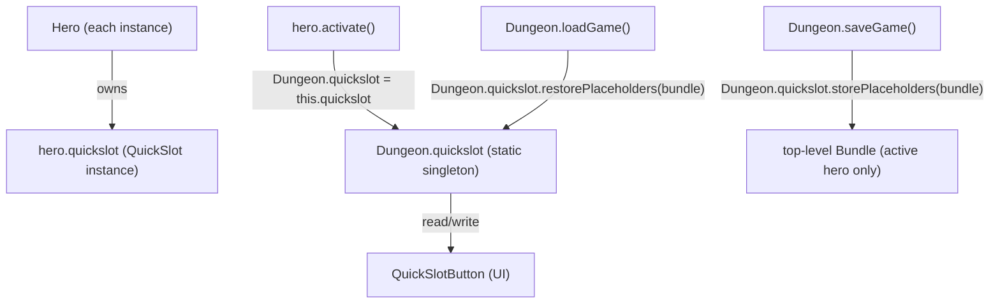

# QuickSlot System

## Metadata

- System type: `library`

## System Intent

- What this is: `QuickSlot` is a fixed-size (6-slot) container that maps inventory `Item` references to numbered quickslot positions in the game HUD. Each `Hero` instance owns its own `QuickSlot` field. `Dungeon.quickslot` is a static singleton that always points to the currently-active hero's `QuickSlot`, enabling all HUD code to reference one global variable regardless of which hero is active.

## Mermaid Diagram



## Flows

### Flow: `slot-assignment`
- Core files:
  - `core/src/main/java/com/shatteredpixel/shatteredpixeldungeon/QuickSlot.java`
  - `core/src/main/java/com/shatteredpixel/shatteredpixeldungeon/ui/QuickSlotButton.java`
  - `core/src/main/java/com/shatteredpixel/shatteredpixeldungeon/Dungeon.java`

#### Types

```txt
QuickSlot {
  slots: Item[6]   (null = empty, quantity==0 = placeholder)
}
```

#### Paths

| path | input | output | path-type | notes |
| --- | --- | --- | --- | --- |
| `slot-assignment.set` | Item, slot index | `Dungeon.quickslot.slots[i] = item` | happy path | Calls `clearItem(item)` first to prevent duplicates |
| `slot-assignment.clear` | slot index | `slots[i] = null` | happy path | |
| `slot-assignment.placeholder` | Item (qty>0 becomes qty=0) | `slots[i] = placeholder` | special | Used when item is consumed so slot shows greyed icon |
| `slot-assignment.replacePlaceholder` | Item | replaces placeholder with real item | happy path | Called on loot pickup |

#### Pseudocode

```
// Singleton swap on hero switch
hero.activate():
  Dungeon.hero     = this
  Dungeon.quickslot = this.quickslot    // UI now reads from this hero's slots
  QuickSlotButton.refresh()

// Slot assignment via UI
QuickSlotButton.setItem(slot, item):
  Dungeon.quickslot.setSlot(slot, item) // writes to ACTIVE hero's QuickSlot
  refresh()
```

### Flow: `save-load`
- Core files:
  - `core/src/main/java/com/shatteredpixel/shatteredpixeldungeon/Dungeon.java` (saveGame, loadGame)
  - `core/src/main/java/com/shatteredpixel/shatteredpixeldungeon/QuickSlot.java` (storePlaceholders, restorePlaceholders)
  - `core/src/main/java/com/shatteredpixel/shatteredpixeldungeon/actors/hero/Hero.java` (storeInBundle, restoreFromBundle)

#### Paths

| path | input | output | path-type | notes |
| --- | --- | --- | --- | --- |
| `save-load.save-active` | `Dungeon.quickslot` | placeholders + placements written to top-level Bundle | happy path | Only the active hero's QuickSlot is saved at Dungeon level |
| `save-load.save-hero` | `hero.storeInBundle()` | hero data written (no quickslot) | **bug path** | `Hero.storeInBundle()` does NOT serialize `this.quickslot` |
| `save-load.load-restore` | top-level Bundle | `Dungeon.quickslot.restorePlaceholders(bundle)` | partial | Only restores active hero's slots; other heroes get empty QuickSlot |
| `save-load.load-hero` | `hero.restoreFromBundle()` | hero data read (no quickslot) | **bug path** | `Hero.restoreFromBundle()` does NOT restore `this.quickslot` |

#### Pseudocode

```
// SAVE (Dungeon.saveGame)
bundle.put("hero", hero)        // triggers Hero.storeInBundle — NO quickslot data
bundle.put("heroes", heroes)    // triggers Hero.storeInBundle for each — NO quickslot data
Dungeon.quickslot.storePlaceholders(bundle)  // saves ONLY the active hero's QuickSlot

// LOAD (Dungeon.loadGame)
quickslot.reset()
quickslot.restorePlaceholders(bundle)  // restores into Dungeon.quickslot only
heroes = bundle.getCollection("heroes")  // each hero's quickslot = new QuickSlot() (empty)
hero = heroes.get(0)                     // hero[0]'s quickslot is then used as Dungeon.quickslot via activate()
```

### Flow: `new-game-init`
- Core files:
  - `core/src/main/java/com/shatteredpixel/shatteredpixeldungeon/Dungeon.java` (spawnHero)
  - `core/src/main/java/com/shatteredpixel/shatteredpixeldungeon/actors/hero/HeroClass.java` (initHero)

#### Pseudocode

```
// spawnHero (Dungeon.java:309-319)
QuickSlot savedSlot = quickslot
quickslot = h.quickslot              // temporarily point singleton at new hero
heroClass.initHero(h)                // HeroClass.initHero sets default quickslot items via Dungeon.quickslot
quickslot = savedSlot                // restore singleton
heroes.add(h)
if (heroes.size() == 1) hero = h
```

## Known Bug

**Issue #11**: `Hero.storeInBundle()` does not call `this.quickslot.storePlaceholders()`, and `Hero.restoreFromBundle()` does not call `this.quickslot.restorePlaceholders()`.

On save, `Dungeon.quickslot.storePlaceholders(bundle)` only persists the **active hero's** quickslot into the top-level bundle. On load, all heroes get a `new QuickSlot()` from the `Hero()` constructor; their quickslot data was never written, so it is lost.

**Fix**: Serialize each hero's quickslot in a named sub-bundle inside `Hero.storeInBundle()` and restore it in `Hero.restoreFromBundle()`. See `docs/bugs/2026-05-28-quickslot-reset-on-reload.md`.

## Logs

| Source | Location |
|--------|----------|
| None | QuickSlot has no logging; UI state is inferred from `Dungeon.quickslot.getItem(slot)` |

## Deployment

- Mechanism: `local only`
- Deploy command:
  ```bash
  ./gradlew desktop:run
  ```
- Notes: Part of the core game module; no separate deployment step.
