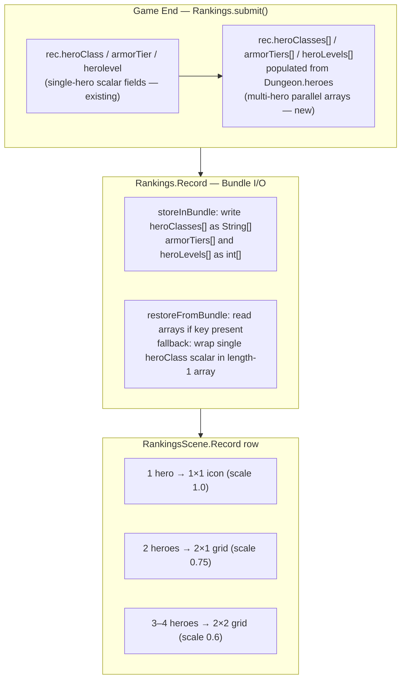

# Rankings

## Metadata

- System type: `flow`

## System Intent

- What this is: Persists and displays a ranked leaderboard of completed runs. `Rankings.Record` captures per-run metadata (score, hero class, depth, date) and, for multiplayer runs, parallel arrays of every hero's class/tier/level. `RankingsScene` renders each record as a row with a 1×1, 2×1, or 2×2 icon grid depending on player count. Single-player rows are visually unchanged.

## Mermaid Diagram



## Flows

### Global Types

```txt
Rankings.Record {
  // scalar fields (all runs, backward compat)
  heroClass:  HeroClass
  armorTier:  int
  herolevel:  int

  // parallel arrays (all runs, including single-player)
  heroClasses: HeroClass[]   -- length >= 1; mirrors Dungeon.heroes order
  armorTiers:  int[]         -- same length as heroClasses
  heroLevels:  int[]         -- same length as heroClasses
}

Rankings.TABLE_SIZE = 11   -- maximum stored records
```

---

### Flow: `rankingsRecordMultiHeroData`
- Core files:
  - `core/src/main/java/com/shatteredpixel/shatteredpixeldungeon/Rankings.java`

#### Types

```txt
Bundle keys (Rankings.Record):
  "heroClasses" — String[] of HeroClass.name() values
  "armorTiers"  — int[]
  "heroLevels"  — int[]

Old keys kept for backward compat:
  "class" — HeroClass enum (single scalar)
  "tier"  — int
  "level" — int
```

#### Paths

| path | input | output | path-type | notes |
| --- | --- | --- | --- | --- |
| `rankingsRecordMultiHeroData.submit` | Game ends; `Dungeon.heroes` non-empty | `heroClasses/armorTiers/heroLevels` populated in iteration order of `Dungeon.heroes` | happy path | Multiplayer: length equals `Dungeon.heroes.size()` (all heroes, alive or dead — dead heroes remain in the list with HP <= 0 so the full party is recorded) |
| `rankingsRecordMultiHeroData.submitFallback` | `Dungeon.heroes` null or empty | arrays initialized as length-1 wrappers around the existing scalar `heroClass/armorTier/herolevel` | happy path | Ensures arrays are always set before record is stored |
| `rankingsRecordMultiHeroData.store` | `storeInBundle` called | `heroClasses` written as `String[]` via `HeroClass.name()`; tiers and levels written as `int[]` | happy path | Old scalar keys also written — old clients can still read the record |
| `rankingsRecordMultiHeroData.restore` | `restoreFromBundle` called, bundle has `"heroClasses"` key | `heroClasses` parsed via `HeroClass.valueOf()`; `armorTiers/heroLevels` read as int arrays | happy path | |
| `rankingsRecordMultiHeroData.restoreCompat` | `restoreFromBundle` called, bundle missing `"heroClasses"` | arrays synthesized as length-1 wrappers around scalar `heroClass/armorTier/herolevel` | backward compat | Old records load without any data loss |

#### Pseudocode

```
// Rankings.submit() — after scalar assignment
if (Dungeon.heroes != null && !Dungeon.heroes.isEmpty()) {
    rec.heroClasses = new HeroClass[Dungeon.heroes.size()];
    rec.armorTiers  = new int[Dungeon.heroes.size()];
    rec.heroLevels  = new int[Dungeon.heroes.size()];
    for (int i = 0; i < Dungeon.heroes.size(); i++) {
        rec.heroClasses[i] = Dungeon.heroes.get(i).heroClass;
        rec.armorTiers[i]  = Dungeon.heroes.get(i).tier();
        rec.heroLevels[i]  = Dungeon.heroes.get(i).lvl;
    }
} else {
    rec.heroClasses = new HeroClass[]{ rec.heroClass };
    rec.armorTiers  = new int[]{ rec.armorTier };
    rec.heroLevels  = new int[]{ rec.herolevel };
}

// Rankings.Record.storeInBundle()
if (heroClasses != null && heroClasses.length > 0) {
    String[] classNames = new String[heroClasses.length];
    for (int i = 0; i < heroClasses.length; i++) classNames[i] = heroClasses[i].name();
    bundle.put("heroClasses", classNames);
    bundle.put("armorTiers",  armorTiers);
    bundle.put("heroLevels",  heroLevels);
}

// Rankings.Record.restoreFromBundle()
if (bundle.contains("heroClasses")) {
    String[] names = bundle.getStringArray("heroClasses");
    heroClasses = new HeroClass[names.length];
    for (int i = 0; i < names.length; i++) heroClasses[i] = HeroClass.valueOf(names[i]);
    armorTiers  = bundle.getIntArray("armorTiers");
    heroLevels  = bundle.getIntArray("heroLevels");
} else {
    heroClasses = new HeroClass[]{ heroClass };
    armorTiers  = new int[]{ armorTier };
    heroLevels  = new int[]{ herolevel };
}
```

---

### Flow: `rankingsRowIconGrid`
- Core files:
  - `core/src/main/java/com/shatteredpixel/shatteredpixeldungeon/scenes/RankingsScene.java`

#### Types

```txt
RankingsScene.Record (inner class, extends Button) holds:
  classIcons:  ArrayList<Image>      -- one entry per hero
  levelTexts:  ArrayList<BitmapText> -- one entry per hero, aligned over icon

Grid shape by hero count:
  n == 1 → icols=1, irows=1, iconScale=1.0f  (1×1)
  n == 2 → icols=2, irows=1, iconScale=0.75f (2×1)
  n == 3 → icols=2, irows=2, iconScale=0.6f  (2×2, bottom-right cell empty)
  n == 4 → icols=2, irows=2, iconScale=0.6f  (2×2)
```

#### Paths

| path | input | output | path-type | notes |
| --- | --- | --- | --- | --- |
| `rankingsRowIconGrid.singleHero` | `rec.heroClasses.length == 1` | single icon at right edge, scale 1.0; single level text centered on icon | happy path | Pixel-identical to pre-multiplayer layout |
| `rankingsRowIconGrid.twoHeroes` | `length == 2` | 2×1 grid of icons (scale 0.75) at right edge, each with level text | happy path | |
| `rankingsRowIconGrid.threeOrFour` | `length == 3 or 4` | 2×2 grid (scale 0.6) at right edge; for n=3, bottom-right slot is empty | happy path | |
| `rankingsRowIconGrid.rogueSpecial` | `heroClass == HeroClass.ROGUE` | icon brightness set to 2.0f | happy path | Cloak of shadows icon is dark by default; brightened to match other icons |
| `rankingsRowIconGrid.stepsDepthShift` | any n | `steps` icon X shifted left by `izoneW` to avoid overlap with icon grid | happy path | `desc` maxWidth capped at `steps.x - (x + 16 + GAP)` |

#### Pseudocode

```
// RankingsScene.Record constructor — build icon + level list
int n = rec.heroClasses != null ? rec.heroClasses.length : 1;
float iconScale = n == 1 ? 1f : (n == 2 ? 0.75f : 0.6f);
for (int i = 0; i < n; i++) {
    Image icon = new Image(Icons.get(rec.heroClasses[i]));
    if (rec.heroClasses[i] == HeroClass.ROGUE) icon.brightness(2f);
    add(icon);  classIcons.add(icon);

    BitmapText lvl = new BitmapText(PixelScene.pixelFont);
    if (rec.heroLevels != null && i < rec.heroLevels.length && rec.heroLevels[i] != 0)
        lvl.text(Integer.toString(rec.heroLevels[i]));
    lvl.measure();
    add(lvl);  levelTexts.add(lvl);
}

// RankingsScene.Record.layout() — position icon grid
int n = classIcons.size();
int icols = n == 1 ? 1 : 2;
int irows = (n + icols - 1) / icols;
float iconScale = n == 1 ? 1f : (n == 2 ? 0.75f : 0.6f);
float iw = 16 * iconScale;
float ih = 16 * iconScale;
float izoneW = icols * iw + (icols - 1);
float izoneX = x + width - 4 - izoneW;
float izoneY = shield.y + (16 - irows * ih - (irows - 1)) / 2f;

for (int i = 0; i < classIcons.size(); i++) {
    Image icon = classIcons.get(i);
    icon.scale.set(iconScale);
    icon.x = izoneX + (i % icols) * (iw + 1);
    icon.y = izoneY + (i / icols) * (ih + 1);
    align(icon);

    BitmapText lvl = levelTexts.get(i);
    lvl.x = icon.x + (iw - lvl.width()) / 2f;
    lvl.y = icon.y + (ih - lvl.height()) / 2f + 1;
    align(lvl);
}

// steps icon shifted left of icon zone
steps.x = izoneX - 18 + (16 - steps.width()) / 2f;
```

---

## Logs

| Source | Location |
|--------|----------|
| In-game log | `GLog` — no new log entries added by this system |

## Deployment

- Mechanism: `local only`
- Deploy command:
  ```bash
  ./gradlew desktop:debug
  ```
- Notes: Old ranking records missing the `"heroClasses"` bundle key load cleanly — `restoreFromBundle` wraps the existing scalar `heroClass/armorTier/herolevel` into length-1 arrays, so `classIcons` always has at least one entry and the row renders correctly. Single-player row layout is pixel-identical to the pre-multiplayer version. Dead heroes are never removed from `Dungeon.heroes` (they remain with HP <= 0); `Rankings.submit()` therefore always sees the full original party size, preventing a multiplayer run from being recorded as a solo run when a non-last hero dies first.
