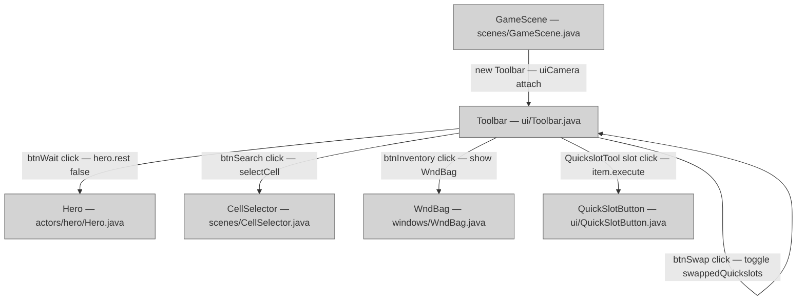

# Toolbar UI

## Metadata

- System type: `library`

## System Intent

- What this is: The `Toolbar` is a bottom-of-screen HUD component in `GameScene` that holds the primary player action buttons: Wait (`btnWait`), Search/Examine (`btnSearch`), Inventory (`btnInventory`), up to six quick-slot buttons (`btnQuick[]`), and an optional quick-slot swap button (`btnSwap`). It also manages a `PickedUpItem` animation layer. Every button is an instance of the private inner class `Tool` (which extends `Button`), and button presses directly invoke `Dungeon.hero` actions or open game-scene overlays.

## Mermaid Diagram



## Flows

### Flow: `waitButtonClick`
- Test files: N/A
- Core files: `core/src/main/java/com/shatteredpixel/shatteredpixeldungeon/ui/Toolbar.java`

#### Types

```txt
WaitButtonClickInput {
  (none — triggered by pointer event on btnWait Tool)
}

WaitButtonClickOutput {
  (side effect: Dungeon.hero.rest(false) is called, consuming one turn)
}
```

#### Paths

| path | input | output | path-type | notes |
| --- | --- | --- | --- | --- |
| `waitButtonClick.ready` | pointer down on btnWait | `Dungeon.hero.rest(false)` called | `happy path` | Guard: `Dungeon.hero != null && Dungeon.hero.ready && !GameScene.cancel()` |
| `waitButtonClick.longClick` | long-press on btnWait | `Dungeon.hero.rest(true)` called | `happy path` | Rest until disturbed |
| `waitButtonClick.notReady` | pointer down while hero not ready | no-op | `guarded` | Guard fails silently |

#### Pseudocode

```
btnWait.onClick():
  if hero != null && hero.ready && !GameScene.cancel():
    examining = false
    hero.rest(false)

btnWait.onLongClick():
  if hero != null && hero.ready && !GameScene.cancel():
    examining = false
    hero.rest(true)
```

### Flow: `toolbarLayout`
- Test files: N/A
- Core files: `core/src/main/java/com/shatteredpixel/shatteredpixeldungeon/ui/Toolbar.java`

#### Types

```txt
LayoutInput {
  SPDSettings.toolbarMode(): "SPLIT" | "GROUP" | "CENTER"
  SPDSettings.flipToolbar(): boolean
  SPDSettings.quickSwapper(): boolean
  PixelScene.uiCamera.width: int
}

LayoutOutput {
  (side effect: all Tool positions set via setPos/setRect calls)
}
```

#### Paths

| path | input | output | path-type | notes |
| --- | --- | --- | --- | --- |
| `toolbarLayout.split` | mode=SPLIT | wait+search at left, inventory+quickslots at right | `happy path` | default for portrait |
| `toolbarLayout.group` | mode=GROUP | all buttons grouped right-aligned | `happy path` | default for landscape |
| `toolbarLayout.center` | mode=CENTER | all buttons centered | `happy path` | GROUP variant with centered origin |
| `toolbarLayout.flipped` | flipToolbar=true | all button positions mirrored horizontally | `happy path` | applied after split/group/center |

### Flow: `toolbarEnableDisable`
- Test files: N/A
- Core files: `core/src/main/java/com/shatteredpixel/shatteredpixeldungeon/ui/Toolbar.java`

#### Types

```txt
EnableInput {
  Dungeon.hero.ready: boolean
  Dungeon.hero.isAlive(): boolean
}

EnableOutput {
  (side effect: all Tool.enable(value) called; inventory kept enabled even when dead)
}
```

#### Paths

| path | input | output | path-type | notes |
| --- | --- | --- | --- | --- |
| `toolbarEnableDisable.heroReady` | ready=true, alive=true | all tools enabled | `happy path` | checked in update() each frame |
| `toolbarEnableDisable.heroBusy` | ready=false | all tools disabled | `guarded` | |
| `toolbarEnableDisable.heroDead` | alive=false | inventory re-enabled; rest disabled | `special case` | btnInventory.enable(true) after the loop |

## Logs

| Source | Location |
|--------|----------|
| exception in mode parse | `Game.reportException(e)` — standard game crash logger |

## Deployment

- Mechanism: `local only`
- Deploy command:
  ```bash
  # No standalone deploy — compiled with the rest of the Android/desktop game
  ./gradlew android:assembleDebug
  ```
- Notes: Toolbar is created once per `GameScene` instantiation and lives until the scene is destroyed.
