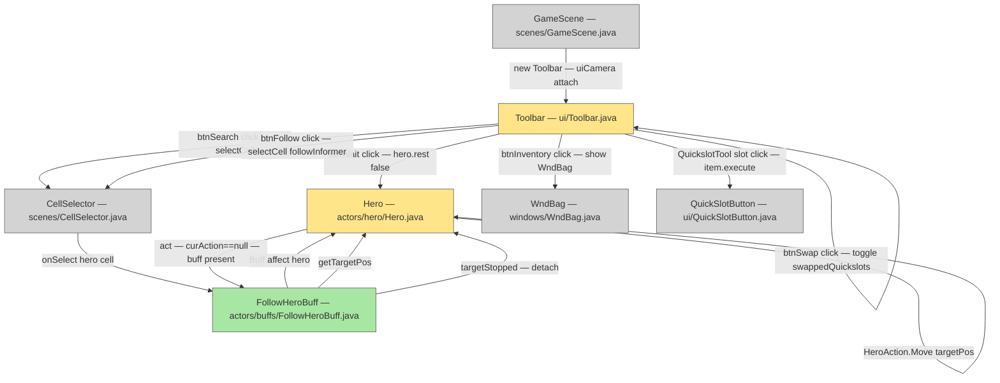

# Toolbar UI

## Metadata

- System type: `library`

## System Intent

- What this is: The `Toolbar` is a bottom-of-screen HUD component in `GameScene` that holds the primary player action buttons: Wait (`btnWait`), Follow (`btnFollow`), Search/Examine (`btnSearch`), Inventory (`btnInventory`), up to six quick-slot buttons (`btnQuick[]`), and an optional quick-slot swap button (`btnSwap`). It also manages a `PickedUpItem` animation layer. Every button is an instance of the private inner class `Tool` (which extends `Button`), and button presses directly invoke `Dungeon.hero` actions or open game-scene overlays. The `btnFollow` button is multiplayer-only: it enters cell-targeting mode so the active hero can select another party member to follow automatically each turn.

## Mermaid Diagram



## Flows

### Flow: `waitButtonClick`
- Test files: N/A
- Core files: `core/src/main/java/com/shatteredpixel/shatteredpixeldungeon/ui/Toolbar.java`

#### Types

```txt
WaitButtonClickInput {
  (none — triggered by pointer event on btnWait Tool)
}

WaitButtonClickOutput {
  (side effect: Dungeon.hero.rest(false) is called, consuming one turn)
}
```

#### Paths

| path | input | output | path-type | notes |
| --- | --- | --- | --- | --- |
| `waitButtonClick.ready` | pointer down on btnWait | `Dungeon.hero.rest(false)` called | `happy path` | Guard: `Dungeon.hero != null && Dungeon.hero.ready && !GameScene.cancel()` |
| `waitButtonClick.longClick` | long-press on btnWait | `Dungeon.hero.rest(true)` called | `happy path` | Rest until disturbed |
| `waitButtonClick.notReady` | pointer down while hero not ready | no-op | `guarded` | Guard fails silently |

#### Pseudocode

```
btnWait.onClick():
  if hero != null && hero.ready && !GameScene.cancel():
    examining = false
    hero.rest(false)

btnWait.onLongClick():
  if hero != null && hero.ready && !GameScene.cancel():
    examining = false
    hero.rest(true)
```

### Flow: `toolbarLayout`
- Test files: N/A
- Core files: `core/src/main/java/com/shatteredpixel/shatteredpixeldungeon/ui/Toolbar.java`

#### Types

```txt
LayoutInput {
  SPDSettings.toolbarMode(): "SPLIT" | "GROUP" | "CENTER"
  SPDSettings.flipToolbar(): boolean
  SPDSettings.quickSwapper(): boolean
  PixelScene.uiCamera.width: int
}

LayoutOutput {
  (side effect: all Tool positions set via setPos/setRect calls)
}
```

#### Paths

| path | input | output | path-type | notes |
| --- | --- | --- | --- | --- |
| `toolbarLayout.split` | mode=SPLIT | wait+search at left, inventory+quickslots at right | `happy path` | default for portrait |
| `toolbarLayout.group` | mode=GROUP | all buttons grouped right-aligned | `happy path` | default for landscape |
| `toolbarLayout.center` | mode=CENTER | all buttons centered | `happy path` | GROUP variant with centered origin |
| `toolbarLayout.flipped` | flipToolbar=true | all button positions mirrored horizontally | `happy path` | applied after split/group/center |

### Flow: `toolbarEnableDisable`
- Test files: N/A
- Core files: `core/src/main/java/com/shatteredpixel/shatteredpixeldungeon/ui/Toolbar.java`

#### Types

```txt
EnableInput {
  Dungeon.hero.ready: boolean
  Dungeon.hero.isAlive(): boolean
}

EnableOutput {
  (side effect: all Tool.enable(value) called; inventory kept enabled even when dead)
}
```

#### Paths

| path | input | output | path-type | notes |
| --- | --- | --- | --- | --- |
| `toolbarEnableDisable.heroReady` | ready=true, alive=true | all tools enabled | `happy path` | checked in update() each frame |
| `toolbarEnableDisable.heroBusy` | ready=false | all tools disabled | `guarded` | |
| `toolbarEnableDisable.heroDead` | alive=false | inventory re-enabled; rest disabled | `special case` | btnInventory.enable(true) after the loop |

### Flow: `followButtonClick`
- Test files: N/A
- Core files:
  - `core/src/main/java/com/shatteredpixel/shatteredpixeldungeon/ui/Toolbar.java`
  - `core/src/main/java/com/shatteredpixel/shatteredpixeldungeon/actors/buffs/FollowHeroBuff.java`

#### Types

```txt
FollowButtonClickInput {
  (none — triggered by pointer event on btnFollow Tool)
}

FollowButtonClickOutput {
  (side effect: GameScene.selectCell(followInformer) called to enter targeting mode)
  OR (side effect: existing FollowHeroBuff detached if already following)
}
```

#### Paths

| path | input | output | path-type | notes |
| --- | --- | --- | --- | --- |
| `followButtonClick.enterTargeting` | click btnFollow while hero ready and no buff | `GameScene.selectCell(followInformer)` called | `happy path` | Guard: `hero != null && hero.ready && !GameScene.cancel() && Dungeon.heroes.size() > 1` |
| `followButtonClick.cancelFollow` | click btnFollow while FollowHeroBuff active | `FollowHeroBuff.detach()` called | `happy path` | Allows toggling off follow mode |
| `followButtonClick.notReady` | click while hero not ready | no-op | `guarded` | Same guard as btnWait |
| `followButtonClick.soloMode` | click when only one hero exists | no-op | `guarded` | `Dungeon.heroes.size() < 2` guard |

#### Pseudocode

```
btnFollow.onClick():
  if hero == null || !hero.ready || GameScene.cancel(): return
  if hero.buff(FollowHeroBuff.class) != null:
    hero.buff(FollowHeroBuff.class).detach()
    return
  if Dungeon.heroes.size() < 2: return
  examining = false
  GameScene.selectCell(followInformer)

followInformer.onSelect(cell):
  if cell == null || instance == null: return
  ch = Actor.findChar(cell)
  if ch instanceof Hero && ch != Dungeon.hero:
    heroIdx = Dungeon.heroes.indexOf(ch)
    if heroIdx >= 0:
      buff = Buff.affect(Dungeon.hero, FollowHeroBuff.class)
      buff.setTargetHeroId(heroIdx)

followInformer.prompt():
  return "Select a hero to follow"
```

### Flow: `followHeroMovement`
- Test files: N/A
- Core files:
  - `core/src/main/java/com/shatteredpixel/shatteredpixeldungeon/actors/hero/Hero.java`
  - `core/src/main/java/com/shatteredpixel/shatteredpixeldungeon/actors/buffs/FollowHeroBuff.java`

#### Types

```txt
FollowHeroBuffState {
  targetHeroId: int   (index into Dungeon.heroes; -1 = unset)
  lastKnownTargetPos: int  (target's pos as of last buff.act(); -1 = uninitialized)
}
```

#### Paths

| path | input | output | path-type | notes |
| --- | --- | --- | --- | --- |
| `followHeroMovement.moveToward` | curAction==null, buff present, target moved, no visible enemies | `curAction = HeroAction.Move(targetPos)` set before action dispatch | `happy path` | `targetStopped()` returns false |
| `followHeroMovement.stopOnTargetIdle` | curAction==null, buff present, target pos unchanged since last turn | buff detached; `ready()` called normally | `stop condition` | `targetStopped()` returns true |
| `followHeroMovement.stopOnTargetDead` | target hero is dead or removed | buff detached; `ready()` called normally | `stop condition` | `getTargetHero()` returns null |
| `followHeroMovement.stopOnEnemyVisible` | new enemy enters hero's FOV | buff detached; `ready()` called — player regains control | `interrupt` | Checked via `visibleEnemies.size() > 0`; same mechanism as hold-wait rest interrupt |
| `followHeroMovement.firstTurn` | curAction==null, buff present, lastKnownTargetPos==-1 | always follows (no stop check on first turn) | `initialization` | Prevents premature detach on attach turn |

#### Pseudocode

```
// In Hero.act(), right before the curAction==null branch that calls ready():
FollowHeroBuff follow = buff(FollowHeroBuff.class);
if (curAction == null && follow != null) {
  if (follow.targetStopped() || visibleEnemies.size() > 0) {
    follow.detach();
    // fall through to normal ready() path (player regains control)
  } else {
    int targetPos = follow.getTargetPos();
    if (targetPos >= 0 && targetPos != pos) {
      curAction = new HeroAction.Move(targetPos);
      // fall through to curAction dispatch (actMove handles pathfinding)
    }
    // if targetPos == pos (already there), fall through to ready()
  }
}

// FollowHeroBuff.act() — called each tick to snapshot target position:
spend(TICK)
Hero h = getTargetHero()
if h != null && h.isAlive(): lastKnownTargetPos = h.pos
return true  // buff persists until detached

// FollowHeroBuff.targetStopped():
Hero h = getTargetHero()
if h == null || !h.isAlive(): return true
return lastKnownTargetPos != -1 && h.pos == lastKnownTargetPos
```

### Flow: `toolbarFollowLayout`
- Test files: N/A
- Core files: `core/src/main/java/com/shatteredpixel/shatteredpixeldungeon/ui/Toolbar.java`

#### Types

```txt
LayoutInput {
  SPDSettings.toolbarMode(): "SPLIT" | "GROUP" | "CENTER"
  SPDSettings.flipToolbar(): boolean
  SPDSettings.interfaceSize(): int
  PixelScene.uiCamera.width: int
}

LayoutOutput {
  (side effect: btnFollow positioned adjacent to btnWait in all layout modes)
}
```

#### Paths

| path | input | output | path-type | notes |
| --- | --- | --- | --- | --- |
| `toolbarFollowLayout.split` | mode=SPLIT | btnWait at left, btnFollow right of btnWait, btnSearch right of btnFollow | `happy path` | `btnSearch.setPos(btnFollow.right(), y)` |
| `toolbarFollowLayout.group` | mode=GROUP | btnWait rightmost, btnFollow left of btnWait, btnSearch left of btnFollow | `happy path` | `btnFollow.setPos(btnWait.left() - btnFollow.width(), y)` |
| `toolbarFollowLayout.center` | mode=CENTER | same chain as GROUP but centered | `happy path` | CENTER pre-adjusts `right` then falls through to GROUP |
| `toolbarFollowLayout.interfaceSizeLarge` | `interfaceSize > 0` | `btnInventory → btnWait → btnFollow → btnSearch` right-to-left chain | `happy path` | Applied in the early-return branch before mode switch |
| `toolbarFollowLayout.flipToolbar` | flipToolbar=true | all positions mirrored; btnFollow NOT individually re-mirrored | `happy path` | Only btnWait, btnSearch, btnInventory and quickslots are explicitly flipped; btnFollow is repositioned relative to its neighbours in the pre-flip step and is carried by the flip geometry |
| `toolbarFollowLayout.alpha` | `alpha(value)` called on Toolbar | `btnFollow.alpha(value)` propagated | `happy path` | Explicitly listed in `Toolbar.alpha()` |
| `toolbarFollowLayout.enableDisable` | hero ready/busy | btnFollow enabled/disabled alongside all other Tool members | `happy path` | Tool subclass; existing `update()` loop covers it automatically |

## Logs

| Source | Location |
|--------|----------|
| exception in mode parse | `Game.reportException(e)` — standard game crash logger |

## Deployment

- Mechanism: `local only`
- Deploy command:
  ```bash
  # No standalone deploy — compiled with the rest of the Android/desktop game
  ./gradlew android:assembleDebug
  ```
- Notes: Toolbar is created once per `GameScene` instantiation and lives until the scene is destroyed.
