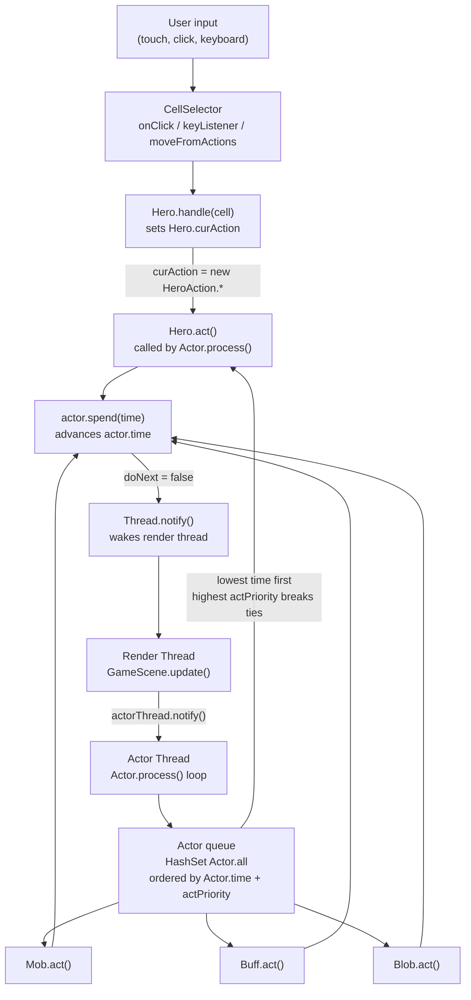

# Turn-Based System

## Metadata

- System type: `library`

## System Intent

- What this is: The turn-based simulation engine that drives all game logic in Shattered Pixel Dungeon. It schedules and executes every character, buff, and environmental effect in a priority-ordered time queue. User input is translated into a `HeroAction` intent stored on the Hero, and the actor loop picks it up on the Hero's next scheduled turn. This document also details how the system would need to change to support multiple human players acting in lockstep before any actor advances.

## Mermaid Diagram



## Flows

### Flow: `userInputToAction`
- Core files:
  - `core/src/main/java/com/shatteredpixel/shatteredpixeldungeon/scenes/CellSelector.java`
  - `core/src/main/java/com/shatteredpixel/shatteredpixeldungeon/actors/hero/Hero.java`
  - `core/src/main/java/com/shatteredpixel/shatteredpixeldungeon/actors/hero/HeroAction.java`

#### Types

```txt
HeroAction (base class)
  .dst: int (cell index, most subclasses)

HeroAction.Move    { dst }
HeroAction.Attack  { target: Char }
HeroAction.PickUp  { dst }
HeroAction.OpenChest { dst }
HeroAction.Buy     { dst }
HeroAction.Interact { ch: Char }
HeroAction.Unlock  { dst }
HeroAction.LvlTransition { dst }
HeroAction.Mine    { dst }
HeroAction.Alchemy { dst }
```

#### Paths

| path | input | output | path-type | notes |
| --- | --- | --- | --- | --- |
| `touch / click on cell` | screen coordinates | `Hero.curAction` set | happy path | CellSelector.onClick -> select(cell) -> defaultCellListener.onSelect -> Hero.handle(cell) |
| `keyboard / d-pad held` | GameAction direction | `Hero.curAction` set | happy path | CellSelector.keyListener / moveFromActions -> Hero.handle(cell) |
| `controller left stick` | analog stick position | `Hero.curAction` set | happy path | CellSelector.update -> moveFromActions -> Hero.handle(cell) |
| `hero not ready` | any input | input ignored | blocked | CellSelector.select() checks `Dungeon.hero.ready` before calling listener |
| `cell == -1 or cancelled` | null/cancel event | no action set | cancel | Hero.handle(-1) returns false; GameScene.cancel() nulls curAction |

#### Pseudocode

```
// CellSelector.onClick (render thread)
p = cameraToWorld(event.current)
for each visible sprite (hero, mobs, heaps):
    if sprite.overlapsPoint(p): select(sprite.pos, button); return
select(tilemap.screenToTile(event), button)

// CellSelector.select
if enabled AND hero.ready AND NOT interfaceBlockingHero:
    listener.onSelect(cell)      // defaultCellListener calls Hero.handle(cell)
    GameScene.ready()
else:
    GameScene.cancel()

// defaultCellListener.onSelect (GameScene, render thread)
if Dungeon.hero.handle(cell):
    Dungeon.hero.next()          // wakes the actor thread

// Hero.handle(cell)  -- sets curAction based on what is at cell
if alchemy pot at cell: curAction = new HeroAction.Alchemy(cell)
else if mob in FOV:     curAction = new HeroAction.Attack(mob) or Interact
else if MiningLevel and hero has Pickaxe and cell is WALL/WALL_DECO/MINE_CRYSTAL/MINE_BOULDER:
                        curAction = new HeroAction.Mine(cell)
else if heap:           curAction = new HeroAction.PickUp / Buy / OpenChest
else if locked door:    curAction = new HeroAction.Unlock(cell)
else if transition:     curAction = new HeroAction.LvlTransition(cell)
else:                   curAction = new HeroAction.Move(cell)
return true
```

---

### Flow: `actorProcessingLoop`
- Core files:
  - `core/src/main/java/com/shatteredpixel/shatteredpixeldungeon/actors/Actor.java`
  - `core/src/main/java/com/shatteredpixel/shatteredpixeldungeon/scenes/GameScene.java`

#### Types

```txt
Actor (abstract)
  .time: float       -- the simulation-time at which this actor next acts
  .actPriority: int  -- tie-breaker when .time values are equal (higher = earlier)
  act(): boolean     -- returns true if actor wants to act again immediately (doNext)

Actor.all: HashSet<Actor>  -- global set of all registered actors
Actor.now() : float        -- public accessor for the private static float `now`; returns current simulation time
                           -- `private static float now` (Actor.java:154) — not directly accessible
Actor.current              -- private static volatile Actor (Actor.java:149); no public getter exists
Actor.keepActorThreadAlive: boolean
```

#### Paths

| path | input | output | path-type | notes |
| --- | --- | --- | --- | --- |
| `normal actor turn` | actor with lowest .time | actor.act() executes, actor.spend(t) called | happy path | doNext=true keeps loop running without sleeping |
| `hero needs input` | Hero with curAction==null | loop pauses, render thread notified | wait path | Hero.act() calls ready() which sets hero.ready=true; act() returns false (doNext=false) |
| `hero has curAction` | Hero with curAction set | Hero executes action, spend(t), next() | happy path | doNext=true or false depending on action result |
| `sprite still moving` | Char whose sprite.isMoving==true | actor thread waits on sprite monitor | animation wait | avoids acting while walking animation plays |
| `hero dies` | Dungeon.hero.isAlive()==false | loop stops immediately | termination | `doNext = false; current = null` |
| `thread interrupted` | Thread.interrupted()==true | current=null, loop sleeps | graceful stop | used by GameScene.destroy() to shut down |

#### Pseudocode

```
// Actor.process()  (runs on dedicated actor thread)
do {
    current = actorWithLowestTime()       // breaks ties by actPriority (higher first)
    if current != null:
        now = current.time
        if current is Char and sprite.isMoving:
            synchronized(sprite) { sprite.wait() }   // yield until move anim done
        doNext = current.act()
        if doNext and hero is dead: doNext = false
    else:
        doNext = false

    if not doNext:
        synchronized(thisThread):
            thisThread.notify()    // signal render thread that processing paused
            thisThread.wait()      // sleep until render thread wakes us
} while keepActorThreadAlive

// GameScene.update()  (render thread, called each frame)
if NOT Actor.processing() AND hero.isAlive():
    if actorThread dead:
        create and start actorThread (calls Actor.process())
    else if notifyDelay <= 0:
        notifyDelay += 1/60f
        synchronized(actorThread) { actorThread.notify() }  // wake actor thread
```

---

### Flow: `heroTurn`
- Core files:
  - `core/src/main/java/com/shatteredpixel/shatteredpixeldungeon/actors/hero/Hero.java`

#### Types

```txt
Hero.ready: boolean         -- true when Hero is waiting for player input
Hero.curAction: HeroAction  -- the action queued by the UI; null = waiting
Hero.lastAction: HeroAction -- saved for resume after interrupt
Hero.resting: boolean       -- true when auto-resting (no enemy visible)
```

#### Paths

| path | input | output | path-type | notes |
| --- | --- | --- | --- | --- |
| `no curAction, not resting` | hero.curAction==null | hero.ready=true, GameScene.ready(), act returns false | wait-for-input | actor thread goes to sleep; UI re-enables cellSelector |
| `resting` | hero.resting==true | spend(TIME_TO_REST), next() | auto-rest | continues until enemy spotted or player acts |
| `curAction set` | hero.curAction!=null | action method called (actMove/actAttack/etc) | execute | hero.ready=false during execution |
| `paralysed` | hero.paralysed > 0 | curAction=null, spend(TICK), return false | skip turn | hero cannot act |
| `interrupt` | hero.interrupt() called | curAction=null, lastAction saved if mid-move | mid-action cancel | triggered by taking damage or enemy sight |
| `resume` | hero.resume() called | curAction=lastAction, next() | continue movement | player taps resume indicator |

#### Pseudocode

```
// Hero.act()
fieldOfView = Dungeon.level.heroFOV
if paralysed > 0:
    curAction = null; spend(TICK); next(); return false

if curAction == null:
    if resting: spend(TIME_TO_REST); next(); return false (doNext=false)
    else: ready()  // sets hero.ready=true, notifies GameScene
    return false

// curAction present:
ready = false
switch curAction type:
    Move       -> actMove(curAction)
    Attack     -> actAttack(curAction)
    PickUp     -> actPickUp(curAction)
    OpenChest  -> actOpenChest(curAction)
    Buy        -> actBuy(curAction)
    Interact   -> actInteract(curAction)
    Unlock     -> actUnlock(curAction)
    LvlTransition -> actTransition(curAction)
    Mine       -> actMine(curAction)
    Alchemy    -> actAlchemy(curAction)
// each actXxx calls spend(time) and next() internally when action is taken
```

---

### Flow: `actorRegistration`
- Core files:
  - `core/src/main/java/com/shatteredpixel/shatteredpixeldungeon/actors/Actor.java`
  - `core/src/main/java/com/shatteredpixel/shatteredpixeldungeon/Dungeon.java`

#### Paths

| path | input | output | path-type | notes |
| --- | --- | --- | --- | --- |
| `Actor.init()` | Dungeon.hero, level.mobs, level.blobs | all registered in Actor.all | level start | called when entering a floor |
| `Actor.add(actor)` | any Actor subclass | inserted into Actor.all with current `now` time | dynamic add | also registers Buffs attached to a Char |
| `Actor.remove(actor)` | Actor instance | removed from Actor.all and Actor.chars | dynamic remove | called on death, de-buff, etc. |

---

## Classes Involved in the Game Loop

| Class | Package | Role |
|---|---|---|
| `Actor` | `actors` | Abstract base for everything in the simulation. Owns the global `HashSet<Actor> all`, the `now` clock, and the `process()` loop. |
| `Char` | `actors` | Abstract character (HP, position, buffs). Subclasses are Hero and Mob. |
| `Hero` | `actors/hero` | The single player-controlled actor. Holds `curAction`, `ready`, `resting`. Its `act()` is the only actor that can pause the loop to wait for input. |
| `HeroAction` | `actors/hero` | Plain data objects encoding player intent (Move, Attack, PickUp, etc.). Set by `Hero.handle(cell)`, consumed by `Hero.act()`. |
| `Mob` | `actors/mobs` | AI-controlled characters. `act()` is driven entirely by internal state machines (SLEEPING, WANDERING, HUNTING, INVESTIGATING, FLEEING, PASSIVE). |
| `Buff` | `actors/buffs` | Status effects that act each turn (actPriority = BUFF_PRIO = -30). |
| `Blob` | `actors/blobs` | Area-of-effect environmental actors (gas, fire, etc.) (actPriority = BLOB_PRIO = -10). |
| `GameScene` | `scenes` | Render thread owner. Creates and wakes the actor thread each frame when `!Actor.processing()`. Owns the `CellSelector`. |
| `CellSelector` | `scenes` | Handles all raw pointer and keyboard input. Translates physical input events into cell selections and calls `Hero.handle(cell)` followed by `Hero.next()`. |
| `Dungeon` | (root package) | Global state: `Dungeon.hero` (single Hero reference), `Dungeon.level` (current Level). |
| `Level` | `levels` | Holds `mobs`, `blobs`, `heaps`, map data. |

### Actor Priority Values (tie-breaking when time is equal)

| Constant | Value | Who uses it |
|---|---|---|
| `VFX_PRIO` | 100 | Visual effects actors |
| `HERO_PRIO` | 0 | Hero |
| `BLOB_PRIO` | -10 | Blob subclasses |
| `MOB_PRIO` | -20 | Mob subclasses |
| `BUFF_PRIO` | -30 | Buff subclasses |
| `DEFAULT` | -100 | Fallback for unspecified actors |

Higher value = acts earlier when time values are equal.

---

## Multiplayer Extension: All Players Submit Before Any Actors Advance

The current architecture supports exactly one Hero (referenced via `Dungeon.hero`). To add N players who must all commit their move before the round resolves, the following structural changes are needed.

### What must change

1. **Multiple Hero references** — `Dungeon.hero` would become `Dungeon.heroes[]` (or a list). Each player controls one Hero instance.

2. **Hero.act() barrier** — Currently, when Hero has no `curAction`, it immediately calls `ready()` and returns `false`, pausing the actor thread. With N players, the Hero must instead wait until **all** heroes have submitted a `curAction`. A shared counter (e.g. `int readyPlayers`, `int totalPlayers`) can implement this. The last hero to submit unblocks the loop.

3. **Turn ordering by player number** — To guarantee player 1 always resolves before player 2 etc., assign each Hero a distinct `actPriority` offset derived from player number. Since all heroes start a turn at the same simulation time, the priority tie-break in `Actor.process()` already handles ordering: player 1 gets `HERO_PRIO + (N - 1)`, player 2 gets `HERO_PRIO + (N - 2)`, down to player N getting `HERO_PRIO + 0`. The highest priority value acts first.

4. **Input routing** — Each player's input must target only their own Hero. The `CellSelector` and `defaultCellListener` currently hardcode `Dungeon.hero`. These would need to be parameterized by player index, or separate UI threads per player would each write to their own Hero's `curAction`.

5. **UI gating** — `cellSelector.enable(Dungeon.hero.ready)` gates input on a single hero. With N players, each player's input channel is gated independently on their own Hero's `ready` flag.

6. **`Dungeon.observe()` and fog-of-war** — Currently bound to the single hero's FOV (`Dungeon.level.heroFOV`). With multiple players, either maintain per-player FOV arrays or union them.

### Minimal pseudocode sketch

```java
// In Hero.act() — replace the single "ready()" call:
if (curAction == null) {
    if (resting) { spend(TIME_TO_REST); next(); return false; }
    // Mark this hero as ready
    MultiplayerManager.markReady(this.playerIndex);
    if (!MultiplayerManager.allPlayersReady()) {
        // block: do not advance; actor thread stays asleep for this hero
        // give hero a future time so other actors can still run
        postpone(Float.MAX_VALUE / 2f);  // effectively remove from queue temporarily
        return false;
    }
    // All heroes ready — proceed
    MultiplayerManager.resetReady();
}

// In Actor.process() — actPriority tie-break is already present:
// Player 1 Hero: actPriority = HERO_PRIO + (N-1)   acts first
// Player 2 Hero: actPriority = HERO_PRIO + (N-2)
// ...
// Player N Hero: actPriority = HERO_PRIO + 0        acts last
```

Note: the `postpone` approach above is a simplification. A cleaner approach uses an explicit `waiting` flag and prevents the actor thread from scheduling that Hero at all until all inputs are collected, similar to how sprite animation blocking currently works via `synchronized(sprite) { sprite.wait() }`.

---

## Logs

| Source | Location |
|--------|----------|
| `GLog` (in-game text log) | Written to game log UI via `GameLog`; no file output by default |
| Crash/exception reporting | `ShatteredPixelDungeon.reportException()` — platform-specific |
| Actor thread errors | `RuntimeException` thrown in `GameScene.destroy()` if actor thread does not stop within 4500 ms |

## Deployment

- Mechanism: `local only` — built and run via Gradle on Android, Desktop (libGDX), or iOS.
- Deploy command:
  ```bash
  # Desktop
  ./gradlew desktop:run

  # Android
  ./gradlew android:installDebug
  ```
- Notes: No server-side component exists. All game logic runs on the client. The "multiplayer" in the repository name refers to the project's aspiration, not to any currently implemented networking layer. As of the investigated codebase (v3.3.8), multiplayer infrastructure has not been added.
