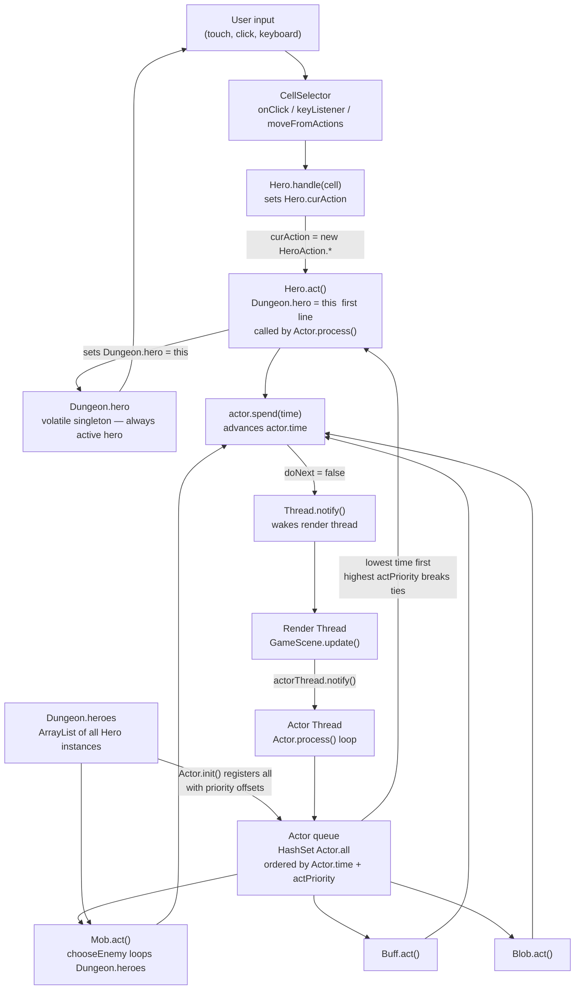

# Turn-Based System

## Metadata

- System type: `library`

## System Intent

- What this is: The turn-based simulation engine that drives all game logic in Shattered Pixel Dungeon. It schedules and executes every character, buff, and environmental effect in a priority-ordered time queue. User input is translated into a `HeroAction` intent stored on the Hero, and the actor loop picks it up on the Hero's next scheduled turn. The engine supports multiple Hero instances via a singleton-swap pattern: `Dungeon.heroes` holds all active heroes, and `Hero.act()` sets `Dungeon.hero = this` as its first action so all existing UI, camera, and input code continues to reference the correct hero without modification.

## Mermaid Diagram



## Flows

### Flow: `userInputToAction`
- Core files:
  - `core/src/main/java/com/shatteredpixel/shatteredpixeldungeon/scenes/CellSelector.java`
  - `core/src/main/java/com/shatteredpixel/shatteredpixeldungeon/actors/hero/Hero.java`
  - `core/src/main/java/com/shatteredpixel/shatteredpixeldungeon/actors/hero/HeroAction.java`

#### Types

```txt
HeroAction (base class)
  .dst: int (cell index, most subclasses)

HeroAction.Move    { dst }
HeroAction.Attack  { target: Char }
HeroAction.PickUp  { dst }
HeroAction.OpenChest { dst }
HeroAction.Buy     { dst }
HeroAction.Interact { ch: Char }
HeroAction.Unlock  { dst }
HeroAction.LvlTransition { dst }
HeroAction.Mine    { dst }
HeroAction.Alchemy { dst }
```

#### Paths

| path | input | output | path-type | notes |
| --- | --- | --- | --- | --- |
| `touch / click on cell` | screen coordinates | `Hero.curAction` set | happy path | CellSelector.onClick -> select(cell) -> defaultCellListener.onSelect -> Hero.handle(cell) |
| `keyboard / d-pad held` | GameAction direction | `Hero.curAction` set | happy path | CellSelector.keyListener / moveFromActions -> Hero.handle(cell) |
| `controller left stick` | analog stick position | `Hero.curAction` set | happy path | CellSelector.update -> moveFromActions -> Hero.handle(cell) |
| `hero not ready` | any input | input ignored | blocked | CellSelector.select() checks `Dungeon.hero.ready` before calling listener |
| `cell == -1 or cancelled` | null/cancel event | no action set | cancel | Hero.handle(-1) returns false; GameScene.cancel() nulls curAction |

#### Pseudocode

```
// CellSelector.onClick (render thread)
p = cameraToWorld(event.current)
for each visible sprite (hero, mobs, heaps):
    if sprite.overlapsPoint(p): select(sprite.pos, button); return
select(tilemap.screenToTile(event), button)

// CellSelector.select
if enabled AND hero.ready AND NOT interfaceBlockingHero:
    listener.onSelect(cell)      // defaultCellListener calls Hero.handle(cell)
    GameScene.ready()
else:
    GameScene.cancel()

// defaultCellListener.onSelect (GameScene, render thread)
if Dungeon.hero.handle(cell):
    Dungeon.hero.next()          // wakes the actor thread

// Hero.handle(cell)  -- sets curAction based on what is at cell
if alchemy pot at cell: curAction = new HeroAction.Alchemy(cell)
else if mob in FOV:     curAction = new HeroAction.Attack(mob) or Interact
else if MiningLevel and hero has Pickaxe and cell is WALL/WALL_DECO/MINE_CRYSTAL/MINE_BOULDER:
                        curAction = new HeroAction.Mine(cell)
else if heap:           curAction = new HeroAction.PickUp / Buy / OpenChest
else if locked door:    curAction = new HeroAction.Unlock(cell)
else if transition:     curAction = new HeroAction.LvlTransition(cell)
else:                   curAction = new HeroAction.Move(cell)
return true
```

---

### Flow: `actorProcessingLoop`
- Core files:
  - `core/src/main/java/com/shatteredpixel/shatteredpixeldungeon/actors/Actor.java`
  - `core/src/main/java/com/shatteredpixel/shatteredpixeldungeon/scenes/GameScene.java`

#### Types

```txt
Actor (abstract)
  .time: float       -- the simulation-time at which this actor next acts
  .actPriority: int  -- tie-breaker when .time values are equal (higher = earlier)
  act(): boolean     -- returns true if actor wants to act again immediately (doNext)

Actor.all: HashSet<Actor>  -- global set of all registered actors
Actor.now() : float        -- public accessor for the private static float `now`; returns current simulation time
                           -- `private static float now` (Actor.java:154) — not directly accessible
Actor.current              -- private static volatile Actor (Actor.java:149); no public getter exists
Actor.keepActorThreadAlive: boolean
```

#### Paths

| path | input | output | path-type | notes |
| --- | --- | --- | --- | --- |
| `normal actor turn` | actor with lowest .time | actor.act() executes, actor.spend(t) called | happy path | doNext=true keeps loop running without sleeping |
| `hero needs input` | Hero with curAction==null | loop pauses, render thread notified | wait path | Hero.act() calls ready() which sets hero.ready=true; act() returns false (doNext=false) |
| `hero has curAction` | Hero with curAction set | Hero executes action, spend(t), next() | happy path | doNext=true or false depending on action result |
| `sprite still moving` | Char whose sprite.isMoving==true | actor thread waits on sprite monitor | animation wait | avoids acting while walking animation plays |
| `hero dies` | Dungeon.hero.isAlive()==false | loop stops immediately | termination | `doNext = false; current = null` |
| `thread interrupted` | Thread.interrupted()==true | current=null, loop sleeps | graceful stop | used by GameScene.destroy() to shut down |

#### Pseudocode

```
// Actor.process()  (runs on dedicated actor thread)
do {
    current = actorWithLowestTime()       // breaks ties by actPriority (higher first)
    if current != null:
        now = current.time
        if current is Char and sprite.isMoving:
            synchronized(sprite) { sprite.wait() }   // yield until move anim done
        doNext = current.act()
        if doNext and hero is dead: doNext = false
    else:
        doNext = false

    if not doNext:
        synchronized(thisThread):
            thisThread.notify()    // signal render thread that processing paused
            thisThread.wait()      // sleep until render thread wakes us
} while keepActorThreadAlive

// GameScene.update()  (render thread, called each frame)
if NOT Actor.processing() AND hero.isAlive():
    if actorThread dead:
        create and start actorThread (calls Actor.process())
    else if notifyDelay <= 0:
        notifyDelay += 1/60f
        synchronized(actorThread) { actorThread.notify() }  // wake actor thread
```

---

### Flow: `heroTurn`
- Core files:
  - `core/src/main/java/com/shatteredpixel/shatteredpixeldungeon/actors/hero/Hero.java`

#### Types

```txt
Hero.ready: boolean         -- true when Hero is waiting for player input
Hero.curAction: HeroAction  -- the action queued by the UI; null = waiting
Hero.lastAction: HeroAction -- saved for resume after interrupt
Hero.resting: boolean       -- true when auto-resting (no enemy visible)
```

#### Paths

| path | input | output | path-type | notes |
| --- | --- | --- | --- | --- |
| `no curAction, not resting` | hero.curAction==null | hero.ready=true, GameScene.ready(), act returns false | wait-for-input | actor thread goes to sleep; UI re-enables cellSelector |
| `resting` | hero.resting==true | spend(TIME_TO_REST), next() | auto-rest | continues until enemy spotted or player acts |
| `curAction set` | hero.curAction!=null | action method called (actMove/actAttack/etc) | execute | hero.ready=false during execution |
| `paralysed` | hero.paralysed > 0 | curAction=null, spend(TICK), return false | skip turn | hero cannot act |
| `interrupt` | hero.interrupt() called | curAction=null, lastAction saved if mid-move | mid-action cancel | triggered by taking damage or enemy sight |
| `resume` | hero.resume() called | curAction=lastAction, next() | continue movement | player taps resume indicator |

#### Pseudocode

```
// Hero.act()
Dungeon.hero = this;  // swap singleton to this hero before any logic (NEW)
fieldOfView = Dungeon.level.heroFOV
if paralysed > 0:
    curAction = null; spend(TICK); next(); return false

if curAction == null:
    if resting: spend(TIME_TO_REST); next(); return false (doNext=false)
    else: ready()  // sets hero.ready=true, notifies GameScene
    return false

// curAction present:
ready = false
switch curAction type:
    Move       -> actMove(curAction)
    Attack     -> actAttack(curAction)
    PickUp     -> actPickUp(curAction)
    OpenChest  -> actOpenChest(curAction)
    Buy        -> actBuy(curAction)
    Interact   -> actInteract(curAction)
    Unlock     -> actUnlock(curAction)
    LvlTransition -> actTransition(curAction)
    Mine       -> actMine(curAction)
    Alchemy    -> actAlchemy(curAction)
// each actXxx calls spend(time) and next() internally when action is taken
```

---

### Flow: `mobEnemySelection`
- Core files:
  - `core/src/main/java/com/shatteredpixel/shatteredpixeldungeon/actors/mobs/Mob.java`

#### Types

```txt
// Mob.chooseEnemy() previously hardcoded a single check against Dungeon.hero.
// Now loops over Dungeon.heroes so all active heroes are candidate targets.
```

#### Paths

| path | input | output | path-type | notes |
| --- | --- | --- | --- | --- |
| `mobEnemySelection.singleHero` | `Dungeon.heroes` size 1 | identical behaviour to pre-multi-hero | happy path | loop over array of size 1 produces same result |
| `mobEnemySelection.multiHero` | N heroes in `Dungeon.heroes` | all visible, non-invisible heroes added as candidates; closest reachable one chosen | happy path | mob picks closest hero the same way it picks the closest ally |
| `mobEnemySelection.heroInvisible` | hero with `invisible > 0` | that hero not added as candidate | edge case | per-hero invisibility check preserved |

#### Pseudocode

```
// Mob.java — Mob.chooseEnemy(), inside the ENEMY alignment block
// Old:
if (fieldOfView[Dungeon.hero.pos] && Dungeon.hero.invisible <= 0) {
    enemies.add(Dungeon.hero);
}

// New:
for (Hero h : Dungeon.heroes) {
    if (fieldOfView[h.pos] && h.invisible <= 0) {
        enemies.add(h);
    }
}
```

---

### Flow: `heroesSaveLoad`
- Core files:
  - `core/src/main/java/com/shatteredpixel/shatteredpixeldungeon/Dungeon.java`

#### Types

```txt
// Existing bundle key "hero" still written for Hero.preview() compatibility.
// New bundle key "heroes" (a Collection<Bundlable>) carries the full array.
// On load: "heroes" key is preferred; falls back to wrapping the legacy "hero" for old saves.
```

#### Paths

| path | input | output | path-type | notes |
| --- | --- | --- | --- | --- |
| `heroesSaveLoad.save` | `Dungeon.heroes` array | serialized into bundle under key `"heroes"`; `"hero"` key still written for preview compat | happy path | `Dungeon.java:641` |
| `heroesSaveLoad.load` | bundle with `"heroes"` key | `Dungeon.heroes` restored from collection; `Dungeon.hero = heroes.get(0)` | happy path | `Dungeon.java:818–838` |
| `heroesSaveLoad.oldSaveCompat` | bundle without `"heroes"` key | `heroes` built by wrapping the legacy `hero` object in a new list | backwards compat | existing single-hero saves load cleanly |
| `heroesSaveLoad.corruptedSave` | `"heroes"` collection present but all entries invalid | `RuntimeException` thrown: "Save file corrupted: no valid heroes found" | error | `Dungeon.java:827` |

#### Pseudocode

```
// Dungeon.java — save
bundle.put("heroes", heroes);  // Collection<Bundlable>
// "hero" key still written earlier for Hero.preview() compat

// Dungeon.java — load
if (bundle.contains("heroes")) {
    heroes = new ArrayList<>();
    for (Bundlable b : bundle.getCollection("heroes")) {
        if (b instanceof Hero) heroes.add((Hero) b);
    }
    if (heroes.isEmpty()) throw new RuntimeException("Save file corrupted: no valid heroes found");
} else {
    // old save: wrap single hero
    heroes = new ArrayList<>();
    heroes.add(hero);
}
hero = heroes.get(0);  // singleton always points to player 0 initially
```

---

### Flow: `heroInitialPlacement`
- Core files:
  - `core/src/main/java/com/shatteredpixel/shatteredpixeldungeon/Dungeon.java`

#### Types

```txt
Dungeon.heroesNeedInitialPlacement: boolean
  -- static field, defaults to false.
  -- Set true by Dungeon.init() when heroes.size() > 1 (new multiplayer game only).
  -- Consumed and cleared by Dungeon.switchLevel() on the first level transition.
  -- Never serialized; always resets to false on load, so the load path is unaffected.
```

#### Paths

| path | input | output | path-type | notes |
| --- | --- | --- | --- | --- |
| `heroInitialPlacement.newGame` | New multiplayer game, first `switchLevel` call, `heroesNeedInitialPlacement==true` | `heroes[1..N]` placed in passable NEIGHBOURS8 cells adjacent to `hero[0].pos`; flag cleared to false | happy path | Only code path that repositions non-primary heroes in `switchLevel` |
| `heroInitialPlacement.load` | `InterlevelScene.restore()` → `switchLevel`, `heroesNeedInitialPlacement==false` | hero positions unchanged; each hero restores at their bundled `pos` | happy path | Flag never set in `restore()`; saved positions preserved |
| `heroInitialPlacement.descend` | `InterlevelScene.descend()` mid-game, `heroes.size() > 1` → sets flag true → `switchLevel` | `heroes[1..N]` placed in passable NEIGHBOURS8 cells adjacent to entrance on new floor; flag cleared | happy path | Flag set in `descend()` at line 670–672, before `switchLevel` |
| `heroInitialPlacement.ascend` | `InterlevelScene.ascend()`, `heroes.size() > 1` → sets flag true → `switchLevel` | `heroes[1..N]` placed in passable NEIGHBOURS8 cells adjacent to entrance on new floor; flag cleared | happy path | Flag set in `ascend()` at line 717–719, before `switchLevel` |
| `heroInitialPlacement.passabilityFallback` | Adjacent cell is impassable or occupied | first valid cell from `PathFinder.NEIGHBOURS8` chosen; falls back to `pos` (same cell as hero[0]) if none found | edge case | Prevents secondary heroes spawning inside walls |
| `heroInitialPlacement.singlePlayer` | `heroes.size() == 1` | `heroesNeedInitialPlacement` never set true; `switchLevel` placement block never entered | happy path | Single-player games are completely unaffected |

#### Pseudocode

```
// Dungeon.java — field declaration
public static boolean heroesNeedInitialPlacement = false;

// Dungeon.init() — after spawnHero loop
if (heroes.size() > 1) {
    heroesNeedInitialPlacement = true;
}

// InterlevelScene.java — descend() — added just before Dungeon.switchLevel call (mid-game path only)
if (Dungeon.heroes != null && Dungeon.heroes.size() > 1) {
    Dungeon.heroesNeedInitialPlacement = true;
}
Dungeon.switchLevel( level, destTransition.cell() );

// InterlevelScene.java — ascend() — added just before Dungeon.switchLevel call
if (Dungeon.heroes != null && Dungeon.heroes.size() > 1) {
    Dungeon.heroesNeedInitialPlacement = true;
}
Dungeon.switchLevel( level, destTransition.cell() );

// Dungeon.switchLevel(level, pos) — replaces the former unconditional TEMP block
if (heroesNeedInitialPlacement) {
    heroesNeedInitialPlacement = false;
    for (int i = 1; i < heroes.size(); i++) {
        int placed = -1;
        for (int offset : PathFinder.NEIGHBOURS8) {
            int candidate = pos + offset;
            if (candidate >= 0 && candidate < level.length()
                    && level.passable[candidate]
                    && Actor.findChar(candidate) == null) {
                placed = candidate;
                break;
            }
        }
        heroes.get(i).pos = (placed != -1) ? placed : pos;
    }
}
```

---

### Flow: `partyStairGate`
- Test files: N/A
- Core files:
  - `core/src/main/java/com/shatteredpixel/shatteredpixeldungeon/levels/Level.java`
  - `core/src/main/assets/messages/levels/levels.properties`

#### Types

```txt
// No new types. Uses existing Level.distance(a, b) — Chebyshev distance — and Dungeon.heroes.
// Distance <= 1 means adjacent (including diagonals) or same cell.
```

#### Paths

| path | input | output | path-type | notes |
| --- | --- | --- | --- | --- |
| `partyStairGate.singlePlayer` | `heroes.size() == 1` | transition proceeds normally, no check | happy path | Guard is a no-op for single-player; completely unaffected |
| `partyStairGate.allAdjacent` | all heroes within distance 1 of stair hero | `beforeTransition()` called, `InterlevelScene` scene switched | happy path | Party moves together to next floor |
| `partyStairGate.heroNotAdjacent` | any hero distance > 1 from stair hero | `return false`, `GLog.w` warning shown | blocked path | "All players must be adjacent to use the stairs!"; stair hero must wait or re-attempt |

#### Pseudocode

```
// Level.java — activateTransition() — inserted AFTER locked check, BEFORE beforeTransition():
if (Dungeon.heroes != null && Dungeon.heroes.size() > 1) {
    for (Hero other : Dungeon.heroes) {
        if (other == hero) continue;
        if (distance(hero.pos, other.pos) > 1) {
            GLog.w(Messages.get(Level.class, "need_party_adjacent"));
            return false;
        }
    }
}

// levels.properties key (levels.level.need_party_adjacent):
// "All players must be adjacent to use the stairs!"
```

---

### Flow: `actorRegistration`
- Core files:
  - `core/src/main/java/com/shatteredpixel/shatteredpixeldungeon/actors/Actor.java`
  - `core/src/main/java/com/shatteredpixel/shatteredpixeldungeon/Dungeon.java`

#### Types

```txt
Actor.init() requires Dungeon.heroes to be non-null and non-empty or throws IllegalStateException.
Each Hero's actPriority is set to HERO_PRIO + (N - 1 - i), where i is the index in Dungeon.heroes.
Player 0 (index 0) receives the highest actPriority and acts first among heroes in any tied tick.
```

#### Paths

| path | input | output | path-type | notes |
| --- | --- | --- | --- | --- |
| `Actor.init() — single hero` | `Dungeon.heroes` with one entry | hero registered with `actPriority = HERO_PRIO + 0 = 0`; behaviour identical to pre-multi-hero | happy path | |
| `Actor.init() — multiple heroes` | `Dungeon.heroes` with N entries | each hero registered; player 0 gets `HERO_PRIO + (N-1)`, player N-1 gets `HERO_PRIO + 0` | happy path | priority tie-break in `Actor.process()` ensures player 0 always acts first within the same tick |
| `Actor.init() — heroes null/empty` | `Dungeon.heroes == null` or empty | `IllegalStateException` thrown | error | guard added in `Actor.java:196` |
| `Actor.add(actor)` | any Actor subclass | inserted into Actor.all with current `now` time | dynamic add | also registers Buffs attached to a Char |
| `Actor.remove(actor)` | Actor instance | removed from Actor.all and Actor.chars | dynamic remove | called on death, de-buff, etc. |

#### Pseudocode

```
// Actor.java — Actor.init()
// Old: add(Dungeon.hero);
// New:
if (Dungeon.heroes == null || Dungeon.heroes.isEmpty())
    throw new IllegalStateException("Dungeon.heroes not initialized");
int n = Dungeon.heroes.size();
for (int i = 0; i < n; i++) {
    Hero h = Dungeon.heroes.get(i);
    h.actPriority = HERO_PRIO + (n - 1 - i);  // player 0 acts first
    add(h);
}
```

---

## Classes Involved in the Game Loop

| Class | Package | Role |
|---|---|---|
| `Actor` | `actors` | Abstract base for everything in the simulation. Owns the global `HashSet<Actor> all`, the `now` clock, and the `process()` loop. |
| `Char` | `actors` | Abstract character (HP, position, buffs). Subclasses are Hero and Mob. |
| `Hero` | `actors/hero` | A player-controlled actor. Holds `curAction`, `ready`, `resting`. Its `act()` sets `Dungeon.hero = this` as its first line (singleton swap) and is the only actor type that can pause the loop to wait for input. |
| `HeroAction` | `actors/hero` | Plain data objects encoding player intent (Move, Attack, PickUp, etc.). Set by `Hero.handle(cell)`, consumed by `Hero.act()`. |
| `Mob` | `actors/mobs` | AI-controlled characters. `act()` is driven entirely by internal state machines (SLEEPING, WANDERING, HUNTING, INVESTIGATING, FLEEING, PASSIVE). |
| `Buff` | `actors/buffs` | Status effects that act each turn (actPriority = BUFF_PRIO = -30). |
| `Blob` | `actors/blobs` | Area-of-effect environmental actors (gas, fire, etc.) (actPriority = BLOB_PRIO = -10). |
| `GameScene` | `scenes` | Render thread owner. Creates and wakes the actor thread each frame when `!Actor.processing()`. Owns the `CellSelector`. |
| `CellSelector` | `scenes` | Handles all raw pointer and keyboard input. Translates physical input events into cell selections and calls `Hero.handle(cell)` followed by `Hero.next()`. |
| `Dungeon` | (root package) | Global state: `public static volatile Hero hero` (singleton — always the currently-acting hero), `public static ArrayList<Hero> heroes` (all active hero instances, index = player number), `Dungeon.level` (current Level). |
| `Level` | `levels` | Holds `mobs`, `blobs`, `heaps`, map data. |

### Actor Priority Values (tie-breaking when time is equal)

| Constant | Value | Who uses it |
|---|---|---|
| `VFX_PRIO` | 100 | Visual effects actors |
| `HERO_PRIO` | 0 | Base for Hero priority; each Hero's actual `actPriority` is `HERO_PRIO + (N - 1 - i)` where `i` is the hero's index in `Dungeon.heroes` |
| `BLOB_PRIO` | -10 | Blob subclasses |
| `MOB_PRIO` | -20 | Mob subclasses |
| `BUFF_PRIO` | -30 | Buff subclasses |
| `DEFAULT` | -100 | Fallback for unspecified actors |

Higher value = acts earlier when time values are equal. With N heroes registered, player 0 receives `HERO_PRIO + (N-1)` (highest) and always resolves first within the same tick.

---

## Multi-Hero Singleton-Swap Pattern

The implemented approach supports N Hero instances while keeping all 1,800+ existing references to `Dungeon.hero` (UI, camera, input gating, FOV) working without changes.

### How it works

1. **`Dungeon.heroes`** — `public static ArrayList<Hero> heroes` holds all active Hero instances (index = player number). Initialized in `Dungeon.init()` after the first hero is created.

2. **`Dungeon.hero`** — `public static volatile Hero hero` remains the singleton that all UI, camera, and input code reads. It is declared `volatile` so writes from the actor thread are immediately visible to the render thread.

3. **Singleton swap in `Hero.act()`** — The very first line of `Hero.act()` is `Dungeon.hero = this;`. Whenever the actor loop schedules any hero's turn, `Dungeon.hero` is immediately updated to point to that hero before any game logic runs. FOV, input gating, and camera all automatically reflect the currently-acting hero with zero code changes.

4. **Priority-ordered registration** — `Actor.init()` iterates `Dungeon.heroes` and assigns `actPriority = HERO_PRIO + (N - 1 - i)` to each hero, ensuring player 0 always acts before player 1 etc. when their simulation times are equal.

5. **Mob targeting** — `Mob.chooseEnemy()` loops over `Dungeon.heroes` instead of hardcoding `Dungeon.hero`, so mobs correctly target any visible, non-invisible hero.

6. **Save / load** — `Dungeon.heroes` is serialized under bundle key `"heroes"`. Old saves that lack this key are handled by wrapping the legacy `"hero"` object in a new list.

7. **Hero class selection** — Before `Dungeon.init()` runs, the multiplayer hero selection UI (see `docs/multiplayer-hero-selection-ui.md`) populates `GamesInProgress.selectedClasses` with one `HeroClass` per player. `Dungeon.init()` iterates this list and calls `spawnHero()` for each entry. If the list is null or empty it falls back to `GamesInProgress.selectedClass` for single-player compatibility.

8. **Initial placement gate (`heroesNeedInitialPlacement`)** — `Dungeon.heroesNeedInitialPlacement` is set to `true` in two places: by `Dungeon.init()` after spawning all heroes when `heroes.size() > 1` (new game start), and by `InterlevelScene.descend()` and `InterlevelScene.ascend()` just before calling `Dungeon.switchLevel()` when `heroes.size() > 1` (every stair transition mid-game). `Dungeon.switchLevel()` checks this flag: if true, it places `heroes[1..N]` adjacent to `hero[0]` using `PathFinder.NEIGHBOURS8` (with passability validation) and immediately clears the flag to false. The load path (`InterlevelScene.restore()`) never sets the flag, so heroes restore at their exact saved positions. The flag is never serialized; it always defaults to false on load. Single-player games are completely unaffected (`heroes.size() == 1` → flag never set).

9. **Party stair gate** — `Level.activateTransition()` checks Chebyshev distance (≤ 1) between every non-stair hero and the stair hero before allowing a floor transition. If any hero is more than 1 tile away, the method returns `false` and emits a `GLog.w` warning ("All players must be adjacent to use the stairs!"). The check only runs when `heroes.size() > 1`; single-player games are completely unaffected. Applies to all transition types. See the `partyStairGate` flow above.

### What remains unchanged

- All UI, camera, and input code reads `Dungeon.hero` — no changes needed.
- FOV (`Dungeon.observe()`) uses `Dungeon.hero` which is always the acting hero at the time it is called — no changes needed.
- `CellSelector` and input routing still target `Dungeon.hero` — no changes needed for the current single-active-hero-at-a-time model.

---

## Logs

| Source | Location |
|--------|----------|
| `GLog` (in-game text log) | Written to game log UI via `GameLog`; no file output by default |
| `GLog.w` — party stair gate | "All players must be adjacent to use the stairs!" shown when `Level.activateTransition()` blocks a transition because a hero is more than 1 tile away |
| Crash/exception reporting | `ShatteredPixelDungeon.reportException()` — platform-specific |
| Actor thread errors | `RuntimeException` thrown in `GameScene.destroy()` if actor thread does not stop within 4500 ms |

## Deployment

- Mechanism: `local only` — built and run via Gradle on Android, Desktop (libGDX), or iOS.
- Deploy command:
  ```bash
  # Desktop
  ./gradlew desktop:run

  # Android
  ./gradlew android:installDebug
  ```
- Notes: No server-side component exists. All game logic runs on the client. The "multiplayer" in the repository name refers to the project's aspiration, not to any currently implemented networking layer. As of the investigated codebase (v3.3.8), multiplayer infrastructure has not been added.
