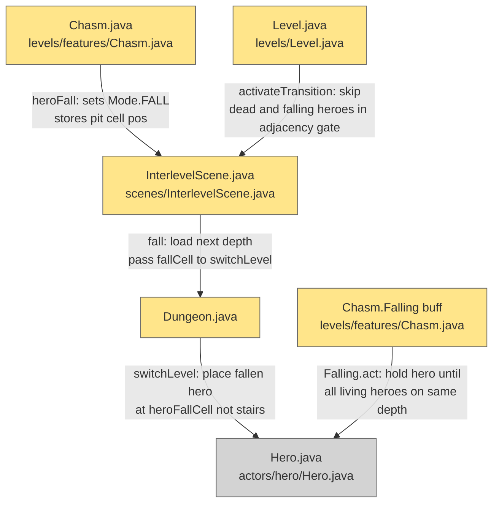

# Player Pit Falling — Multiplayer Synchronization

## System Intent

- What is being built: Correct multiplayer behavior when a hero falls down a pit/chasm to the next floor. The falling hero enters a **falling state** (via the existing `Chasm.Falling` buff) and lands at the fall/pit landing cell (not at the stairs). The `Chasm.Falling` buff is extended to block `heroLand()` until all other non-dead, non-falling heroes have reached the same depth. The descend-stairs adjacency gate (`Level.activateTransition`) is updated to exclude dead and falling heroes from the check. Hero placement on `switchLevel` is extended to support per-hero entry positions: stair-descenders land adjacent to the stair entrance as before; the fallen hero lands at `Dungeon.heroFallCell`.
- Primary consumer(s): `Chasm.heroFall()`, `InterlevelScene.fall()`, `Dungeon.switchLevel()`, `Level.activateTransition()`, `Chasm.Falling.act()`
- Boundary: Six files touched. No changes to single-player code paths. No networking. The "all-players descend together" invariant is preserved — the fallen hero waits in the falling state until the rest of the party catches up on the new floor.

## Stage Gate Tracker

- [ ] Stage 1 Mermaid approved
- [ ] Stage 2 Flows approved
- [ ] Stage 3 Logs + Deployment approved or skipped

## Mermaid Diagram



ONCE YOU GET APPROVAL FROM THE DEVELOPER, DELETE THIS LINE AND UPDATE THE STAGE GATE TRACKER

## Flows

- Flow naming rule: `### Flow: <flowname>`
- `N/A` for test files means explicit no-test-required waiver (not a missing mapping).

### Global Types

```txt
StandardError {
  message: string (human-readable description of what went wrong)
}
```

---

### Flow: `heroFallIntoChasm`
- Test files: N/A
- Core files:
  - `core/src/main/java/com/shatteredpixel/shatteredpixeldungeon/levels/features/Chasm.java`
  - `core/src/main/java/com/shatteredpixel/shatteredpixeldungeon/scenes/InterlevelScene.java`
  - `core/src/main/java/com/shatteredpixel/shatteredpixeldungeon/Dungeon.java`

#### Types

```txt
// New static field on Dungeon (not serialized — computed fresh on every fall):
Dungeon.heroFallCell: int
  -- The cell index on the next floor where the falling hero should land.
  -- Set in InterlevelScene.fall() before Dungeon.switchLevel() is called.
  -- Consumed and cleared by Dungeon.switchLevel() when placing the falling hero.
  -- Initialized to -1 (no pending fall).

// InterlevelScene.fallIntoPit: boolean  (already exists)
  -- True when the pit is a WeakFloorRoom pit; false otherwise.
  -- Used by Level.fallCell() to pick the landing cell type.
```

#### Paths

| path | input | output | path-type | notes | updated |
| --- | --- | --- | --- | --- | --- |
| `heroFallIntoChasm.singlePlayer` | `Dungeon.heroes.size() == 1` | identical to pre-multiplayer behavior — hero lands at `fallCell`, `Chasm.Falling` buff fires immediately | happy path | No behavior change for single-player | |
| `heroFallIntoChasm.multiPlayer` | `Dungeon.heroes.size() > 1`, hero steps on chasm | `Chasm.heroFall()` stores pit pos → `InterlevelScene.fall()` computes `fallCell`, stores in `Dungeon.heroFallCell`, calls `switchLevel` → hero placed at `heroFallCell` (not stairs) | happy path | Hero is now on the next depth with `Chasm.Falling` buff active | |
| `heroFallIntoChasm.heroAlreadyDead` | Hero is dead when `heroFall` is called | `Dungeon.hero.isAlive() == false` → sprite hidden, no scene switch (existing guard in `Chasm.heroFall`) | edge case | Existing dead-hero guard is unchanged | |

#### Pseudocode

```
// Chasm.java — heroFall(int pos)  — NO CHANGE to this method.
// Existing logic already sets Mode.FALL and switches scene. No edits needed here.

// InterlevelScene.java — fall()
Mob.holdAllies(Dungeon.level);
Buff.affect(Dungeon.hero, Chasm.Falling.class);  // already present
Dungeon.saveAll();

Dungeon.depth++;
if (Dungeon.levelHasBeenGenerated(Dungeon.depth, Dungeon.branch)) {
    level = Dungeon.loadLevel(GamesInProgress.curSlot);
} else {
    level = Dungeon.newLevel();
}

int fallLandingCell = level.fallCell(fallIntoPit);  // existing logic
Dungeon.heroFallCell = fallLandingCell;              // NEW: store for switchLevel
Dungeon.switchLevel(level, fallLandingCell);          // pos arg is still used for hero[0]

// Dungeon.java — new field declaration:
public static int heroFallCell = -1;

// Dungeon.switchLevel(Level level, int pos)
// After existing heroesNeedInitialPlacement block, add:
if (heroFallCell != -1) {
    // Place the falling hero at the fall landing cell, not at pos (stairs)
    hero.pos = heroFallCell;
    heroFallCell = -1;  // consume the flag
}
// Note: for fall transitions heroesNeedInitialPlacement is NOT set to true,
// so heroes[1..N] are not repositioned — they remain at their saved positions
// on the current floor until they descend via stairs.
```

---

### Flow: `fallingStateWait`
- Test files: N/A
- Core files:
  - `core/src/main/java/com/shatteredpixel/shatteredpixeldungeon/levels/features/Chasm.java`

#### Types

```txt
Chasm.Falling extends Buff
  -- actPriority = VFX_PRIO (already set).
  -- act() currently calls heroLand() immediately and detaches.
  -- NEW: act() checks whether all other non-dead, non-falling heroes are on the same depth.
         If not, spend(TICK) and return true (keep waiting). If yes, call heroLand() and detach.

// "same depth" check: Dungeon.depth == the depth where this hero now lives.
// All other heroes are on another floor until they descend via stairs.
// A hero is "falling" if they have Chasm.Falling buff active.
// A hero is "dead" if !hero.isAlive().
```

#### Paths

| path | input | output | path-type | notes | updated |
| --- | --- | --- | --- | --- | --- |
| `fallingStateWait.singlePlayer` | `Dungeon.heroes.size() == 1` | no other heroes to wait for → `heroLand()` fires immediately (same as before) | happy path | Single-player completely unchanged | |
| `fallingStateWait.waitingForParty` | Other non-dead non-falling heroes are on a different depth | `spend(TICK)`, buff stays active, hero remains frozen | wait path | Hero cannot act until party arrives | |
| `fallingStateWait.partyArrived` | All other non-dead non-falling heroes are now on `Dungeon.depth` | `heroLand()` called, buff detached | happy path | Party is reunited on the new floor | |
| `fallingStateWait.allOthersDead` | All other heroes are dead | no non-dead non-falling heroes remain to wait for → `heroLand()` fires | edge case | Game proceeds; final-hero-death check already handled by existing `Hero.die()` flow | |
| `fallingStateWait.multipleHerosFalling` | Two heroes both fell (one after the other) | each has a `Chasm.Falling` buff; each waits for all non-dead non-falling others; when neither is waiting for the other (both falling), condition resolves and both land | edge case | Heroes who are themselves falling are excluded from the "must arrive" requirement | |

#### Pseudocode

```
// Chasm.java — Chasm.Falling.act()  UPDATED:

@Override
public boolean act() {
    // Check if all other non-dead, non-falling heroes are on the same depth.
    if (Dungeon.heroes != null && Dungeon.heroes.size() > 1) {
        for (Hero h : Dungeon.heroes) {
            if (h == (Hero) target) continue;          // skip self
            if (!h.isAlive()) continue;                // skip dead heroes
            if (h.buff(Chasm.Falling.class) != null) continue; // skip other falling heroes
            // This hero is alive and not falling — check if they are on the same depth.
            // heroes on other floors are not in Dungeon.level's actor set,
            // so we check depth via Dungeon.depth (which is the fallen hero's current depth).
            // Non-descended heroes are still registered in actors (their floor is saved but
            // they act on the NEW level after switchLevel).
            // Simpler check: if h is not in the current level's actor set, they haven't arrived yet.
            if (Actor.find(h) == null || !Dungeon.level.heroFOV.length > h.pos) {
                // Hero not yet present on this floor
                spend(TICK);
                return true;  // keep buff active, try again next tick
            }
        }
    }
    // All other living non-falling heroes are on this floor (or there are none).
    heroLand();
    detach();
    return true;
}

// NOTE: The "hero is on this floor" check needs a reliable mechanism.
// Recommended: add a depth field to Hero that tracks which depth the hero is on.
// Dungeon.switchLevel sets hero.depth = Dungeon.depth for all heroes.
// Chasm.Falling.act() then checks: h.depth == ((Hero)target).depth.

// Dungeon.java — switchLevel — after placing heroes, add:
for (Hero h : heroes) {
    h.depth = Dungeon.depth;
}
// Hero.java — add field:
public int depth = 1;  // tracks which floor this hero is on
// Serialized under key "depth" in Hero's storeInBundle / restoreFromBundle.
```

---

### Flow: `adjacencyGateExcludeFallingAndDead`
- Test files: N/A
- Core files:
  - `core/src/main/java/com/shatteredpixel/shatteredpixeldungeon/levels/Level.java`

#### Types

```txt
// No new types. Modifies the existing party adjacency check in Level.activateTransition().
// A hero is "falling" if they have Chasm.Falling buff active.
// A hero is "dead" if !hero.isAlive().
```

#### Paths

| path | input | output | path-type | notes | updated |
| --- | --- | --- | --- | --- | --- |
| `adjacencyGate.singlePlayer` | `heroes.size() == 1` | transition proceeds normally, no check | happy path | Unchanged | |
| `adjacencyGate.allAliveAndAdjacent` | all alive non-falling heroes within distance 1 | transition proceeds | happy path | Normal stair descent | |
| `adjacencyGate.heroNotAdjacent` | any alive non-falling hero is distance > 1 | `return false`, `GLog.w` warning | blocked path | Same as existing behavior | |
| `adjacencyGate.fallingHeroExcluded` | one hero has `Chasm.Falling` buff | that hero is skipped in the adjacency loop; other heroes can proceed with stair descent | happy path | NEW: enables the rest of the party to descend while a hero is falling | |
| `adjacencyGate.deadHeroExcluded` | one hero is dead (`!isAlive()`) | dead hero skipped (already implemented) | happy path | Existing dead-hero guard is preserved | |

#### Pseudocode

```
// Level.java — activateTransition() — UPDATED adjacency loop:

if (Dungeon.heroes != null && Dungeon.heroes.size() > 1) {
    for (Hero other : Dungeon.heroes) {
        if (other == hero) continue;
        if (!other.isAlive()) continue;                          // skip dead heroes (existing)
        if (other.buff(Chasm.Falling.class) != null) continue;  // NEW: skip falling heroes
        if (distance(hero.pos, other.pos) > 1) {
            GLog.w(Messages.get(Level.class, "need_party_adjacent"));
            return false;
        }
    }
}
```

---

### Flow: `heroEntryPosition`
- Test files: N/A
- Core files:
  - `core/src/main/java/com/shatteredpixel/shatteredpixeldungeon/Dungeon.java`
  - `core/src/main/java/com/shatteredpixel/shatteredpixeldungeon/scenes/InterlevelScene.java`

#### Types

```txt
// Extends existing heroesNeedInitialPlacement mechanism.
// Fall path does NOT set heroesNeedInitialPlacement — the fallen hero lands at heroFallCell
// (set in fall()) and other heroes are not yet on the new floor (they descend via stairs later).

// For stair descent (descend/ascend), the existing heroesNeedInitialPlacement mechanism
// places heroes[1..N] adjacent to the stairs entrance — this is unchanged.
```

#### Paths

| path | input | output | path-type | notes | updated |
| --- | --- | --- | --- | --- | --- |
| `heroEntry.stairDescend` | `InterlevelScene.Mode.DESCEND` | `heroesNeedInitialPlacement = true` → `switchLevel` places all heroes adjacent to stair entrance | happy path | Existing behavior, unchanged | |
| `heroEntry.stairAscend` | `InterlevelScene.Mode.ASCEND` | `heroesNeedInitialPlacement = true` → `switchLevel` places all heroes adjacent to stair entrance | happy path | Existing behavior, unchanged | |
| `heroEntry.pitFall` | `InterlevelScene.Mode.FALL` | `heroesNeedInitialPlacement` NOT set → `Dungeon.heroFallCell` set → `switchLevel` places `hero[0]` at `heroFallCell` | happy path | NEW: fallen hero appears at pit landing, not at stairs | |
| `heroEntry.pitFallNoCell` | `level.fallCell()` returns -1 (no valid cell) | `Dungeon.heroFallCell = -1`, `switchLevel(level, -1)` → `hero.pos` left at -1 or handled by existing -1 guard in `switchLevel` | edge case | Existing -1 guards in `switchLevel` apply | |

#### Pseudocode

```
// InterlevelScene.java — fall() UPDATED (summary of changes):
// 1. Does NOT set Dungeon.heroesNeedInitialPlacement (fall is a solo-hero event).
// 2. Sets Dungeon.heroFallCell = level.fallCell(fallIntoPit).
// 3. Calls Dungeon.switchLevel(level, Dungeon.heroFallCell).  (pos arg remains the fall cell)

// Dungeon.java — switchLevel(Level level, int pos) UPDATED:
// After the existing heroesNeedInitialPlacement block:
if (heroFallCell != -1) {
    hero.pos = heroFallCell;  // override: fallen hero lands at pit, not stairs
    heroFallCell = -1;
}
// Note: pos == heroFallCell in the fall path so this is a no-op in practice,
// but it makes the intent explicit and guards against future refactors that change pos.
```

---

## Logs

| Source | Location |
|--------|----------|
| `GLog.w` — adjacency gate | "All players must be adjacent to use the stairs!" — emitted when `Level.activateTransition` blocks due to non-adjacent heroes. Falling/dead heroes are now excluded from triggering this message. |
| `GLog` — fall | No new log messages. The existing fall animation and screen-shake in `Chasm.heroLand()` are unchanged. |

## Deployment

- Mechanism: `local only`
- Deploy command:
  ```bash
  # Desktop
  ./gradlew desktop:run

  # Android
  ./gradlew android:installDebug
  ```
- Notes: No server-side component. All game logic runs on the client. Single-player is completely unaffected — every new guard is conditional on `heroes.size() > 1` or skipped when `Dungeon.heroes == null`.

ONCE YOU GET APPROVAL FROM THE DEVELOPER, DELETE THIS LINE AND UPDATE THE STAGE GATE TRACKER
