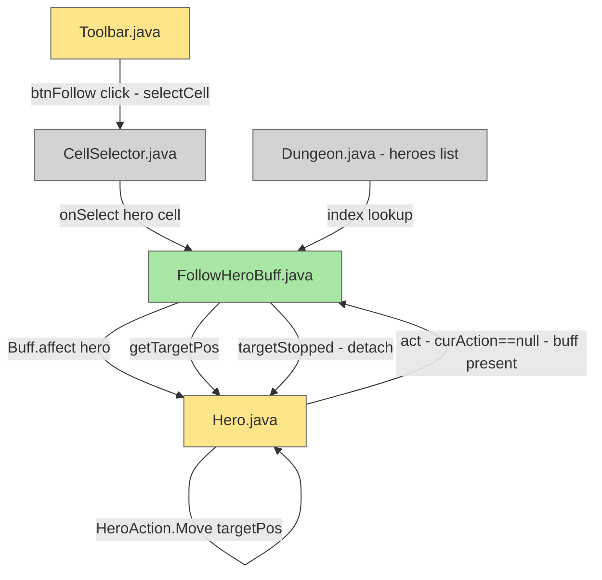

# Follow Hero Button

## System Intent

- What is being built: A "Follow" toolbar button placed next to the Wait button. When pressed, the active hero enters cell-targeting mode to select another player hero. Once a target is chosen, every subsequent turn the active hero automatically moves one step toward the target — until the target stops moving (does not change position between turns), at which point the follow mode is cancelled.
- Primary consumer(s): Multiplayer sessions where `Dungeon.heroes.size() > 1`. The active hero (`Dungeon.hero`) follows any other hero in the party.
- Boundary (black-box scope only): Only the local active hero's turn is auto-driven. The target hero is read-only (position only). No AI or pathfinding changes for the target; no cross-hero network sync required.

## Stage Gate Tracker

- [ ] Stage 1 Mermaid approved
- [ ] Stage 2 Flows approved
- [ ] Stage 3 Logs + Deployment approved or skipped

## Mermaid Diagram

Rendered diagram: https://mermaid.ink/img/Z3JhcGggVEQKICBUQltUb29sYmFyLmphdmFdOjo6dXBkYXRlZCAtLT58YnRuRm9sbG93IGNsaWNrIC0gc2VsZWN0Q2VsbHwgQ1NbQ2VsbFNlbGVjdG9yLmphdmFdOjo6dW5jaGFuZ2VkCiAgQ1MgLS0-fG9uU2VsZWN0IGhlcm8gY2VsbHwgRkhCW0ZvbGxvd0hlcm9CdWZmLmphdmFdOjo6Y3JlYXRlZAogIEZIQiAtLT58QnVmZi5hZmZlY3QgaGVyb3wgSFtIZXJvLmphdmFdOjo6dXBkYXRlZAogIEggLS0-fGFjdCAtIGN1ckFjdGlvbj09bnVsbCAtIGJ1ZmYgcHJlc2VudHwgRkhCCiAgRkhCIC0tPnxnZXRUYXJnZXRQb3N8IEgKICBIIC0tPnxIZXJvQWN0aW9uLk1vdmUgdGFyZ2V0UG9zfCBICiAgRkhCIC0tPnx0YXJnZXRTdG9wcGVkIC0gZGV0YWNofCBICiAgRFtEdW5nZW9uLmphdmEgLSBoZXJvZXMgbGlzdF06Ojp1bmNoYW5nZWQgLS0-fGluZGV4IGxvb2t1cHwgRkhCCgpjbGFzc0RlZiB1bmNoYW5nZWQgZmlsbDojZDNkM2QzLHN0cm9rZTojNjY2LHN0cm9rZS13aWR0aDoxcHg7CmNsYXNzRGVmIHVwZGF0ZWQgZmlsbDojZmZlNThhLHN0cm9rZTojNjY2LHN0cm9rZS13aWR0aDoxcHg7CmNsYXNzRGVmIGNyZWF0ZWQgZmlsbDojYThlNmEzLHN0cm9rZTojNjY2LHN0cm9rZS13aWR0aDoxcHg7Cg==



ONCE YOU GET APPROVAL FROM THE DEVELOPER, DELETE THIS LINE AND UPDATE THE STAGE GATE TRACKER

## Flows

- Flow naming rule: `### Flow: \`<flowname>\``
- `N/A` for test files means explicit no-test-required waiver.

### Global Types

```txt
StandardError {
  message: string (human-readable description of what went wrong)
}
```

### Flow: `followButtonClick`
- Test files: N/A
- Core files:
  - `core/src/main/java/com/shatteredpixel/shatteredpixeldungeon/ui/Toolbar.java`
  - `core/src/main/java/com/shatteredpixel/shatteredpixeldungeon/actors/buffs/FollowHeroBuff.java` (new)

#### Types

```txt
FollowButtonClickInput {
  (none — triggered by pointer event on btnFollow Tool)
}

FollowButtonClickOutput {
  (side effect: GameScene.selectCell(followInformer) called to enter targeting mode)
  OR (side effect: existing FollowHeroBuff detached if already following)
}
```

#### Paths

| path | input | output | path-type | notes | updated |
| --- | --- | --- | --- | --- | --- |
| `followButtonClick.enterTargeting` | click btnFollow while hero ready and no buff | `GameScene.selectCell(followInformer)` called | `happy path` | Guard: `hero != null && hero.ready && !GameScene.cancel() && Dungeon.heroes.size() > 1` | |
| `followButtonClick.cancelFollow` | click btnFollow while FollowHeroBuff active | `FollowHeroBuff.detach()` called | `happy path` | Allows toggling off | |
| `followButtonClick.notReady` | click while hero not ready | no-op | `guarded` | Same guard as btnWait | |
| `followButtonClick.soloMode` | click when only one hero exists | no-op | `guarded` | `Dungeon.heroes.size() < 2` guard | |

#### Pseudocode

```
btnFollow.onClick():
  if hero == null || !hero.ready || GameScene.cancel(): return
  if hero.buff(FollowHeroBuff.class) != null:
    hero.buff(FollowHeroBuff.class).detach()
    return
  if Dungeon.heroes.size() < 2: return
  examining = false
  GameScene.selectCell(followInformer)

followInformer.onSelect(cell):
  if cell == null || instance == null: return
  ch = Actor.findChar(cell)
  if ch instanceof Hero && ch != Dungeon.hero:
    heroIdx = Dungeon.heroes.indexOf(ch)
    if heroIdx >= 0:
      buff = Buff.affect(Dungeon.hero, FollowHeroBuff.class)
      buff.setTargetHeroId(heroIdx)

followInformer.prompt():
  return "Select a hero to follow"
```

### Flow: `followHeroMovement`
- Test files: N/A
- Core files:
  - `core/src/main/java/com/shatteredpixel/shatteredpixeldungeon/actors/hero/Hero.java`
  - `core/src/main/java/com/shatteredpixel/shatteredpixeldungeon/actors/buffs/FollowHeroBuff.java` (new)

#### Types

```txt
FollowHeroBuffState {
  targetHeroId: int   (index into Dungeon.heroes)
  lastKnownTargetPos: int  (target's pos as of last buff.act(); -1 = uninitialized)
}
```

#### Paths

| path | input | output | path-type | notes | updated |
| --- | --- | --- | --- | --- | --- |
| `followHeroMovement.moveToward` | curAction==null, buff present, target moved | `curAction = HeroAction.Move(targetPos)` set before action dispatch | `happy path` | Buff.targetStopped() returns false | |
| `followHeroMovement.stopOnTargetIdle` | curAction==null, buff present, target pos unchanged since last turn | buff detached; `ready()` called normally | `stop condition` | Buff.targetStopped() returns true | |
| `followHeroMovement.stopOnTargetDead` | target hero is dead or removed | buff detached; `ready()` called normally | `stop condition` | getTargetHero() returns null | |
| `followHeroMovement.firstTurn` | curAction==null, buff present, lastKnownTargetPos==-1 | always follow (no stop check on first turn) | `initialization` | Prevents premature detach on attach turn | |

#### Pseudocode

```
// In Hero.act(), right before the curAction==null branch that calls ready():

FollowHeroBuff follow = buff(FollowHeroBuff.class);
if (curAction == null && follow != null) {
  if (follow.targetStopped()) {
    follow.detach();
    // fall through to normal ready() path below
  } else {
    int targetPos = follow.getTargetPos();
    if (targetPos >= 0 && targetPos != pos) {
      curAction = new HeroAction.Move(targetPos);
      // fall through to curAction dispatch (actMove handles pathfinding)
    }
    // if targetPos == pos (already there), fall through to ready()
  }
}

// FollowHeroBuff:
class FollowHeroBuff extends Buff {
  int targetHeroId = -1;
  int lastKnownTargetPos = -1;  // -1 = uninitialized

  void setTargetHeroId(int id) { targetHeroId = id; }

  Hero getTargetHero():
    if targetHeroId < 0 || targetHeroId >= Dungeon.heroes.size(): return null
    return Dungeon.heroes.get(targetHeroId)

  int getTargetPos():
    Hero h = getTargetHero()
    return h != null && h.isAlive() ? h.pos : -1

  boolean targetStopped():
    Hero h = getTargetHero()
    if h == null || !h.isAlive(): return true
    return lastKnownTargetPos != -1 && h.pos == lastKnownTargetPos

  @Override boolean act():
    spend(TICK)
    Hero h = getTargetHero()
    if h != null && h.isAlive():
      lastKnownTargetPos = h.pos
    return true  // buff persists until detached

  @Override void storeInBundle(Bundle bundle):
    super.storeInBundle(bundle)
    bundle.put("targetHeroId", targetHeroId)
    bundle.put("lastKnownTargetPos", lastKnownTargetPos)

  @Override void restoreFromBundle(Bundle bundle):
    super.restoreFromBundle(bundle)
    targetHeroId = bundle.getInt("targetHeroId")
    lastKnownTargetPos = bundle.getInt("lastKnownTargetPos")
}
```

### Flow: `toolbarFollowLayout`
- Test files: N/A
- Core files:
  - `core/src/main/java/com/shatteredpixel/shatteredpixeldungeon/ui/Toolbar.java`

#### Types

```txt
LayoutInput {
  SPDSettings.toolbarMode(): "SPLIT" | "GROUP" | "CENTER"
  SPDSettings.flipToolbar(): boolean
  PixelScene.uiCamera.width: int
}

LayoutOutput {
  (side effect: btnFollow positioned adjacent to btnWait in all layout modes)
}
```

#### Paths

| path | input | output | path-type | notes | updated |
| --- | --- | --- | --- | --- | --- |
| `toolbarFollowLayout.split` | mode=SPLIT | btnWait at left, btnFollow right of btnWait, btnSearch right of btnFollow | `happy path` | mirror existing btnSearch shift relative to btnWait | |
| `toolbarFollowLayout.group` | mode=GROUP | btnWait rightmost, btnFollow left of btnWait, btnSearch left of btnFollow | `happy path` | right-to-left chain | |
| `toolbarFollowLayout.center` | mode=CENTER | same as GROUP but centered | `happy path` | CENTER inherits GROUP layout | |
| `toolbarFollowLayout.interfaceSizeLarge` | interfaceSize > 0 | btnFollow inserted between btnWait and btnSearch in right-to-left chain | `happy path` | match the existing `interfaceSize > 0` branch in layout() | |
| `toolbarFollowLayout.flipToolbar` | flipToolbar=true | all positions mirrored; btnFollow remains between wait and search | `happy path` | existing flip logic already mirrors all member positions | |
| `toolbarFollowLayout.enableDisable` | hero ready/busy | btnFollow enabled/disabled alongside all other Tool members | `happy path` | Tool subclass; existing update() loop covers it automatically | |
| `toolbarFollowLayout.alpha` | alpha(value) called | btnFollow.alpha(value) called | `happy path` | must be added explicitly to Toolbar.alpha() | |

#### Pseudocode

```
// createChildren() — add after btnWait:
add(btnFollow = new Tool(24, 0, 20, 26) {
  @Override protected void onClick() { /* followButtonClick flow */ }
  @Override protected String hoverText() { return "Follow Hero"; }
});
btnFollow.icon(208, 0, 16, 16);  // icon offset TBD from toolbar spritesheet

// layout() — SPLIT mode:
btnWait.setPos(x, y);
btnFollow.setPos(btnWait.right(), y);
btnSearch.setPos(btnFollow.right(), y);

// layout() — GROUP/CENTER mode:
btnWait.setPos(right - btnWait.width(), y);
btnFollow.setPos(btnWait.left() - btnFollow.width(), y);
btnSearch.setPos(btnFollow.left() - btnSearch.width(), y);

// layout() — interfaceSize > 0:
btnInventory.setPos(right - btnInventory.width(), y);
btnWait.setPos(btnInventory.left() - btnWait.width(), y);
btnFollow.setPos(btnWait.left() - btnFollow.width(), y);
btnSearch.setPos(btnFollow.left() - btnSearch.width(), y);

// alpha():
btnFollow.alpha(value);  // add alongside existing alpha calls

// followInformer static field (alongside existing informer):
private static CellSelector.Listener followInformer = new CellSelector.Listener() { ... };
```

ONCE YOU GET APPROVAL FROM THE DEVELOPER, DELETE THIS LINE AND UPDATE THE STAGE GATE TRACKER

## Logs

| Source | Location |
|--------|----------|
| N/A | No new logging required |

## Deployment

- Mechanism: `local only`
- Deploy command:
  ```bash
  ./gradlew android:assembleDebug
  # or for desktop testing:
  ./gradlew desktop:run
  ```
- Notes: Toolbar and Hero changes compile with the full game; no separate deploy step.
