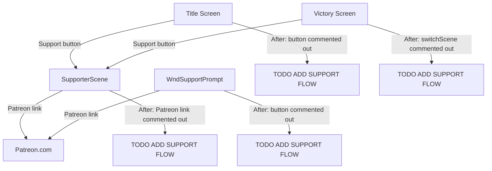

# Plan: Remove Patreon/Support Buttons

## Summary

Comment out all Patreon and developer-support buttons/links throughout the codebase and replace with `// TODO ADD SUPPORT FLOW` markers. No replacement functionality is added — this is purely a removal pass.

## Locations to Modify

### 1. `TitleScene.java` — Support button on main title screen

- **Lines 183–184**: `btnSupport = new SupportButton(...)` and `add(btnSupport)` — comment out
- **Line 73**: `private StyledButton btnSupport;` — comment out
- **Lines 235, 245–246, 327, 336**: Button positioning/state references — comment out
- **Lines 487–499**: Inner `SupportButton` class body — comment out
- Add `// TODO ADD SUPPORT FLOW` above each commented block

### 2. `SupporterScene.java` — Entire Patreon link scene

- **Line 86**: Patreon URL string — comment out
- **Lines 129, 131**: `patreon_msg` / `patreon_english` message references — comment out
- Add `// TODO ADD SUPPORT FLOW` above the file-level class declaration

### 3. `WndSupportPrompt.java` — Support prompt dialog

- **Lines 49, 51**: `patreon_msg` / `patreon_english` message references — comment out
- **Lines 60–70**: `RedButton link` Patreon button block — comment out
- **Line 70**: `SPDSettings.supportNagged(true)` call — comment out
- Add `// TODO ADD SUPPORT FLOW` above each commented block

### 4. `WndVictoryCongrats.java` — Support button on victory screen

- **Line 118**: `ShatteredPixelDungeon.switchScene(SupporterScene.class)` — comment out
- Add `// TODO ADD SUPPORT FLOW` above the commented line

### 5. `scenes.properties` (English only) — Message strings

- Lines for `supporterscene.*`, `titlescene.patreon_body`, `titlescene.patreon_button` — comment out (prefix with `#`)
- Add `# TODO ADD SUPPORT FLOW` above each commented block

## What NOT to Change

- Changelog files (`v0_7_X_Changes.java` etc.) — historical text, leave as-is
- Localized properties files (non-English) — leave as-is; they'll fall back gracefully when the keys are unused
- `SPDSettings` support-nag fields — leave as-is (harmless without the UI)

## Mermaid Diagram

## Flows

### Flow 1: Comment out TitleScene support button
- Find `btnSupport` field, instantiation, `add()` call, and positioning references
- Comment each out with `// TODO ADD SUPPORT FLOW`
- Comment out the inner `SupportButton` class

### Flow 2: Comment out SupporterScene Patreon link
- Comment out the Patreon URL and message references in the scene body

### Flow 3: Comment out WndSupportPrompt Patreon button
- Comment out the `RedButton link` block and `supportNagged` call

### Flow 4: Comment out WndVictoryCongrats support navigation
- Comment out the `switchScene(SupporterScene.class)` line

### Flow 5: Comment out English scenes.properties support strings
- Prefix affected lines with `#` and add `# TODO ADD SUPPORT FLOW`
