# Broadcast Boss Upgrades

## System Intent

- What is being built: When any hero activates a TengusMask or KingsCrown, a sequential selection window is shown for every eligible hero in turn order. Player A picks their subclass/ability, then the window automatically re-appears for Player B, then C, etc. Only one physical item needs to be picked up — the chain handles the rest. Single-player is unchanged.
- Primary consumer(s): `TengusMask`, `KingsCrown`, `WndChooseSubclass`, `WndChooseAbility`, `Tengu.die()`
- Boundary: No changes to the window UI itself, InterlevelScene, save/load, or actor turn system. Also fixes the existing bug where `Tengu.die()` checks `Dungeon.hero.subClass` (always hero[0]) instead of checking all heroes.

## Stage Gate Tracker

- [x] Stage 1 Mermaid approved
- [x] Stage 2 Flows approved
- [x] Stage 3 Logs + Deployment approved or skipped

## Mermaid Diagram

```mermaid
flowchart TD
  subgraph TengusMask["TengusMask — Sequential Subclass Selection"]
    TM1["Hero A picks up TengusMask\nItem.execute(heroA, AC_WEAR)\npopulate pendingHeroes = heroes with subClass==NONE, excluding heroA"]:::modified
    TM2["WndChooseSubclass shown\nfor Hero A"]:::unchanged
    TM3["Hero A picks subclass\nTengusMask.choose(subCls)\napply to curUser=heroA\ncall showNextPending()"]:::modified
    TM4{"pendingHeroes\nempty?"}:::created
    TM5["Pop next hero B\nset curUser = heroB\nnew TengusMask()\nWndChooseSubclass shown for Hero B"]:::created
    TM6["Hero B picks subclass\napply, call showNextPending()"]:::created
    TM7["Done — all eligible heroes\nhave chosen subclass"]:::unchanged
    TM1 --> TM2 --> TM3 --> TM4
    TM4 -->|"no"| TM5 --> TM6 --> TM4
    TM4 -->|"yes"| TM7
  end

  subgraph KingsCrown["KingsCrown — Sequential Ability Selection"]
    KC1["Hero A picks up KingsCrown\nItem.execute(heroA, AC_WEAR)\npopulate pendingHeroes = all heroes except heroA"]:::modified
    KC2["WndChooseAbility shown\nfor Hero A"]:::unchanged
    KC3["Hero A picks ability\nKingsCrown.upgradeArmor(heroA, armor, ability)\ncall showNextPending()"]:::modified
    KC4{"pendingHeroes\nempty?"}:::created
    KC5["Pop next hero B\nnew KingsCrown()\nWndChooseAbility shown for Hero B"]:::created
    KC6["Hero B picks ability\napply, call showNextPending()"]:::created
    KC7["Done — all heroes\nhave chosen armor ability"]:::unchanged
    KC1 --> KC2 --> KC3 --> KC4
    KC4 -->|"no"| KC5 --> KC6 --> KC4
    KC4 -->|"yes"| KC7
  end

  subgraph TenguDie["Tengu.die() Drop Fix"]
    TD1["Tengu dies"]:::unchanged
    TD2["Check: does ANY hero\nhave subClass == NONE?\n(was: Dungeon.hero only)"]:::modified
    TD3["Drop 1 TengusMask\nat Tengu's position"]:::unchanged
    TD4["No drop needed\nall heroes have subclasses"]:::unchanged
    TD1 --> TD2
    TD2 -->|"yes"| TD3
    TD2 -->|"no"| TD4
  end

classDef unchanged fill:#d3d3d3,stroke:#666,stroke-width:1px;
classDef created fill:#a8e6a3,stroke:#666,stroke-width:1px;
classDef modified fill:#ffe08a,stroke:#666,stroke-width:1px;
```



## Flows

### Global Types

```txt
StandardError {
  message: string
}

// New static field on TengusMask (reset on each fresh activation)
TengusMask.pendingHeroes: ArrayList<Hero>   -- heroes still waiting to choose subclass

// New static field on KingsCrown (reset on each fresh activation)
KingsCrown.pendingHeroes: ArrayList<Hero>   -- heroes still waiting to choose armor ability
```

---

### Flow: `tengusMaskSequentialChoice`
- Test files: N/A
- Core files:
  - `core/src/main/java/com/shatteredpixel/shatteredpixeldungeon/items/TengusMask.java`

#### Types

```txt
// TengusMask gains:
//   static ArrayList<Hero> pendingHeroes — queue of heroes yet to choose
//   static void showNextPending()        — pops next hero, shows window for them
```

#### Paths

| path | input | output | path-type | notes | updated |
| --- | --- | --- | --- | --- | --- |
| `tengusMaskSequentialChoice.singlePlayer` | heroes.size() == 1 | existing flow unchanged | happy path | pendingHeroes stays empty, showNextPending is a no-op | |
| `tengusMaskSequentialChoice.firstHero` | Hero A activates mask, has subClass==NONE | WndChooseSubclass shown for Hero A; pendingHeroes populated with remaining eligible heroes | happy path | | |
| `tengusMaskSequentialChoice.chainNext` | Hero A picks subclass, pendingHeroes not empty | subclass applied to A; window shown for next hero in list | happy path | Uses fresh TengusMask() as callback carrier; detach is a no-op for non-inventory item | |
| `tengusMaskSequentialChoice.allDone` | Last pending hero picks subclass | subclass applied; showNextPending is a no-op (empty list) | happy path | | |
| `tengusMaskSequentialChoice.alreadyHasSubclass` | A hero in pendingHeroes already has a subclass (e.g. picked up a second mask mid-run) | that hero is skipped | happy path | showNextPending() skips heroes where subClass != NONE | |

#### Pseudocode

```
// TengusMask.java — add fields and methods:
public static ArrayList<Hero> pendingHeroes = new ArrayList<>();

public static void showNextPending() {
    // skip any hero who already has a subclass
    while (!pendingHeroes.isEmpty() && pendingHeroes.get(0).subClass != HeroSubClass.NONE) {
        pendingHeroes.remove(0);
    }
    if (pendingHeroes.isEmpty()) return;
    Hero next = pendingHeroes.remove(0);
    Item.curUser = next;
    GameScene.show(new WndChooseSubclass(new TengusMask(), next));
}

// TengusMask.execute() — AFTER setting curUser, BEFORE GameScene.show:
// ADD:
pendingHeroes.clear();
for (Hero h : Dungeon.heroes) {
    if (h != hero && h.subClass == HeroSubClass.NONE) {
        pendingHeroes.add(h);
    }
}

// TengusMask.choose() — AFTER applying subclass, visual effects, etc:
// ADD at end of method:
showNextPending();
```

---

### Flow: `kingsCrownSequentialChoice`
- Test files: N/A
- Core files:
  - `core/src/main/java/com/shatteredpixel/shatteredpixeldungeon/items/KingsCrown.java`

#### Types

```txt
// KingsCrown gains:
//   static ArrayList<Hero> pendingHeroes — queue of heroes yet to choose armor ability
//   static void showNextPending()        — pops next hero, shows WndChooseAbility for them
```

#### Paths

| path | input | output | path-type | notes | updated |
| --- | --- | --- | --- | --- | --- |
| `kingsCrownSequentialChoice.singlePlayer` | heroes.size() == 1 | existing flow unchanged | happy path | | |
| `kingsCrownSequentialChoice.firstHero` | Hero A activates crown | WndChooseAbility shown for Hero A; pendingHeroes = all other heroes | happy path | | |
| `kingsCrownSequentialChoice.chainNext` | Hero A picks ability, pendingHeroes not empty | ability applied to A; WndChooseAbility shown for next hero | happy path | Fresh KingsCrown() passed; WndChooseAbility already handles null crown at line 126 | |
| `kingsCrownSequentialChoice.allDone` | Last hero picks ability | applied; showNextPending is no-op | happy path | | |

#### Pseudocode

```
// KingsCrown.java — add fields and methods:
public static ArrayList<Hero> pendingHeroes = new ArrayList<>();

public static void showNextPending() {
    if (pendingHeroes.isEmpty()) return;
    Hero next = pendingHeroes.remove(0);
    GameScene.show(new WndChooseAbility(new KingsCrown(), next.belongings.armor(), next));
}

// KingsCrown.execute() — AFTER setting curUser, BEFORE GameScene.show:
// ADD:
pendingHeroes.clear();
for (Hero h : Dungeon.heroes) {
    if (h != hero) {
        pendingHeroes.add(h);
    }
}

// KingsCrown.upgradeArmor() — AFTER applying ability, visual effects, etc:
// ADD at end of method:
showNextPending();
```

---

### Flow: `tengusDieDropFix`
- Test files: N/A
- Core files:
  - `core/src/main/java/com/shatteredpixel/shatteredpixeldungeon/actors/mobs/Tengu.java`

#### Types

```txt
// Fix Tengu.die() drop condition:
// WAS: if (Dungeon.hero.subClass == HeroSubClass.NONE) — only checks hero[0]
// NOW: if any hero in Dungeon.heroes has subClass == NONE
```

#### Paths

| path | input | output | path-type | notes | updated |
| --- | --- | --- | --- | --- | --- |
| `tengusDieDropFix.anyEligible` | At least one hero has subClass == NONE | TengusMask dropped; sequential chain shows for all eligible heroes | happy path | | |
| `tengusDieDropFix.allHaveSubclass` | All heroes already have subclasses | No mask dropped | happy path | Edge case: all heroes got subclass another way | |

#### Pseudocode

```
// Tengu.die() — REPLACE drop condition:
// REMOVE:
//   if (Dungeon.hero.subClass == HeroSubClass.NONE) {

// REPLACE WITH:
boolean anyNeedsSubclass = false;
for (Hero h : Dungeon.heroes) {
    if (h.subClass == HeroSubClass.NONE) { anyNeedsSubclass = true; break; }
}
if (anyNeedsSubclass) {
    Dungeon.level.drop(new TengusMask(), pos).sprite.drop();
}
```

## Logs

| Source | Location |
|--------|----------|
| In-game log | `GLog` — no new entries needed; existing messages in TengusMask/KingsCrown apply per hero |

## Deployment

- Mechanism: `local only`
- Deploy command:
  ```bash
  ./gradlew desktop:debug
  ```
- Notes: Single-player is completely unaffected — `pendingHeroes` stays empty and `showNextPending()` is a no-op. `KingsCrown.unique = true` and `TengusMask.unique = true` remain unchanged — only one physical item is ever dropped.


