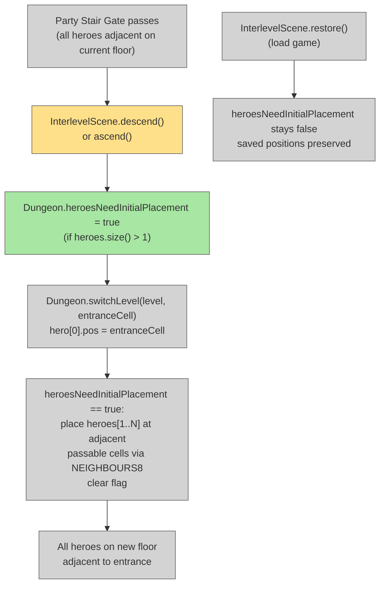

# Fix Stair Descent Positioning

## System Intent

- What is being built: When the party descends or ascends stairs, all non-hero[0] heroes are placed adjacent to the entrance on the new floor — the same passability-validated NEIGHBOURS8 search already used for the first descent in a new game. The load/continue path is unaffected because `heroesNeedInitialPlacement` is never set there.
- Primary consumer(s): `InterlevelScene.descend()`, `InterlevelScene.ascend()`, `Dungeon.switchLevel()`
- Boundary: Two lines added in `InterlevelScene.java` (one in descend, one in ascend). No changes to `Dungeon.switchLevel()`, `Actor.init()`, or the save/load path.

## Root Cause

`Dungeon.heroesNeedInitialPlacement` is only set to `true` in `Dungeon.init()` (new game startup). On all subsequent floor transitions the flag is `false`, so the NEIGHBOURS8 placement block in `switchLevel()` is skipped. Non-hero[0] heroes keep their stale positions from the previous floor — which are wrong cells for the new floor layout. The `heroesNeedInitialPlacement` mechanism already does exactly what we need; it just needs to be triggered on every descent/ascend, not only on the first one.

## Stage Gate Tracker

- [x] Stage 1 Mermaid approved
- [x] Stage 2 Flows approved
- [x] Stage 3 Logs + Deployment approved or skipped

## Mermaid Diagram




## Flows

### Global Types

```txt
StandardError {
  message: string
}
```

---

### Flow: `setRelocationFlagOnTransition`
- Test files: N/A
- Core files:
  - `core/src/main/java/com/shatteredpixel/shatteredpixeldungeon/scenes/InterlevelScene.java`

#### Types

```txt
// No new types — reuses existing Dungeon.heroesNeedInitialPlacement boolean
```

#### Paths

| path | input | output | path-type | notes | updated |
| --- | --- | --- | --- | --- | --- |
| `setRelocationFlagOnTransition.descend` | Party descends stairs, heroes.size() > 1 | flag set true → switchLevel places all heroes adjacent to entrance | happy path | | |
| `setRelocationFlagOnTransition.ascend` | Party ascends stairs, heroes.size() > 1 | flag set true → switchLevel places all heroes adjacent to entrance | happy path | | |
| `setRelocationFlagOnTransition.singlePlayer` | heroes.size() == 1 | flag stays false, hero[0] placed normally | happy path | Unchanged from current behavior | |
| `setRelocationFlagOnTransition.load` | InterlevelScene.restore() (CONTINUE mode) | flag never set → saved positions preserved | happy path | Load path unaffected | |

#### Pseudocode

```
// InterlevelScene.java — descend() method — ADD just before Dungeon.switchLevel call:
if (Dungeon.heroes != null && Dungeon.heroes.size() > 1) {
    Dungeon.heroesNeedInitialPlacement = true;
}
Dungeon.switchLevel( level, destTransition.cell() );

// InterlevelScene.java — ascend() method — ADD just before Dungeon.switchLevel call:
if (Dungeon.heroes != null && Dungeon.heroes.size() > 1) {
    Dungeon.heroesNeedInitialPlacement = true;
}
Dungeon.switchLevel( level, destTransition.cell() );
```


## Logs

| Source | Location |
|--------|----------|
| In-game log | `GLog` — no new entries needed |

## Deployment

- Mechanism: `local only`
- Deploy command:
  ```bash
  ./gradlew desktop:debug
  ```
- Notes: Single-player is completely unaffected (flag stays false when `heroes.size() == 1`). Load/continue path is unaffected (flag never set in `restore()`). The existing NEIGHBOURS8 passability search in `switchLevel()` already handles edge cases (impassable neighbours → fallback to hero[0]'s cell).

ONCE YOU GET APPROVAL FROM THE DEVELOPER, DELETE THIS LINE AND UPDATE THE STAGE GATE TRACKER
