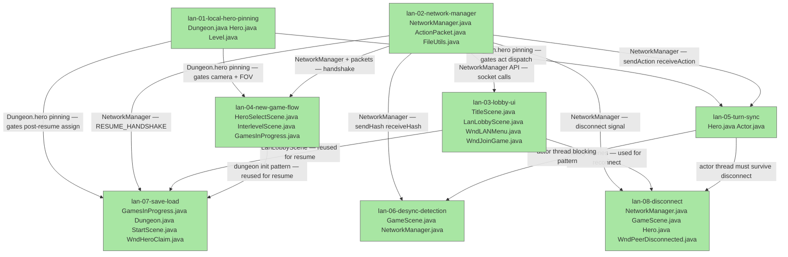

# Plan: LAN Multiplayer — Master Roadmap (lan-00)

## System Intent

- What is being built: A LAN/hotspot lockstep multiplayer system allowing 2–4 Android/desktop devices to play Shattered Pixel Dungeon together without any server. One device hosts; others join by IP. The simulation is deterministic — only player actions are exchanged each turn. This roadmap coordinates 8 ordered sub-plans that together deliver the complete feature.
- Primary consumer(s): Players wanting local co-op; the `TitleScene`, `GameScene`, `Hero`, `Dungeon`, and `Actor` subsystems.
- Boundary: The full LAN multiplayer feature is decomposed into 8 sub-plans (lan-01 through lan-08). Each sub-plan is independently reviewable and approvable. Sub-plans must be implemented in dependency order as declared below.

### Sub-Plan Index

| # | File | One-Line Description | Depends On |
|---|------|----------------------|------------|
| 01 | `lan-01-local-hero-pinning.md` | Add `Dungeon.hero`; gate camera/UI/FOV to local hero only | — |
| 02 | `lan-02-network-manager.md` | TCP socket layer, binary packet protocol, `ActionPacket` DTO | — |
| 03 | `lan-03-lobby-ui.md` | Title screen "LAN Game" button, host/join lobby scenes and dialogs | 02 |
| 04 | `lan-04-new-game-flow.md` | Per-device hero select, HERO_READY/HANDSHAKE exchange, dungeon init | 01, 02, 03 |
| 05 | `lan-05-turn-sync.md` | Remote hero act() blocking pattern; local hero sendAction() | 01, 02 |
| 06 | `lan-06-desync-detection.md` | Every-10-turn hash exchange and host-authoritative resync | 02, 05 |
| 07 | `lan-07-save-load.md` | Host-only save, LAN badge, resume handshake, WndHeroClaim | 01, 02, 03, 04 |
| 08 | `lan-08-disconnect.md` | Timeout detection, WndPeerDisconnected, continue-solo removal | 02, 05 |

### Implementation Order

Implement in this strict order to respect dependencies:

1. `lan-01` and `lan-02` (independent — implement in parallel or either order)
2. `lan-03` (needs `lan-02` for NetworkManager calls)
3. `lan-04` (needs `lan-01`, `lan-02`, `lan-03`)
4. `lan-05` (needs `lan-01`, `lan-02`)
5. `lan-06` (needs `lan-02`, `lan-05`)
6. `lan-07` (needs `lan-01`, `lan-02`, `lan-03`, `lan-04`)
7. `lan-08` (needs `lan-02`, `lan-05`)

## Stage Gate Tracker

- [x] Stage 1 Mermaid approved
- [x] Stage 2 Flows approved
- [x] Stage 3 Logs + Deployment approved or skipped

## Mermaid Diagram



ONCE YOU GET APPROVAL FROM THE DEVELOPER, DELETE THIS LINE AND UPDATE THE STAGE GATE TRACKER

## Flows

### Flow: `subplan-01-local-hero-pinning`

- Core files: `core/.../Dungeon.java`, `core/.../actors/hero/Hero.java`, `core/.../levels/Level.java`
- Depends on: nothing

#### Types

```txt
LocalHeroPinningScope {
  Dungeon.hero: Hero (new static field)
  LAN-gated operations: activate(), observe(), updateFieldOfView()
}
```

#### Paths

| path | input | output | path-type | notes | updated |
| --- | --- | --- | --- | --- | --- |
| `pinning.normal-mode` | game launched without LAN | `Dungeon.hero == Dungeon.hero` (existing behavior unchanged) | happy path | no behavioral change in solo | |
| `pinning.lan-remote-turn` | remote hero's `act()` runs | camera/UI/FOV not updated | happy path | gated by `this != Dungeon.hero` | |
| `pinning.lan-local-turn` | local hero's `act()` runs | full camera/UI/FOV update as normal | happy path | | |

#### Pseudocode

```
Dungeon.java:


Hero.activate():
  if (NetworkManager.lanMode && this != Dungeon.hero) return;  // skip camera + UI swap
  // ... existing activate body ...

Level.updateFieldOfView(Hero hero, boolean[] visible):
  if (NetworkManager.lanMode && hero != Dungeon.hero) {
    ShadowCaster.castShadow(hero.pos, ...throwawayArray...);  // run for simulation but discard
    return;
  }
  // ... existing heroFOV update body ...
```

---

### Flow: `subplan-02-network-manager`

- Core files: `core/.../network/NetworkManager.java` (new), `core/.../network/ActionPacket.java` (new), `SPD-classes/.../utils/FileUtils.java`, `android/AndroidManifest.xml`
- Depends on: nothing

#### Types

```txt
Packet types (binary, byte type header):
  ACTION=1, HASH=2, HANDSHAKE=3, PLAYER_JOINED=4, START=5,
  HERO_READY=6, SAVE_LOBBY_INFO=7, RESUME_START=8,
  HERO_CLAIM=9, RESUME_HANDSHAKE=10
```

#### Paths

| path | input | output | path-type | notes | updated |
| --- | --- | --- | --- | --- | --- |
| `network.host-game` | `hostGame(port)` | `ServerSocket` open, isHost=true | happy path | blocks until first client | |
| `network.join-game` | `joinGame(ip, port)` | `Socket` connected, isHost=false | happy path | | |
| `network.send-action` | `HeroAction + heroId` | bytes written to stream | happy path | fires before actMove/actAttack dispatch | |
| `network.receive-async` | background thread | `curAction` set on remote hero; actor thread notified | happy path | mirrors touch-input wake pattern | |
| `network.disconnect` | `IOException` or `SocketTimeoutException` | `Signal.PEER_DISCONNECTED` fired | error | setSoTimeout on all reads | |

#### Pseudocode

```
NetworkManager.receiveActionAsync(Hero remoteHero):
  new Thread(() -> {
    try {
      byte type = in.readByte();  // blocks with setSoTimeout
      int heroId = in.readInt();
      byte actionType = in.readByte();
      int targetPos = in.readInt();
      remoteHero.curAction = actionFromPacket(actionType, targetPos);
      synchronized(Actor.class) { Actor.class.notifyAll(); }
    } catch (SocketTimeoutException e) {
      Dungeon.level.addItemToSpawn(...);  // no-op; fire signal
      Signal.dispatch(PEER_DISCONNECTED);
    }
  }).start();
```

---

### Flow: `subplan-03-lobby-ui`

- Core files: `core/.../scenes/TitleScene.java`, `core/.../scenes/LanLobbyScene.java` (new), `core/.../windows/WndLANMenu.java` (new), `core/.../windows/WndJoinGame.java` (new)
- Depends on: lan-02

#### Types

```txt
LobbyState {
  players: List<PlayerSlot>  // slot 0=host, 1-3=clients
  isHost: boolean
  hostIP: string
}
PlayerSlot { index: int, connected: boolean, heroClass: HeroClass | null }
```

#### Paths

| path | input | output | path-type | notes | updated |
| --- | --- | --- | --- | --- | --- |
| `lobby.host-open` | tap "Host Room" | LanLobbyScene shown with IP, empty slots, Start disabled | happy path | | |
| `lobby.client-join` | PLAYER_JOINED received | slot fills in on host + all connected clients | happy path | host broadcasts updated list | |
| `lobby.start` | host taps Start (≥2 players) | START packet broadcast; all transition to HeroSelectScene | happy path | | |
| `lobby.join-enter-ip` | tap "Join Room" | WndJoinGame shown; on confirm connects and enters lobby | happy path | | |
| `lobby.connect-fail` | bad IP / timeout | error toast, stay on WndJoinGame | error | | |

---

### Flow: `subplan-04-new-game-flow`

- Core files: `core/.../scenes/HeroSelectScene.java`, `core/.../scenes/InterlevelScene.java`, `core/.../GamesInProgress.java`
- Depends on: lan-01, lan-02, lan-03

#### Types

```txt
HandshakePayload { seed: long, playerCount: int, heroClasses: HeroClass[] }
```

#### Paths

| path | input | output | path-type | notes | updated |
| --- | --- | --- | --- | --- | --- |
| `newgame.host-select` | host gets START, enters HeroSelectScene | playerCount=1, currentPlayerSelecting=0; sends HERO_READY | happy path | bypasses pass-and-play loop | |
| `newgame.client-select` | client gets START | same single-hero select; sends HERO_READY | happy path | | |
| `newgame.handshake` | all HERO_READY received by host | host broadcasts HANDSHAKE; clients write selectedClasses | happy path | must happen before InterlevelScene | |
| `newgame.dungeon-init` | InterlevelScene DESCEND | Dungeon.init() called; Dungeon.hero pinned to heroes.get(localPlayerIndex) | happy path | Dungeon.seed set before InterlevelScene | |

---

### Flow: `subplan-05-turn-sync`

- Core files: `core/.../actors/hero/Hero.java`, `core/.../actors/Actor.java`
- Depends on: lan-01, lan-02

#### Types

```txt
TurnDispatch {
  local hero (this==Dungeon.hero): sends ACTION packet before actMove/actAttack dispatch
  remoteHero: act() returns false; background thread sets curAction and notifies
}
```

#### Paths

| path | input | output | path-type | notes | updated |
| --- | --- | --- | --- | --- | --- |
| `turnsync.local-act` | local hero's turn | ACTION packet sent; action dispatched | happy path | sendAction before curAction dispatch | |
| `turnsync.remote-act` | remote hero's turn | act() returns false; thread blocks | happy path | background thread sets curAction + notifies | |
| `turnsync.interrupt` | `GameScene.destroy()` | actor thread interrupt handled | error | setSoTimeout prevents indefinite block | |

---

### Flow: `subplan-06-desync-detection`

- Core files: `core/.../scenes/GameScene.java` (hook point), `core/.../network/NetworkManager.java`
- Depends on: lan-02, lan-05

#### Types

```txt
HashPacket { turn: int, hash: long }
ResyncPayload { fullDungeonBundle: byte[] }
```

#### Paths

| path | input | output | path-type | notes | updated |
| --- | --- | --- | --- | --- | --- |
| `desync.check` | `(int)Actor.now() % 10 == 0` | HASH packet sent and received | happy path | both devices | |
| `desync.match` | hashes equal | continue | happy path | | |
| `desync.mismatch` | hashes differ | overlay shown; host sends full bundle; client deserializes | error | host is authoritative | |

---

### Flow: `subplan-07-save-load`

- Core files: `core/.../GamesInProgress.java`, `core/.../Dungeon.java`, `core/.../scenes/StartScene.java`, `core/.../windows/WndHeroClaim.java` (new), `core/.../scenes/LanLobbyScene.java`
- Depends on: lan-01, lan-02, lan-03, lan-04

#### Types

```txt
SaveLobbyInfo { playerCount: int, heroNames: String[], heroClasses: HeroClass[], heroHP: int[] }
HeroClaim { heroIndex: int }
ResumeHandshake { fullDungeonBundle: byte[], heroAssignments: int[] }
```

#### Paths

| path | input | output | path-type | notes | updated |
| --- | --- | --- | --- | --- | --- |
| `save.host-save` | session ends | Dungeon.saveAll() called; isMultiplayerSave=true | happy path | | |
| `save.client-skip` | session ends | no save written | happy path | | |
| `load.host-path` | tap LAN save slot → host | load bundle; open lobby; await HERO_CLAIM; send RESUME_HANDSHAKE | happy path | | |
| `load.client-path` | tap LAN save slot → join | receive SAVE_LOBBY_INFO; WndHeroClaim; send HERO_CLAIM | happy path | | |
| `load.claim-conflict` | duplicate HERO_CLAIM | reject; prompt client to pick again | error | first-claim-wins | |

---

### Flow: `subplan-08-disconnect`

- Core files: `core/.../network/NetworkManager.java`, `core/.../scenes/GameScene.java`, `core/.../actors/hero/Hero.java`, `core/.../windows/WndPeerDisconnected.java` (new)
- Depends on: lan-02, lan-05

#### Types

```txt
DisconnectOptions { WAIT_RECONNECT, CONTINUE_SOLO, QUIT }
```

#### Paths

| path | input | output | path-type | notes | updated |
| --- | --- | --- | --- | --- | --- |
| `disconnect.detect` | SocketTimeoutException | Signal.PEER_DISCONNECTED fired | error | | |
| `disconnect.wait` | user picks Wait | host re-opens ServerSocket; resync via desync flow | recovery | | |
| `disconnect.solo` | user picks Continue Solo | Hero.removeFromGame() called; single-player loop | recovery | requires new removal path | |
| `disconnect.quit` | user picks Quit | normal title screen return | happy path | | |

## Logs

| Source | Location |
|--------|----------|
| Network errors | `NetworkManager` — log to `ShatteredPixelDungeon.reportException()` |
| Lobby events | `GLog` or `ShatteredPixelDungeon.logException()` |
| Desync events | `GLog.warning()` in-game overlay |

## Deployment

- Mechanism: `local only`
- Deploy command:
  ```bash
  ./gradlew desktop:run
  ```
- Notes: No network code exists yet. All sub-plans are additive. Android build requires `INTERNET` + `ACCESS_WIFI_STATE` permissions in `android/AndroidManifest.xml`.

ONCE YOU GET APPROVAL FROM THE DEVELOPER, DELETE THIS LINE AND UPDATE THE STAGE GATE TRACKER
