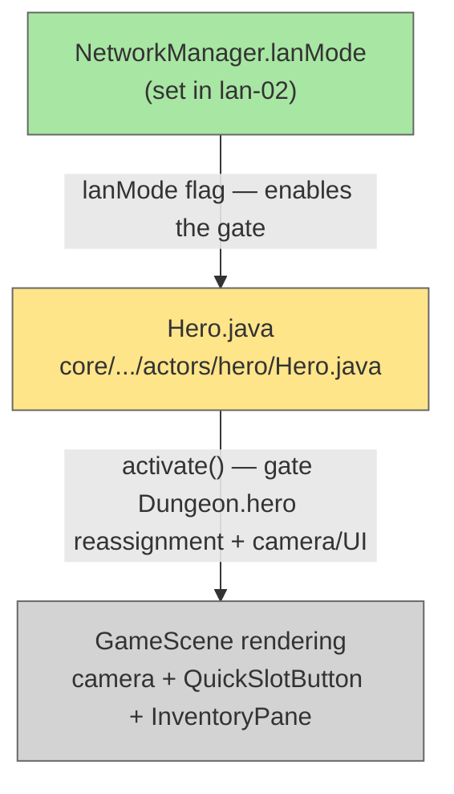

# Plan: LAN Multiplayer — 01 Local Hero Pinning

## System Intent

- What is being built: In LAN mode, `Dungeon.hero` stays pinned to the local hero for the entire session — it is never reassigned to a remote hero. `Hero.activate()` is gated so that camera panning, UI refresh, and `Dungeon.hero` reassignment only fire when the acting hero is already `Dungeon.hero` (i.e. the local hero). Remote heroes run their turns silently — the simulation stays deterministic, but nothing touches the local player's view or controls. No new `localHero` field is needed; `Dungeon.hero` itself is the identity of the local hero.
- Primary consumer(s): `Hero.act()`, `Hero.activate()`, later sub-plans (lan-05 reads `Dungeon.hero` to decide whether to block on input or network).
- Boundary: One change only — gate `Hero.activate()`. No network code. No UI. In solo/pass-and-play mode behaviour is unchanged (lanMode is false, gate never fires).

## Stage Gate Tracker

- [ ] Stage 1 Mermaid approved
- [x] Stage 2 Flows approved
- [x] Stage 3 Logs + Deployment approved or skipped

## Mermaid Diagram



ONCE YOU GET APPROVAL FROM THE DEVELOPER, DELETE THIS LINE AND UPDATE THE STAGE GATE TRACKER

## Flows

### Global Types

```txt
StandardError {
  message: string (human-readable description of what went wrong)
}
```

### Flow: `activateGate`

- Test files: N/A
- Core files: `core/src/main/java/com/shatteredpixel/shatteredpixeldungeon/actors/hero/Hero.java`

#### Types

```txt
ActivateContext {
  this: Hero           // the hero whose turn is being processed
  Dungeon.hero: Hero   // the local hero — never changes in LAN mode
  NetworkManager.lanMode: boolean
}
```

#### Paths

| path | input | output | path-type | notes | updated |
| --- | --- | --- | --- | --- | --- |
| `activateGate.solo` | lanMode=false | full activate: `Dungeon.hero = this`, camera pan, UI refresh | happy path | no behavioral change from today | |
| `activateGate.lan-local` | lanMode=true, this==Dungeon.hero | full activate (camera pan, UI refresh); `Dungeon.hero = this` is a no-op since it's already set | happy path | local hero's turn looks and feels normal | |
| `activateGate.lan-remote` | lanMode=true, this!=Dungeon.hero | early return — no camera pan, no UI refresh, no Dungeon.hero reassignment | happy path | remote hero acts silently like a mob | |

#### Pseudocode

```
Hero.activate():
  if (NetworkManager.lanMode && this != Dungeon.hero) {
    return;   // remote hero — skip all camera/UI/singleton work
  }
  // existing activate() body unchanged:
  Dungeon.hero = this;
  Dungeon.quickslot = this.quickslot;
  InventoryPane.lastBag = this.belongings.backpack;
  Game.runOnRenderThread(() -> {
    Camera.main.panTo(self.sprite.center(), 5f);
    QuickSlotButton.refresh();
    InventoryPane.refresh();
  });
```

#### Why FOV and heroFOV need no separate gate

`Dungeon.observe()` is called in `Hero.act()` and internally uses `Dungeon.hero` (the local hero) to recompute `heroFOV`. Since `Dungeon.hero` never changes in LAN mode, `heroFOV` is always recomputed from the local hero's position — even when a remote hero's `act()` triggers `observe()`. No throwaway array or separate gate is required.

## Logs

| Source | Location |
|--------|----------|
| N/A | No new log messages needed |

## Deployment

- Mechanism: `local only`
- Deploy command:
  ```bash
  ./gradlew desktop:run
  ```
- Notes: Purely additive. Gate only activates when `NetworkManager.lanMode == true`, which is set in lan-02. Solo and pass-and-play behaviour is identical to today.

ONCE YOU GET APPROVAL FROM THE DEVELOPER, DELETE THIS LINE AND UPDATE THE STAGE GATE TRACKER
