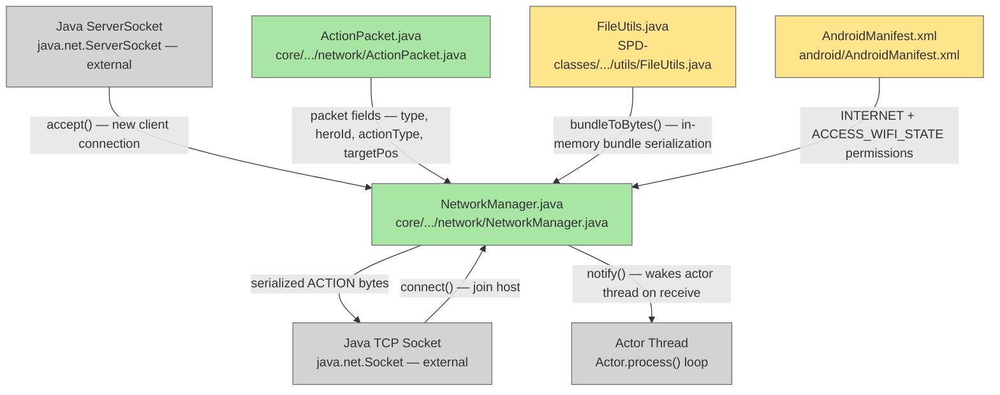

# Plan: LAN Multiplayer — 02 Network Manager

## System Intent

- What is being built: A `NetworkManager` singleton wrapping Java TCP sockets (`java.net.ServerSocket` / `Socket`) with a binary packet protocol. Also includes an `ActionPacket` DTO, a new `FileUtils.bundleToBytes()` public helper, and Android permissions. The `lanMode` static boolean flag is defined here and read by all other sub-plans.
- Primary consumer(s): All other LAN sub-plans (lan-03 through lan-08). Nothing in the existing codebase is modified except `FileUtils.java` (one new public method) and `AndroidManifest.xml` (two permissions).
- Boundary: Pure networking plumbing. No game logic changes. Uses `java.net` (available on Android API 21+ and desktop via LibGDX JVM). No new Gradle dependencies.

## Stage Gate Tracker

- [ ] Stage 1 Mermaid approved
- [x] Stage 2 Flows approved
- [x] Stage 3 Logs + Deployment approved or skipped

## Mermaid Diagram



ONCE YOU GET APPROVAL FROM THE DEVELOPER, DELETE THIS LINE AND UPDATE THE STAGE GATE TRACKER

## Flows

### Global Types

```txt
StandardError {
  message: string (human-readable description of what went wrong)
}

PacketType {
  ACTION          = 1   // [byte type] [int heroId] [byte actionType] [int targetPos]
  HASH            = 2   // [byte type] [int turn] [long hash]
  HANDSHAKE       = 3   // [byte type] [long seed] [int playerCount] [int[] heroClassOrdinals]
  PLAYER_JOINED   = 4   // [byte type] [int playerIndex] [int currentPlayers]
  START           = 5   // [byte type] [int playerCount] [long seed]
  HERO_READY      = 6   // [byte type] [byte heroClassOrdinal]
  SAVE_LOBBY_INFO = 7   // [byte type] [int playerCount] [String[] heroNames] [byte[] heroClasses] [int[] heroHP]
  RESUME_START    = 8   // [byte type] [int playerCount]
  HERO_CLAIM      = 9   // [byte type] [int heroIndex]
  RESUME_HANDSHAKE= 10  // [byte type] [int bundleLen] [byte[] dungeonBundle] [int[] heroAssignments]
  CLASS_CLAIMED   = 11  // [byte type] [int playerIndex] [byte heroClassOrdinal]
  CLASS_REJECTED  = 12  // [byte type] [int playerIndex]
  CLASS_UNCLAIMED = 13  // [byte type] [int playerIndex] [byte heroClassOrdinal]
}
```

### Flow: `networkManagerInit`

- Test files: N/A
- Core files: `core/src/main/java/com/shatteredpixel/shatteredpixeldungeon/network/NetworkManager.java` (new)

#### Types

```txt
NetworkManagerFields {
  serverSocket: ServerSocket
  peerSockets: List<Socket>         // one per connected client (host-side); single socket (client-side)
  ins: List<DataInputStream>
  outs: List<DataOutputStream>
  isHost: boolean
  localPlayerIndex: int
  lanMode: boolean (static)         // false by default; set true when LAN session starts
  connectedPlayerCount: int
}
```

#### Paths

| path | input | output | path-type | notes | updated |
| --- | --- | --- | --- | --- | --- |
| `init.host` | `hostGame(port)` called | `ServerSocket` open on port; `isHost=true`; `lanMode=true` | happy path | blocks in accept() loop until playerCount reached | |
| `init.client` | `joinGame(ip, port)` called | `Socket` connected to host; `isHost=false`; `lanMode=true` | happy path | | |
| `init.host-bind-fail` | port already in use | `IOException` propagated; lanMode stays false | error | caller shows error toast | |
| `init.client-connect-fail` | bad IP or host unreachable | `IOException` propagated | error | caller shows error toast | |

#### Pseudocode

```
class NetworkManager {
  public static boolean lanMode = false;
  public static int localPlayerIndex = 0;

  // Host: open server, accept clients in a loop
  public static void hostGame(int port) throws IOException {
    serverSocket = new ServerSocket(port);
    lanMode = true;
    isHost = true;
    localPlayerIndex = 0;
    // Accept clients in a background thread; each accepted socket added to peerSockets
    // Send PLAYER_JOINED to new client and broadcast updated list to all
  }

  // Client: connect to host
  public static void joinGame(String ip, int port) throws IOException {
    Socket s = new Socket(ip, port);
    s.setSoTimeout(5000);  // 5s timeout on all reads
    peerSocket = s;
    in = new DataInputStream(s.getInputStream());
    out = new DataOutputStream(s.getOutputStream());
    lanMode = true;
    isHost = false;
  }

  public static void disconnect() {
    lanMode = false;
    // close all streams and sockets; swallow IOExceptions
  }
}
```

---

### Flow: `sendReceiveAction`

- Test files: N/A
- Core files: `core/src/main/java/com/shatteredpixel/shatteredpixeldungeon/network/NetworkManager.java`

#### Types

```txt
ActionPacket {
  type: byte = 1
  heroId: int
  actionType: byte  // 0=move, 1=attack, 2=interact, 3=rest, ...
  targetPos: int    // cell index
}
```

#### Paths

| path | input | output | path-type | notes | updated |
| --- | --- | --- | --- | --- | --- |
| `action.send` | `sendAction(HeroAction action, int heroId)` | ACTION bytes written to all peer streams | happy path | called before curAction dispatch in Hero.act() | |
| `action.receive-async` | background reader thread | `remoteHero.curAction` set; `Actor.class.notifyAll()` | happy path | mirrors touch-input wake pattern | |
| `action.receive-timeout` | `SocketTimeoutException` in reader | `Signal.dispatch(PEER_DISCONNECTED)` | error | actor thread wakes with null action; detected upstream | |
| `action.receive-interrupt` | `Thread.interrupt()` during read | reader exits cleanly | error | `GameScene.destroy()` path | |

#### Pseudocode

```
sendAction(HeroAction action, int heroId):
  for (DataOutputStream out : outs) {
    out.writeByte(PacketType.ACTION);
    out.writeInt(heroId);
    out.writeByte(actionTypeOrdinal(action));
    out.writeInt(targetPosOf(action));
    out.flush();
  }

receiveActionAsync(Hero remoteHero):
  new Thread(() -> {
    try {
      byte type = in.readByte();
      // ... read heroId, actionType, targetPos ...
      remoteHero.curAction = decodeAction(actionType, targetPos);
      synchronized (Actor.class) { Actor.class.notifyAll(); }
    } catch (SocketTimeoutException e) {
      Signal.dispatch(new Signal.PEER_DISCONNECTED());
    } catch (InterruptedIOException | InterruptedException e) {
      Thread.currentThread().interrupt();  // preserve interrupt flag
    }
  }, "net-reader").start();
```

---

### Flow: `sendReceiveHash`

- Test files: N/A
- Core files: `core/src/main/java/com/shatteredpixel/shatteredpixeldungeon/network/NetworkManager.java`

#### Types

```txt
HashPacket {
  type: byte = 2
  turn: int
  hash: long
}
```

#### Paths

| path | input | output | path-type | notes | updated |
| --- | --- | --- | --- | --- | --- |
| `hash.send` | `sendHash(hash, turn)` | HASH bytes written | happy path | called every 10 turns | |
| `hash.receive` | `receiveHash()` | `HashPacket` returned | happy path | blocking with setSoTimeout | |
| `hash.timeout` | peer slow to respond | `SocketTimeoutException` | error | treat as disconnect | |

#### Pseudocode

```
sendHash(long hash, int turn):
  out.writeByte(PacketType.HASH);
  out.writeInt(turn);
  out.writeLong(hash);
  out.flush();

receiveHash():
  byte type = in.readByte();   // expects HASH=2
  int turn   = in.readInt();
  long hash  = in.readLong();
  return new HashPacket(turn, hash);
```

---

### Flow: `bundleToBytesHelper`

- Test files: N/A
- Core files: `SPD-classes/src/main/java/com/watabou/utils/FileUtils.java`

#### Types

```txt
BundleBytes {
  bundle: Bundle
  -> byte[]  // in-memory serialized form; used for RESUME_HANDSHAKE payload
}
```

#### Paths

| path | input | output | path-type | notes | updated |
| --- | --- | --- | --- | --- | --- |
| `bundleToBytes.success` | valid Bundle | `byte[]` of serialized JSON/binary | happy path | wraps the existing private `bundleToStream` | |
| `bundleToBytes.failure` | serialization error | `IOException` propagated | error | | |

#### Pseudocode

```
// FileUtils.java — new public method
public static byte[] bundleToBytes(Bundle bundle) throws IOException {
  ByteArrayOutputStream baos = new ByteArrayOutputStream();
  // Replicates bundleToStream logic:
  //   Writer writer = new OutputStreamWriter(new GZIPOutputStream(baos));
  //   new JSONObject(bundle.getData()).write(writer); writer.close();
  // or: call bundleToStream(bundle, baos) if we make it package-accessible
  return baos.toByteArray();
}
```

---

### Flow: `androidPermissions`

- Test files: N/A
- Core files: `android/src/main/AndroidManifest.xml`

#### Paths

| path | input | output | path-type | notes | updated |
| --- | --- | --- | --- | --- | --- |
| `permissions.add` | build | `INTERNET` + `ACCESS_WIFI_STATE` in manifest | happy path | required for TCP sockets and IP discovery | |

#### Pseudocode

```xml
<!-- android/src/main/AndroidManifest.xml — add inside <manifest> tag -->
<uses-permission android:name="android.permission.INTERNET" />
<uses-permission android:name="android.permission.ACCESS_WIFI_STATE" />
```

## Logs

| Source | Location |
|--------|----------|
| Network errors | `ShatteredPixelDungeon.reportException(e)` in all catch blocks |
| Connection events | `GLog.p("Connected as player %d", localPlayerIndex)` |
| Disconnect events | `GLog.w("Peer disconnected")` |

## Deployment

- Mechanism: `local only`
- Deploy command:
  ```bash
  ./gradlew desktop:run
  # For Android: ./gradlew android:installDebug
  ```
- Notes: `java.net` sockets are available without additional Gradle dependencies. Android permissions must be in the manifest before any socket call at runtime.

ONCE YOU GET APPROVAL FROM THE DEVELOPER, DELETE THIS LINE AND UPDATE THE STAGE GATE TRACKER
