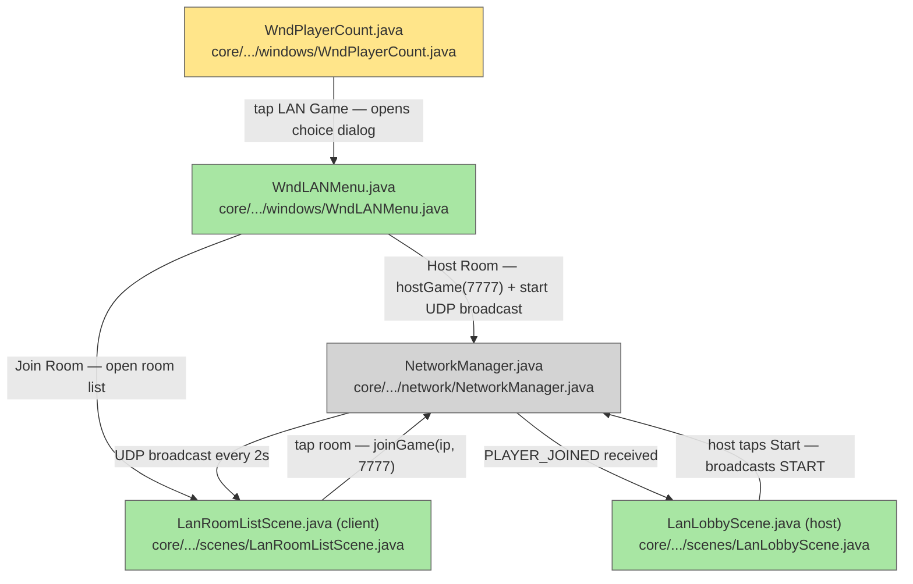

# Plan: LAN Multiplayer — 03 Lobby UI

## System Intent

- What is being built: LAN session entry UI. A "LAN Game" option is added to the existing `WndPlayerCount` dialog (below the 4-player button). Tapping it opens `WndLANMenu` (Host / Join). Host path creates `LanLobbyScene` showing connected player slots (max 4) and a Start button; the host also broadcasts a UDP discovery packet every 2 seconds so clients can find the room automatically. Client path shows a room-discovery list (`LanRoomListScene`) populated by UDP broadcasts — player taps a room to join, no IP entry required. Once the host taps Start, all devices transition to `HeroSelectScene` for their own slot (lan-04).
- Primary consumer(s): Player at the title screen. Calls `NetworkManager.hostGame()` / `NetworkManager.joinGame()` — no game logic.
- Boundary: Lobby phase only. Ends when host broadcasts START. Hero selection and dungeon init are lan-04.

## Stage Gate Tracker

- [ ] Stage 1 Mermaid approved
- [x] Stage 2 Flows approved
- [x] Stage 3 Logs + Deployment approved or skipped

## Mermaid Diagram



ONCE YOU GET APPROVAL FROM THE DEVELOPER, DELETE THIS LINE AND UPDATE THE STAGE GATE TRACKER

## Flows

### Global Types

```txt
StandardError {
  message: string
}
```

### Flow: `wndPlayerCountLanButton`

- Test files: N/A
- Core files: `core/src/main/java/com/shatteredpixel/shatteredpixeldungeon/windows/WndPlayerCount.java`

#### Types

```txt
WndPlayerCountInput {
  (none — user tap)
}
WndPlayerCountOutput {
  (side effect: WndLANMenu shown)
}
```

#### Paths

| path | input | output | path-type | notes | updated |
| --- | --- | --- | --- | --- | --- |
| `lanButton.tap` | user taps "LAN Game" button | `WndLANMenu` shown over current scene | happy path | button added below 4-player option in the existing loop | |

#### Pseudocode

```
WndPlayerCount constructor — after the existing for (count 1..4) loop:

  RedButton btnLAN = new RedButton("LAN Game") {
    @Override protected void onClick() {
      super.onClick();
      hide();
      ShatteredPixelDungeon.scene().addToFront(new WndLANMenu());
    }
  };
  btnLAN.setRect(0, pos, WIDTH, BTN_HEIGHT);
  add(btnLAN);
  pos += BTN_HEIGHT + GAP;

  resize(WIDTH, (int)pos);
```

---

### Flow: `wndLANMenu`

- Test files: N/A
- Core files: `core/src/main/java/com/shatteredpixel/shatteredpixeldungeon/windows/WndLANMenu.java` (new)

#### Paths

| path | input | output | path-type | notes | updated |
| --- | --- | --- | --- | --- | --- |
| `lanMenu.host` | tap "Host Room" | `NetworkManager.hostGame(7777)` called; `LanLobbyScene` shown | happy path | |
| `lanMenu.join` | tap "Join Room" | `WndJoinGame` shown | happy path | |
| `lanMenu.hostFail` | hostGame throws IOException | error toast shown; lanMode stays false | error | port in use or no network |

#### Pseudocode

```
class WndLANMenu extends Window {
  "Host Room" button onClick():
    try {
      NetworkManager.hostGame(7777);
      hide();
      ShatteredPixelDungeon.switchScene(LanLobbyScene.class);
    } catch (IOException e) {
      showToast("Could not open room: " + e.getMessage());
    }

  "Join Room" button onClick():
    hide();
    ShatteredPixelDungeon.scene().addToFront(new WndJoinGame());
}
```

---

### Flow: `lanLobbySceneHost`

- Test files: N/A
- Core files: `core/src/main/java/com/shatteredpixel/shatteredpixeldungeon/scenes/LanLobbyScene.java` (new)

#### Types

```txt
LobbyPlayerSlot {
  index: int
  label: String  // "Host" for slot 0, "Player N" for others, "Empty" if not yet filled
}
```

#### Paths

| path | input | output | path-type | notes | updated |
| --- | --- | --- | --- | --- | --- |
| `lobby.host-waiting` | scene created as host | IP shown, 1 slot filled (host), Start disabled | happy path | accepts connections in background |
| `lobby.host-player-joined` | PLAYER_JOINED received | slot list updates; Start enabled when ≥2 | happy path | |
| `lobby.host-start` | tap Start (≥2 players) | generates seed; broadcasts `START {playerCount, seed}`; transitions to HeroSelectScene | happy path | |
| `lobby.host-max` | 4th player joins | no more connections accepted; Start auto-enables | happy path | |

#### Pseudocode

```
LanLobbyScene (host mode):
  create():
    show device IP (NetworkInterface.getNetworkInterfaces scan)
    show slot list [slot 0 = "Host (You)", slots 1-3 = "Empty"]
    show "Waiting for players..." label
    show "Start Game" button (disabled)
    start background thread: accept client connections, send PLAYER_JOINED, update slot list

  onPlayerJoined(int playerIndex, int total):
    update slot list display
    if total >= 2: enable Start button

  onStartTapped():
    long seed = new Random().nextLong()
    NetworkManager.sendStart(playerCount, seed)
    GamesInProgress.playerCount = 1          // each device selects one hero
    GamesInProgress.selectedClasses = new ArrayList<>()
    GamesInProgress.currentPlayerSelecting = 0
    ShatteredPixelDungeon.switchScene(HeroSelectScene.class)
```

---

### Flow: `lanLobbySceneClient`

- Test files: N/A
- Core files: `core/src/main/java/com/shatteredpixel/shatteredpixeldungeon/scenes/LanLobbyScene.java` (new)

#### Paths

| path | input | output | path-type | notes | updated |
| --- | --- | --- | --- | --- | --- |
| `lobby.client-waiting` | scene created as client | slot list shown, "Waiting for host..." label, no Start button | happy path | |
| `lobby.client-player-joined` | PLAYER_JOINED broadcast received | slot list updates | happy path | |
| `lobby.client-start` | START packet received from host | stores seed + playerCount; transitions to HeroSelectScene | happy path | |

#### Pseudocode

```
LanLobbyScene (client mode):
  create():
    show slot list (populated from PLAYER_JOINED packets)
    show "Waiting for host to start..." label
    start background thread: listen for PLAYER_JOINED and START packets

  onStartReceived(int playerCount, long seed):
    Dungeon.seed = seed
    GamesInProgress.playerCount = 1
    GamesInProgress.selectedClasses = new ArrayList<>()
    GamesInProgress.currentPlayerSelecting = 0
    ShatteredPixelDungeon.switchScene(HeroSelectScene.class)
```

---

### Flow: `udpRoomDiscovery`

- Test files: N/A
- Core files: `core/src/main/java/com/shatteredpixel/shatteredpixeldungeon/network/NetworkManager.java`, `core/src/main/java/com/shatteredpixel/shatteredpixeldungeon/scenes/LanRoomListScene.java` (new)

#### Types

```txt
UDPDiscoveryPacket {
  gameId: String = "SPD-MP"  // identifies packets as belonging to this game
  hostIP: String
  tcpPort: int = 7777
  roomName: String           // host device name or "Room"
  currentPlayers: int
  maxPlayers: int = 4
}
```

#### Paths

| path | input | output | path-type | notes | updated |
| --- | --- | --- | --- | --- | --- |
| `udp.host-broadcast` | `startDiscoveryBroadcast()` called after `hostGame()` | UDP packet sent to 255.255.255.255:7778 every 2s | happy path | background thread; stops when lobby closes or game starts |
| `udp.client-listen` | `LanRoomListScene` created | background thread listens on UDP port 7778 | happy path | |
| `udp.room-discovered` | UDP packet received with gameId=="SPD-MP" | room entry added/updated in list | happy path | deduplicated by hostIP |
| `udp.room-stale` | no packet from host for 6s | room entry removed from list | happy path | client detects host gone |
| `udp.tap-join` | player taps a room in the list | `NetworkManager.joinGame(hostIP, 7777)`; switch to `LanLobbyScene` | happy path | no IP typing needed |
| `udp.connect-fail` | joinGame throws IOException | error toast shown; stays on room list | error | host may have started already |

#### Pseudocode

```
NetworkManager.startDiscoveryBroadcast(String roomName, int currentPlayers):
  new Thread(() -> {
    DatagramSocket udp = new DatagramSocket();
    udp.setBroadcast(true);
    while (lanMode && !gameStarted) {
      byte[] data = buildDiscoveryPacket(roomName, currentPlayers);
      udp.send(new DatagramPacket(data, data.length,
               InetAddress.getByName("255.255.255.255"), 7778));
      Thread.sleep(2000);
    }
    udp.close();
  }).start();

LanRoomListScene:
  create():
    show "Looking for rooms..." label
    show scrollable room list (initially empty)
    start UDP listener thread on port 7778
    show "Back" button

  onPacketReceived(UDPDiscoveryPacket packet):
    if packet.gameId != "SPD-MP": ignore
    add or update room entry by packet.hostIP
    refresh list display

  onRoomTapped(String hostIP):
    try {
      NetworkManager.joinGame(hostIP, 7777);
      ShatteredPixelDungeon.switchScene(LanLobbyScene.class);
    } catch (IOException e) {
      showToast("Could not connect");
    }
```

## Logs

| Source | Location |
|--------|----------|
| N/A | No new GLog messages — lobby errors surfaced via in-dialog text |

## Deployment

- Mechanism: `local only`
- Deploy command:
  ```bash
  ./gradlew android:assembleDebug
  ```
- Notes: Requires lan-02 (NetworkManager) to exist before implementation. UI components compile independently of game logic.

ONCE YOU GET APPROVAL FROM THE DEVELOPER, DELETE THIS LINE AND UPDATE THE STAGE GATE TRACKER
