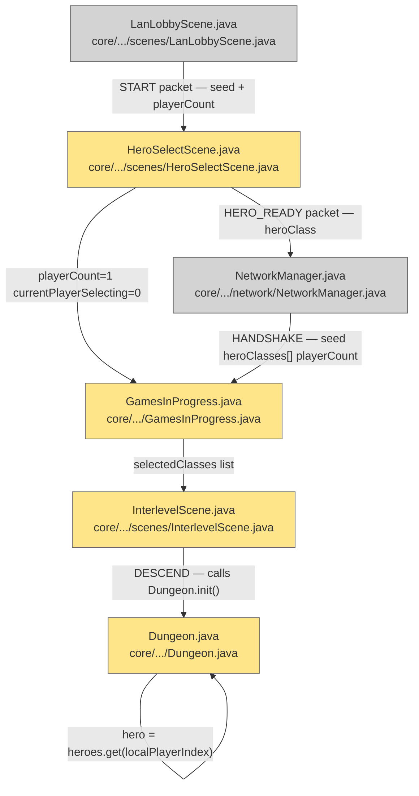

# Plan: LAN Multiplayer — 04 New Game Flow

## System Intent

- What is being built: The per-device hero selection and dungeon initialization flow for a new LAN game. Each device runs `HeroSelectScene` with `playerCount=1` so only its local hero is selected (bypassing the pass-and-play multi-hero loop). After selection, devices exchange `HERO_READY`/`HANDSHAKE` packets. Clients overwrite `GamesInProgress.selectedClasses` from the handshake before `InterlevelScene` runs `Dungeon.init()`. `Dungeon.hero` is set immediately after heroes are spawned.
- Primary consumer(s): `HeroSelectScene`, `InterlevelScene`, `GamesInProgress`, `Dungeon.init()`.
- Boundary: Covers new-game startup only. Resume flow is in lan-07.

## Stage Gate Tracker

- [ ] Stage 1 Mermaid approved
- [x] Stage 2 Flows approved
- [x] Stage 3 Logs + Deployment approved or skipped

## Mermaid Diagram



ONCE YOU GET APPROVAL FROM THE DEVELOPER, DELETE THIS LINE AND UPDATE THE STAGE GATE TRACKER

## Flows

### Global Types

```txt
StandardError {
  message: string (human-readable description of what went wrong)
}

HandshakePayload {
  seed: long
  playerCount: int
  heroClasses: HeroClass[]   // one per player, in playerIndex order
}
```

### Flow: `perDeviceHeroSelect`

- Test files: N/A
- Core files: `core/src/main/java/com/shatteredpixel/shatteredpixeldungeon/scenes/HeroSelectScene.java`, `core/src/main/java/com/shatteredpixel/shatteredpixeldungeon/GamesInProgress.java`

#### Types

```txt
HeroSelectSetup {
  playerCount: int = 1             // only local hero selected
  currentPlayerSelecting: int = 0  // always slot 0 in LAN mode
}
```

#### Paths

| path | input | output | path-type | notes | updated |
| --- | --- | --- | --- | --- | --- |
| `heroSelect.lan-enter` | LAN session, START received | `HeroSelectScene` entered with `playerCount=1` | happy path | bypasses pass-and-play multi-hero loop | |
| `heroSelect.lan-complete` | hero chosen | `HERO_READY { heroClassOrdinal }` sent; wait for HANDSHAKE | happy path | host waits for all HERO_READY before broadcasting HANDSHAKE | |
| `heroSelect.solo` | non-LAN game | existing pass-and-play loop unchanged | happy path | no behavioral change | |

#### Pseudocode

```
HeroSelectScene.create():
  if (NetworkManager.lanMode) {
    // Single-hero select — this device picks its own hero only
    GamesInProgress.playerCount = 1;
    GamesInProgress.currentPlayerSelecting = 0;
  }
  // Existing hero selection UI renders normally for slot 0

HeroSelectScene.onHeroChosen(HeroClass cls):
  if (NetworkManager.lanMode) {
    // Store local choice, send to host
    localHeroClass = cls;
    GamesInProgress.selectedClasses = new ArrayList<>();
    GamesInProgress.selectedClasses.add(cls);
    NetworkManager.sendHeroReady(cls);
    // Now wait for HANDSHAKE before transitioning
    if (NetworkManager.isHost) {
      waitForAllHeroReady(GamesInProgress.playerCount);  // blocking in background thread
      // Once all HERO_READY received:
      NetworkManager.broadcastHandshake(Dungeon.seed, collectedClasses);
      overwriteSelectedClasses(collectedClasses);
      Game.switchScene(InterlevelScene.class);  // DESCEND mode
    } else {
      waitForHandshake();  // background thread; on receive:
      //   overwriteSelectedClasses(handshake.heroClasses);
      //   Dungeon.seed = handshake.seed;
      //   Game.switchScene(InterlevelScene.class);
    }
  } else {
    // existing pass-and-play flow
  }

overwriteSelectedClasses(HeroClass[] classes):
  GamesInProgress.selectedClasses = Arrays.asList(classes);
  // This ensures Dungeon.init() spawns all heroes in correct playerIndex order
```

---

### Flow: `handshakeExchange`

- Test files: N/A
- Core files: `core/src/main/java/com/shatteredpixel/shatteredpixeldungeon/network/NetworkManager.java` (ref), `core/src/main/java/com/shatteredpixel/shatteredpixeldungeon/scenes/HeroSelectScene.java`

#### Types

```txt
HeroReadyPacket {
  type: byte = 6
  heroClassOrdinal: byte
}

HandshakePacket {
  type: byte = 3
  seed: long
  playerCount: int
  heroClassOrdinals: int[]
}
```

#### Paths

| path | input | output | path-type | notes | updated |
| --- | --- | --- | --- | --- | --- |
| `handshake.host-collect` | host receives all HERO_READY | `collectedClasses[]` assembled in playerIndex order | happy path | index 0 = host's own class | |
| `handshake.broadcast` | all classes collected | HANDSHAKE packet sent to all clients | happy path | | |
| `handshake.client-receive` | client receives HANDSHAKE | `GamesInProgress.selectedClasses` overwritten; proceed to InterlevelScene | happy path | must happen before InterlevelScene | |
| `handshake.timeout` | client never receives HANDSHAKE | error shown; return to title | error | 30s timeout | |

---

### Flow: `dungeonInitLAN`

- Test files: N/A
- Core files: `core/src/main/java/com/shatteredpixel/shatteredpixeldungeon/Dungeon.java`, `core/src/main/java/com/shatteredpixel/shatteredpixeldungeon/scenes/InterlevelScene.java`

#### Types

```txt
DungeonInitState {
  seed: long              // set before InterlevelScene; from host in HANDSHAKE
  selectedClasses: List<HeroClass>  // full list from HANDSHAKE, in playerIndex order
  Dungeon.hero: Hero  // pinned to local hero — never reassigned in LAN
}
```

#### Paths

| path | input | output | path-type | notes | updated |
| --- | --- | --- | --- | --- | --- |
| `dungeonInit.descend` | InterlevelScene DESCEND mode | `Dungeon.init()` called; all heroes spawned from `selectedClasses` | happy path | `Random.pushGenerator(seed+1)` per existing code | |
| `dungeonInit.local-hero-set` | after heroes spawned | `Dungeon.hero = heroes.get(localPlayerIndex)` | happy path | Dungeon.hero is now pinned to local hero for session | |
| `dungeonInit.rng-determinism` | same seed on both devices | identical hero spawn order and dungeon layout | happy path | `Generator.fullReset()` called by `Dungeon.init()`; deterministic from seed | |

#### Pseudocode

```
// InterlevelScene runs Dungeon.init() which internally does:
//   Generator.fullReset();
//   Random.pushGenerator(Dungeon.seed + 1);   // NOTE: +1 offset is intentional in existing code
//   for (HeroClass cls : GamesInProgress.selectedClasses) { spawnHero(cls); }

// After InterlevelScene completes Dungeon.init():
if (NetworkManager.lanMode) {
  Dungeon.hero = Dungeon.heroes.get(NetworkManager.localPlayerIndex);
  Dungeon.hero = Dungeon.hero;
}

// Result: each device has all heroes in Dungeon.heroes; each device's camera/UI/FOV
// is pinned to its own Dungeon.hero via the gates from lan-01.
```

---

### Flow: `classClaimedBroadcast`

- Test files: N/A
- Core files: `core/src/main/java/com/shatteredpixel/shatteredpixeldungeon/scenes/HeroSelectScene.java`, `core/src/main/java/com/shatteredpixel/shatteredpixeldungeon/network/NetworkManager.java`

#### Types

```txt
ClassClaimedPacket {
  type: byte = 11
  playerIndex: int
  heroClassOrdinal: byte
}

ClassUnclaimedPacket {
  type: byte = 13
  playerIndex: int
  heroClassOrdinal: byte  // the class being released
}

ClassRejectedPacket {
  type: byte = 12
  playerIndex: int   // the player whose claim was rejected
}
```

#### Paths

| path | input | output | path-type | notes | updated |
| --- | --- | --- | --- | --- | --- |
| `classClaimed.tap` | player taps a class (not yet confirmed) | `CLASS_CLAIMED {playerIndex, ordinal}` sent; class reserved on all devices | happy path | soft reservation — player can still unselect |
| `classClaimed.swap` | player taps a different class while one is reserved | `CLASS_UNCLAIMED` for old, `CLASS_CLAIMED` for new | happy path | old class becomes available again on all devices |
| `classClaimed.unselect` | player taps selected class again (deselect) | `CLASS_UNCLAIMED {playerIndex, ordinal}` sent; class freed on all devices | happy path | |
| `classClaimed.confirm` | player taps "Play" / confirm button | `HERO_READY {heroClassOrdinal}` sent; no longer changeable | happy path | final lock-in; host waits for all HERO_READY |
| `classClaimed.received` | remote `CLASS_CLAIMED` received | that class greyed out: "Reserved by Player X" | happy path | class becomes unselectable until unclaimed or confirmed |
| `classClaimed.unclaimed-received` | remote `CLASS_UNCLAIMED` received | that class re-enabled in local HeroSelectScene | happy path | |
| `classClaimed.race-host-wins` | two players claim same class simultaneously | host keeps first received; sends `CLASS_REJECTED` to second | guarded | host is authoritative |
| `classClaimed.rejected` | local player receives `CLASS_REJECTED` | class deselected; "Just taken — pick another" shown | guarded | |
| `classClaimed.solo` | non-LAN game | no change | happy path | |

#### Pseudocode

```
// Three selection states for a hero class button:
//   AVAILABLE   — selectable
//   RESERVED    — tapped but not confirmed; player can still swap
//   CONFIRMED   — HERO_READY sent; locked permanently
//   TAKEN       — another player has reserved or confirmed it

// Player taps a class:
HeroSelectScene.onClassTapped(HeroClass cls):
  if cls.state == TAKEN: return  // can't select
  if (currentReservation != null) {
    NetworkManager.sendClassUnclaimed(localPlayerIndex, currentReservation);
    currentReservation.state = AVAILABLE;
  }
  if cls == currentReservation:  // tapping selected class = deselect
    currentReservation = null;
    return;
  NetworkManager.sendClassClaimed(localPlayerIndex, cls);
  currentReservation = cls;
  cls.state = RESERVED;

// Player taps "Play" (confirm):
HeroSelectScene.onConfirm():
  if currentReservation == null: return  // must have a class selected
  NetworkManager.sendHeroReady(currentReservation);
  currentReservation.state = CONFIRMED;
  // wait for HANDSHAKE (existing flow)

// Host arbitration:
NetworkManager (host) on CLASS_CLAIMED from playerIdx:
  if (claimedClasses.containsKey(cls)):
    sendClassRejected(playerIdx);
  else:
    claimedClasses.put(cls, playerIdx);
    broadcastClassClaimed(playerIdx, cls);

NetworkManager (host) on CLASS_UNCLAIMED from playerIdx:
  claimedClasses.remove(cls);
  broadcastClassUnclaimed(playerIdx, cls);
```

## Logs

| Source | Location |
|--------|----------|
| Handshake | `GLog.p("Handshake received — %d players, seed %d", playerCount, seed)` |
| Init | existing `Dungeon.init()` log messages unchanged |

## Deployment

- Mechanism: `local only`
- Deploy command:
  ```bash
  ./gradlew desktop:run
  ```
- Notes: `GamesInProgress.selectedClasses` must be overwritten on the client before `InterlevelScene.create()` is called, as `Dungeon.init()` reads it synchronously during scene setup.

ONCE YOU GET APPROVAL FROM THE DEVELOPER, DELETE THIS LINE AND UPDATE THE STAGE GATE TRACKER
