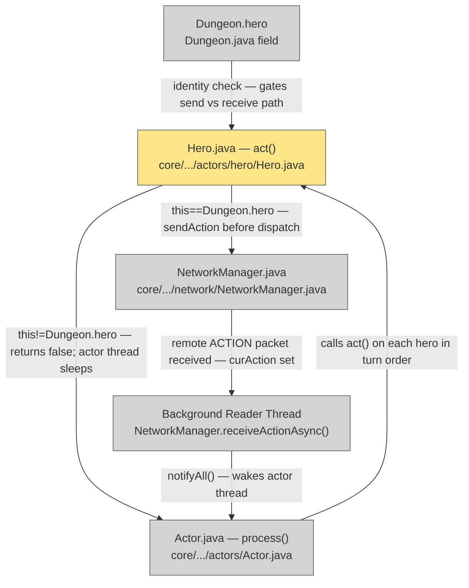

# Plan: LAN Multiplayer — 05 Turn Sync

## System Intent

- What is being built: The per-turn action exchange mechanism. When the local hero's `act()` reaches the action-dispatch point, the chosen `curAction` is sent to all peers via `NetworkManager.sendAction()` before being executed. When a remote hero's `act()` reaches the same point, `act()` returns `false` (exactly as a local hero waiting for touch input), and a background reader thread sets `curAction` and calls `Actor.class.notifyAll()` to wake the actor thread — mirroring the existing touch-input wake pattern. All guards (`isAlive`, `WaitingToFall`, `activate`, FOV, `checkVisibleMobs`, paralysed, `FollowHeroBuff`) run on both local and remote heroes unchanged.
- Primary consumer(s): `Hero.act()`, the actor thread in `Actor.process()`.
- Boundary: Covers the turn exchange only. Desync detection (which fires every 10 turns) is in lan-06.

## Stage Gate Tracker

- [ ] Stage 1 Mermaid approved
- [x] Stage 2 Flows approved
- [x] Stage 3 Logs + Deployment approved or skipped

## Mermaid Diagram



ONCE YOU GET APPROVAL FROM THE DEVELOPER, DELETE THIS LINE AND UPDATE THE STAGE GATE TRACKER

## Flows

### Global Types

```txt
StandardError {
  message: string (human-readable description of what went wrong)
}
```

### Flow: `localTurnSend`

- Test files: N/A
- Core files: `core/src/main/java/com/shatteredpixel/shatteredpixeldungeon/actors/hero/Hero.java`

#### Types

```txt
ActionDispatchContext {
  curAction: HeroAction  // set by handle() or FollowHeroBuff before dispatch
  heroId: int            // == NetworkManager.localPlayerIndex
}
```

#### Paths

| path | input | output | path-type | notes | updated |
| --- | --- | --- | --- | --- | --- |
| `localSend.normal` | local hero has curAction | `NetworkManager.sendAction(curAction, heroId)` fires; then dispatch proceeds | happy path | sendAction before `if (curAction instanceof HeroAction.Move)` chain | |
| `localSend.follow-buff` | `FollowHeroBuff` sets curAction as Move | Move action sent over network; remote device simulates identical move | happy path | no special handling; buff is transparent to network | |
| `localSend.solo` | lanMode=false | no sendAction call; dispatch unchanged | happy path | guarded by `NetworkManager.lanMode` | |

#### Pseudocode

```
Hero.act():
  // -- existing guards (run regardless of LAN) --
  if (!isAlive()) { spend(TICK); return true; }
  if (buff(WaitingToFall.class) != null) { pos = 0; sprite.hide(); spend(TICK); return true; }
  activate();           // gated by lan-01 to skip camera/UI for remote heroes
  fieldOfView = Dungeon.level.heroFOV;
  observe();            // gated by lan-01 for remote heroes
  checkVisibleMobs();
  BuffIndicator.refreshHero(this);
  if (paralysed > 0) { spend(TICK); paralysed--; return true; }
  FollowHeroBuff follow = buff(FollowHeroBuff.class);
  if (follow != null && !follow.isStopped()) { curAction = follow.action(); }

  // -- LAN dispatch gate (insertion point after all guards) --
  if (NetworkManager.lanMode) {
    if (this == Dungeon.hero) {
      // Local hero: wait for input as normal, then transmit
      if (curAction == null) { ready(); return false; }
      // curAction is set — send before dispatching
      NetworkManager.sendAction(curAction, NetworkManager.localPlayerIndex);
      // fall through to existing dispatch below
    } else {
      // Remote hero: start async receiver, return false (actor thread sleeps)
      if (curAction == null) {
        NetworkManager.receiveActionAsync(this);  // sets curAction + notifies on arrival
        return false;
      }
      // curAction already set by background thread — fall through to dispatch
    }
  } else {
    if (curAction == null) { ready(); return false; }
  }

  // -- existing dispatch (unchanged) --
  if (curAction instanceof HeroAction.Move) { return actMove((HeroAction.Move)curAction); }
  if (curAction instanceof HeroAction.Attack) { return actAttack((HeroAction.Attack)curAction); }
  // ... etc ...
```

---

### Flow: `remoteHeroTurnReceive`

- Test files: N/A
- Core files: `core/src/main/java/com/shatteredpixel/shatteredpixeldungeon/network/NetworkManager.java`

#### Types

```txt
ReceivedAction {
  heroId: int
  curAction: HeroAction   // decoded from packet bytes
}
```

#### Paths

| path | input | output | path-type | notes | updated |
| --- | --- | --- | --- | --- | --- |
| `remoteReceive.success` | ACTION packet arrives on background thread | `remoteHero.curAction` set; `Actor.class.notifyAll()` | happy path | actor thread wakes; re-enters Hero.act() with curAction set | |
| `remoteReceive.timeout` | `SocketTimeoutException` | `Signal.PEER_DISCONNECTED` dispatched | error | actor thread wakes via signal; disconnect handling in lan-08 | |
| `remoteReceive.interrupt` | `Thread.interrupt()` during read | reader thread exits; `InterruptedException` swallowed | error | `GameScene.destroy()` path; actor thread interrupted separately | |
| `remoteReceive.wrong-hero` | packet heroId != expected | assertion logged; action applied to correct hero by heroId lookup | error | should not happen in deterministic simulation | |

#### Pseudocode

```
NetworkManager.receiveActionAsync(Hero remoteHero):
  new Thread("net-reader") {
    run():
      try {
        in.setSoTimeout(30_000);   // 30s; longer than any reasonable turn
        byte type = in.readByte(); // expects ACTION = 1
        int heroId    = in.readInt();
        byte actType  = in.readByte();
        int targetPos = in.readInt();

        HeroAction action;
        switch (actType) {
          case 0: action = new HeroAction.Move(targetPos); break;
          case 1: action = new HeroAction.Attack(Dungeon.level.mobs.get(targetPos)); break;
          // ... etc ...
        }
        remoteHero.curAction = action;
        synchronized (Actor.class) { Actor.class.notifyAll(); }

      } catch (SocketTimeoutException e) {
        Signal.dispatch(new Signal.PEER_DISCONNECTED(remoteHero));
        synchronized (Actor.class) { Actor.class.notifyAll(); }  // wake actor thread so it can check
      } catch (InterruptedIOException | InterruptedException e) {
        Thread.currentThread().interrupt();
      }
  }.start();
```

---

### Flow: `actorThreadWake`

- Test files: N/A
- Core files: `core/src/main/java/com/shatteredpixel/shatteredpixeldungeon/actors/Actor.java` (reference only — no changes)

#### Types

```txt
WakeSignal {
  mechanism: Actor.class.notifyAll()   // same as touch-input wake path
}
```

#### Paths

| path | input | output | path-type | notes | updated |
| --- | --- | --- | --- | --- | --- |
| `actorWake.touch-input` | player touches screen | render thread calls `Actor.class.notifyAll()` | happy path | existing path — unchanged | |
| `actorWake.network-action` | background reader receives ACTION packet | reader thread calls `Actor.class.notifyAll()` | happy path | new path — mirrors touch-input exactly | |
| `actorWake.destroy` | `GameScene.destroy()` | `actorThread.interrupt()` then 4500ms wait | happy path | existing path — `SocketTimeoutException` + interrupt both handled | |

#### Pseudocode

```
// Actor.process() loop (existing — NOT modified):
//   synchronized (Actor.class) {
//     while (keepActorThreadAlive && !next.act()) {
//       Actor.class.wait();   // sleeps here for both local and remote heroes
//     }
//   }

// No changes to Actor.java are needed. The existing wait/notify pattern
// is reused: background network reader replaces render thread as the notifier
// for remote-hero turns.
```

---

### Flow: `queuedActionInput`

- Test files: N/A
- Core files:
  - `core/src/main/java/com/shatteredpixel/shatteredpixeldungeon/ui/Toolbar.java`
  - `core/src/main/java/com/shatteredpixel/shatteredpixeldungeon/scenes/GameScene.java`
  - `core/src/main/java/com/shatteredpixel/shatteredpixeldungeon/actors/hero/Hero.java`

#### Types

```txt
QueuedActionContext {
  Dungeon.hero.curAction: HeroAction | null  // one-slot queue; new input overwrites
  Dungeon.hero.ready: boolean                // false during remote hero's turn in LAN
}
```

#### Paths

| path | input | output | path-type | notes | updated |
| --- | --- | --- | --- | --- | --- |
| `queue.input-during-remote-turn` | local player taps during remote hero's turn | `Dungeon.hero.curAction` set; toolbar stays enabled | happy path | action queued; dispatched when local hero's turn comes |
| `queue.overwrite` | player taps again before their turn fires | `curAction` overwritten with new action | happy path | built into curAction being a single field |
| `queue.turn-fires-with-queued` | local hero's turn comes, `curAction` already set | dispatch immediately — skip `ready()` call | happy path | no wait needed; player already chose |
| `queue.turn-fires-without-queued` | local hero's turn comes, `curAction == null` | `ready()` called as normal; player must now input | happy path | standard flow |
| `queue.toolbar-always-enabled` | remote hero is acting | local hero toolbar stays enabled (can input) | happy path | Toolbar.update() checks `Dungeon.hero.isAlive()` not `ready` in LAN mode |
| `queue.solo` | non-LAN game | toolbar enable/disable unchanged | happy path | |

#### Pseudocode

```
// Toolbar.update() — enable toolbar for local hero even during remote turn:
if (lastEnabled != (NetworkManager.lanMode
    ? Dungeon.hero.isAlive()
    : Dungeon.hero.ready && Dungeon.hero.isAlive())) {
  lastEnabled = NetworkManager.lanMode
      ? Dungeon.hero.isAlive()
      : Dungeon.hero.ready && Dungeon.hero.isAlive();
  // ... existing enable/disable loop unchanged ...
}

// GameScene.handleCell() — accept input even when hero not ready:
if (NetworkManager.lanMode) {
  // Queue it; hero.ready may be false (remote hero's turn) but input is accepted
  Dungeon.hero.handle(cell);   // sets curAction; no notify needed here
} else {
  // existing path: only handle if hero.ready
  if (Dungeon.hero.ready) Dungeon.hero.handle(cell);
}

// Hero.act() — local hero path, after all guards:
if (NetworkManager.lanMode && this == Dungeon.hero) {
  if (curAction == null) {
    ready();       // nothing queued — wait for input now
    return false;
  }
  // curAction already set (was queued) — fall through to dispatch immediately
}
```

#### Why overwrite is correct

`curAction` is a single `HeroAction` field. Tapping a new cell while one is queued simply replaces it. The remote hero's turn has no access to `curAction` on the local hero — only the local player sets it. There is no concurrent write risk.

## Logs

| Source | Location |
|--------|----------|
| Action sent | `GLog.d("Action sent: %s for hero %d", curAction, heroId)` — debug only |
| Action received | `GLog.d("Action received for hero %d", heroId)` — debug only |

## Deployment

- Mechanism: `local only`
- Deploy command:
  ```bash
  ./gradlew desktop:run
  ```
- Notes: The insertion point in `Hero.act()` is after `FollowHeroBuff` resolution and before the `curAction instanceof` dispatch chain. The existing `ready()` → `curAction == null` → return false pattern is preserved for the local hero path.

ONCE YOU GET APPROVAL FROM THE DEVELOPER, DELETE THIS LINE AND UPDATE THE STAGE GATE TRACKER
