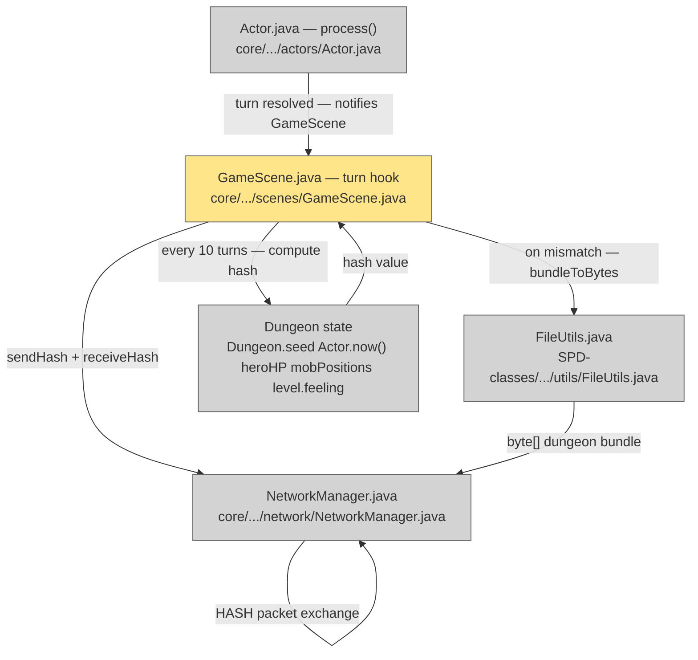

# Plan: LAN Multiplayer — 06 Desync Detection

## System Intent

- What is being built: A lightweight hash-exchange mechanism that fires every 10 turns to verify both devices are in the same simulation state. Every `(int)Actor.now() % 10 == 0`, each device computes a deterministic hash of key game state, sends it to the peer, and compares. On mismatch, the host serializes the full dungeon bundle via `FileUtils.bundleToBytes()` and sends it to the client, which deserializes and replaces its local state.
- Primary consumer(s): Hook point in `GameScene` (or `Actor.process()` after turn resolution); `NetworkManager.sendHash()` / `receiveHash()`; `FileUtils.bundleToBytes()` from lan-02.
- Boundary: Covers periodic hash check and host-authoritative resync only. Disconnect handling (socket errors during desync) is covered by lan-08.

## Stage Gate Tracker

- [ ] Stage 1 Mermaid approved
- [x] Stage 2 Flows approved
- [x] Stage 3 Logs + Deployment approved or skipped

## Mermaid Diagram



ONCE YOU GET APPROVAL FROM THE DEVELOPER, DELETE THIS LINE AND UPDATE THE STAGE GATE TRACKER

## Flows

### Global Types

```txt
StandardError {
  message: string (human-readable description of what went wrong)
}

HashResult {
  match: boolean
  localHash: long
  peerHash: long
  turn: int
}
```

### Flow: `hashCompute`

- Test files: N/A
- Core files: `core/src/main/java/com/shatteredpixel/shatteredpixeldungeon/scenes/GameScene.java`

#### Types

```txt
HashInput {
  Dungeon.seed: long
  Dungeon.hero.HP: int        // Dungeon.hero is pinned to localHero in LAN mode — stable
  Actor.now(): float           // cast to int before use
  Dungeon.level.feeling: Feeling
  mobPositions: int[]          // sorted cell positions of all live mobs
}
```

#### Paths

| path | input | output | path-type | notes | updated |
| --- | --- | --- | --- | --- | --- |
| `hash.trigger` | `(int)Actor.now() % 10 == 0` after turn resolved | hash computed and sent | happy path | must use int cast — `Actor.now()` returns float | |
| `hash.no-trigger` | other turns | no hash exchange | happy path | | |
| `hash.mob-positions` | live mobs in `Dungeon.level.mobs` | sorted int[] of `mob.pos` values | happy path | sort ensures determinism regardless of mob iteration order | |

#### Pseudocode

```
// GameScene — hook called after each turn resolution (e.g. in Actor.process() observer or GameScene update)
private void onTurnResolved() {
  if (!NetworkManager.lanMode) return;
  int turn = (int) Actor.now();
  if (turn % 10 != 0) return;

  long hash = computeHash(turn);
  NetworkManager.sendHash(hash, turn);
  HashPacket peer = NetworkManager.receiveHash();  // blocking with timeout

  if (peer.hash != hash) {
    handleDesync(hash, peer.hash, turn);
  }
}

private long computeHash(int turn) {
  int[] mobPos = new int[Dungeon.level.mobs.size()];
  int i = 0;
  for (Mob m : Dungeon.level.mobs) { mobPos[i++] = m.pos; }
  Arrays.sort(mobPos);

  return Dungeon.seed
      ^ ((long) Dungeon.hero.HP << 32)   // Dungeon.hero == localHero in LAN mode
      ^ (long) turn
      ^ (long) Dungeon.level.feeling.ordinal()
      ^ (long) Arrays.hashCode(mobPos);
}
```

---

### Flow: `hashExchange`

- Test files: N/A
- Core files: `core/src/main/java/com/shatteredpixel/shatteredpixeldungeon/network/NetworkManager.java`

#### Types

```txt
HashPacket {
  type: byte = 2
  turn: int
  hash: long
}
```

#### Paths

| path | input | output | path-type | notes | updated |
| --- | --- | --- | --- | --- | --- |
| `exchange.send` | `sendHash(hash, turn)` | HASH bytes written to peer | happy path | | |
| `exchange.receive` | `receiveHash()` | `HashPacket` returned | happy path | blocking read with setSoTimeout | |
| `exchange.timeout` | peer silent | `SocketTimeoutException` | error | treated as disconnect; signal dispatched | |

---

### Flow: `desyncRecovery`

- Test files: N/A
- Core files: `core/src/main/java/com/shatteredpixel/shatteredpixeldungeon/scenes/GameScene.java`, `core/src/main/java/com/shatteredpixel/shatteredpixeldungeon/network/NetworkManager.java`

#### Types

```txt
ResyncPayload {
  type: byte = implied (host sends raw bundle after mismatch signal)
  bundleLen: int
  dungeonBundle: byte[]
}
```

#### Paths

| path | input | output | path-type | notes | updated |
| --- | --- | --- | --- | --- | --- |
| `recovery.host-send` | hash mismatch detected on host | full dungeon bundle serialized via `FileUtils.bundleToBytes()`; sent to client | happy path | host is authoritative | |
| `recovery.client-receive` | client receives bundle bytes | `Dungeon.loadGame(bundle)` restores state; resume from same turn | happy path | same as resume deserialization in lan-07 | |
| `recovery.overlay` | mismatch detected | "Resyncing..." overlay shown on both devices while bundle transfers | UX | | |
| `recovery.host-bundle-fail` | `FileUtils.bundleToBytes()` throws | log exception; show error dialog; option to quit | error | should not happen; indicates save serialization bug | |

#### Pseudocode

```
handleDesync(long localHash, long peerHash, int turn):
  GLog.w("Desync detected at turn %d: local=%d peer=%d", turn, localHash, peerHash);
  showOverlay("Resyncing...");

  if (NetworkManager.isHost) {
    // Host is authoritative — serialize and send
    Bundle bundle = new Bundle();
    Dungeon.saveGame(bundle);   // populates bundle in-memory
    byte[] bytes = FileUtils.bundleToBytes(bundle);
    NetworkManager.sendResyncBundle(bytes);
    hideOverlay();
  } else {
    // Client — receive and restore
    byte[] bytes = NetworkManager.receiveResyncBundle();
    Bundle bundle = FileUtils.bundleFromBytes(bytes);
    Dungeon.loadGame(bundle);
    Dungeon.hero = Dungeon.heroes.get(NetworkManager.localPlayerIndex);
    Dungeon.hero = Dungeon.hero;
    hideOverlay();
  }
```

## Logs

| Source | Location |
|--------|----------|
| Hash mismatch | `GLog.w("Desync at turn %d", turn)` |
| Resync start/end | `GLog.p("Resyncing...") / GLog.p("Resync complete")` |
| Hash values | `ShatteredPixelDungeon.reportException()` with local+peer hash in message |

## Deployment

- Mechanism: `local only`
- Deploy command:
  ```bash
  ./gradlew desktop:run
  ```
- Notes: The hook point for `onTurnResolved()` should be in `GameScene.update()` checking `Actor.now()`, or via an observer registered with the actor thread. Choose the location that avoids holding the actor lock during the network exchange.

ONCE YOU GET APPROVAL FROM THE DEVELOPER, DELETE THIS LINE AND UPDATE THE STAGE GATE TRACKER
