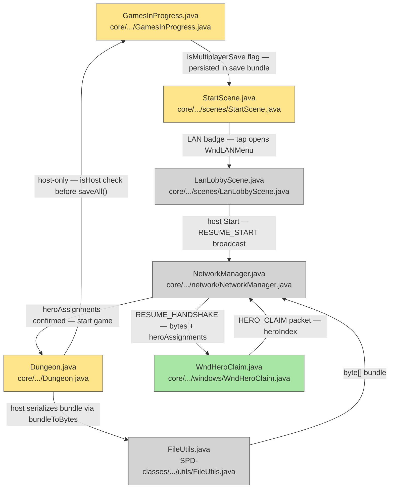

# Plan: LAN Multiplayer — 07 Save and Load

## System Intent

- What is being built: Host-only save (clients skip `Dungeon.saveAll()`); an `isMultiplayerSave` flag on `GamesInProgress.Info` so the title screen can badge LAN save slots; and a full resume flow — host loads normally, clients receive a `RESUME_HANDSHAKE` bundle (byte array from `FileUtils.bundleToBytes()`), and each player picks their hero via `WndHeroClaim`. The existing save format already serializes all heroes under the `"heroes"` key; no save-format changes are needed.
- Primary consumer(s): `GamesInProgress`, `Dungeon.saveAll()`, `StartScene`, `LanLobbyScene` (reused for resume lobby), `WndHeroClaim` (new).
- Boundary: New game flow (hero select + dungeon init) is already handled in lan-04. This plan covers only save, badge, and resume.

## Stage Gate Tracker

- [ ] Stage 1 Mermaid approved
- [x] Stage 2 Flows approved
- [x] Stage 3 Logs + Deployment approved or skipped

## Mermaid Diagram



ONCE YOU GET APPROVAL FROM THE DEVELOPER, DELETE THIS LINE AND UPDATE THE STAGE GATE TRACKER

## Flows

### Global Types

```txt
StandardError {
  message: string (human-readable description of what went wrong)
}

SaveLobbyInfo {
  playerCount: int
  heroNames: String[]     // from Dungeon.heroes
  heroClasses: HeroClass[]
  heroHP: int[]           // read from Dungeon.heroes directly (NOT from GamesInProgress.Info)
}

HeroCard {
  index: int
  name: String
  heroClass: HeroClass
  hp: int
  depth: int
}
```

### Flow: `hostOnlySave`

- Test files: N/A
- Core files: `core/src/main/java/com/shatteredpixel/shatteredpixeldungeon/Dungeon.java`, `core/src/main/java/com/shatteredpixel/shatteredpixeldungeon/GamesInProgress.java`

#### Types

```txt
SaveContext {
  isHost: boolean   // NetworkManager.isHost
  isMultiplayerSave: boolean  // true when lanMode == true
}
```

#### Paths

| path | input | output | path-type | notes | updated |
| --- | --- | --- | --- | --- | --- |
| `save.host` | session ends, isHost=true | `Dungeon.saveAll()` called normally; `isMultiplayerSave=true` in GamesInProgress | happy path | existing save format stores all heroes | |
| `save.client` | session ends, isHost=false | save skipped entirely | happy path | no local save file written on client | |
| `save.solo` | non-LAN session | existing save behavior unchanged | happy path | `isMultiplayerSave=false` | |

#### Pseudocode

```
// Dungeon.java — in GameScene.pause() / quit path:
if (NetworkManager.lanMode) {
  if (NetworkManager.isHost) {
    GamesInProgress.setMultiplayerSave(true);
    Dungeon.saveAll();     // existing — writes all heroes
  }
  // else: client — skip save
} else {
  Dungeon.saveAll();       // existing solo/pass-and-play path
}

// GamesInProgress.java — add to Info:
public boolean isMultiplayerSave = false;
// Persisted in storeInBundle() / restoreFromBundle() under key "isMultiplayerSave"
```

---

### Flow: `saveSLotBadge`

- Test files: N/A
- Core files: `core/src/main/java/com/shatteredpixel/shatteredpixeldungeon/scenes/StartScene.java`

#### Types

```txt
SlotDisplay {
  isMultiplayerSave: boolean   // from GamesInProgress.Info
  badge: "LAN" label rendered on slot card
}
```

#### Paths

| path | input | output | path-type | notes | updated |
| --- | --- | --- | --- | --- | --- |
| `badge.lan-slot` | slot loaded with `isMultiplayerSave=true` | "LAN" badge rendered on slot card | happy path | | |
| `badge.tap-lan-slot` | player taps LAN save slot | `WndLANMenu` shown (same as new-game entry point) | happy path | host/join choice before loading | |
| `badge.solo-slot` | `isMultiplayerSave=false` | existing slot display unchanged | happy path | | |

#### Pseudocode

```
StartScene — slot rendering:
  if (info.isMultiplayerSave) {
    add(new RenderedTextBlock("LAN", ...));   // badge top-right of slot card
  }

StartScene — slot tap:
  if (info.isMultiplayerSave) {
    scene().addToFront(new WndLANMenu(/* resumeSlot = */ slot));
  } else {
    // existing single-player continue flow
  }
```

---

### Flow: `hostResumePath`

- Test files: N/A
- Core files: `core/src/main/java/com/shatteredpixel/shatteredpixeldungeon/Dungeon.java`, `core/src/main/java/com/shatteredpixel/shatteredpixeldungeon/scenes/LanLobbyScene.java`, `core/src/main/java/com/shatteredpixel/shatteredpixeldungeon/network/NetworkManager.java`

#### Types

```txt
ResumeLobbyState {
  savedHeroes: List<HeroCard>   // from Dungeon.heroes after loadGame()
  connectedPlayers: int
  heroAssignments: int[]        // heroIndex -> playerIndex mapping
}
```

#### Paths

| path | input | output | path-type | notes | updated |
| --- | --- | --- | --- | --- | --- |
| `hostResume.load` | tap "Host Room" on LAN save slot | `Dungeon.loadGame()` called; full state in memory | happy path | existing multi-hero restore handles "heroes" key | |
| `hostResume.lobby` | save loaded | `LanLobbyScene` shown with SAVE_LOBBY_INFO data; Start enabled when ≥2 | happy path | SAVE_LOBBY_INFO sent to each connecting client | |
| `hostResume.start` | host taps Start | `RESUME_START { playerCount }` broadcast; host awaits HERO_CLAIM from each client | happy path | | |
| `hostResume.collect-claims` | all clients send HERO_CLAIM | `heroAssignments[]` assembled; host claims leftover index | happy path | | |
| `hostResume.send-bundle` | claims resolved | `FileUtils.bundleToBytes()` produces bytes; `RESUME_HANDSHAKE` broadcast | happy path | Generator seeds included in full bundle (via existing storeInBundle) | |
| `hostResume.set-local-hero` | bundle sent | `Dungeon.hero = heroes.get(assignedIndex)`; game starts | happy path | | |

#### Pseudocode

```
// Host path when tap "Host Room" on LAN save slot:
Dungeon.loadGame(slot);      // restores Dungeon.heroes, Generator state, etc.
NetworkManager.hostGame(7777);

// On each client connect — send lobby info:
SaveLobbyInfo info = new SaveLobbyInfo();
info.playerCount   = Dungeon.heroes.size();
info.heroNames     = heroNames(Dungeon.heroes);
info.heroClasses   = heroClasses(Dungeon.heroes);
info.heroHP        = heroHPs(Dungeon.heroes);  // read from Dungeon.heroes, NOT GamesInProgress
NetworkManager.sendSaveLobbyInfo(clientOut, info);

// Host taps Start:
NetworkManager.broadcastResumeStart(connectedPlayers);
int[] claims = awaitHeroClaims(connectedPlayers - 1);  // all clients; host gets leftover
int hostAssignment = firstUnclaimedIndex(claims);
int[] heroAssignments = buildAssignments(claims, hostAssignment);

Bundle bundle = new Bundle();
Dungeon.saveGame(bundle);   // in-memory
byte[] bytes = FileUtils.bundleToBytes(bundle);
NetworkManager.broadcastResumeHandshake(bytes, heroAssignments);

Dungeon.hero = Dungeon.heroes.get(heroAssignments[0]);  // index 0 = host
Dungeon.hero = Dungeon.hero;
Game.switchScene(GameScene.class);
```

---

### Flow: `clientResumePath`

- Test files: N/A
- Core files: `core/src/main/java/com/shatteredpixel/shatteredpixeldungeon/windows/WndHeroClaim.java` (new), `core/src/main/java/com/shatteredpixel/shatteredpixeldungeon/network/NetworkManager.java`

#### Types

```txt
WndHeroClaimState {
  heroes: HeroCard[]     // from SAVE_LOBBY_INFO
  claimedIndex: int | null
}
```

#### Paths

| path | input | output | path-type | notes | updated |
| --- | --- | --- | --- | --- | --- |
| `clientResume.join` | tap "Join Room" on LAN save slot | connect to host; receive SAVE_LOBBY_INFO | happy path | same WndJoinGame IP entry as new-game flow | |
| `clientResume.lobby` | SAVE_LOBBY_INFO received | `LanLobbyScene` shown in waiting mode | happy path | | |
| `clientResume.hero-claim-ui` | RESUME_START received | `WndHeroClaim` shown with hero cards | happy path | one card per saved hero | |
| `clientResume.claim-send` | client picks a hero | `HERO_CLAIM { heroIndex }` sent to host | happy path | | |
| `clientResume.claim-conflict` | host rejects (index already claimed) | `WndHeroClaim` prompts "taken, pick another" | error | first-claim-wins rule | |
| `clientResume.bundle-receive` | RESUME_HANDSHAKE received | `Dungeon.loadGame(bundle)`; Dungeon.hero stays pinned; game starts | happy path | | |

#### Pseudocode

```
WndHeroClaim extends Window:
  HeroCard[] heroes;
  int selectedIndex = -1;

  create(HeroCard[] heroes):
    this.heroes = heroes;
    for (int i = 0; i < heroes.length; i++) {
      int idx = i;
      add(new HeroCardButton(heroes[i]) {
        onClick():
          selectedIndex = idx;
          highlight(idx);
          btnConfirm.enable(true);
      });
    }
    btnConfirm = new RedButton("Claim Hero") {
      onClick():
        NetworkManager.sendHeroClaim(selectedIndex);
        // wait for RESUME_HANDSHAKE or rejection
        waitForHandshakeOrRejection();
    };
    add(btnConfirm);

onResumeHandshake(byte[] bytes, int[] heroAssignments):
  Bundle bundle = FileUtils.bundleFromBytes(bytes);
  Dungeon.loadGame(bundle);
  int myIndex = heroAssignments[NetworkManager.localPlayerIndex];
  Dungeon.hero = Dungeon.heroes.get(myIndex);
  Dungeon.hero = Dungeon.hero;
  hide();
  Game.switchScene(GameScene.class);

onClaimRejected():
  showMessage("That hero is already taken. Please choose another.");
  btnConfirm.enable(false);
  selectedIndex = -1;
```

## Logs

| Source | Location |
|--------|----------|
| Save (host) | `GLog.p("Game saved")` — existing |
| Save (client skip) | no log needed |
| Resume start | `GLog.p("Resuming LAN game, %d heroes", playerCount)` |
| Claim conflict | `GLog.w("Hero %d already claimed", heroIndex)` |

## Deployment

- Mechanism: `local only`
- Deploy command:
  ```bash
  ./gradlew desktop:run
  ```
- Notes: `FileUtils.bundleToBytes()` must be implemented in lan-02 before this plan can be completed. `Generator` category seeds are already included in the full bundle via `Generator.storeInBundle()` — no extra Generator sync step needed for resume.

ONCE YOU GET APPROVAL FROM THE DEVELOPER, DELETE THIS LINE AND UPDATE THE STAGE GATE TRACKER
