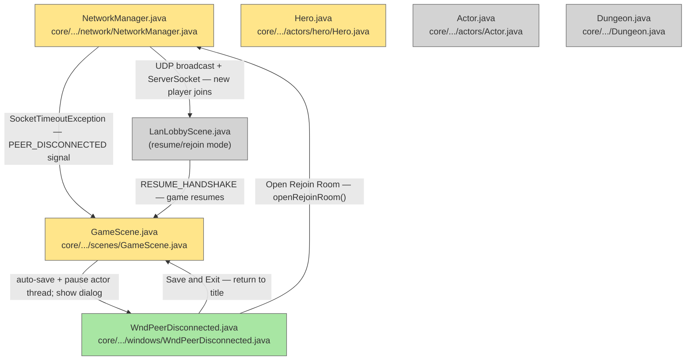

# Plan: LAN Multiplayer — 08 Disconnect Handling

## System Intent

- What is being built: Graceful peer-disconnect detection and recovery. All `NetworkManager` reads use `Socket.setSoTimeout()` so `SocketTimeoutException` acts as the disconnect signal rather than blocking indefinitely. On detection, the host auto-saves immediately, then opens a rejoin lobby so any player can claim the disconnected hero's character — reusing the LAN save resume flow from lan-07. The disconnected hero stays in `Dungeon.heroes` and is never removed; their spot waits for a new player. Two options shown: "Open Rejoin Room" (auto-save + open lobby) and "Save and Exit" (save + exit).
- Primary consumer(s): `NetworkManager` (read loop), `GameScene` (signal listener), `LanLobbyScene` (rejoin lobby), `WndPeerDisconnected`.
- Boundary: Covers mid-game disconnect only. Lobby-phase connection failure (before dungeon init) is handled in lan-03. Rejoin resync reuses the `RESUME_HANDSHAKE` bundle from lan-07.

## Stage Gate Tracker

- [ ] Stage 1 Mermaid approved
- [x] Stage 2 Flows approved
- [x] Stage 3 Logs + Deployment approved or skipped

## Mermaid Diagram



ONCE YOU GET APPROVAL FROM THE DEVELOPER, DELETE THIS LINE AND UPDATE THE STAGE GATE TRACKER

## Flows

### Global Types

```txt
StandardError {
  message: string (human-readable description of what went wrong)
}

DisconnectEvent {
  disconnectedHero: Hero   // the hero whose network reader timed out
  isHost: boolean
}
```

### Flow: `disconnectDetection`

- Test files: N/A
- Core files: `core/src/main/java/com/shatteredpixel/shatteredpixeldungeon/network/NetworkManager.java`

#### Types

```txt
TimeoutConfig {
  soTimeout: int = 5000ms on handshake reads
  soTimeout: int = 30000ms on gameplay reads (action + hash packets)
}
```

#### Paths

| path | input | output | path-type | notes | updated |
| --- | --- | --- | --- | --- | --- |
| `detect.timeout` | `SocketTimeoutException` on any read | `Signal.dispatch(PEER_DISCONNECTED)` + wake actor thread | error | setSoTimeout must be set on every socket after construction | |
| `detect.io-error` | `IOException` (connection reset, broken pipe) | same as timeout — dispatch PEER_DISCONNECTED | error | catch both; treat identically | |
| `detect.interrupt` | `Thread.interrupt()` on reader thread | reader exits cleanly; no signal dispatched | happy path | `GameScene.destroy()` cleanup path | |

#### Pseudocode

```
// NetworkManager — applied to all sockets at construction:
socket.setSoTimeout(30_000);   // 30s gameplay read timeout

// In receiveActionAsync / receiveHash background threads:
} catch (SocketTimeoutException | IOException e) {
  if (!Thread.currentThread().isInterrupted()) {
    Signal.dispatch(new Signal.PEER_DISCONNECTED(associatedHero));
    synchronized (Actor.class) { Actor.class.notifyAll(); }   // wake actor thread
  }
} catch (InterruptedIOException e) {
  Thread.currentThread().interrupt();  // preserve flag; exit cleanly
}
```

---

### Flow: `disconnectDialog`

- Test files: N/A
- Core files: `core/src/main/java/com/shatteredpixel/shatteredpixeldungeon/scenes/GameScene.java`, `core/src/main/java/com/shatteredpixel/shatteredpixeldungeon/windows/WndPeerDisconnected.java` (new)

#### Types

```txt
DialogOptions { OPEN_REJOIN_ROOM, QUIT }

WndPeerDisconnectedState {
  disconnectedHero: Hero
  heroName: String     // displayed in dialog message
}
```

#### Paths

| path | input | output | path-type | notes | updated |
| --- | --- | --- | --- | --- | --- |
| `dialog.show` | PEER_DISCONNECTED signal received | actor thread paused; auto-save runs; `WndPeerDisconnected` shown | happy path | auto-save fires immediately on disconnect before dialog |
| `dialog.rejoin` | player taps "Open Rejoin Room" | host opens `LanLobbyScene` rejoin lobby; game paused waiting for new player | recovery | reuses lan-07 resume lobby; disconnected hero's slot shown as available |
| `dialog.quit` | player taps "Save and Exit" | `NetworkManager.disconnect()`; return to TitleScene | happy path | save already done before dialog showed |

#### Pseudocode

```
// GameScene — signal registration:
Signal.add(new Signal.Observer<Signal.PEER_DISCONNECTED>() {
  public void onSignal(Signal.PEER_DISCONNECTED event) {
    ShatteredPixelDungeon.runOnRenderThread(() -> {
      Actor.pauseThread();
      // Auto-save first (host only)
      if (NetworkManager.isHost) {
        try { Dungeon.saveAll(); } catch (IOException e) { /* log */ }
      }
      addToFront(new WndPeerDisconnected(event.hero));
    });
  }
});

WndPeerDisconnected extends Window:
  Hero disconnectedHero;

  create(Hero hero):
    disconnectedHero = hero;
    String name = hero.name() != null ? hero.name() : "A player";
    add(new RenderedTextBlock(name + " disconnected. Game saved.", ...));

    add(new RedButton("Open Rejoin Room") { onClick(): onRejoin(); });
    add(new RedButton("Save and Exit")    { onClick(): onQuit(); });

  onRejoin():
    hide();
    // Reopen lobby in resume mode — disconnected hero slot available to claim
    NetworkManager.openRejoinRoom();   // re-opens ServerSocket; starts UDP broadcast
    ShatteredPixelDungeon.switchScene(LanLobbyScene.class);  // resume-lobby mode

  onQuit():
    NetworkManager.disconnect();
    Game.switchScene(TitleScene.class);
    hide();
```

---

### Flow: `reconnectFlow`

- Test files: N/A
- Core files: `core/src/main/java/com/shatteredpixel/shatteredpixeldungeon/network/NetworkManager.java`, `core/src/main/java/com/shatteredpixel/shatteredpixeldungeon/scenes/GameScene.java`

#### Types

```txt
ReconnectContext {
  waitTimeout: int = 120s   // give disconnected player 2 minutes to rejoin
  resyncMethod: desync recovery bundle from lan-06
}
```

#### Paths

| path | input | output | path-type | notes | updated |
| --- | --- | --- | --- | --- | --- |
| `rejoin.host-open` | "Open Rejoin Room" tapped | host re-opens ServerSocket + UDP broadcast; `LanLobbyScene` shown in resume mode | recovery | disconnected hero's slot shown as claimable |
| `rejoin.client-join` | new/returning player opens `LanRoomListScene` | discovers room via UDP broadcast; taps to join | recovery | same join flow as first-time join (lan-03) |
| `rejoin.hero-claim` | new player joins | receives `SAVE_LOBBY_INFO`; sees `WndHeroClaim` to pick disconnected hero | recovery | same claim flow as lan-07 resume |
| `rejoin.resync` | hero claimed | host sends `RESUME_HANDSHAKE` bundle; new player deserializes and enters GameScene | recovery | reuses lan-07 bundle serialization |
| `rejoin.game-resumes` | all players reconnected / slot filled | actor thread resumed; game continues from saved state | happy path | |

#### Pseudocode

```
// "Open Rejoin Room" — opens lobby in resume mode:
NetworkManager.openRejoinRoom():
  hostGame(7777);                     // re-opens ServerSocket
  startDiscoveryBroadcast(roomName, currentPlayers);  // UDP broadcast resumes

// LanLobbyScene (resume/rejoin mode):
//   Shows current players + disconnected slot as "OPEN"
//   Each new connection receives SAVE_LOBBY_INFO with all hero cards
//   On host Start: runs the RESUME_HANDSHAKE flow from lan-07
//   New player receives bundle, deserializes, sets Dungeon.hero = claimed hero
//   Actor thread resumed; game continues

// The disconnected hero stays in Dungeon.heroes and Actor.all throughout —
// their turn just never fires because receiveActionAsync has no socket to read from.
// On rejoin, the new player's receiveActionAsync is wired up to the new socket.
```

## Logs

| Source | Location |
|--------|----------|
| Disconnect | `GLog.w("Player %d disconnected", playerIndex)` |
| Reconnect | `GLog.p("Player %d reconnected", playerIndex)` |
| Continue solo | `GLog.p("Continuing solo")` |
| Network errors | `ShatteredPixelDungeon.reportException(e)` |

## Deployment

- Mechanism: `local only`
- Deploy command:
  ```bash
  ./gradlew desktop:run
  ```
- Notes: `Actor.remove()` is the existing method for removing actors from the queue. Verify its behavior with a live (non-dead) hero before implementing `removeFromGame()`. The 4500ms actor-thread watchdog in `GameScene.destroy()` must not fire during the reconnect wait window — ensure `keepActorThreadAlive` remains true while waiting.

ONCE YOU GET APPROVAL FROM THE DEVELOPER, DELETE THIS LINE AND UPDATE THE STAGE GATE TRACKER
