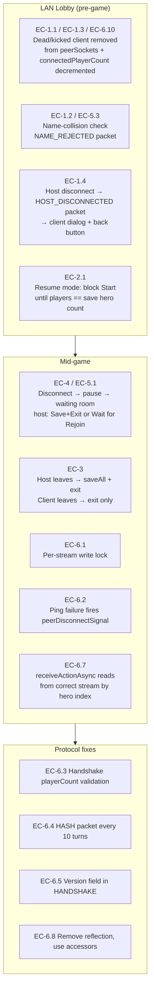

# Plan: LAN Edge Case Fixes

## System Intent

Fix the LAN multiplayer edge cases identified in `docs/investigations/lan-edge-cases.md`. Each fix is scoped to a specific failure mode, has tests, and is implemented. Items marked out-of-scope by the user (EC-6.6, EC-6.9) are excluded.

### Scope summary (by user decision)

| EC     | Fix strategy |
|--------|-------------|
| EC-1.1 | Remove ghost slots: kick player from `peerSockets`/`ins`/`outs`/`playerNames` and decrement `connectedPlayerCount` when their socket dies during lobby |
| EC-1.2 | Reject `NAME_ANNOUNCE` if the name is already in `playerNames`; send a `NAME_REJECTED` packet back |
| EC-1.3 | Add a kick button (host-only) to each slot in `LanLobbyScene`; sending `KICK` packet closes the client's connection and removes the slot |
| EC-1.4 | On host disconnect in lobby, kick all clients with a `HOST_DISCONNECTED` packet and show a dialog with a "Back to Lobby List" button |
| EC-1.5 | No change — already handled |
| EC-2.1 | Block `LanLobbyScene` start until connected player count equals save hero count; show "Need N players" message |
| EC-2.2 | No change — players can pick any hero; left to human coordination |
| EC-2.3 | When a player disconnects mid-game, pause and show waiting room; host gets "Save and Exit" or "Wait for Rejoin" options |
| EC-3   | Fix: save game for host, exit for non-hosts (no save on client) |
| EC-4   | Fix: always pause and go to waiting room when reaching a disconnected player's turn; host gets "Save and Exit" or "Wait for Rejoin" |
| EC-5.1 | Fix: pause and go to waiting room with "Save and Exit" option for host when reconnect is needed |
| EC-5.3 | Fix: prevent two players with the same name from joining a room |
| EC-6.1 | Fix: synchronize multi-byte writes with a per-stream lock to prevent packet interleaving |
| EC-6.2 | Fix: fire `peerDisconnectSignal` from `startPingSender()` when a write fails, not only from the reader |
| EC-6.3 | Fix: validate `playerCount` in `waitForHandshake()` against `HeroClass.values().length` |
| EC-6.4 | Fix: implement `HASH` packet sending every 10 turns for desync detection |
| EC-6.5 | Fix: add a version field to the `HANDSHAKE` packet; reject mismatches |
| EC-6.7 | Fix: `receiveActionAsync()` must read from the correct stream (`ins.get(playerIndex - 1)`) based on which hero's turn it is |
| EC-6.8 | Fix: remove reflection access to `NetworkManager` fields; expose `clientIn`/`clientOut` as proper accessors |
| EC-6.10 | Fix: decrement `connectedPlayerCount` and remove slots when a client departs in the lobby |

---

## Architecture



---

## Flows

### Flow 1: `lobbyPlayerManagement` — EC-1.1, EC-1.2, EC-1.3, EC-1.4, EC-6.10

**What:** Ensure the host lobby correctly reflects the live player count at all times. Remove ghost slots when a client drops, prevent duplicate names, add a kick mechanism, and handle host disconnect cleanly.

**Entry:** `LanLobbyScene` is active (host or client).
**Exit:** The lobby always shows only actually-connected, uniquely-named players; host can kick; clients are notified if host leaves.

**Steps:**

1. **EC-1.1 / EC-6.10 — Remove ghost slots on client drop**
   - In `NetworkManager.acceptClientsLoop()`, after `PLAYER_JOINED` is broadcast, start a per-client watchdog thread (`lan-peer-watch-N`) that blocks on `in.readByte()` with a 500 ms timeout (only during the lobby phase, `gameStarted == false`).
   - When the watchdog detects `IOException` (client gone), call a new `removeClient(int index)` helper that:
     - Closes the socket
     - Removes from `peerSockets`, `ins`, `outs`, `playerNames`
     - Decrements `connectedPlayerCount`
     - Compacts the remaining indices (shifts everything down)
     - Broadcasts `PLAYER_LEFT { newTotal, names[] }` to all remaining clients
     - Calls `onPlayerJoined` callback to refresh the host lobby UI
   - Add `PacketType.PLAYER_LEFT = 17` to `NetworkManager.PacketType`.
   - Update `LanLobbyScene.startClientListenerThread()` to handle `PLAYER_LEFT`: re-render all slot labels and disable Start if total drops below 2.

2. **EC-1.2 / EC-5.3 — Reject duplicate names**
   - In `acceptClientsLoop()`, after reading `NAME_ANNOUNCE`, check if `clientName` already exists in `playerNames[0..connectedPlayerCount-1]`.
   - If duplicate: write `NAME_REJECTED` packet (`PacketType.NAME_REJECTED = 18`) back to the client socket, close the socket, and do not add it to the lists.
   - Add `PacketType.NAME_REJECTED = 18`.
   - In `NetworkManager.joinGame()`, after sending `NAME_ANNOUNCE`, read the next byte; if it is `NAME_REJECTED`, throw `IOException("Name already taken")` so the calling scene can show an error dialog.

3. **EC-1.3 — Kick button**
   - In `LanLobbyScene`, each non-host slot label row (host-only view) gets a small "X" `RedButton` beside it.
   - Tapping X calls `NetworkManager.kickPlayer(int playerIndex)`:
     - Writes `KICK` packet (`PacketType.KICK = 19`) to the target's `DataOutputStream`.
     - Calls `removeClient(playerIndex - 1)` (0-indexed in `outs`).
   - On the client side, `startClientListenerThread()` handles `KICK`: show an "You were kicked" dialog, call `NetworkManager.disconnect()`, switch to `LanRoomListScene`.
   - Add `PacketType.KICK = 19`.

4. **EC-1.4 — Host disconnect in lobby**
   - In `LanLobbyScene.destroy()`, if `!gameStarted` and `NetworkManager.isHost()`, before calling `disconnect()`, broadcast `HOST_DISCONNECTED` (`PacketType.HOST_DISCONNECTED = 20`) to all connected clients.
   - On the client side, `startClientListenerThread()` handles `HOST_DISCONNECTED`: show a dialog "Host left the room" with a single "Back to Room List" button; tapping it calls `NetworkManager.disconnect()` and switches to `LanRoomListScene`.
   - Add `PacketType.HOST_DISCONNECTED = 20`.
   - Fix the existing freeze: add a 10-second `SO_TIMEOUT` on client sockets **during the lobby phase only** (before `gameStarted`). Reset to 0 after `START` is received. This ensures clients do not block forever if the host crashes without sending `HOST_DISCONNECTED`.

**Tests** (new file: `core/src/test/java/.../network/LobbyPlayerManagementTest.java`):
- `duplicateName_isRejected()` — two clients send the same name; second receives `NAME_REJECTED`
- `clientDropInLobby_removesSlot()` — client socket closes; host `connectedPlayerCount` decrements; `PLAYER_LEFT` is broadcast
- `kickPlayer_clientReceivesKickPacket()` — host calls `kickPlayer(1)`; target client stream receives `KICK` byte
- `hostDisconnectInLobby_broadcastsHostDisconnected()` — host socket closes; all remaining client streams receive `HOST_DISCONNECTED`

---

### Flow 2: `resumeLobbyPlayerCountGate` — EC-2.1

**What:** In resume mode, prevent the host from starting until the connected player count equals the number of heroes in the loaded save.

**Entry:** `LanLobbyScene` opens with `resumeMode = true`.
**Exit:** Start button is only enabled when `connectedPlayerCount == Dungeon.heroes.size()`.

**Steps:**

1. In `LanLobbyScene.onPlayerJoined()`, when `resumeMode == true`, change the Start button enable condition from `total >= 2` to `total == Dungeon.heroes.size()`.
2. Update the status label in resume mode to show "Need N players (have M)" where N is `Dungeon.heroes.size()` and M is `total`.
3. If a player leaves in resume mode (PLAYER_LEFT packet), immediately disable Start and update the status label.
4. Add a note in `onStartTapped()` asserting `connectedPlayerCount == Dungeon.heroes.size()` (defensive check; log a warning and abort if mismatch).

**Tests** (new file: `core/src/test/java/.../network/ResumeLobbyGateTest.java`):
- `resumeMode_startButtonDisabledUntilCorrectCount()` — save has 3 heroes; Start stays disabled at 2 players, enables at 3
- `resumeMode_playerLeaves_startDisabled()` — 3 players join (Start enabled); one leaves; Start re-disables
- `resumeMode_startPrevented_whenCountMismatch()` — `onStartTapped()` with mismatched count returns early without sending START

---

### Flow 3: `midGameDisconnectHandling` — EC-3, EC-4, EC-5.1

**What:** When a player disconnects mid-game, the game pauses and transitions to a waiting room. Host can save and exit or wait for the player to rejoin. Non-hosts exit without saving.

**Entry:** `peerDisconnectSignal` is dispatched during gameplay.
**Exit:** Game is either saved and exited (host) or exited (client), or a rejoin is attempted.

**Steps:**

1. **EC-3 — Host disconnect: save for host, exit for clients**
   - In `GameScene`'s `peerDisconnectSignal` handler, when `NetworkManager.isHost()`, call `Dungeon.saveAll()` then transition to a waiting room window.
   - When `!NetworkManager.isHost()` (client), do NOT save; simply disconnect and switch to `TitleScene`.
   - `WndPeerDisconnected` is only shown on the host side. Its "Save and Exit" path calls `Dungeon.saveAll()` then `NetworkManager.disconnect()` then switches to `TitleScene`.

2. **EC-4 — Non-host disconnect: pause and go to waiting room**
   - Fix `startPingSender()` (EC-6.2): when a write to a peer `DataOutputStream` throws `IOException`, fire `peerDisconnectSignal` with that peer's hero (looked up by index from `Dungeon.heroes`). Currently it only logs a warning and breaks.
   - Fix `receiveActionAsync()` for 3+ players (EC-6.7 dependency): when a non-index-0 client's turn arrives, read from the correct `ins.get(heroIndex - 1)` stream.
   - In the `peerDisconnectSignal` handler, when `NetworkManager.isHost()` and a *client* disconnected:
     - Pause the actor thread (`Actor.keepActorThreadAlive = false`).
     - Call `Dungeon.saveAll()` to preserve state.
     - Show `WndPeerDisconnected` with:
       - "Wait for Rejoin" → calls `NetworkManager.openRejoinRoom()`, transitions to `LanLobbyScene` in resume mode.
       - "Save and Exit" → disconnects and switches to `TitleScene`.

3. **EC-5.1 — Reconnect waiting room**
   - `WndPeerDisconnected` (shown on host when a client disconnects) already has "Open Rejoin Room". Rename it "Wait for Rejoin" for clarity.
   - On the client side when the host disconnects: show a simpler `WndHostDisconnected` window with only "Save and Exit" (client cannot save) and "Exit". No rejoin option for clients because they have no authority to reopen a room.
   - Create `WndHostDisconnected` as a new window class.

4. **Remove the incorrect "Open Rejoin Room" path for clients**
   - `WndPeerDisconnected` currently allows any device to call `openRejoinRoom()`, which is wrong for clients. Guard `onRejoin()` with `if (!NetworkManager.isHost()) return;` and remove the "Open Rejoin Room" button from the client's disconnect dialog entirely (they see `WndHostDisconnected` instead).

**Tests** (new file: `core/src/test/java/.../network/MidGameDisconnectTest.java`):
- `hostDisconnect_clientExitsWithoutSave()` — `peerDisconnectSignal` fired on client; verify `Dungeon.saveAll()` is NOT called
- `clientDisconnect_hostSavesAndShowsWaitingRoom()` — `peerDisconnectSignal` fired on host; verify `Dungeon.saveAll()` is called and `WndPeerDisconnected` is queued
- `pingSenderFailure_firesPeerDisconnectSignal()` — inject a broken `DataOutputStream` in `outs`; start `startPingSender()`; verify `peerDisconnectSignal` fires within 6s
- `nonHostDisconnect_heroTurnPauses()` — signal fires for hero[1]; verify actor thread is stopped

---

### Flow 4: `multiStreamActionReader` — EC-6.7

**What:** Fix `receiveActionAsync()` to read from the correct `DataInputStream` based on which remote hero is taking a turn, enabling 3- and 4-player games.

**Entry:** `Hero.act()` calls `receiveActionAsync(this)` for a remote hero.
**Exit:** The reader thread reads from `ins.get(heroIndex - 1)` not always `ins.get(0)`.

**Steps:**

1. Change the stream selection in `receiveActionAsync()`:
   ```java
   DataInputStream in = isHost
       ? ins.get(remoteHero.heroIndex - 1)  // heroIndex is 1-based for clients
       : clientIn;
   ```
   where `remoteHero.heroIndex` is `Dungeon.heroes.indexOf(remoteHero)`.
2. Add a `heroIndex` field to `Hero` (or compute inline with `Dungeon.heroes.indexOf(remoteHero)`). Prefer inline to avoid a new field.
3. Ensure `ins` is indexed correctly: `ins.get(0)` is the stream for client at `playerIndex=1`, `ins.get(1)` for `playerIndex=2`, etc.
4. The singleton `actionReaderRunning` guard must be per-stream (not global) for 3+ players, otherwise only one remote hero can ever have an active reader. Change to `boolean[] actionReaderRunning = new boolean[MAX_PLAYERS]` keyed by `heroIndex - 1`.

**Tests** (new file: `core/src/test/java/.../network/MultiStreamActionReaderTest.java`):
- `threePlayerGame_hero2ReceivesFromStream1()` — inject two streams; hero at index 2 waits; send packet on `ins.get(1)`; verify hero2 receives action
- `threePlayerGame_hero1ReceivesFromStream0()` — hero at index 1 waits; send packet on `ins.get(0)`; verify hero1 receives action
- `perStreamGuard_allowsConcurrentReaders()` — both hero1 and hero2 readers can be active simultaneously

---

### Flow 5: `protocolHardening` — EC-6.1, EC-6.2, EC-6.3, EC-6.4, EC-6.5, EC-6.8

**What:** Harden the wire protocol: prevent packet corruption from concurrent writes, add desync detection, version negotiation, handshake validation, and remove reflection.

**Entry:** Network connections are established.
**Exit:** All multi-byte writes are atomic, desync is detected, version mismatches are rejected, reflection is eliminated.

**Steps:**

1. **EC-6.1 — Per-stream write lock**
   - Add `private static final List<Object> outLocks = new ArrayList<>()` in `NetworkManager`, one lock per entry in `outs`.
   - Wrap every multi-byte write sequence in `sendAction()`, `sendItemIdentified()`, `sendClassClaimed()`, `sendClassUnclaimed()`, and `startPingSender()` with `synchronized (outLocks.get(i))`.
   - For client mode, add `private static final Object clientOutLock = new Object()` and wrap all `clientOut` writes.
   - Update `acceptClientsLoop()` to push a new `Object()` to `outLocks` when a new `outs` entry is added.

2. **EC-6.2 — Ping failure fires disconnect signal**
   - In `startPingSender()`, when `IOException` is caught writing to `outs.get(i)`, determine the corresponding hero by `Dungeon.heroes.get(i + 1)` and dispatch `peerDisconnectSignal.dispatch(new PeerDisconnected(hero))`.
   - Also call `GameScene.notifyActorThread()` to wake up the actor thread.

3. **EC-6.3 — Handshake playerCount validation**
   - In `waitForHandshake()` on the client, after reading `playerCount`, assert `playerCount >= 1 && playerCount <= MAX_PLAYERS`. If out of range, throw `IOException("Invalid playerCount: " + playerCount)`.
   - Also assert each `classOrdinal < HeroClass.values().length` before indexing.

4. **EC-6.4 — HASH packet every 10 turns**
   - Add `sendStateHash(int turn, long hash)` to `NetworkManager` that writes a `HASH` packet.
   - In `Hero.act()`, after every 10 successful turns (`Dungeon.depth`-independent counter on the host), compute a lightweight hash of `Dungeon.level.map` XOR hero positions XOR hero HP values, then call `NetworkManager.sendStateHash()`.
   - In `receiveActionAsync()`, handle `PacketType.HASH`: compare received hash against locally computed hash; if mismatch, dispatch a new `DesyncDetectedSignal` and log a prominent warning. No automatic recovery in this plan — just detection.
   - Add `NetworkManager.DesyncDetectedSignal` and a static signal field.

5. **EC-6.5 — Version field in HANDSHAKE**
   - Add `public static final int PROTOCOL_VERSION = 1` to `NetworkManager`.
   - In `sendHandshake()`, write `PROTOCOL_VERSION` as an `int` before `seed`.
   - In `waitForHandshake()`, read the version field first; if it does not match `PROTOCOL_VERSION`, throw `IOException("Protocol version mismatch: remote=" + remoteVersion)`.
   - `LanRoomListScene` does not filter by version (the error surfaces at handshake time, not discovery time).

6. **EC-6.8 — Remove reflection**
   - Add public accessor methods to `NetworkManager`:
     - `public static DataInputStream getClientIn()` — returns `clientIn`
     - `public static DataOutputStream getClientOut()` — returns `clientOut`
   - Replace all `getDeclaredField("clientIn") / getDeclaredField("clientOut")` calls in `WndHeroClaim` with the new accessors.

**Tests** (new file: `core/src/test/java/.../network/ProtocolHardeningTest.java`):
- `concurrentWrite_doesNotCorruptStream()` — two threads simultaneously call `sendAction()` and `sendPing()`; reader receives two well-formed complete packets with no byte interleaving
- `pingSendFailure_firesPeerDisconnectSignal()` — covered by Flow 3 test above; also verify from protocol angle
- `handshake_invalidPlayerCount_throwsIOException()` — inject playerCount=99 in handshake bytes; verify `IOException` thrown
- `handshake_invalidClassOrdinal_throwsIOException()` — inject classOrdinal=127 in handshake bytes; verify `IOException` thrown
- `handshake_versionMismatch_throwsIOException()` — inject wrong version field; verify rejection
- `stateHash_mismatch_firesDesyncSignal()` — inject mismatched HASH packet; verify `DesyncDetectedSignal` dispatches
- `noReflection_clientInOut_accessibleViaAccessors()` — verify `NetworkManager.getClientIn()` and `getClientOut()` return non-null after `joinGame()`

---

## New Packet Types Summary

| Constant | Value | Direction | Purpose |
|----------|-------|-----------|---------|
| `PLAYER_LEFT` | 17 | Host → Clients | A player was removed from the lobby |
| `NAME_REJECTED` | 18 | Host → Client | Name collision; client must pick another name |
| `KICK` | 19 | Host → Client | Client has been kicked by host |
| `HOST_DISCONNECTED` | 20 | Host → Clients | Host is leaving the lobby |

---

## New Files

| File | Purpose |
|------|---------|
| `windows/WndHostDisconnected.java` | Client-side dialog shown when host disconnects mid-game |
| `test/.../network/LobbyPlayerManagementTest.java` | Tests for EC-1.1–1.4, EC-6.10 |
| `test/.../network/ResumeLobbyGateTest.java` | Tests for EC-2.1 |
| `test/.../network/MidGameDisconnectTest.java` | Tests for EC-3, EC-4, EC-5.1 |
| `test/.../network/MultiStreamActionReaderTest.java` | Tests for EC-6.7 |
| `test/.../network/ProtocolHardeningTest.java` | Tests for EC-6.1–6.5, EC-6.8 |

---

## Modified Files

| File | Changes |
|------|---------|
| `network/NetworkManager.java` | `removeClient()`, per-stream write locks, ping-fires-signal, hash sending, version field, stream selection in `receiveActionAsync`, per-stream reader guard, new packet constants, `getClientIn()` / `getClientOut()` accessors |
| `scenes/LanLobbyScene.java` | Resume mode player count gate, PLAYER_LEFT handling, kick button per slot, HOST_DISCONNECTED handling, lobby-phase SO_TIMEOUT |
| `windows/WndPeerDisconnected.java` | Guard `onRejoin()` to host-only; rename "Wait for Rejoin"; route clients to `WndHostDisconnected` |
| `windows/WndHeroClaim.java` | Remove reflection; use `NetworkManager.getClientIn()` / `getClientOut()` |
| `actors/hero/Hero.java` | State hash computation every 10 turns; call `NetworkManager.sendStateHash()` |

---

## Out of Scope

- **EC-6.6** (split-brain two hosts) — user removed from scope
- **EC-6.9** (accept loop no upper bound) — user removed from scope
- **EC-2.2** (new player joins resume, picks any hero) — user decision: any character can be any character
- **EC-1.5** (start pressed host only) — already handled correctly

---

## Implementation Order

1. Flow 5 — protocol hardening (prerequisite: remove reflection before Flow 3 tests compile cleanly)
2. Flow 1 — lobby player management (packet constants must exist first)
3. Flow 2 — resume lobby gate
4. Flow 4 — multi-stream action reader (prerequisite for Flow 3 correctness in 3+ player games)
5. Flow 3 — mid-game disconnect handling (depends on ping-fires-signal from Flow 5)
