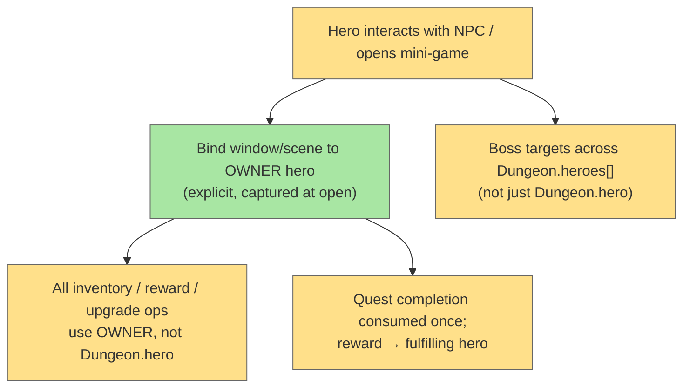

# Mini-Games Multiplayer Compatibility

## System Intent

- What is being built: Audit and fix every interactive "mini-game" / sub-mode so it
  works correctly with multiple heroes (`Dungeon.heroes[]`). A mini-game here means
  any self-contained interactive interaction: quest NPC exchange windows, the alchemy
  crafting scene, item trade/upgrade/energize windows, and multi-phase boss puzzles.
- Primary consumer(s): Quest windows (`Wnd*`), `AlchemyScene`, shop/trade flow, the
  Tengu boss encounter — all of which currently assume a single `Dungeon.hero`.
- Boundary: Build on the existing singleton-swap model (see
  `multi-hero-singleton-swap.md`). The core problem: these interactions capture
  `Dungeon.hero` at open time and may resolve against the *wrong* hero if the window
  outlives the acting hero's turn, or if multiple heroes interact with the same NPC.

## Stage Gate Tracker

- [ ] Stage 1 Mermaid approved
- [ ] Stage 2 Flows approved
- [ ] Stage 3 Logs + Deployment approved or skipped

## Core Problem

The singleton-swap model sets `Dungeon.hero = this` at the start of each hero's turn.
That keeps UI/camera correct *during* a turn, but interactive mini-games are
problematic because:

1. **Stale hero capture** — a window/scene reads `Dungeon.hero` when it opens and
   keeps acting on it. If it stays open across turns, or another hero becomes active,
   rewards/upgrades land on the wrong hero.
2. **Shared NPC, multiple claimants** — two heroes can each open the same quest NPC's
   window; quest completion and reward delivery must be attributed to the hero who
   actually fulfilled it, and the quest must be consumed exactly once.
3. **Boss targeting** — encounters that hard-code `Dungeon.hero` as "the target"
   ignore the other heroes.

**Fix direction:** each interactive window/scene should bind to an explicit
**owner hero** at construction (passed in, not read from the global singleton at use
time), and resolve all inventory/reward/upgrade operations against that owner.

## Mermaid Diagram



## Affected Mini-Games (audit)

### Critical (game-breaking with multiple heroes)

| Mini-game | File | Issue |
| --- | --- | --- |
| Blacksmith / Troll | `core/src/main/java/com/shatteredpixel/shatteredpixeldungeon/windows/WndBlacksmith.java` | Heavy `Dungeon.hero` use for reforge/upgrade/inventory (`ScrollOfUpgrade.upgrade(Dungeon.hero)`); quest reward + ability on wrong hero |
| Tengu boss | `core/src/main/java/com/shatteredpixel/shatteredpixeldungeon/actors/mobs/Tengu.java` | Phase/teleport/trap-placement logic hard-codes `Dungeon.hero` as the target; ignores other heroes |
| Alchemy scene | `core/src/main/java/com/shatteredpixel/shatteredpixeldungeon/scenes/AlchemyScene.java` | Full scene operates on `Dungeon.hero.belongings`; crafted output goes to wrong hero |

### High (incorrect behavior / reward misattribution)

| Mini-game | File | Issue |
| --- | --- | --- |
| Imp quest | `core/src/main/java/com/shatteredpixel/shatteredpixeldungeon/windows/WndImp.java` | Reward pickup via `Dungeon.hero` |
| Sad Ghost quest | `core/src/main/java/com/shatteredpixel/shatteredpixeldungeon/windows/WndSadGhost.java` | Item selection + reward via `Dungeon.hero.belongings` |
| Wandmaker quest | `core/src/main/java/com/shatteredpixel/shatteredpixeldungeon/windows/WndWandmaker.java` | Item exchange + reward via `Dungeon.hero` |
| Item upgrade | `core/src/main/java/com/shatteredpixel/shatteredpixeldungeon/windows/WndUpgrade.java` | `hasTalent` checks + `ScrollOfUpgrade.upgrade` on wrong hero |
| Trade / sell | `core/src/main/java/com/shatteredpixel/shatteredpixeldungeon/windows/WndTradeItem.java` | Gold + buff checks (MasterThievesArmband) on wrong hero |
| Energize item | `core/src/main/java/com/shatteredpixel/shatteredpixeldungeon/windows/WndEnergizeItem.java` | Unequip/detach/energize on wrong hero |

### Medium (interaction gating / passive)

| Mini-game | File | Issue |
| --- | --- | --- |
| Shopkeeper | `core/src/main/java/com/shatteredpixel/shatteredpixeldungeon/actors/mobs/npcs/Shopkeeper.java` | `Dungeon.hero.pos` rotation (passive); buying/selling inherits `WndTradeItem` issues |
| Rat King | `core/src/main/java/com/shatteredpixel/shatteredpixeldungeon/actors/mobs/npcs/RatKing.java` | `c != Dungeon.hero` gating for Ratmogrify grant — only one hero gets it |
| Magic well water | `core/src/main/java/com/shatteredpixel/shatteredpixeldungeon/levels/rooms/special/MagicWellRoom.java` | WellWater blob effect must apply to the hero who drinks, not the active one |

## Flows (to be filled in during investigation)

> Touch points are listed above. Exact `file_path:line_number`, types, paths, and
> pseudocode should be filled in per the table format used in
> `multi-hero-singleton-swap.md`. The shared pattern across all flows:

### Flow: `windowOwnerBinding`
- Intent: change interactive `Wnd*` constructors (and `AlchemyScene`) to take an
  explicit owner `Hero` and store it, replacing internal `Dungeon.hero` reads with
  the stored owner.
- Core files: all `Wnd*` files in the Critical/High tables + `AlchemyScene.java`.

### Flow: `questSingleConsumption`
- Intent: quest NPCs (`Imp`, `Ghost`, `Wandmaker`, `Blacksmith`) mark the quest
  complete atomically and deliver the reward to the fulfilling hero exactly once,
  even if multiple heroes opened the window.
- Core files: NPC classes under
  `core/src/main/java/com/shatteredpixel/shatteredpixeldungeon/actors/mobs/npcs/`.

### Flow: `bossTargetsAllHeroes`
- Intent: Tengu (and any boss with hard-coded `Dungeon.hero` targeting) selects/uses
  targets across `Dungeon.heroes[]`, consistent with `Mob.chooseEnemy()`.
- Core files: `Tengu.java` (and a sweep for other bosses referencing `Dungeon.hero`).

### Flow: `abilityGrantPerHero`
- Intent: Rat King Ratmogrify grant works per-hero rather than gating on the single
  `Dungeon.hero`.
- Core files: `RatKing.java`.

## Acceptance Criteria

- [ ] Every interactive mini-game window/scene binds to an explicit owner hero at open
      time and resolves inventory/reward/upgrade operations against that owner.
- [ ] Quest rewards (Imp, Ghost, Wandmaker, Blacksmith) go to the hero who fulfilled
      the quest, and each quest is consumed exactly once across all heroes.
- [ ] Trade/sell, upgrade, and energize windows act on the correct hero's belongings
      and gold/buffs.
- [ ] AlchemyScene crafts into the correct hero's inventory.
- [ ] Tengu (and other bosses) target across all living heroes rather than only
      `Dungeon.hero`.
- [ ] Rat King grants Ratmogrify correctly with multiple heroes.
- [ ] No interactive mini-game misbehaves when opened by a non-active hero or when it
      remains open across a hero-turn swap.

## Logs

| Source | Location |
|--------|----------|
| In-game log | `GLog` — existing |
| Crash reporting | `ShatteredPixelDungeon.reportException()` — existing |

## Deployment

- Mechanism: `local only`
- Deploy command:
  ```bash
  ./gradlew desktop:debug
  ```
- Notes: No server-side component. Changes are local Java. Quest/reward state must
  remain save/load compatible.
