# Multi-Hero Save/Restore

## System Intent

- What is being built: Full save/load fidelity for all heroes in a multiplayer game. When a player exits and resumes their save, every hero is restored at the exact position, health, and inventory state they had when they quit. The only time heroes spawn adjacent to each other is at the very start of a new game on the first level.
- Primary consumer(s): `Dungeon.switchLevel()`, `Dungeon.init()`, `InterlevelScene.restore()`
- Boundary: No changes to the save file schema beyond what already exists. No changes to hero selection UI. No networking. Single fix to the TEMP adjacent-placement block in `switchLevel` that currently clobbers saved positions on every load.

## Root Cause

`Dungeon.switchLevel()` contains a TEMP block (lines 509–513) that sets `heroes.get(i).pos = pos + i` for every hero beyond hero[0], on **every** level transition — including `InterlevelScene.restore()` (the load path). This overwrites the correct positions that `Dungeon.loadGame()` already restored from the bundle. The save/load serialization itself is correct; all hero state (position, HP, HT, buffs, inventory, equipped items) round-trips through `Hero.storeInBundle` / `Hero.restoreFromBundle`. The only broken piece is this unconditional position override on load.

## Stage Gate Tracker

- [x] Stage 1 Mermaid approved
- [x] Stage 2 Flows approved
- [x] Stage 3 Logs + Deployment approved or skipped

## Mermaid Diagram

```mermaid
flowchart TD
  subgraph NewGame["New Game Path"]
    NG1["Dungeon.init()\nspawnHero() × N\nset heroesNeedInitialPlacement=true"]:::modified
    NG2["InterlevelScene.descend()"]:::unchanged
    NG3["Dungeon.switchLevel(level, pos)\nheroesNeedInitialPlacement==true:\nplace heroes[1..N] adjacent to pos\nvalidate passability\nset heroesNeedInitialPlacement=false"]:::modified
    NG4["Heroes on floor 1\nadjacent to each other"]:::unchanged
    NG1 --> NG2 --> NG3 --> NG4
  end

  subgraph LoadGame["Load / Continue Path"]
    LG1["InterlevelScene.restore()"]:::unchanged
    LG2["Dungeon.loadGame(slot)\nall heroes deserialized\nwith saved pos/HP/items"]:::unchanged
    LG3["Dungeon.switchLevel(level, hero.pos)\nheroesNeedInitialPlacement==false:\nSKIP adjacent placement\neach hero keeps saved pos"]:::modified
    LG4["Heroes at saved positions\nwith saved HP and inventory"]:::unchanged
    LG1 --> LG2 --> LG3 --> LG4
  end

  subgraph FloorChange["Floor Change (DESCEND/ASCEND mid-game)"]
    FC1["InterlevelScene.descend()\nor ascend()"]:::unchanged
    FC2["Dungeon.switchLevel(level, pos)\nheroesNeedInitialPlacement==false:\nSKIP — each hero handles\ntheir own level transition"]:::modified
    FC3["Heroes transition independently"]:::unchanged
    FC1 --> FC2 --> FC3
  end

classDef unchanged fill:#d3d3d3,stroke:#666,stroke-width:1px;
classDef modified fill:#ffe08a,stroke:#666,stroke-width:1px;
```



## Flows

### Global Types

```txt
StandardError {
  message: string
}

// New field added to Dungeon (static, not bundled — resets false on load)
Dungeon.heroesNeedInitialPlacement: boolean   -- true only during first switchLevel of a new game
```

---

### Flow: `fixHeroInitialPlacement`
- Test files: N/A
- Core files:
  - `core/src/main/java/com/shatteredpixel/shatteredpixeldungeon/Dungeon.java`

#### Types

```txt
// Dungeon.switchLevel behaviour:
// - heroesNeedInitialPlacement == true  → place heroes[1..N] adjacent to pos (new game only), then set flag false
// - heroesNeedInitialPlacement == false → skip placement; heroes already at correct saved positions
```

#### Paths

| path | input | output | path-type | notes | updated |
| --- | --- | --- | --- | --- | --- |
| `fixHeroInitialPlacement.newGame` | New game, first switchLevel | heroes[1..N] placed adjacent to hero[0], passability validated, flag cleared | happy path | Only path that moves non-hero[0] positions | |
| `fixHeroInitialPlacement.load` | CONTINUE mode, switchLevel after loadGame | hero positions unchanged from bundle | happy path | Core fix — was clobbering saved positions | |
| `fixHeroInitialPlacement.floorChange` | DESCEND/ASCEND mid-game | non-hero[0] positions unchanged in switchLevel | happy path | Each hero's per-floor position is managed by their own act()/movement | |
| `fixHeroInitialPlacement.passabilityFallback` | Adjacent cell is impassable or occupied | search NEIGHBOURS8 for first valid passable unoccupied cell | happy path | Prevents heroes spawning in walls | |

#### Pseudocode

```
// Dungeon.java — add field
public static boolean heroesNeedInitialPlacement = false;

// Dungeon.init() — after spawning all heroes (existing spawnHero loop)
// AFTER: the selectedClasses loop that calls spawnHero()
if (heroes.size() > 1) {
    heroesNeedInitialPlacement = true;
}

// Dungeon.switchLevel() — REPLACE the TEMP block (lines 509–513):
// REMOVE:
//   // TEMP: place extra heroes adjacent to hero1 for multiplayer testing
//   for (int i = 1; i < heroes.size(); i++) {
//       heroes.get(i).pos = pos + i;
//   }

// REPLACE WITH:
if (heroesNeedInitialPlacement) {
    heroesNeedInitialPlacement = false;
    for (int i = 1; i < heroes.size(); i++) {
        // find first passable unoccupied neighbour
        int placed = -1;
        for (int offset : PathFinder.NEIGHBOURS8) {
            int candidate = pos + offset;
            if (candidate >= 0 && candidate < level.length()
                    && level.passable[candidate]
                    && Actor.findChar(candidate) == null) {
                placed = candidate;
                break;
            }
        }
        heroes.get(i).pos = (placed != -1) ? placed : pos; // fallback: same cell as hero[0]
    }
}
```

---

### Flow: `verifyHeroStateRoundTrip`
- Test files: N/A (manual verification via existing debug run)
- Core files:
  - `core/src/main/java/com/shatteredpixel/shatteredpixeldungeon/Dungeon.java`
  - `core/src/main/java/com/shatteredpixel/shatteredpixeldungeon/actors/hero/Hero.java`

#### Types

```txt
// Existing Hero.storeInBundle already persists: pos, HP, HT, HTBoost, lvl, exp, STR,
// heroClass, subClass, buffs, belongings (equipped + backpack).
// No schema changes needed.
```

#### Paths

| path | input | output | path-type | notes | updated |
| --- | --- | --- | --- | --- | --- |
| `verifyHeroStateRoundTrip.position` | Save with heroes at different cells, reload | each hero at saved cell | happy path | Fixed by flow 1 | |
| `verifyHeroStateRoundTrip.health` | Save with non-full HP, reload | each hero at saved HP | happy path | Already works via Char.restoreFromBundle | |
| `verifyHeroStateRoundTrip.inventory` | Save with unique items per hero, reload | each hero has their own items | happy path | Already works via Belongings.restoreFromBundle | |
| `verifyHeroStateRoundTrip.buffs` | Save with active buffs per hero, reload | buffs restored correctly | happy path | Already works via Char.restoreFromBundle | |

#### Pseudocode

```
// No code changes — this flow is verification only.
// The existing serialization already covers all hero state.
// Run: ./gradlew desktop:debug
//   1. Start a 2-player game
//   2. Move heroes to different cells, reduce HP, pick up different items
//   3. Save (Wnd menu → Main Menu)
//   4. Continue the save
//   5. Verify each hero is at their saved cell with saved HP and inventory
```

## Logs

| Source | Location |
|--------|----------|
| In-game log | `GLog` — no new entries needed |
| Crash reporting | `ShatteredPixelDungeon.reportException()` — existing |

## Deployment

- Mechanism: `local only`
- Deploy command:
  ```bash
  ./gradlew desktop:debug
  ```
- Notes: Single-player games are fully unaffected (`heroes.size() == 1`, so `heroesNeedInitialPlacement` is never set true). Existing saves load correctly — the flag defaults to false on load.


