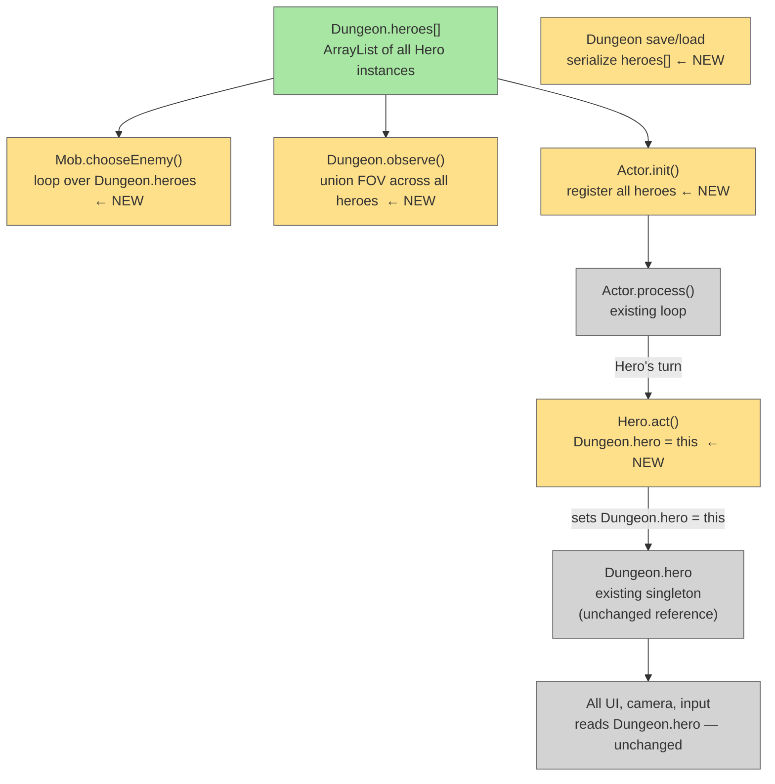

# Multi-Hero Singleton Swap

## System Intent

- What is being built: Support for multiple Hero instances in the game. `Dungeon.heroes[]` holds all active heroes. Whenever the actor loop schedules a Hero's turn, `Hero.act()` sets `Dungeon.hero = this` — so all 1,834+ existing references to `Dungeon.hero` (UI, camera, input gating) continue to work without changes.
- Primary consumer(s): Actor loop, Mob AI target selection, FOV system, save/load
- Boundary: No UI changes. No networking. No input routing changes. No FOV changes. The singleton proxy pattern means only the actor loop, mob targeting, and save/load need to know about the array. FOV is per-active-hero automatically via the swap.

## Stage Gate Tracker

- [ ] Stage 1 Mermaid approved
- [ ] Stage 2 Flows approved
- [ ] Stage 3 Logs + Deployment approved or skipped

## Mermaid Diagram



ONCE YOU GET APPROVAL FROM THE DEVELOPER, DELETE THIS LINE AND UPDATE THE STAGE GATE TRACKER

## Flows

### Global Types

```txt
StandardError {
  message: string
}
```

---

### Flow: `heroesArrayInit`
- Test files: N/A
- Core files:
  - `core/src/main/java/com/shatteredpixel/shatteredpixeldungeon/Dungeon.java`

#### Types

```txt
// New field added to Dungeon
Dungeon.heroes: ArrayList<Hero>   -- all active hero instances (index = player number)
Dungeon.hero:   Hero              -- unchanged singleton; always points to currently-acting hero
```

#### Paths

| path | input | output | path-type | notes | updated |
| --- | --- | --- | --- | --- | --- |
| `heroesArrayInit.newGame` | `Dungeon.init()` called | `heroes` initialized with single Hero | happy path | `heroes = new ArrayList<>(); heroes.add(hero);` after existing `hero = new Hero()` at Dungeon.java:281 | |
| `heroesArrayInit.alreadyExists` | second call to init | existing list replaced | happy path | same as new game; init always resets | |

#### Pseudocode

```
// Dungeon.java — Dungeon.init()
hero = new Hero();
hero.live();
GamesInProgress.selectedClass.initHero(hero);
// NEW:
heroes = new ArrayList<>();
heroes.add(hero);
```

---

### Flow: `heroSingletonSwap`
- Test files: N/A
- Core files:
  - `core/src/main/java/com/shatteredpixel/shatteredpixeldungeon/actors/hero/Hero.java`

#### Types

```txt
Hero.act(): boolean   -- existing method; first line now sets Dungeon.hero = this
```

#### Paths

| path | input | output | path-type | notes | updated |
| --- | --- | --- | --- | --- | --- |
| `heroSingletonSwap.setActive` | actor loop calls `hero.act()` on any Hero in `heroes[]` | `Dungeon.hero` updated to that hero before any logic runs | happy path | All UI/camera/input code reads `Dungeon.hero` and now automatically sees the acting hero | |
| `heroSingletonSwap.singleHero` | only one hero in `heroes[]` | no behaviour change | happy path | `Dungeon.hero = this` is a no-op when there is only one hero | |

#### Pseudocode

```
// Hero.java — Hero.act()  (add as very first line)
Dungeon.hero = this;   // swap singleton to this hero before any logic

// ... rest of existing act() unchanged ...
if (paralysed > 0) { ... }
if (curAction == null) { ready(); return false; }
// etc.
```

---

### Flow: `mobTargetAllHeroes`
- Test files: N/A
- Core files:
  - `core/src/main/java/com/shatteredpixel/shatteredpixeldungeon/actors/mobs/Mob.java`

#### Types

```txt
// Mob.chooseEnemy() currently hardcodes one check:
//   if (fieldOfView[Dungeon.hero.pos] && Dungeon.hero.invisible <= 0) enemies.add(Dungeon.hero);
// Replace with a loop over Dungeon.heroes
```

#### Paths

| path | input | output | path-type | notes | updated |
| --- | --- | --- | --- | --- | --- |
| `mobTargetAllHeroes.singleHero` | one hero in `Dungeon.heroes` | identical behaviour to current | happy path | loop over array of size 1 produces same result | |
| `mobTargetAllHeroes.multiHero` | N heroes in `Dungeon.heroes` | all visible, non-invisible heroes added as candidates | happy path | mob picks closest reachable hero same as it picks closest ally | |
| `mobTargetAllHeroes.heroInvisible` | hero with `invisible > 0` | hero not added as candidate | edge case | existing invisibility check preserved per-hero | |

#### Pseudocode

```
// Mob.java — Mob.chooseEnemy(), inside the ENEMY alignment block
// REMOVE:
if (fieldOfView[Dungeon.hero.pos] && Dungeon.hero.invisible <= 0) {
    enemies.add(Dungeon.hero);
}

// REPLACE WITH:
for (Hero h : Dungeon.heroes) {
    if (fieldOfView[h.pos] && h.invisible <= 0) {
        enemies.add(h);
    }
}
```

---

### Flow: `fovActiveHeroOnly`
- Test files: N/A
- Core files: none — no change required

#### Types

```txt
// Dungeon.observe() already calls: level.updateFieldOfView(hero, level.heroFOV)
// Because Hero.act() sets Dungeon.hero = this before any logic,
// Dungeon.hero is always the currently-acting hero when observe() runs.
// FOV reflects only that hero's vision — no change needed.
```

#### Paths

| path | input | output | path-type | notes | updated |
| --- | --- | --- | --- | --- | --- |
| `fovActiveHeroOnly.noChange` | `Hero.act()` sets `Dungeon.hero = this` first | `observe()` uses the active hero's position and viewDistance automatically | happy path | Zero code changes required — singleton swap handles this for free | |

---

### Flow: `actorInitAllHeroes`
- Test files: N/A
- Core files:
  - `core/src/main/java/com/shatteredpixel/shatteredpixeldungeon/actors/Actor.java`

#### Types

```txt
Actor.actPriority: int   -- tie-breaker; higher = acts first when time is equal
HERO_PRIO = 0            -- existing constant
// Player 0 gets HERO_PRIO + (N-1), player N-1 gets HERO_PRIO + 0
// Guarantees player 0 always resolves before player 1 etc. within the same tick
```

#### Paths

| path | input | output | path-type | notes | updated |
| --- | --- | --- | --- | --- | --- |
| `actorInitAllHeroes.singleHero` | one hero in `Dungeon.heroes` | hero registered with `actPriority = HERO_PRIO + 0 = 0` | happy path | identical to current behaviour | |
| `actorInitAllHeroes.multiHero` | N heroes | each hero registered; player 0 gets highest priority | happy path | `heroes[i].actPriority = HERO_PRIO + (N - 1 - i)` | |

#### Pseudocode

```
// Actor.java — Actor.init()
// REMOVE:
add(Dungeon.hero);

// REPLACE WITH:
int n = Dungeon.heroes.size();
for (int i = 0; i < n; i++) {
    Hero h = Dungeon.heroes.get(i);
    h.actPriority = HERO_PRIO + (n - 1 - i);  // player 0 acts first
    add(h);
}
```

---

### Flow: `heroesSaveLoad`
- Test files: N/A
- Core files:
  - `core/src/main/java/com/shatteredpixel/shatteredpixeldungeon/Dungeon.java`

#### Types

```txt
// Existing bundle key "hero" saves/loads Dungeon.hero
// New bundle key "heroes" saves/loads the full array
// Both kept for now; "hero" remains primary for single-hero saves (backwards compat)
```

#### Paths

| path | input | output | path-type | notes | updated |
| --- | --- | --- | --- | --- | --- |
| `heroesSaveLoad.save` | `Dungeon.heroes` array | serialized into bundle under key `"heroes"` | happy path | `bundle.put("heroes", heroes.toArray(new Hero[0]))` | |
| `heroesSaveLoad.load` | bundle with `"heroes"` key | `Dungeon.heroes` restored; `Dungeon.hero = heroes.get(0)` | happy path | fallback: if no `"heroes"` key, wrap existing `hero` in new list (old save compat) | |
| `heroesSaveLoad.oldSaveCompat` | bundle without `"heroes"` key | `heroes` built from legacy `"hero"` key | backwards compat | existing saves still load cleanly | |

#### Pseudocode

```
// Dungeon.java — save
bundle.put("heroes", heroes.toArray(new Hero[0]));
// keep existing: bundle.put(HERO, hero);  -- for Hero.preview() compatibility

// Dungeon.java — load
if (bundle.contains("heroes")) {
    Hero[] arr = (Hero[]) bundle.get("heroes");
    heroes = new ArrayList<>(Arrays.asList(arr));
} else {
    // old save: wrap single hero
    heroes = new ArrayList<>();
    heroes.add(hero);
}
hero = heroes.get(0);  // singleton always points to player 0 initially
```

ONCE YOU GET APPROVAL FROM THE DEVELOPER, DELETE THIS LINE AND UPDATE THE STAGE GATE TRACKER

## Logs

| Source | Location |
|--------|----------|
| In-game log | `GLog` — existing; no new log entries needed |
| Crash reporting | `ShatteredPixelDungeon.reportException()` — existing |

## Deployment

- Mechanism: `local only`
- Deploy command:
  ```bash
  ./gradlew desktop:debug
  ```
- Notes: No server-side component. All changes are local Java. Single-hero saves remain fully compatible via the `heroesSaveLoad.oldSaveCompat` path.

ONCE YOU GET APPROVAL FROM THE DEVELOPER, DELETE THIS LINE AND UPDATE THE STAGE GATE TRACKER
